# EDA
Keith Williams  
January 19, 2017  


```r
library(tidyverse) # data wrangling and visualization

# file should exist in the parent directory of the repo
# parent/
# |-> 10kDiabetes.csv
# |-> kdd-diabetes/
# |   |-> R/
file_name <- "../../10kDiabetes.csv"

# read file
diabetes <- read_csv(file_name, na = c("?", ""))
```

## Introduce the rows and columns  


```r
# view structure
glimpse(diabetes)
```

```
## Observations: 10,000
## Variables: 52
## $ rowID                    <int> 1, 2, 3, 4, 5, 6, 7, 8, 9, 10, 11, 12...
## $ race                     <chr> "Caucasian", "Caucasian", "Caucasian"...
## $ gender                   <chr> "Female", "Female", "Male", "Female",...
## $ age                      <chr> "[50-60)", "[20-30)", "[80-90)", "[50...
## $ weight                   <chr> NA, "[50-75)", NA, NA, NA, NA, NA, NA...
## $ admission_type_id        <chr> "Elective", "Urgent", "Not Available"...
## $ discharge_disposition_id <chr> "Discharged to home", "Discharged to ...
## $ admission_source_id      <chr> "Physician Referral", "Physician Refe...
## $ time_in_hospital         <int> 1, 2, 7, 4, 5, 4, 6, 2, 3, 5, 14, 2, ...
## $ payer_code               <chr> "CP", "UN", "MC", "UN", NA, NA, "MC",...
## $ medical_specialty        <chr> "Surgery-Neuro", NA, "Family/GeneralP...
## $ num_lab_procedures       <int> 35, 8, 12, 33, 31, 29, 46, 49, 54, 47...
## $ num_procedures           <int> 4, 5, 0, 1, 0, 0, 1, 1, 0, 2, 2, 0, 4...
## $ num_medications          <int> 21, 5, 21, 5, 13, 10, 20, 17, 10, 12,...
## $ number_outpatient        <int> 0, 0, 0, 0, 0, 0, 0, 2, 0, 0, 0, 0, 0...
## $ number_emergency         <int> 0, 0, 0, 0, 0, 0, 0, 1, 0, 0, 0, 0, 0...
## $ number_inpatient         <int> 0, 0, 1, 0, 0, 0, 0, 1, 1, 0, 0, 1, 0...
## $ diag_1                   <chr> "723", "664", "481", "682", "296", "4...
## $ diag_2                   <chr> "723", "648", "428", "41", "250.01", ...
## $ diag_3                   <chr> "719", "285", "276", "250", "298", "4...
## $ number_diagnoses         <int> 9, 6, 9, 3, 7, 8, 8, 9, 9, 5, 9, 5, 5...
## $ max_glu_serum            <chr> "None", "None", ">200", "None", "None...
## $ A1Cresult                <chr> "None", "None", "None", "None", "None...
## $ metformin                <chr> "No", "No", "No", "No", "Steady", "St...
## $ repaglinide              <chr> "No", "No", "No", "No", "No", "No", "...
## $ nateglinide              <chr> "No", "No", "No", "No", "No", "No", "...
## $ chlorpropamide           <chr> "No", "No", "No", "No", "No", "No", "...
## $ glimepiride              <chr> "No", "No", "No", "No", "No", "No", "...
## $ acetohexamide            <chr> "No", "No", "No", "No", "No", "No", "...
## $ glipizide                <chr> "No", "No", "No", "No", "Steady", "No...
## $ glyburide                <chr> "No", "No", "No", "No", "No", "No", "...
## $ tolbutamide              <chr> "No", "No", "No", "No", "No", "No", "...
## $ pioglitazone             <chr> "No", "No", "No", "No", "No", "No", "...
## $ rosiglitazone            <chr> "No", "No", "No", "No", "No", "No", "...
## $ acarbose                 <chr> "No", "No", "No", "No", "No", "No", "...
## $ miglitol                 <chr> "No", "No", "No", "No", "No", "No", "...
## $ troglitazone             <chr> "No", "No", "No", "No", "No", "No", "...
## $ tolazamide               <chr> "No", "No", "No", "No", "No", "No", "...
## $ examide                  <chr> "No", "No", "No", "No", "No", "No", "...
## $ citoglipton              <chr> "No", "No", "No", "No", "No", "No", "...
## $ insulin                  <chr> "No", "No", "Steady", "Steady", "Stea...
## $ glyburide.metformin      <chr> "No", "No", "No", "No", "No", "No", "...
## $ glipizide.metformin      <chr> "No", "No", "No", "No", "No", "No", "...
## $ glimepiride.pioglitazone <chr> "No", "No", "No", "No", "No", "No", "...
## $ metformin.rosiglitazone  <chr> "No", "No", "No", "No", "No", "No", "...
## $ metformin.pioglitazone   <chr> "No", "No", "No", "No", "No", "No", "...
## $ change                   <chr> "No", "No", "No", "No", "Ch", "No", "...
## $ diabetesMed              <chr> "No", "No", "Yes", "Yes", "Yes", "Yes...
## $ readmitted               <lgl> FALSE, FALSE, TRUE, FALSE, FALSE, FAL...
## $ diag_1_desc              <chr> "Spinal stenosis in cervical region",...
## $ diag_2_desc              <chr> "Spinal stenosis in cervical region",...
## $ diag_3_desc              <chr> "Effusion of joint, site unspecified"...
```

```r
# outcome variable
mean(diabetes$readmitted)
```

```
## [1] 0.3965
```

There are 10,000 records, 39.65% of which were readmitted within 30 days. Features include demographics, admission conditions, procedure and lab descriptions and results, medication changes, and diagnoses.  

## Use descriptive statistics to describe the data  


```r
# proportion of missing records for each variable
prop_na <- map_dbl(diabetes, ~mean(is.na(.x)))
data_frame(variable = names(prop_na), proportion_na = prop_na) %>% 
    ggplot(aes(forcats::fct_reorder(variable, prop_na), prop_na)) +
    geom_bar(stat = "identity") +
    labs(x = "variable", y = "proportion missing values", title = "Missing Values") +
    coord_flip()
```

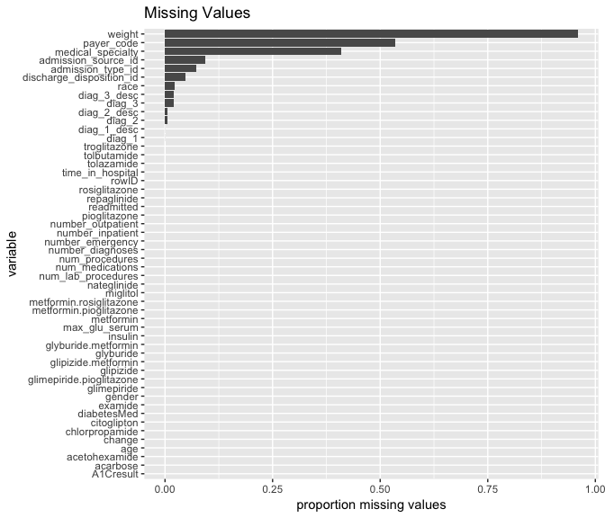<!-- -->

Weight, payer code, and medical specialty have so many missing values, that they likely won't be useful. It may be possible to impute admission_source_id, admission_type_id, discharge_disposition_id, race, and the diagnoses.  


```r
# demographic distributions
race_plot <- ggplot(diabetes, aes(race, fill = readmitted)) + geom_bar()
age_plot <- ggplot(diabetes, aes(age, fill = readmitted)) + geom_bar()
gender_plot <- ggplot(diabetes, aes(gender, fill = readmitted)) + geom_bar()

gridExtra::grid.arrange(race_plot, age_plot, gender_plot)
```

<!-- -->


```r
# summarise numeric columns
numeric_cols <- diabetes[, map_lgl(diabetes, ~is.numeric(.x))] %>% 
    select(-rowID)
summary(numeric_cols)
```

```
##  time_in_hospital num_lab_procedures num_procedures  num_medications
##  Min.   : 1.000   Min.   :  1.00     Min.   :0.000   Min.   : 1.00  
##  1st Qu.: 2.000   1st Qu.: 32.00     1st Qu.:0.000   1st Qu.:10.00  
##  Median : 4.000   Median : 44.00     Median :1.000   Median :14.00  
##  Mean   : 4.435   Mean   : 43.08     Mean   :1.399   Mean   :15.56  
##  3rd Qu.: 6.000   3rd Qu.: 57.00     3rd Qu.:2.000   3rd Qu.:19.00  
##  Max.   :14.000   Max.   :120.00     Max.   :6.000   Max.   :81.00  
##  number_outpatient number_emergency number_inpatient  number_diagnoses
##  Min.   : 0.0000   Min.   : 0.000   Min.   : 0.0000   Min.   :1.000   
##  1st Qu.: 0.0000   1st Qu.: 0.000   1st Qu.: 0.0000   1st Qu.:5.000   
##  Median : 0.0000   Median : 0.000   Median : 0.0000   Median :7.000   
##  Mean   : 0.2817   Mean   : 0.115   Mean   : 0.3873   Mean   :7.025   
##  3rd Qu.: 0.0000   3rd Qu.: 0.000   3rd Qu.: 0.0000   3rd Qu.:9.000   
##  Max.   :36.0000   Max.   :42.000   Max.   :10.0000   Max.   :9.000
```

```r
# look at numeric column distributions by readmission status
tidy_numeric_cols <- numeric_cols %>% 
    bind_cols(select(diabetes, readmitted)) %>% 
    gather("variable", "value", -readmitted)

# boxplots
ggplot(tidy_numeric_cols, aes(factor(0), value)) + 
    geom_boxplot() + 
    facet_wrap(~variable, scales = "free_x") +
    labs(x = NULL, title = "Numeric Column Boxplots") +
    coord_flip() +
    theme(axis.text.y = element_blank(), axis.ticks.y = element_blank())
```

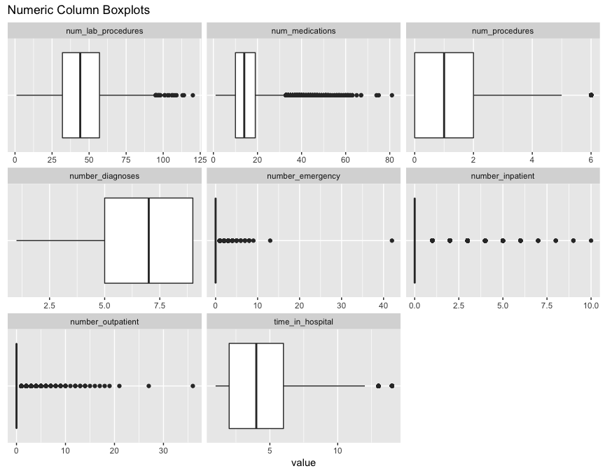<!-- -->

```r
# Distribution by readmission status
ggplot(tidy_numeric_cols, aes(value, color = readmitted, fill = readmitted)) +
    geom_density(alpha = 0.4) + 
    facet_wrap(~variable, scales = "free")
```

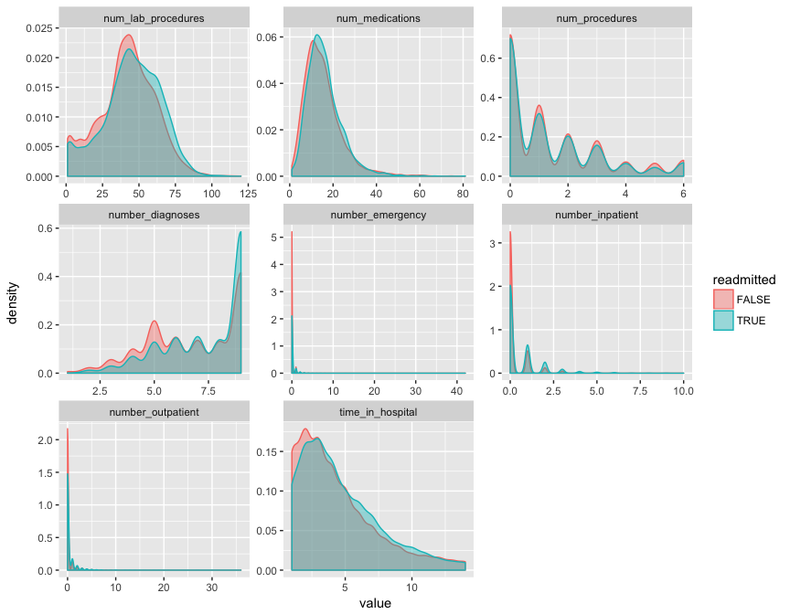<!-- -->


```r
# medications
select(diabetes, max_glu_serum:readmitted) %>% 
    gather("med", "description", -readmitted) %>% 
    ggplot(aes(description, fill = readmitted)) +
    geom_bar() +
    facet_wrap(~med, scales = "free_x", ncol = 4)
```

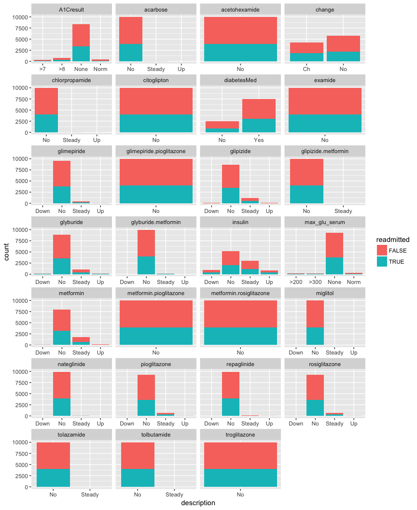<!-- -->

One can see that some the medications have zero or near-zero variance:  
    - acarbose  
    - acetohexamide  
    - chlorpropamide
    - citoglipton  
    - examide  
    - glimepiride:pioglitazone  
    - glipizide.metformin  
    - metformin.pioglitazone  
    - metformin.rosiglitazone  
    - miglitol  
    - tolazamide  
    - tolbutamide  
    - troglitazone  
    
These medications will not be useful in predicting readmission with little to no variance among records.    

Of particular interest, it appears "change" has a much higher proportion of readmissions than no change:  

```r
ggplot(diabetes, aes(change, fill = readmitted)) + 
    geom_bar(position = "fill")
```

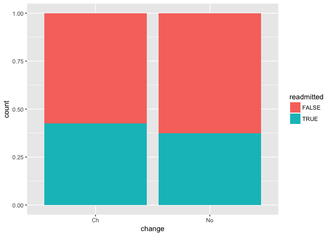<!-- -->

Also, A1Cresult seems to have an association with readmission:  

```r
diabetes %>% 
    mutate(A1C_tested = ifelse(A1Cresult == "None", "not_tested", "tested")) %>% 
ggplot(aes(A1C_tested, fill = readmitted)) +
    geom_bar(position = "fill")
```

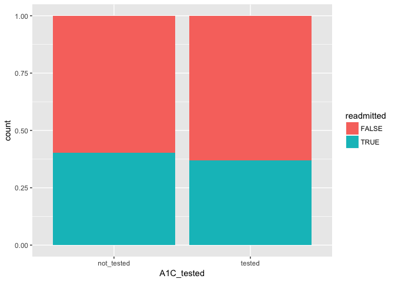<!-- -->


```r
# look for commonalities in primary diagnosis
stringr::str_replace_all(diabetes$diag_1_desc, pattern = "unspecified", "") %>% 
wordcloud::wordcloud(max.words = 250, 
                     random.color = FALSE, 
                     colors = viridis::viridis(n = 7))
```

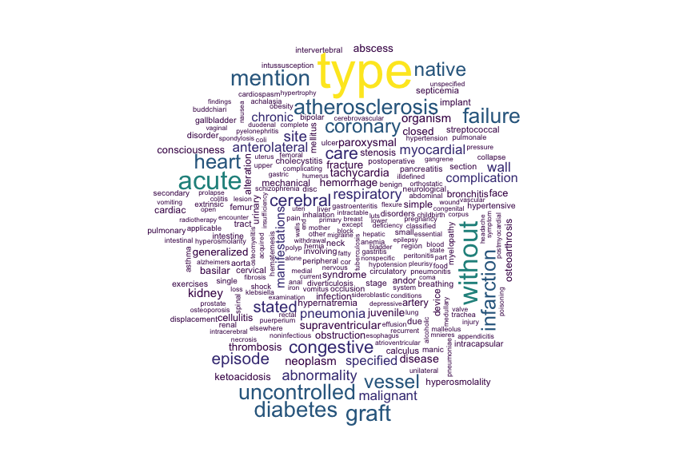<!-- -->

## Prepare Modeling Dataset


```r
# dropping columns due to missingness, near zero variance, and irrelevance for modeling (IDs)
for_model <- diabetes %>% 
    select(-c(rowID,
              weight,
              payer_code,
              medical_specialty,
              diag_1,
              diag_1_desc,
              diag_2,
              diag_2_desc,
              diag_3,
              diag_3_desc,
              acarbose,
              acetohexamide,
              chlorpropamide,
              citoglipton,
              examide,
              glimepiride.pioglitazone,
              glipizide.metformin,
              metformin.pioglitazone,
              metformin.rosiglitazone,
              miglitol,
              nateglinide,
              tolazamide,
              tolbutamide,
              troglitazone
              )) %>% 
    # fill missing admission source and types and discharge disposition with 'Not Available'
    tidyr::replace_na(list(admission_source_id = "Not Available", 
                           admission_type_id = "Not Available",
                           discharge_disposition_id = "Not Available")) %>% 
    # map A1C results into tested and not
    mutate(A1C_tested = ifelse(A1Cresult == "None", "not_tested", "tested")) %>% 
    select(-A1Cresult)
```


```r
for_model %>% 
    as.data.frame() %>% 
    saveRDS('../../data_for_modeling.rds')
```


```r
# convert charcters to factors to prepare for KNN  
for_knn <- for_model %>% 
    mutate_if(is.character, as.factor)

# split into data to train KNN on race, remove response variable
train <- for_knn %>% 
    filter(!is.na(race)) %>% 
    select(-readmitted)

test <- for_knn %>% 
    filter(is.na(race)) %>% 
    select(-race, -readmitted)

# fit KNN model, k = 3
knn_mdl <- caret::knn3(race ~ ., data = train, k = 3)
# make predictions for missing race observations
race_imputations <- caret::predict.knn3(knn_mdl, newdata = test, type = "class")

# recombine the train and newly imputed test sets
test_imputed <- for_knn %>% 
    filter(is.na(race))
test_imputed$race <- race_imputations
full_imputed <- bind_rows(filter(for_knn, !is.na(race)), test_imputed)
```


```r
# library(caret)
# diabetes_dummy <- dummyVars(~ race + gender + age + admission_type_id + max_glu_serum +
#                             A1Cresult , data = diabetes, levelsOnly = TRUE,fullRank = T)
# frame <- data.frame( predict(diabetes_dummy, newdata = diabetes ) )
# for_model <- cbind(for_model,frame)
# glimpse(for_model)

dummied <- model.matrix(readmitted ~ ., data = full_imputed)
```


```r
numeric_cols <- names(full_imputed)[map_lgl(full_imputed, is.numeric)]

cormat <- full_imputed %>%
    select(one_of(numeric_cols), readmitted) %>% 
    cor(use = "complete.obs")
cormat[upper.tri(cormat)] <- NA

cormat %>% 
    reshape2::melt(na.rm = TRUE) %>%
    ggplot(aes(Var2, Var1, fill = value)) +
    geom_tile(color = 'gray90') +
    scale_fill_gradient2(low = "#67a9cf", high = "#ef8a62", limit = c(-1, 1), name = "correlation") +
    coord_equal() +
    theme(axis.text.x = element_text(size = 14,angle = 45, vjust = 1, hjust = 1),
          axis.text.y = element_text(size = 14),
          axis.title = element_blank(),
          panel.background = element_blank()) +
    ggtitle("Correlation Matrix")
```

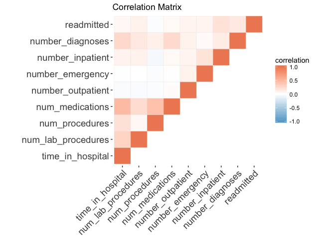<!-- -->


```r
# data_for_model <- readRDS('../../data_for_modeling.rds')
```


```r
proceduresData <- subset(for_model, select =  c(numeric_cols, "readmitted"))
matrix <- as.matrix(proceduresData)
Hmisc::rcorr(matrix,type="pearson")
```

```
##                    time_in_hospital num_lab_procedures num_procedures
## time_in_hospital               1.00               0.29           0.20
## num_lab_procedures             0.29               1.00           0.05
## num_procedures                 0.20               0.05           1.00
## num_medications                0.48               0.24           0.42
## number_outpatient             -0.03              -0.03          -0.02
## number_emergency              -0.01               0.00          -0.03
## number_inpatient               0.08               0.09          -0.06
## number_diagnoses               0.26               0.15           0.10
## readmitted                     0.05               0.08          -0.03
##                    num_medications number_outpatient number_emergency
## time_in_hospital              0.48             -0.03            -0.01
## num_lab_procedures            0.24             -0.03             0.00
## num_procedures                0.42             -0.02            -0.03
## num_medications               1.00              0.03             0.01
## number_outpatient             0.03              1.00             0.08
## number_emergency              0.01              0.08             1.00
## number_inpatient              0.04              0.08             0.19
## number_diagnoses              0.25              0.10             0.03
## readmitted                    0.04              0.07             0.08
##                    number_inpatient number_diagnoses readmitted
## time_in_hospital               0.08             0.26       0.05
## num_lab_procedures             0.09             0.15       0.08
## num_procedures                -0.06             0.10      -0.03
## num_medications                0.04             0.25       0.04
## number_outpatient              0.08             0.10       0.07
## number_emergency               0.19             0.03       0.08
## number_inpatient               1.00             0.12       0.19
## number_diagnoses               0.12             1.00       0.16
## readmitted                     0.19             0.16       1.00
## 
## n= 10000 
## 
## 
## P
##                    time_in_hospital num_lab_procedures num_procedures
## time_in_hospital                    0.0000             0.0000        
## num_lab_procedures 0.0000                              0.0000        
## num_procedures     0.0000           0.0000                           
## num_medications    0.0000           0.0000             0.0000        
## number_outpatient  0.0011           0.0043             0.0342        
## number_emergency   0.4541           0.8952             0.0106        
## number_inpatient   0.0000           0.0000             0.0000        
## number_diagnoses   0.0000           0.0000             0.0000        
## readmitted         0.0000           0.0000             0.0063        
##                    num_medications number_outpatient number_emergency
## time_in_hospital   0.0000          0.0011            0.4541          
## num_lab_procedures 0.0000          0.0043            0.8952          
## num_procedures     0.0000          0.0342            0.0106          
## num_medications                    0.0101            0.5141          
## number_outpatient  0.0101                            0.0000          
## number_emergency   0.5141          0.0000                            
## number_inpatient   0.0000          0.0000            0.0000          
## number_diagnoses   0.0000          0.0000            0.0011          
## readmitted         0.0000          0.0000            0.0000          
##                    number_inpatient number_diagnoses readmitted
## time_in_hospital   0.0000           0.0000           0.0000    
## num_lab_procedures 0.0000           0.0000           0.0000    
## num_procedures     0.0000           0.0000           0.0063    
## num_medications    0.0000           0.0000           0.0000    
## number_outpatient  0.0000           0.0000           0.0000    
## number_emergency   0.0000           0.0011           0.0000    
## number_inpatient                    0.0000           0.0000    
## number_diagnoses   0.0000                            0.0000    
## readmitted         0.0000           0.0000
```


```r
library(gmodels)

CrossTable(for_model$glimepiride, for_model$readmitted, chisq = TRUE, expected = TRUE, format = "SPSS")
```


```r
CrossTable( for_model$readmitted , for_model$insulin , chisq = TRUE, expected = TRUE, format = "SPSS")
CrossTable( for_model$readmitted , for_model$A1Cresult , chisq = TRUE, expected = TRUE, format = "SPSS")
```


```r
## PCA
pca <- prcomp(dummied)
s <- summary(pca)
pca_summary <- data_frame(pc = 1:91, prop_var = s$importance[2, ]) %>%
    mutate(cumvar = cumsum(prop_var))

pve <- ggplot(pca_summary, aes(pc, prop_var)) +
    geom_line() +
    geom_point() +
    # scale_x_continuous(breaks = 0:91) +
    theme(panel.grid.minor.x = element_blank()) +
    labs(x = "Principal Component",
         y = "Proportion of Variance Explained")

cve <- ggplot(pca_summary, aes(pc, cumvar)) + 
    geom_line() + 
    # scale_x_continuous(breaks = 0:91) +
    theme(panel.grid.minor.x = element_blank()) +
    labs(x = "Principal Component",
         y = "Cumulative Variance Explained",
         title = "Principal Components Analysis")

gridExtra::grid.arrange(cve, pve)
```

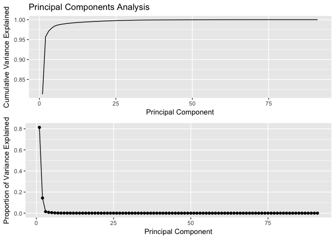<!-- -->


```r
data_frame(PC1 = pca$x[,1], PC2 = pca$x[,2], readmitted = full_imputed$readmitted) %>% 
    ggplot(aes(PC1, PC2, color = readmitted)) + 
    geom_point(alpha = 0.3) +
    scale_color_manual(values = c("#545454", "#E34949")) +
    guides(color = guide_legend(override.aes = list(alpha = 1))) +
    ggtitle("First Two Principal Components")
```

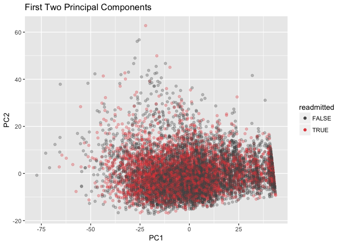<!-- -->


```r
data_frame(PC1 = pca$x[,1], PC2 = pca$x[,2], readmitted = full_imputed$readmitted) %>% 
    gather("PC", "value", PC1, PC2) %>% 
    ggplot(aes(value, fill = readmitted, color = readmitted)) +
    geom_density(alpha = 0.3) +
    facet_wrap(~PC, ncol = 1, scales = "free_y") +
    scale_color_manual(values = c("#545454", "#E34949")) +
    scale_fill_manual(values = c("#545454", "#E34949")) +
    ggtitle("Distribution of First Principal Component")
```

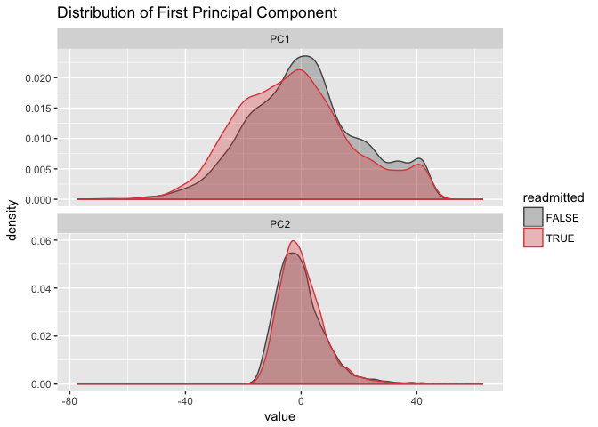<!-- -->


```r
mdl <- glm(readmitted ~ ., data = full_imputed)
summary(mdl)
```

```
## 
## Call:
## glm(formula = readmitted ~ ., data = full_imputed)
## 
## Deviance Residuals: 
##     Min       1Q   Median       3Q      Max  
## -1.2438  -0.3860  -0.2288   0.5065   1.0463  
## 
## Coefficients:
##                                                                                                                                       Estimate
## (Intercept)                                                                                                                         -0.2170499
## raceAsian                                                                                                                            0.0052693
## raceCaucasian                                                                                                                        0.0389297
## raceHispanic                                                                                                                        -0.0046962
## raceOther                                                                                                                           -0.0046998
## genderMale                                                                                                                          -0.0163269
## age[10-20)                                                                                                                           0.1128831
## age[20-30)                                                                                                                           0.1130185
## age[30-40)                                                                                                                           0.0821649
## age[40-50)                                                                                                                           0.1327647
## age[50-60)                                                                                                                           0.1390269
## age[60-70)                                                                                                                           0.1698222
## age[70-80)                                                                                                                           0.1889980
## age[80-90)                                                                                                                           0.1885320
## age[90-100)                                                                                                                          0.1309330
## admission_type_idEmergency                                                                                                          -0.0507968
## admission_type_idNewborn                                                                                                            -0.4255972
## admission_type_idNot Available                                                                                                       0.0643170
## admission_type_idNot Mapped                                                                                                         -0.0906098
## admission_type_idUrgent                                                                                                             -0.0098189
## discharge_disposition_idDischarged to home                                                                                          -0.0096469
## discharge_disposition_idDischarged/transferred to a federal health care facility.                                                   -0.2959240
## discharge_disposition_idDischarged/transferred to a long term care hospital.                                                        -0.0618225
## discharge_disposition_idDischarged/transferred to a nursing facility certified under Medicaid but not certified under Medicare      -0.3195870
## discharge_disposition_idDischarged/transferred to another  type of inpatient care institution                                        0.0353654
## discharge_disposition_idDischarged/transferred to another rehab fac including rehab units of a hospital.                             0.0052045
## discharge_disposition_idDischarged/transferred to another short term hospital                                                       -0.0651836
## discharge_disposition_idDischarged/transferred to home under care of Home IV provider                                                0.1714629
## discharge_disposition_idDischarged/transferred to home with home health service                                                      0.0486172
## discharge_disposition_idDischarged/transferred to ICF                                                                               -0.1077971
## discharge_disposition_idDischarged/transferred to SNF                                                                               -0.0367542
## discharge_disposition_idDischarged/transferred within this institution to Medicare approved swing bed                                0.2036880
## discharge_disposition_idDischarged/transferred/referred another institution for outpatient services                                 -0.4419684
## discharge_disposition_idDischarged/transferred/referred to a psychiatric hospital of a psychiatric distinct part unit of a hospital  0.0694125
## discharge_disposition_idDischarged/transferred/referred to this institution for outpatient services                                 -0.4228322
## discharge_disposition_idExpired                                                                                                     -0.4614278
## discharge_disposition_idHospice / home                                                                                              -0.4326276
## discharge_disposition_idHospice / medical facility                                                                                  -0.3896022
## discharge_disposition_idLeft AMA                                                                                                     0.0767504
## discharge_disposition_idNot Available                                                                                               -0.1026205
## discharge_disposition_idNot Mapped                                                                                                  -0.1104797
## admission_source_idCourt/Law Enforcement                                                                                             0.7091302
## admission_source_idEmergency Room                                                                                                    0.1269499
## admission_source_idHMO Referral                                                                                                      0.0534979
## admission_source_idNot Available                                                                                                     0.0410985
## admission_source_idNot Mapped                                                                                                        0.2389028
## admission_source_idPhysician Referral                                                                                                0.0622447
## admission_source_idTransfer from a hospital                                                                                         -0.0395937
## admission_source_idTransfer from a Skilled Nursing Facility (SNF)                                                                   -0.0027247
## admission_source_idTransfer from another health care facility                                                                        0.0268746
## time_in_hospital                                                                                                                     0.0013781
## num_lab_procedures                                                                                                                   0.0014893
## num_procedures                                                                                                                      -0.0060595
## num_medications                                                                                                                     -0.0006774
## number_outpatient                                                                                                                    0.0166036
## number_emergency                                                                                                                     0.0278646
## number_inpatient                                                                                                                     0.0907868
## number_diagnoses                                                                                                                     0.0245681
## max_glu_serum>300                                                                                                                    0.0329153
## max_glu_serumNone                                                                                                                    0.0377090
## max_glu_serumNorm                                                                                                                   -0.0204010
## metforminNo                                                                                                                         -0.0263691
## metforminSteady                                                                                                                     -0.0427377
## metforminUp                                                                                                                         -0.1428809
## repaglinideNo                                                                                                                       -0.0695089
## repaglinideSteady                                                                                                                    0.0371087
## repaglinideUp                                                                                                                       -0.2574162
## glimepirideNo                                                                                                                       -0.0929908
## glimepirideSteady                                                                                                                   -0.0863969
## glimepirideUp                                                                                                                       -0.0238597
## glipizideNo                                                                                                                          0.0623078
## glipizideSteady                                                                                                                      0.0589133
## glipizideUp                                                                                                                         -0.0272950
## glyburideNo                                                                                                                          0.0122930
## glyburideSteady                                                                                                                     -0.0149335
## glyburideUp                                                                                                                          0.1014777
## pioglitazoneNo                                                                                                                      -0.1051026
## pioglitazoneSteady                                                                                                                  -0.0355465
## pioglitazoneUp                                                                                                                      -0.0398580
## rosiglitazoneNo                                                                                                                     -0.0890913
## rosiglitazoneSteady                                                                                                                 -0.0758423
## rosiglitazoneUp                                                                                                                     -0.2161456
## insulinNo                                                                                                                           -0.0230923
## insulinSteady                                                                                                                       -0.0547601
## insulinUp                                                                                                                           -0.0423214
## glyburide.metforminNo                                                                                                                0.4055465
## glyburide.metforminSteady                                                                                                            0.4208769
## glyburide.metforminUp                                                                                                               -0.0488489
## changeNo                                                                                                                            -0.0141203
## diabetesMedYes                                                                                                                       0.0459466
## A1C_testedtested                                                                                                                    -0.0366285
##                                                                                                                                     Std. Error
## (Intercept)                                                                                                                          0.6796175
## raceAsian                                                                                                                            0.0636628
## raceCaucasian                                                                                                                        0.0119519
## raceHispanic                                                                                                                         0.0361577
## raceOther                                                                                                                            0.0435036
## genderMale                                                                                                                           0.0094783
## age[10-20)                                                                                                                           0.0979979
## age[20-30)                                                                                                                           0.0928005
## age[30-40)                                                                                                                           0.0873662
## age[40-50)                                                                                                                           0.0859111
## age[50-60)                                                                                                                           0.0854786
## age[60-70)                                                                                                                           0.0854435
## age[70-80)                                                                                                                           0.0854400
## age[80-90)                                                                                                                           0.0858935
## age[90-100)                                                                                                                          0.0899203
## admission_type_idEmergency                                                                                                           0.0197713
## admission_type_idNewborn                                                                                                             0.4652481
## admission_type_idNot Available                                                                                                       0.0242215
## admission_type_idNot Mapped                                                                                                          0.0769711
## admission_type_idUrgent                                                                                                              0.0164498
## discharge_disposition_idDischarged to home                                                                                           0.3300899
## discharge_disposition_idDischarged/transferred to a federal health care facility.                                                    0.5706582
## discharge_disposition_idDischarged/transferred to a long term care hospital.                                                         0.3364836
## discharge_disposition_idDischarged/transferred to a nursing facility certified under Medicaid but not certified under Medicare       0.5696487
## discharge_disposition_idDischarged/transferred to another  type of inpatient care institution                                        0.3321135
## discharge_disposition_idDischarged/transferred to another rehab fac including rehab units of a hospital.                             0.3319309
## discharge_disposition_idDischarged/transferred to another short term hospital                                                        0.3318913
## discharge_disposition_idDischarged/transferred to home under care of Home IV provider                                                0.3526470
## discharge_disposition_idDischarged/transferred to home with home health service                                                      0.3302467
## discharge_disposition_idDischarged/transferred to ICF                                                                                0.3333636
## discharge_disposition_idDischarged/transferred to SNF                                                                                0.3302766
## discharge_disposition_idDischarged/transferred within this institution to Medicare approved swing bed                                0.4254164
## discharge_disposition_idDischarged/transferred/referred another institution for outpatient services                                  0.5722910
## discharge_disposition_idDischarged/transferred/referred to a psychiatric hospital of a psychiatric distinct part unit of a hospital  0.3541691
## discharge_disposition_idDischarged/transferred/referred to this institution for outpatient services                                  0.4660907
## discharge_disposition_idExpired                                                                                                      0.3318170
## discharge_disposition_idHospice / home                                                                                               0.3397890
## discharge_disposition_idHospice / medical facility                                                                                   0.3415239
## discharge_disposition_idLeft AMA                                                                                                     0.3374324
## discharge_disposition_idNot Available                                                                                                0.3306538
## discharge_disposition_idNot Mapped                                                                                                   0.3325184
## admission_source_idCourt/Law Enforcement                                                                                             0.4668336
## admission_source_idEmergency Room                                                                                                    0.0373202
## admission_source_idHMO Referral                                                                                                      0.0921452
## admission_source_idNot Available                                                                                                     0.0428007
## admission_source_idNot Mapped                                                                                                        0.1074747
## admission_source_idPhysician Referral                                                                                                0.0361745
## admission_source_idTransfer from a hospital                                                                                          0.0422286
## admission_source_idTransfer from a Skilled Nursing Facility (SNF)                                                                    0.0565467
## admission_source_idTransfer from another health care facility                                                                        0.0452164
## time_in_hospital                                                                                                                     0.0019270
## num_lab_procedures                                                                                                                   0.0002863
## num_procedures                                                                                                                       0.0031825
## num_medications                                                                                                                      0.0007634
## number_outpatient                                                                                                                    0.0042821
## number_emergency                                                                                                                     0.0073550
## number_inpatient                                                                                                                     0.0056853
## number_diagnoses                                                                                                                     0.0026402
## max_glu_serum>300                                                                                                                    0.0534279
## max_glu_serumNone                                                                                                                    0.0378049
## max_glu_serumNorm                                                                                                                    0.0418770
## metforminNo                                                                                                                          0.0665791
## metforminSteady                                                                                                                      0.0665862
## metforminUp                                                                                                                          0.0780319
## repaglinideNo                                                                                                                        0.2091554
## repaglinideSteady                                                                                                                    0.2133389
## repaglinideUp                                                                                                                        0.2450417
## glimepirideNo                                                                                                                        0.1556139
## glimepirideSteady                                                                                                                    0.1564543
## glimepirideUp                                                                                                                        0.1753128
## glipizideNo                                                                                                                          0.0660281
## glipizideSteady                                                                                                                      0.0661506
## glipizideUp                                                                                                                          0.0808409
## glyburideNo                                                                                                                          0.0618992
## glyburideSteady                                                                                                                      0.0616917
## glyburideUp                                                                                                                          0.0768601
## pioglitazoneNo                                                                                                                       0.1296515
## pioglitazoneSteady                                                                                                                   0.1304863
## pioglitazoneUp                                                                                                                       0.1556218
## rosiglitazoneNo                                                                                                                      0.1554598
## rosiglitazoneSteady                                                                                                                  0.1561005
## rosiglitazoneUp                                                                                                                      0.1841171
## insulinNo                                                                                                                            0.0259655
## insulinSteady                                                                                                                        0.0205470
## insulinUp                                                                                                                            0.0221680
## glyburide.metforminNo                                                                                                                0.4645867
## glyburide.metforminSteady                                                                                                            0.4688339
## glyburide.metforminUp                                                                                                                0.5703745
## changeNo                                                                                                                             0.0180558
## diabetesMedYes                                                                                                                       0.0168834
## A1C_testedtested                                                                                                                     0.0134538
##                                                                                                                                     t value
## (Intercept)                                                                                                                          -0.319
## raceAsian                                                                                                                             0.083
## raceCaucasian                                                                                                                         3.257
## raceHispanic                                                                                                                         -0.130
## raceOther                                                                                                                            -0.108
## genderMale                                                                                                                           -1.723
## age[10-20)                                                                                                                            1.152
## age[20-30)                                                                                                                            1.218
## age[30-40)                                                                                                                            0.940
## age[40-50)                                                                                                                            1.545
## age[50-60)                                                                                                                            1.626
## age[60-70)                                                                                                                            1.988
## age[70-80)                                                                                                                            2.212
## age[80-90)                                                                                                                            2.195
## age[90-100)                                                                                                                           1.456
## admission_type_idEmergency                                                                                                           -2.569
## admission_type_idNewborn                                                                                                             -0.915
## admission_type_idNot Available                                                                                                        2.655
## admission_type_idNot Mapped                                                                                                          -1.177
## admission_type_idUrgent                                                                                                              -0.597
## discharge_disposition_idDischarged to home                                                                                           -0.029
## discharge_disposition_idDischarged/transferred to a federal health care facility.                                                    -0.519
## discharge_disposition_idDischarged/transferred to a long term care hospital.                                                         -0.184
## discharge_disposition_idDischarged/transferred to a nursing facility certified under Medicaid but not certified under Medicare       -0.561
## discharge_disposition_idDischarged/transferred to another  type of inpatient care institution                                         0.106
## discharge_disposition_idDischarged/transferred to another rehab fac including rehab units of a hospital.                              0.016
## discharge_disposition_idDischarged/transferred to another short term hospital                                                        -0.196
## discharge_disposition_idDischarged/transferred to home under care of Home IV provider                                                 0.486
## discharge_disposition_idDischarged/transferred to home with home health service                                                       0.147
## discharge_disposition_idDischarged/transferred to ICF                                                                                -0.323
## discharge_disposition_idDischarged/transferred to SNF                                                                                -0.111
## discharge_disposition_idDischarged/transferred within this institution to Medicare approved swing bed                                 0.479
## discharge_disposition_idDischarged/transferred/referred another institution for outpatient services                                  -0.772
## discharge_disposition_idDischarged/transferred/referred to a psychiatric hospital of a psychiatric distinct part unit of a hospital   0.196
## discharge_disposition_idDischarged/transferred/referred to this institution for outpatient services                                  -0.907
## discharge_disposition_idExpired                                                                                                      -1.391
## discharge_disposition_idHospice / home                                                                                               -1.273
## discharge_disposition_idHospice / medical facility                                                                                   -1.141
## discharge_disposition_idLeft AMA                                                                                                      0.227
## discharge_disposition_idNot Available                                                                                                -0.310
## discharge_disposition_idNot Mapped                                                                                                   -0.332
## admission_source_idCourt/Law Enforcement                                                                                              1.519
## admission_source_idEmergency Room                                                                                                     3.402
## admission_source_idHMO Referral                                                                                                       0.581
## admission_source_idNot Available                                                                                                      0.960
## admission_source_idNot Mapped                                                                                                         2.223
## admission_source_idPhysician Referral                                                                                                 1.721
## admission_source_idTransfer from a hospital                                                                                          -0.938
## admission_source_idTransfer from a Skilled Nursing Facility (SNF)                                                                    -0.048
## admission_source_idTransfer from another health care facility                                                                         0.594
## time_in_hospital                                                                                                                      0.715
## num_lab_procedures                                                                                                                    5.202
## num_procedures                                                                                                                       -1.904
## num_medications                                                                                                                      -0.887
## number_outpatient                                                                                                                     3.877
## number_emergency                                                                                                                      3.789
## number_inpatient                                                                                                                     15.969
## number_diagnoses                                                                                                                      9.305
## max_glu_serum>300                                                                                                                     0.616
## max_glu_serumNone                                                                                                                     0.997
## max_glu_serumNorm                                                                                                                    -0.487
## metforminNo                                                                                                                          -0.396
## metforminSteady                                                                                                                      -0.642
## metforminUp                                                                                                                          -1.831
## repaglinideNo                                                                                                                        -0.332
## repaglinideSteady                                                                                                                     0.174
## repaglinideUp                                                                                                                        -1.050
## glimepirideNo                                                                                                                        -0.598
## glimepirideSteady                                                                                                                    -0.552
## glimepirideUp                                                                                                                        -0.136
## glipizideNo                                                                                                                           0.944
## glipizideSteady                                                                                                                       0.891
## glipizideUp                                                                                                                          -0.338
## glyburideNo                                                                                                                           0.199
## glyburideSteady                                                                                                                      -0.242
## glyburideUp                                                                                                                           1.320
## pioglitazoneNo                                                                                                                       -0.811
## pioglitazoneSteady                                                                                                                   -0.272
## pioglitazoneUp                                                                                                                       -0.256
## rosiglitazoneNo                                                                                                                      -0.573
## rosiglitazoneSteady                                                                                                                  -0.486
## rosiglitazoneUp                                                                                                                      -1.174
## insulinNo                                                                                                                            -0.889
## insulinSteady                                                                                                                        -2.665
## insulinUp                                                                                                                            -1.909
## glyburide.metforminNo                                                                                                                 0.873
## glyburide.metforminSteady                                                                                                             0.898
## glyburide.metforminUp                                                                                                                -0.086
## changeNo                                                                                                                             -0.782
## diabetesMedYes                                                                                                                        2.721
## A1C_testedtested                                                                                                                     -2.723
##                                                                                                                                     Pr(>|t|)
## (Intercept)                                                                                                                         0.749452
## raceAsian                                                                                                                           0.934037
## raceCaucasian                                                                                                                       0.001129
## raceHispanic                                                                                                                        0.896663
## raceOther                                                                                                                           0.913972
## genderMale                                                                                                                          0.084999
## age[10-20)                                                                                                                          0.249393
## age[20-30)                                                                                                                          0.223304
## age[30-40)                                                                                                                          0.347002
## age[40-50)                                                                                                                          0.122288
## age[50-60)                                                                                                                          0.103885
## age[60-70)                                                                                                                          0.046890
## age[70-80)                                                                                                                          0.026986
## age[80-90)                                                                                                                          0.028190
## age[90-100)                                                                                                                         0.145397
## admission_type_idEmergency                                                                                                          0.010207
## admission_type_idNewborn                                                                                                            0.360332
## admission_type_idNot Available                                                                                                      0.007935
## admission_type_idNot Mapped                                                                                                         0.239147
## admission_type_idUrgent                                                                                                             0.550589
## discharge_disposition_idDischarged to home                                                                                          0.976686
## discharge_disposition_idDischarged/transferred to a federal health care facility.                                                   0.604075
## discharge_disposition_idDischarged/transferred to a long term care hospital.                                                        0.854228
## discharge_disposition_idDischarged/transferred to a nursing facility certified under Medicaid but not certified under Medicare      0.574793
## discharge_disposition_idDischarged/transferred to another  type of inpatient care institution                                       0.915199
## discharge_disposition_idDischarged/transferred to another rehab fac including rehab units of a hospital.                            0.987491
## discharge_disposition_idDischarged/transferred to another short term hospital                                                       0.844301
## discharge_disposition_idDischarged/transferred to home under care of Home IV provider                                               0.626824
## discharge_disposition_idDischarged/transferred to home with home health service                                                     0.882965
## discharge_disposition_idDischarged/transferred to ICF                                                                               0.746428
## discharge_disposition_idDischarged/transferred to SNF                                                                               0.911394
## discharge_disposition_idDischarged/transferred within this institution to Medicare approved swing bed                               0.632094
## discharge_disposition_idDischarged/transferred/referred another institution for outpatient services                                 0.439968
## discharge_disposition_idDischarged/transferred/referred to a psychiatric hospital of a psychiatric distinct part unit of a hospital 0.844625
## discharge_disposition_idDischarged/transferred/referred to this institution for outpatient services                                 0.364329
## discharge_disposition_idExpired                                                                                                     0.164375
## discharge_disposition_idHospice / home                                                                                              0.202968
## discharge_disposition_idHospice / medical facility                                                                                  0.253991
## discharge_disposition_idLeft AMA                                                                                                    0.820075
## discharge_disposition_idNot Available                                                                                               0.756297
## discharge_disposition_idNot Mapped                                                                                                  0.739706
## admission_source_idCourt/Law Enforcement                                                                                            0.128789
## admission_source_idEmergency Room                                                                                                   0.000672
## admission_source_idHMO Referral                                                                                                     0.561535
## admission_source_idNot Available                                                                                                    0.336963
## admission_source_idNot Mapped                                                                                                       0.026247
## admission_source_idPhysician Referral                                                                                               0.085340
## admission_source_idTransfer from a hospital                                                                                         0.348472
## admission_source_idTransfer from a Skilled Nursing Facility (SNF)                                                                   0.961570
## admission_source_idTransfer from another health care facility                                                                       0.552289
## time_in_hospital                                                                                                                    0.474537
## num_lab_procedures                                                                                                                  2.01e-07
## num_procedures                                                                                                                      0.056941
## num_medications                                                                                                                     0.374896
## number_outpatient                                                                                                                   0.000106
## number_emergency                                                                                                                    0.000152
## number_inpatient                                                                                                                     < 2e-16
## number_diagnoses                                                                                                                     < 2e-16
## max_glu_serum>300                                                                                                                   0.537862
## max_glu_serumNone                                                                                                                   0.318564
## max_glu_serumNorm                                                                                                                   0.626152
## metforminNo                                                                                                                         0.692072
## metforminSteady                                                                                                                     0.520992
## metforminUp                                                                                                                         0.067122
## repaglinideNo                                                                                                                       0.739646
## repaglinideSteady                                                                                                                   0.861914
## repaglinideUp                                                                                                                       0.293514
## glimepirideNo                                                                                                                       0.550138
## glimepirideSteady                                                                                                                   0.580811
## glimepirideUp                                                                                                                       0.891747
## glipizideNo                                                                                                                         0.345369
## glipizideSteady                                                                                                                     0.373169
## glipizideUp                                                                                                                         0.735643
## glyburideNo                                                                                                                         0.842582
## glyburideSteady                                                                                                                     0.808733
## glyburideUp                                                                                                                         0.186769
## pioglitazoneNo                                                                                                                      0.417584
## pioglitazoneSteady                                                                                                                  0.785308
## pioglitazoneUp                                                                                                                      0.797863
## rosiglitazoneNo                                                                                                                     0.566602
## rosiglitazoneSteady                                                                                                                 0.627080
## rosiglitazoneUp                                                                                                                     0.240440
## insulinNo                                                                                                                           0.373838
## insulinSteady                                                                                                                       0.007709
## insulinUp                                                                                                                           0.056275
## glyburide.metforminNo                                                                                                               0.382728
## glyburide.metforminSteady                                                                                                           0.369362
## glyburide.metforminUp                                                                                                               0.931751
## changeNo                                                                                                                            0.434213
## diabetesMedYes                                                                                                                      0.006512
## A1C_testedtested                                                                                                                    0.006490
##                                                                                                                                        
## (Intercept)                                                                                                                            
## raceAsian                                                                                                                              
## raceCaucasian                                                                                                                       ** 
## raceHispanic                                                                                                                           
## raceOther                                                                                                                              
## genderMale                                                                                                                          .  
## age[10-20)                                                                                                                             
## age[20-30)                                                                                                                             
## age[30-40)                                                                                                                             
## age[40-50)                                                                                                                             
## age[50-60)                                                                                                                             
## age[60-70)                                                                                                                          *  
## age[70-80)                                                                                                                          *  
## age[80-90)                                                                                                                          *  
## age[90-100)                                                                                                                            
## admission_type_idEmergency                                                                                                          *  
## admission_type_idNewborn                                                                                                               
## admission_type_idNot Available                                                                                                      ** 
## admission_type_idNot Mapped                                                                                                            
## admission_type_idUrgent                                                                                                                
## discharge_disposition_idDischarged to home                                                                                             
## discharge_disposition_idDischarged/transferred to a federal health care facility.                                                      
## discharge_disposition_idDischarged/transferred to a long term care hospital.                                                           
## discharge_disposition_idDischarged/transferred to a nursing facility certified under Medicaid but not certified under Medicare         
## discharge_disposition_idDischarged/transferred to another  type of inpatient care institution                                          
## discharge_disposition_idDischarged/transferred to another rehab fac including rehab units of a hospital.                               
## discharge_disposition_idDischarged/transferred to another short term hospital                                                          
## discharge_disposition_idDischarged/transferred to home under care of Home IV provider                                                  
## discharge_disposition_idDischarged/transferred to home with home health service                                                        
## discharge_disposition_idDischarged/transferred to ICF                                                                                  
## discharge_disposition_idDischarged/transferred to SNF                                                                                  
## discharge_disposition_idDischarged/transferred within this institution to Medicare approved swing bed                                  
## discharge_disposition_idDischarged/transferred/referred another institution for outpatient services                                    
## discharge_disposition_idDischarged/transferred/referred to a psychiatric hospital of a psychiatric distinct part unit of a hospital    
## discharge_disposition_idDischarged/transferred/referred to this institution for outpatient services                                    
## discharge_disposition_idExpired                                                                                                        
## discharge_disposition_idHospice / home                                                                                                 
## discharge_disposition_idHospice / medical facility                                                                                     
## discharge_disposition_idLeft AMA                                                                                                       
## discharge_disposition_idNot Available                                                                                                  
## discharge_disposition_idNot Mapped                                                                                                     
## admission_source_idCourt/Law Enforcement                                                                                               
## admission_source_idEmergency Room                                                                                                   ***
## admission_source_idHMO Referral                                                                                                        
## admission_source_idNot Available                                                                                                       
## admission_source_idNot Mapped                                                                                                       *  
## admission_source_idPhysician Referral                                                                                               .  
## admission_source_idTransfer from a hospital                                                                                            
## admission_source_idTransfer from a Skilled Nursing Facility (SNF)                                                                      
## admission_source_idTransfer from another health care facility                                                                          
## time_in_hospital                                                                                                                       
## num_lab_procedures                                                                                                                  ***
## num_procedures                                                                                                                      .  
## num_medications                                                                                                                        
## number_outpatient                                                                                                                   ***
## number_emergency                                                                                                                    ***
## number_inpatient                                                                                                                    ***
## number_diagnoses                                                                                                                    ***
## max_glu_serum>300                                                                                                                      
## max_glu_serumNone                                                                                                                      
## max_glu_serumNorm                                                                                                                      
## metforminNo                                                                                                                            
## metforminSteady                                                                                                                        
## metforminUp                                                                                                                         .  
## repaglinideNo                                                                                                                          
## repaglinideSteady                                                                                                                      
## repaglinideUp                                                                                                                          
## glimepirideNo                                                                                                                          
## glimepirideSteady                                                                                                                      
## glimepirideUp                                                                                                                          
## glipizideNo                                                                                                                            
## glipizideSteady                                                                                                                        
## glipizideUp                                                                                                                            
## glyburideNo                                                                                                                            
## glyburideSteady                                                                                                                        
## glyburideUp                                                                                                                            
## pioglitazoneNo                                                                                                                         
## pioglitazoneSteady                                                                                                                     
## pioglitazoneUp                                                                                                                         
## rosiglitazoneNo                                                                                                                        
## rosiglitazoneSteady                                                                                                                    
## rosiglitazoneUp                                                                                                                        
## insulinNo                                                                                                                              
## insulinSteady                                                                                                                       ** 
## insulinUp                                                                                                                           .  
## glyburide.metforminNo                                                                                                                  
## glyburide.metforminSteady                                                                                                              
## glyburide.metforminUp                                                                                                                  
## changeNo                                                                                                                               
## diabetesMedYes                                                                                                                      ** 
## A1C_testedtested                                                                                                                    ** 
## ---
## Signif. codes:  0 '***' 0.001 '**' 0.01 '*' 0.05 '.' 0.1 ' ' 1
## 
## (Dispersion parameter for gaussian family taken to be 0.214886)
## 
##     Null deviance: 2392.9  on 9999  degrees of freedom
## Residual deviance: 2129.3  on 9909  degrees of freedom
## AIC: 13095
## 
## Number of Fisher Scoring iterations: 2
```

```r
broom::tidy(mdl) %>% 
    filter(p.value < 0.2) %>% 
    mutate(odds_ratio = exp(estimate),
           readmission = ifelse(odds_ratio > 1, "More Likely", "Less Likely")) %>% 
    ggplot(aes(reorder(term, odds_ratio), 
               odds_ratio, 
               fill = readmission, 
               alpha = -p.value, 
               color = readmission)) +
    geom_bar(stat = "identity") +
    scale_color_manual(values = c("#545454", "#E34949")) +
    scale_fill_manual(values = c("#545454", "#E34949")) +
    labs(x = "Odds Ratio",
         y = "Feature",
         alpha = "significance",
         title = "Most Important Features",
         subtitle = "Compared to race:AA, age:[0-10], admitted:Elective") +
    guides(alpha = guide_legend(label = F)) +
    coord_flip()
```

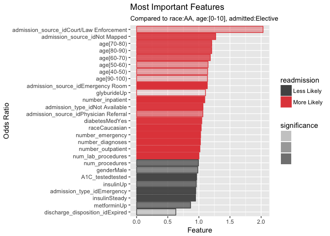<!-- -->

