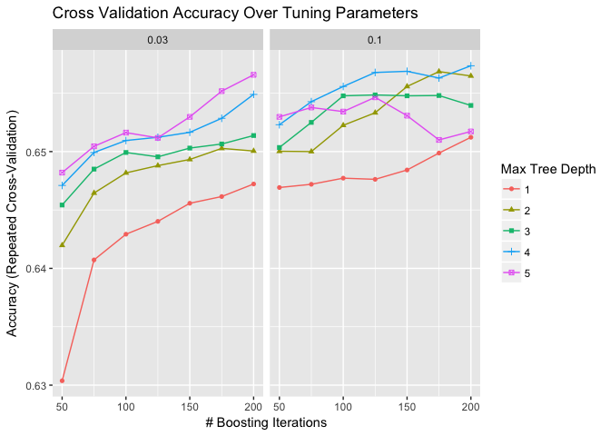
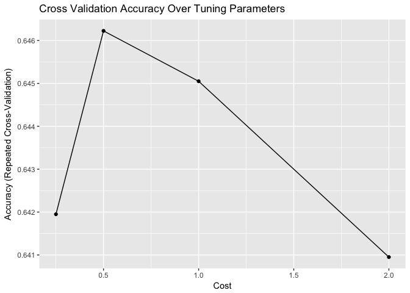

# EDA
Keith Williams  
January 19, 2017  


```r
library(tidyverse) # data wrangling and visualization

# file should exist in the parent directory of the repo
# parent/
# |-> 10kDiabetes.csv
# |-> kdd-diabetes/
# |   |-> R/
file_name <- "../../10kDiabetes.csv"

# read file
diabetes <- read_csv(file_name, na = c("?", ""))
```

## Introduce the rows and columns  


```r
# view structure
glimpse(diabetes)
```

```
## Observations: 10,000
## Variables: 52
## $ rowID                    <int> 1, 2, 3, 4, 5, 6, 7, 8, 9, 10, 11, 12...
## $ race                     <chr> "Caucasian", "Caucasian", "Caucasian"...
## $ gender                   <chr> "Female", "Female", "Male", "Female",...
## $ age                      <chr> "[50-60)", "[20-30)", "[80-90)", "[50...
## $ weight                   <chr> NA, "[50-75)", NA, NA, NA, NA, NA, NA...
## $ admission_type_id        <chr> "Elective", "Urgent", "Not Available"...
## $ discharge_disposition_id <chr> "Discharged to home", "Discharged to ...
## $ admission_source_id      <chr> "Physician Referral", "Physician Refe...
## $ time_in_hospital         <int> 1, 2, 7, 4, 5, 4, 6, 2, 3, 5, 14, 2, ...
## $ payer_code               <chr> "CP", "UN", "MC", "UN", NA, NA, "MC",...
## $ medical_specialty        <chr> "Surgery-Neuro", NA, "Family/GeneralP...
## $ num_lab_procedures       <int> 35, 8, 12, 33, 31, 29, 46, 49, 54, 47...
## $ num_procedures           <int> 4, 5, 0, 1, 0, 0, 1, 1, 0, 2, 2, 0, 4...
## $ num_medications          <int> 21, 5, 21, 5, 13, 10, 20, 17, 10, 12,...
## $ number_outpatient        <int> 0, 0, 0, 0, 0, 0, 0, 2, 0, 0, 0, 0, 0...
## $ number_emergency         <int> 0, 0, 0, 0, 0, 0, 0, 1, 0, 0, 0, 0, 0...
## $ number_inpatient         <int> 0, 0, 1, 0, 0, 0, 0, 1, 1, 0, 0, 1, 0...
## $ diag_1                   <chr> "723", "664", "481", "682", "296", "4...
## $ diag_2                   <chr> "723", "648", "428", "41", "250.01", ...
## $ diag_3                   <chr> "719", "285", "276", "250", "298", "4...
## $ number_diagnoses         <int> 9, 6, 9, 3, 7, 8, 8, 9, 9, 5, 9, 5, 5...
## $ max_glu_serum            <chr> "None", "None", ">200", "None", "None...
## $ A1Cresult                <chr> "None", "None", "None", "None", "None...
## $ metformin                <chr> "No", "No", "No", "No", "Steady", "St...
## $ repaglinide              <chr> "No", "No", "No", "No", "No", "No", "...
## $ nateglinide              <chr> "No", "No", "No", "No", "No", "No", "...
## $ chlorpropamide           <chr> "No", "No", "No", "No", "No", "No", "...
## $ glimepiride              <chr> "No", "No", "No", "No", "No", "No", "...
## $ acetohexamide            <chr> "No", "No", "No", "No", "No", "No", "...
## $ glipizide                <chr> "No", "No", "No", "No", "Steady", "No...
## $ glyburide                <chr> "No", "No", "No", "No", "No", "No", "...
## $ tolbutamide              <chr> "No", "No", "No", "No", "No", "No", "...
## $ pioglitazone             <chr> "No", "No", "No", "No", "No", "No", "...
## $ rosiglitazone            <chr> "No", "No", "No", "No", "No", "No", "...
## $ acarbose                 <chr> "No", "No", "No", "No", "No", "No", "...
## $ miglitol                 <chr> "No", "No", "No", "No", "No", "No", "...
## $ troglitazone             <chr> "No", "No", "No", "No", "No", "No", "...
## $ tolazamide               <chr> "No", "No", "No", "No", "No", "No", "...
## $ examide                  <chr> "No", "No", "No", "No", "No", "No", "...
## $ citoglipton              <chr> "No", "No", "No", "No", "No", "No", "...
## $ insulin                  <chr> "No", "No", "Steady", "Steady", "Stea...
## $ glyburide.metformin      <chr> "No", "No", "No", "No", "No", "No", "...
## $ glipizide.metformin      <chr> "No", "No", "No", "No", "No", "No", "...
## $ glimepiride.pioglitazone <chr> "No", "No", "No", "No", "No", "No", "...
## $ metformin.rosiglitazone  <chr> "No", "No", "No", "No", "No", "No", "...
## $ metformin.pioglitazone   <chr> "No", "No", "No", "No", "No", "No", "...
## $ change                   <chr> "No", "No", "No", "No", "Ch", "No", "...
## $ diabetesMed              <chr> "No", "No", "Yes", "Yes", "Yes", "Yes...
## $ readmitted               <lgl> FALSE, FALSE, TRUE, FALSE, FALSE, FAL...
## $ diag_1_desc              <chr> "Spinal stenosis in cervical region",...
## $ diag_2_desc              <chr> "Spinal stenosis in cervical region",...
## $ diag_3_desc              <chr> "Effusion of joint, site unspecified"...
```

```r
# outcome variable
mean(diabetes$readmitted)
```

```
## [1] 0.3965
```

There are 10,000 records, 39.65% of which were readmitted within 30 days. Features include demographics, admission conditions, procedure and lab descriptions and results, medication changes, and diagnoses.  

## Use descriptive statistics to describe the data  


```r
# proportion of missing records for each variable
prop_na <- map_dbl(diabetes, ~mean(is.na(.x)))
data_frame(variable = names(prop_na), proportion_na = prop_na) %>% 
    ggplot(aes(forcats::fct_reorder(variable, prop_na), prop_na)) +
    geom_bar(stat = "identity") +
    labs(x = "variable", y = "proportion missing values", title = "Missing Values") +
    coord_flip()
```

<!-- -->

Weight, payer code, and medical specialty have so many missing values, that they likely won't be useful. It may be possible to impute admission_source_id, admission_type_id, discharge_disposition_id, race, and the diagnoses.  


```r
# demographic distributions
race_plot <- ggplot(diabetes, aes(race, fill = readmitted)) + geom_bar()
age_plot <- ggplot(diabetes, aes(age, fill = readmitted)) + geom_bar()
gender_plot <- ggplot(diabetes, aes(gender, fill = readmitted)) + geom_bar()

gridExtra::grid.arrange(race_plot, age_plot, gender_plot)
```

<!-- -->


```r
# summarise numeric columns
numeric_cols <- diabetes[, map_lgl(diabetes, ~is.numeric(.x))] %>% 
    select(-rowID)
summary(numeric_cols)
```

```
##  time_in_hospital num_lab_procedures num_procedures  num_medications
##  Min.   : 1.000   Min.   :  1.00     Min.   :0.000   Min.   : 1.00  
##  1st Qu.: 2.000   1st Qu.: 32.00     1st Qu.:0.000   1st Qu.:10.00  
##  Median : 4.000   Median : 44.00     Median :1.000   Median :14.00  
##  Mean   : 4.435   Mean   : 43.08     Mean   :1.399   Mean   :15.56  
##  3rd Qu.: 6.000   3rd Qu.: 57.00     3rd Qu.:2.000   3rd Qu.:19.00  
##  Max.   :14.000   Max.   :120.00     Max.   :6.000   Max.   :81.00  
##  number_outpatient number_emergency number_inpatient  number_diagnoses
##  Min.   : 0.0000   Min.   : 0.000   Min.   : 0.0000   Min.   :1.000   
##  1st Qu.: 0.0000   1st Qu.: 0.000   1st Qu.: 0.0000   1st Qu.:5.000   
##  Median : 0.0000   Median : 0.000   Median : 0.0000   Median :7.000   
##  Mean   : 0.2817   Mean   : 0.115   Mean   : 0.3873   Mean   :7.025   
##  3rd Qu.: 0.0000   3rd Qu.: 0.000   3rd Qu.: 0.0000   3rd Qu.:9.000   
##  Max.   :36.0000   Max.   :42.000   Max.   :10.0000   Max.   :9.000
```

```r
# look at numeric column distributions by readmission status
tidy_numeric_cols <- numeric_cols %>% 
    bind_cols(select(diabetes, readmitted)) %>% 
    gather("variable", "value", -readmitted)

# boxplots
ggplot(tidy_numeric_cols, aes(factor(0), value)) + 
    geom_boxplot() + 
    facet_wrap(~variable, scales = "free_x") +
    labs(x = NULL, title = "Numeric Column Boxplots") +
    coord_flip() +
    theme(axis.text.y = element_blank(), axis.ticks.y = element_blank())
```

<!-- -->

```r
# Distribution by readmission status
ggplot(tidy_numeric_cols, aes(value, color = readmitted, fill = readmitted)) +
    geom_density(alpha = 0.4) + 
    facet_wrap(~variable, scales = "free")
```

<!-- -->


```r
# medications
select(diabetes, max_glu_serum:readmitted) %>% 
    gather("med", "description", -readmitted) %>% 
    ggplot(aes(description, fill = readmitted)) +
    geom_bar() +
    facet_wrap(~med, scales = "free_x", ncol = 4)
```

<!-- -->

One can see that some the medications have zero or near-zero variance:  
    - acarbose  
    - acetohexamide  
    - chlorpropamide
    - citoglipton  
    - examide  
    - glimepiride:pioglitazone  
    - glipizide.metformin  
    - metformin.pioglitazone  
    - metformin.rosiglitazone  
    - miglitol  
    - tolazamide  
    - tolbutamide  
    - troglitazone  
    
These medications will not be useful in predicting readmission with little to no variance among records.    

Of particular interest, it appears "change" has a much higher proportion of readmissions than no change:  

```r
ggplot(diabetes, aes(change, fill = readmitted)) + 
    geom_bar(position = "fill")
```

<!-- -->

Also, A1Cresult seems to have an association with readmission:  

```r
diabetes %>% 
    mutate(A1C_tested = ifelse(A1Cresult == "None", "not_tested", "tested")) %>% 
ggplot(aes(A1C_tested, fill = readmitted)) +
    geom_bar(position = "fill")
```

<!-- -->


```r
# look for commonalities in primary diagnosis
stringr::str_replace_all(diabetes$diag_1_desc, pattern = "unspecified", "") %>% 
wordcloud::wordcloud(max.words = 250, 
                     random.color = FALSE, 
                     colors = viridis::viridis(n = 7))
```

<!-- -->

## Prepare Modeling Dataset


```r
# dropping columns due to missingness, near zero variance, and irrelevance for modeling (IDs)
for_model <- diabetes %>% 
    select(-c(rowID,
              weight,
              payer_code,
              medical_specialty,
              diag_1,
              diag_1_desc,
              diag_2,
              diag_2_desc,
              diag_3,
              diag_3_desc,
              acarbose,
              acetohexamide,
              chlorpropamide,
              citoglipton,
              examide,
              glimepiride.pioglitazone,
              glipizide.metformin,
              metformin.pioglitazone,
              metformin.rosiglitazone,
              miglitol,
              nateglinide,
              tolazamide,
              tolbutamide,
              troglitazone
              )) %>% 
    # fill missing admission source and types and discharge disposition with 'Not Available'
    tidyr::replace_na(list(admission_source_id = "Not Available", 
                           admission_type_id = "Not Available",
                           discharge_disposition_id = "Not Available")) %>% 
    # map A1C results into tested and not
    mutate(A1C_tested = ifelse(A1Cresult == "None", "not_tested", "tested")) %>% 
    select(-A1Cresult)
```


```r
for_model %>% 
    as.data.frame() %>% 
    saveRDS('../../data_for_modeling.rds')
```


```r
# convert charcters to factors to prepare for KNN  
for_knn <- for_model %>% 
    mutate_if(is.character, as.factor)

# split into data to train KNN on race, remove response variable
train <- for_knn %>% 
    filter(!is.na(race)) %>% 
    select(-readmitted)

test <- for_knn %>% 
    filter(is.na(race)) %>% 
    select(-race, -readmitted)

# fit KNN model, k = 3
knn_mdl <- caret::knn3(race ~ ., data = train, k = 3)
# make predictions for missing race observations
race_imputations <- caret::predict.knn3(knn_mdl, newdata = test, type = "class")

# recombine the train and newly imputed test sets
test_imputed <- for_knn %>% 
    filter(is.na(race))
test_imputed$race <- race_imputations
full_imputed <- bind_rows(filter(for_knn, !is.na(race)), test_imputed)
```


```r
# library(caret)
# diabetes_dummy <- dummyVars(~ race + gender + age + admission_type_id + max_glu_serum +
#                             A1Cresult , data = diabetes, levelsOnly = TRUE,fullRank = T)
# frame <- data.frame( predict(diabetes_dummy, newdata = diabetes ) )
# for_model <- cbind(for_model,frame)
# glimpse(for_model)

dummied <- model.matrix(readmitted ~ ., data = full_imputed)
```


```r
numeric_cols <- names(full_imputed)[map_lgl(full_imputed, is.numeric)]

cormat <- full_imputed %>%
    select(one_of(numeric_cols), readmitted) %>% 
    cor(use = "complete.obs")
cormat[upper.tri(cormat)] <- NA

cormat %>% 
    reshape2::melt(na.rm = TRUE) %>%
    ggplot(aes(Var2, Var1, fill = value)) +
    geom_tile(color = 'gray90') +
    scale_fill_gradient2(low = "#67a9cf", high = "#ef8a62", limit = c(-1, 1), name = "correlation") +
    coord_equal() +
    theme(axis.text.x = element_text(size = 14,angle = 45, vjust = 1, hjust = 1),
          axis.text.y = element_text(size = 14),
          axis.title = element_blank(),
          panel.background = element_blank()) +
    ggtitle("Correlation Matrix")
```

<!-- -->


```r
# data_for_model <- readRDS('../../data_for_modeling.rds')
```


```r
proceduresData <- subset(for_model, select =  c(numeric_cols, "readmitted"))
matrix <- as.matrix(proceduresData)
Hmisc::rcorr(matrix,type="pearson")
```

```
##                    time_in_hospital num_lab_procedures num_procedures
## time_in_hospital               1.00               0.29           0.20
## num_lab_procedures             0.29               1.00           0.05
## num_procedures                 0.20               0.05           1.00
## num_medications                0.48               0.24           0.42
## number_outpatient             -0.03              -0.03          -0.02
## number_emergency              -0.01               0.00          -0.03
## number_inpatient               0.08               0.09          -0.06
## number_diagnoses               0.26               0.15           0.10
## readmitted                     0.05               0.08          -0.03
##                    num_medications number_outpatient number_emergency
## time_in_hospital              0.48             -0.03            -0.01
## num_lab_procedures            0.24             -0.03             0.00
## num_procedures                0.42             -0.02            -0.03
## num_medications               1.00              0.03             0.01
## number_outpatient             0.03              1.00             0.08
## number_emergency              0.01              0.08             1.00
## number_inpatient              0.04              0.08             0.19
## number_diagnoses              0.25              0.10             0.03
## readmitted                    0.04              0.07             0.08
##                    number_inpatient number_diagnoses readmitted
## time_in_hospital               0.08             0.26       0.05
## num_lab_procedures             0.09             0.15       0.08
## num_procedures                -0.06             0.10      -0.03
## num_medications                0.04             0.25       0.04
## number_outpatient              0.08             0.10       0.07
## number_emergency               0.19             0.03       0.08
## number_inpatient               1.00             0.12       0.19
## number_diagnoses               0.12             1.00       0.16
## readmitted                     0.19             0.16       1.00
## 
## n= 10000 
## 
## 
## P
##                    time_in_hospital num_lab_procedures num_procedures
## time_in_hospital                    0.0000             0.0000        
## num_lab_procedures 0.0000                              0.0000        
## num_procedures     0.0000           0.0000                           
## num_medications    0.0000           0.0000             0.0000        
## number_outpatient  0.0011           0.0043             0.0342        
## number_emergency   0.4541           0.8952             0.0106        
## number_inpatient   0.0000           0.0000             0.0000        
## number_diagnoses   0.0000           0.0000             0.0000        
## readmitted         0.0000           0.0000             0.0063        
##                    num_medications number_outpatient number_emergency
## time_in_hospital   0.0000          0.0011            0.4541          
## num_lab_procedures 0.0000          0.0043            0.8952          
## num_procedures     0.0000          0.0342            0.0106          
## num_medications                    0.0101            0.5141          
## number_outpatient  0.0101                            0.0000          
## number_emergency   0.5141          0.0000                            
## number_inpatient   0.0000          0.0000            0.0000          
## number_diagnoses   0.0000          0.0000            0.0011          
## readmitted         0.0000          0.0000            0.0000          
##                    number_inpatient number_diagnoses readmitted
## time_in_hospital   0.0000           0.0000           0.0000    
## num_lab_procedures 0.0000           0.0000           0.0000    
## num_procedures     0.0000           0.0000           0.0063    
## num_medications    0.0000           0.0000           0.0000    
## number_outpatient  0.0000           0.0000           0.0000    
## number_emergency   0.0000           0.0011           0.0000    
## number_inpatient                    0.0000           0.0000    
## number_diagnoses   0.0000                            0.0000    
## readmitted         0.0000           0.0000
```


```r
library(gmodels)

CrossTable(for_model$glimepiride, for_model$readmitted, chisq = TRUE, expected = TRUE, format = "SPSS")
```


```r
CrossTable( for_model$readmitted , for_model$insulin , chisq = TRUE, expected = TRUE, format = "SPSS")
CrossTable( for_model$readmitted , for_model$A1Cresult , chisq = TRUE, expected = TRUE, format = "SPSS")
```


```r
## PCA
pca <- prcomp(dummied)
s <- summary(pca)
pca_summary <- data_frame(pc = 1:91, prop_var = s$importance[2, ]) %>%
    mutate(cumvar = cumsum(prop_var))

pve <- ggplot(pca_summary, aes(pc, prop_var)) +
    geom_line() +
    geom_point() +
    # scale_x_continuous(breaks = 0:91) +
    theme(panel.grid.minor.x = element_blank()) +
    labs(x = "Principal Component",
         y = "Proportion of Variance Explained")

cve <- ggplot(pca_summary, aes(pc, cumvar)) + 
    geom_line() + 
    # scale_x_continuous(breaks = 0:91) +
    theme(panel.grid.minor.x = element_blank()) +
    labs(x = "Principal Component",
         y = "Cumulative Variance Explained",
         title = "Principal Components Analysis")

gridExtra::grid.arrange(cve, pve)
```

<!-- -->


```r
data_frame(PC1 = pca$x[,1], PC2 = pca$x[,2], readmitted = full_imputed$readmitted) %>% 
    ggplot(aes(PC1, PC2, color = readmitted)) + 
    geom_point(alpha = 0.3) +
    scale_color_manual(values = c("#545454", "#E34949")) +
    guides(color = guide_legend(override.aes = list(alpha = 1))) +
    ggtitle("First Two Principal Components")
```

<!-- -->


```r
data_frame(PC1 = pca$x[,1], PC2 = pca$x[,2], readmitted = full_imputed$readmitted) %>% 
    gather("PC", "value", PC1, PC2) %>% 
    ggplot(aes(value, fill = readmitted, color = readmitted)) +
    geom_density(alpha = 0.3) +
    facet_wrap(~PC, ncol = 1, scales = "free_y") +
    scale_color_manual(values = c("#545454", "#E34949")) +
    scale_fill_manual(values = c("#545454", "#E34949")) +
    ggtitle("Distribution of First Principal Component")
```

<!-- -->


```r
mdl <- glm(readmitted ~ ., data = full_imputed)
summary(mdl)
```

```
## 
## Call:
## glm(formula = readmitted ~ ., data = full_imputed)
## 
## Deviance Residuals: 
##     Min       1Q   Median       3Q      Max  
## -1.2436  -0.3858  -0.2287   0.5064   1.0470  
## 
## Coefficients:
##                                                                                                                                       Estimate
## (Intercept)                                                                                                                         -0.2134965
## raceAsian                                                                                                                            0.0199143
## raceCaucasian                                                                                                                        0.0370920
## raceHispanic                                                                                                                        -0.0076827
## raceOther                                                                                                                           -0.0137195
## genderMale                                                                                                                          -0.0163153
## age[10-20)                                                                                                                           0.1120238
## age[20-30)                                                                                                                           0.1117589
## age[30-40)                                                                                                                           0.0808316
## age[40-50)                                                                                                                           0.1315452
## age[50-60)                                                                                                                           0.1379001
## age[60-70)                                                                                                                           0.1687307
## age[70-80)                                                                                                                           0.1879587
## age[80-90)                                                                                                                           0.1876437
## age[90-100)                                                                                                                          0.1297650
## admission_type_idEmergency                                                                                                          -0.0510386
## admission_type_idNewborn                                                                                                            -0.4275570
## admission_type_idNot Available                                                                                                       0.0643005
## admission_type_idNot Mapped                                                                                                         -0.0905946
## admission_type_idUrgent                                                                                                             -0.0099071
## discharge_disposition_idDischarged to home                                                                                          -0.0100080
## discharge_disposition_idDischarged/transferred to a federal health care facility.                                                   -0.2974236
## discharge_disposition_idDischarged/transferred to a long term care hospital.                                                        -0.0625096
## discharge_disposition_idDischarged/transferred to a nursing facility certified under Medicaid but not certified under Medicare      -0.3212224
## discharge_disposition_idDischarged/transferred to another  type of inpatient care institution                                        0.0350231
## discharge_disposition_idDischarged/transferred to another rehab fac including rehab units of a hospital.                             0.0048094
## discharge_disposition_idDischarged/transferred to another short term hospital                                                       -0.0652344
## discharge_disposition_idDischarged/transferred to home under care of Home IV provider                                                0.1711678
## discharge_disposition_idDischarged/transferred to home with home health service                                                      0.0482166
## discharge_disposition_idDischarged/transferred to ICF                                                                               -0.1086198
## discharge_disposition_idDischarged/transferred to SNF                                                                               -0.0370037
## discharge_disposition_idDischarged/transferred within this institution to Medicare approved swing bed                                0.2026245
## discharge_disposition_idDischarged/transferred/referred another institution for outpatient services                                 -0.4419494
## discharge_disposition_idDischarged/transferred/referred to a psychiatric hospital of a psychiatric distinct part unit of a hospital  0.0692646
## discharge_disposition_idDischarged/transferred/referred to this institution for outpatient services                                 -0.4229971
## discharge_disposition_idExpired                                                                                                     -0.4619699
## discharge_disposition_idHospice / home                                                                                              -0.4330109
## discharge_disposition_idHospice / medical facility                                                                                  -0.3897181
## discharge_disposition_idLeft AMA                                                                                                     0.0763754
## discharge_disposition_idNot Available                                                                                               -0.1029493
## discharge_disposition_idNot Mapped                                                                                                  -0.1107808
## admission_source_idCourt/Law Enforcement                                                                                             0.7087213
## admission_source_idEmergency Room                                                                                                    0.1269038
## admission_source_idHMO Referral                                                                                                      0.0536080
## admission_source_idNot Available                                                                                                     0.0411128
## admission_source_idNot Mapped                                                                                                        0.2391174
## admission_source_idPhysician Referral                                                                                                0.0621091
## admission_source_idTransfer from a hospital                                                                                         -0.0394275
## admission_source_idTransfer from a Skilled Nursing Facility (SNF)                                                                   -0.0031486
## admission_source_idTransfer from another health care facility                                                                        0.0269628
## time_in_hospital                                                                                                                     0.0013534
## num_lab_procedures                                                                                                                   0.0014910
## num_procedures                                                                                                                      -0.0060498
## num_medications                                                                                                                     -0.0006736
## number_outpatient                                                                                                                    0.0166338
## number_emergency                                                                                                                     0.0278316
## number_inpatient                                                                                                                     0.0907807
## number_diagnoses                                                                                                                     0.0246129
## max_glu_serum>300                                                                                                                    0.0329421
## max_glu_serumNone                                                                                                                    0.0375343
## max_glu_serumNorm                                                                                                                   -0.0205921
## metforminNo                                                                                                                         -0.0264169
## metforminSteady                                                                                                                     -0.0427470
## metforminUp                                                                                                                         -0.1429200
## repaglinideNo                                                                                                                       -0.0697128
## repaglinideSteady                                                                                                                    0.0367029
## repaglinideUp                                                                                                                       -0.2576859
## glimepirideNo                                                                                                                       -0.0928022
## glimepirideSteady                                                                                                                   -0.0861812
## glimepirideUp                                                                                                                       -0.0246977
## glipizideNo                                                                                                                          0.0630054
## glipizideSteady                                                                                                                      0.0596931
## glipizideUp                                                                                                                         -0.0263971
## glyburideNo                                                                                                                          0.0122104
## glyburideSteady                                                                                                                     -0.0150157
## glyburideUp                                                                                                                          0.1013668
## pioglitazoneNo                                                                                                                      -0.1051084
## pioglitazoneSteady                                                                                                                  -0.0356824
## pioglitazoneUp                                                                                                                      -0.0412457
## rosiglitazoneNo                                                                                                                     -0.0892914
## rosiglitazoneSteady                                                                                                                 -0.0760245
## rosiglitazoneUp                                                                                                                     -0.2162358
## insulinNo                                                                                                                           -0.0230440
## insulinSteady                                                                                                                       -0.0548858
## insulinUp                                                                                                                           -0.0423520
## glyburide.metforminNo                                                                                                                0.4045981
## glyburide.metforminSteady                                                                                                            0.4199555
## glyburide.metforminUp                                                                                                               -0.0494349
## changeNo                                                                                                                            -0.0142039
## diabetesMedYes                                                                                                                       0.0459618
## A1C_testedtested                                                                                                                    -0.0367170
##                                                                                                                                     Std. Error
## (Intercept)                                                                                                                          0.6796417
## raceAsian                                                                                                                            0.0631311
## raceCaucasian                                                                                                                        0.0119633
## raceHispanic                                                                                                                         0.0360742
## raceOther                                                                                                                            0.0436700
## genderMale                                                                                                                           0.0094793
## age[10-20)                                                                                                                           0.0980017
## age[20-30)                                                                                                                           0.0928042
## age[30-40)                                                                                                                           0.0873740
## age[40-50)                                                                                                                           0.0859142
## age[50-60)                                                                                                                           0.0854818
## age[60-70)                                                                                                                           0.0854459
## age[70-80)                                                                                                                           0.0854433
## age[80-90)                                                                                                                           0.0858974
## age[90-100)                                                                                                                          0.0899233
## admission_type_idEmergency                                                                                                           0.0197720
## admission_type_idNewborn                                                                                                             0.4652648
## admission_type_idNot Available                                                                                                       0.0242218
## admission_type_idNot Mapped                                                                                                          0.0769741
## admission_type_idUrgent                                                                                                              0.0164505
## discharge_disposition_idDischarged to home                                                                                           0.3301018
## discharge_disposition_idDischarged/transferred to a federal health care facility.                                                    0.5706791
## discharge_disposition_idDischarged/transferred to a long term care hospital.                                                         0.3364962
## discharge_disposition_idDischarged/transferred to a nursing facility certified under Medicaid but not certified under Medicare       0.5696694
## discharge_disposition_idDischarged/transferred to another  type of inpatient care institution                                        0.3321256
## discharge_disposition_idDischarged/transferred to another rehab fac including rehab units of a hospital.                             0.3319430
## discharge_disposition_idDischarged/transferred to another short term hospital                                                        0.3319038
## discharge_disposition_idDischarged/transferred to home under care of Home IV provider                                                0.3526598
## discharge_disposition_idDischarged/transferred to home with home health service                                                      0.3302587
## discharge_disposition_idDischarged/transferred to ICF                                                                                0.3333744
## discharge_disposition_idDischarged/transferred to SNF                                                                                0.3302887
## discharge_disposition_idDischarged/transferred within this institution to Medicare approved swing bed                                0.4254323
## discharge_disposition_idDischarged/transferred/referred another institution for outpatient services                                  0.5723117
## discharge_disposition_idDischarged/transferred/referred to a psychiatric hospital of a psychiatric distinct part unit of a hospital  0.3541819
## discharge_disposition_idDischarged/transferred/referred to this institution for outpatient services                                  0.4661076
## discharge_disposition_idExpired                                                                                                      0.3318291
## discharge_disposition_idHospice / home                                                                                               0.3398013
## discharge_disposition_idHospice / medical facility                                                                                   0.3415363
## discharge_disposition_idLeft AMA                                                                                                     0.3374447
## discharge_disposition_idNot Available                                                                                                0.3306658
## discharge_disposition_idNot Mapped                                                                                                   0.3325304
## admission_source_idCourt/Law Enforcement                                                                                             0.4668497
## admission_source_idEmergency Room                                                                                                    0.0373216
## admission_source_idHMO Referral                                                                                                      0.0921488
## admission_source_idNot Available                                                                                                     0.0428027
## admission_source_idNot Mapped                                                                                                        0.1074783
## admission_source_idPhysician Referral                                                                                                0.0361771
## admission_source_idTransfer from a hospital                                                                                          0.0422299
## admission_source_idTransfer from a Skilled Nursing Facility (SNF)                                                                    0.0565486
## admission_source_idTransfer from another health care facility                                                                        0.0452177
## time_in_hospital                                                                                                                     0.0019269
## num_lab_procedures                                                                                                                   0.0002863
## num_procedures                                                                                                                       0.0031826
## num_medications                                                                                                                      0.0007634
## number_outpatient                                                                                                                    0.0042823
## number_emergency                                                                                                                     0.0073553
## number_inpatient                                                                                                                     0.0056855
## number_diagnoses                                                                                                                     0.0026401
## max_glu_serum>300                                                                                                                    0.0534298
## max_glu_serumNone                                                                                                                    0.0378061
## max_glu_serumNorm                                                                                                                    0.0418782
## metforminNo                                                                                                                          0.0665810
## metforminSteady                                                                                                                      0.0665883
## metforminUp                                                                                                                          0.0780348
## repaglinideNo                                                                                                                        0.2091628
## repaglinideSteady                                                                                                                    0.2133467
## repaglinideUp                                                                                                                        0.2450509
## glimepirideNo                                                                                                                        0.1556197
## glimepirideSteady                                                                                                                    0.1564600
## glimepirideUp                                                                                                                        0.1753240
## glipizideNo                                                                                                                          0.0660294
## glipizideSteady                                                                                                                      0.0661514
## glipizideUp                                                                                                                          0.0808417
## glyburideNo                                                                                                                          0.0619012
## glyburideSteady                                                                                                                      0.0616939
## glyburideUp                                                                                                                          0.0768629
## pioglitazoneNo                                                                                                                       0.1296563
## pioglitazoneSteady                                                                                                                   0.1304909
## pioglitazoneUp                                                                                                                       0.1556253
## rosiglitazoneNo                                                                                                                      0.1554655
## rosiglitazoneSteady                                                                                                                  0.1561067
## rosiglitazoneUp                                                                                                                      0.1841240
## insulinNo                                                                                                                            0.0259673
## insulinSteady                                                                                                                        0.0205486
## insulinUp                                                                                                                            0.0221695
## glyburide.metforminNo                                                                                                                0.4646030
## glyburide.metforminSteady                                                                                                            0.4688505
## glyburide.metforminUp                                                                                                                0.5703951
## changeNo                                                                                                                             0.0180571
## diabetesMedYes                                                                                                                       0.0168840
## A1C_testedtested                                                                                                                     0.0134558
##                                                                                                                                     t value
## (Intercept)                                                                                                                          -0.314
## raceAsian                                                                                                                             0.315
## raceCaucasian                                                                                                                         3.100
## raceHispanic                                                                                                                         -0.213
## raceOther                                                                                                                            -0.314
## genderMale                                                                                                                           -1.721
## age[10-20)                                                                                                                            1.143
## age[20-30)                                                                                                                            1.204
## age[30-40)                                                                                                                            0.925
## age[40-50)                                                                                                                            1.531
## age[50-60)                                                                                                                            1.613
## age[60-70)                                                                                                                            1.975
## age[70-80)                                                                                                                            2.200
## age[80-90)                                                                                                                            2.185
## age[90-100)                                                                                                                           1.443
## admission_type_idEmergency                                                                                                           -2.581
## admission_type_idNewborn                                                                                                             -0.919
## admission_type_idNot Available                                                                                                        2.655
## admission_type_idNot Mapped                                                                                                          -1.177
## admission_type_idUrgent                                                                                                              -0.602
## discharge_disposition_idDischarged to home                                                                                           -0.030
## discharge_disposition_idDischarged/transferred to a federal health care facility.                                                    -0.521
## discharge_disposition_idDischarged/transferred to a long term care hospital.                                                         -0.186
## discharge_disposition_idDischarged/transferred to a nursing facility certified under Medicaid but not certified under Medicare       -0.564
## discharge_disposition_idDischarged/transferred to another  type of inpatient care institution                                         0.105
## discharge_disposition_idDischarged/transferred to another rehab fac including rehab units of a hospital.                              0.014
## discharge_disposition_idDischarged/transferred to another short term hospital                                                        -0.197
## discharge_disposition_idDischarged/transferred to home under care of Home IV provider                                                 0.485
## discharge_disposition_idDischarged/transferred to home with home health service                                                       0.146
## discharge_disposition_idDischarged/transferred to ICF                                                                                -0.326
## discharge_disposition_idDischarged/transferred to SNF                                                                                -0.112
## discharge_disposition_idDischarged/transferred within this institution to Medicare approved swing bed                                 0.476
## discharge_disposition_idDischarged/transferred/referred another institution for outpatient services                                  -0.772
## discharge_disposition_idDischarged/transferred/referred to a psychiatric hospital of a psychiatric distinct part unit of a hospital   0.196
## discharge_disposition_idDischarged/transferred/referred to this institution for outpatient services                                  -0.908
## discharge_disposition_idExpired                                                                                                      -1.392
## discharge_disposition_idHospice / home                                                                                               -1.274
## discharge_disposition_idHospice / medical facility                                                                                   -1.141
## discharge_disposition_idLeft AMA                                                                                                      0.226
## discharge_disposition_idNot Available                                                                                                -0.311
## discharge_disposition_idNot Mapped                                                                                                   -0.333
## admission_source_idCourt/Law Enforcement                                                                                              1.518
## admission_source_idEmergency Room                                                                                                     3.400
## admission_source_idHMO Referral                                                                                                       0.582
## admission_source_idNot Available                                                                                                      0.961
## admission_source_idNot Mapped                                                                                                         2.225
## admission_source_idPhysician Referral                                                                                                 1.717
## admission_source_idTransfer from a hospital                                                                                          -0.934
## admission_source_idTransfer from a Skilled Nursing Facility (SNF)                                                                    -0.056
## admission_source_idTransfer from another health care facility                                                                         0.596
## time_in_hospital                                                                                                                      0.702
## num_lab_procedures                                                                                                                    5.208
## num_procedures                                                                                                                       -1.901
## num_medications                                                                                                                      -0.882
## number_outpatient                                                                                                                     3.884
## number_emergency                                                                                                                      3.784
## number_inpatient                                                                                                                     15.967
## number_diagnoses                                                                                                                      9.323
## max_glu_serum>300                                                                                                                     0.617
## max_glu_serumNone                                                                                                                     0.993
## max_glu_serumNorm                                                                                                                    -0.492
## metforminNo                                                                                                                          -0.397
## metforminSteady                                                                                                                      -0.642
## metforminUp                                                                                                                          -1.831
## repaglinideNo                                                                                                                        -0.333
## repaglinideSteady                                                                                                                     0.172
## repaglinideUp                                                                                                                        -1.052
## glimepirideNo                                                                                                                        -0.596
## glimepirideSteady                                                                                                                    -0.551
## glimepirideUp                                                                                                                        -0.141
## glipizideNo                                                                                                                           0.954
## glipizideSteady                                                                                                                       0.902
## glipizideUp                                                                                                                          -0.327
## glyburideNo                                                                                                                           0.197
## glyburideSteady                                                                                                                      -0.243
## glyburideUp                                                                                                                           1.319
## pioglitazoneNo                                                                                                                       -0.811
## pioglitazoneSteady                                                                                                                   -0.273
## pioglitazoneUp                                                                                                                       -0.265
## rosiglitazoneNo                                                                                                                      -0.574
## rosiglitazoneSteady                                                                                                                  -0.487
## rosiglitazoneUp                                                                                                                      -1.174
## insulinNo                                                                                                                            -0.887
## insulinSteady                                                                                                                        -2.671
## insulinUp                                                                                                                            -1.910
## glyburide.metforminNo                                                                                                                 0.871
## glyburide.metforminSteady                                                                                                             0.896
## glyburide.metforminUp                                                                                                                -0.087
## changeNo                                                                                                                             -0.787
## diabetesMedYes                                                                                                                        2.722
## A1C_testedtested                                                                                                                     -2.729
##                                                                                                                                     Pr(>|t|)
## (Intercept)                                                                                                                         0.753428
## raceAsian                                                                                                                           0.752431
## raceCaucasian                                                                                                                       0.001938
## raceHispanic                                                                                                                        0.831354
## raceOther                                                                                                                           0.753404
## genderMale                                                                                                                          0.085255
## age[10-20)                                                                                                                          0.253033
## age[20-30)                                                                                                                          0.228524
## age[30-40)                                                                                                                          0.354925
## age[40-50)                                                                                                                          0.125771
## age[50-60)                                                                                                                          0.106731
## age[60-70)                                                                                                                          0.048329
## age[70-80)                                                                                                                          0.027844
## age[80-90)                                                                                                                          0.028948
## age[90-100)                                                                                                                         0.149034
## admission_type_idEmergency                                                                                                          0.009856
## admission_type_idNewborn                                                                                                            0.358142
## admission_type_idNot Available                                                                                                      0.007952
## admission_type_idNot Mapped                                                                                                         0.239244
## admission_type_idUrgent                                                                                                             0.547028
## discharge_disposition_idDischarged to home                                                                                          0.975814
## discharge_disposition_idDischarged/transferred to a federal health care facility.                                                   0.602257
## discharge_disposition_idDischarged/transferred to a long term care hospital.                                                        0.852632
## discharge_disposition_idDischarged/transferred to a nursing facility certified under Medicaid but not certified under Medicare      0.572852
## discharge_disposition_idDischarged/transferred to another  type of inpatient care institution                                       0.916020
## discharge_disposition_idDischarged/transferred to another rehab fac including rehab units of a hospital.                            0.988441
## discharge_disposition_idDischarged/transferred to another short term hospital                                                       0.844187
## discharge_disposition_idDischarged/transferred to home under care of Home IV provider                                               0.627430
## discharge_disposition_idDischarged/transferred to home with home health service                                                     0.883927
## discharge_disposition_idDischarged/transferred to ICF                                                                               0.744568
## discharge_disposition_idDischarged/transferred to SNF                                                                               0.910799
## discharge_disposition_idDischarged/transferred within this institution to Medicare approved swing bed                               0.633886
## discharge_disposition_idDischarged/transferred/referred another institution for outpatient services                                 0.440004
## discharge_disposition_idDischarged/transferred/referred to a psychiatric hospital of a psychiatric distinct part unit of a hospital 0.844957
## discharge_disposition_idDischarged/transferred/referred to this institution for outpatient services                                 0.364159
## discharge_disposition_idExpired                                                                                                     0.163895
## discharge_disposition_idHospice / home                                                                                              0.202585
## discharge_disposition_idHospice / medical facility                                                                                  0.253867
## discharge_disposition_idLeft AMA                                                                                                    0.820946
## discharge_disposition_idNot Available                                                                                               0.755549
## discharge_disposition_idNot Mapped                                                                                                  0.739032
## admission_source_idCourt/Law Enforcement                                                                                            0.129023
## admission_source_idEmergency Room                                                                                                   0.000676
## admission_source_idHMO Referral                                                                                                     0.560745
## admission_source_idNot Available                                                                                                    0.336818
## admission_source_idNot Mapped                                                                                                       0.026117
## admission_source_idPhysician Referral                                                                                               0.086046
## admission_source_idTransfer from a hospital                                                                                         0.350513
## admission_source_idTransfer from a Skilled Nursing Facility (SNF)                                                                   0.955599
## admission_source_idTransfer from another health care facility                                                                       0.550996
## time_in_hospital                                                                                                                    0.482481
## num_lab_procedures                                                                                                                  1.95e-07
## num_procedures                                                                                                                      0.057347
## num_medications                                                                                                                     0.377576
## number_outpatient                                                                                                                   0.000103
## number_emergency                                                                                                                    0.000155
## number_inpatient                                                                                                                     < 2e-16
## number_diagnoses                                                                                                                     < 2e-16
## max_glu_serum>300                                                                                                                   0.537546
## max_glu_serumNone                                                                                                                   0.320827
## max_glu_serumNorm                                                                                                                   0.622933
## metforminNo                                                                                                                         0.691551
## metforminSteady                                                                                                                     0.520915
## metforminUp                                                                                                                         0.067057
## repaglinideNo                                                                                                                       0.738919
## repaglinideSteady                                                                                                                   0.863414
## repaglinideUp                                                                                                                       0.293027
## glimepirideNo                                                                                                                       0.550962
## glimepirideSteady                                                                                                                   0.581770
## glimepirideUp                                                                                                                       0.887976
## glipizideNo                                                                                                                         0.340005
## glipizideSteady                                                                                                                     0.366882
## glipizideUp                                                                                                                         0.744031
## glyburideNo                                                                                                                         0.843631
## glyburideSteady                                                                                                                     0.807708
## glyburideUp                                                                                                                         0.187266
## pioglitazoneNo                                                                                                                      0.417575
## pioglitazoneSteady                                                                                                                  0.784515
## pioglitazoneUp                                                                                                                      0.790990
## rosiglitazoneNo                                                                                                                     0.565745
## rosiglitazoneSteady                                                                                                                 0.626266
## rosiglitazoneUp                                                                                                                     0.240262
## insulinNo                                                                                                                           0.374872
## insulinSteady                                                                                                                       0.007575
## insulinUp                                                                                                                           0.056114
## glyburide.metforminNo                                                                                                               0.383859
## glyburide.metforminSteady                                                                                                           0.370428
## glyburide.metforminUp                                                                                                               0.930937
## changeNo                                                                                                                            0.431528
## diabetesMedYes                                                                                                                      0.006496
## A1C_testedtested                                                                                                                    0.006370
##                                                                                                                                        
## (Intercept)                                                                                                                            
## raceAsian                                                                                                                              
## raceCaucasian                                                                                                                       ** 
## raceHispanic                                                                                                                           
## raceOther                                                                                                                              
## genderMale                                                                                                                          .  
## age[10-20)                                                                                                                             
## age[20-30)                                                                                                                             
## age[30-40)                                                                                                                             
## age[40-50)                                                                                                                             
## age[50-60)                                                                                                                             
## age[60-70)                                                                                                                          *  
## age[70-80)                                                                                                                          *  
## age[80-90)                                                                                                                          *  
## age[90-100)                                                                                                                            
## admission_type_idEmergency                                                                                                          ** 
## admission_type_idNewborn                                                                                                               
## admission_type_idNot Available                                                                                                      ** 
## admission_type_idNot Mapped                                                                                                            
## admission_type_idUrgent                                                                                                                
## discharge_disposition_idDischarged to home                                                                                             
## discharge_disposition_idDischarged/transferred to a federal health care facility.                                                      
## discharge_disposition_idDischarged/transferred to a long term care hospital.                                                           
## discharge_disposition_idDischarged/transferred to a nursing facility certified under Medicaid but not certified under Medicare         
## discharge_disposition_idDischarged/transferred to another  type of inpatient care institution                                          
## discharge_disposition_idDischarged/transferred to another rehab fac including rehab units of a hospital.                               
## discharge_disposition_idDischarged/transferred to another short term hospital                                                          
## discharge_disposition_idDischarged/transferred to home under care of Home IV provider                                                  
## discharge_disposition_idDischarged/transferred to home with home health service                                                        
## discharge_disposition_idDischarged/transferred to ICF                                                                                  
## discharge_disposition_idDischarged/transferred to SNF                                                                                  
## discharge_disposition_idDischarged/transferred within this institution to Medicare approved swing bed                                  
## discharge_disposition_idDischarged/transferred/referred another institution for outpatient services                                    
## discharge_disposition_idDischarged/transferred/referred to a psychiatric hospital of a psychiatric distinct part unit of a hospital    
## discharge_disposition_idDischarged/transferred/referred to this institution for outpatient services                                    
## discharge_disposition_idExpired                                                                                                        
## discharge_disposition_idHospice / home                                                                                                 
## discharge_disposition_idHospice / medical facility                                                                                     
## discharge_disposition_idLeft AMA                                                                                                       
## discharge_disposition_idNot Available                                                                                                  
## discharge_disposition_idNot Mapped                                                                                                     
## admission_source_idCourt/Law Enforcement                                                                                               
## admission_source_idEmergency Room                                                                                                   ***
## admission_source_idHMO Referral                                                                                                        
## admission_source_idNot Available                                                                                                       
## admission_source_idNot Mapped                                                                                                       *  
## admission_source_idPhysician Referral                                                                                               .  
## admission_source_idTransfer from a hospital                                                                                            
## admission_source_idTransfer from a Skilled Nursing Facility (SNF)                                                                      
## admission_source_idTransfer from another health care facility                                                                          
## time_in_hospital                                                                                                                       
## num_lab_procedures                                                                                                                  ***
## num_procedures                                                                                                                      .  
## num_medications                                                                                                                        
## number_outpatient                                                                                                                   ***
## number_emergency                                                                                                                    ***
## number_inpatient                                                                                                                    ***
## number_diagnoses                                                                                                                    ***
## max_glu_serum>300                                                                                                                      
## max_glu_serumNone                                                                                                                      
## max_glu_serumNorm                                                                                                                      
## metforminNo                                                                                                                            
## metforminSteady                                                                                                                        
## metforminUp                                                                                                                         .  
## repaglinideNo                                                                                                                          
## repaglinideSteady                                                                                                                      
## repaglinideUp                                                                                                                          
## glimepirideNo                                                                                                                          
## glimepirideSteady                                                                                                                      
## glimepirideUp                                                                                                                          
## glipizideNo                                                                                                                            
## glipizideSteady                                                                                                                        
## glipizideUp                                                                                                                            
## glyburideNo                                                                                                                            
## glyburideSteady                                                                                                                        
## glyburideUp                                                                                                                            
## pioglitazoneNo                                                                                                                         
## pioglitazoneSteady                                                                                                                     
## pioglitazoneUp                                                                                                                         
## rosiglitazoneNo                                                                                                                        
## rosiglitazoneSteady                                                                                                                    
## rosiglitazoneUp                                                                                                                        
## insulinNo                                                                                                                              
## insulinSteady                                                                                                                       ** 
## insulinUp                                                                                                                           .  
## glyburide.metforminNo                                                                                                                  
## glyburide.metforminSteady                                                                                                              
## glyburide.metforminUp                                                                                                                  
## changeNo                                                                                                                               
## diabetesMedYes                                                                                                                      ** 
## A1C_testedtested                                                                                                                    ** 
## ---
## Signif. codes:  0 '***' 0.001 '**' 0.01 '*' 0.05 '.' 0.1 ' ' 1
## 
## (Dispersion parameter for gaussian family taken to be 0.2149015)
## 
##     Null deviance: 2392.9  on 9999  degrees of freedom
## Residual deviance: 2129.5  on 9909  degrees of freedom
## AIC: 13096
## 
## Number of Fisher Scoring iterations: 2
```

```r
broom::tidy(mdl) %>% 
    filter(p.value < 0.2) %>% 
    mutate(odds_ratio = exp(estimate),
           readmission = ifelse(odds_ratio > 1, "More Likely", "Less Likely")) %>% 
    ggplot(aes(reorder(term, odds_ratio), 
               odds_ratio, 
               fill = readmission, 
               alpha = -p.value, 
               color = readmission)) +
    geom_bar(stat = "identity") +
    scale_color_manual(values = c("#545454", "#E34949")) +
    scale_fill_manual(values = c("#545454", "#E34949")) +
    labs(x = "Odds Ratio",
         y = "Feature",
         alpha = "significance",
         title = "Most Important Features",
         subtitle = "Compared to race:AA, age:[0-10], admitted:Elective") +
    guides(alpha = guide_legend(label = F)) +
    coord_flip()
```

<!-- -->

## Prediction Task  

Going to use full, imputed data, split into train and test, then train a few algorithms to predict.  


```r
set.seed(666)
# split into train and test using stratified split
full_imputed_factor <- full_imputed %>% 
    mutate(readmitted = as.factor(readmitted))
inTrain <- caret::createDataPartition(full_imputed_factor$readmitted, p = 0.8, list = FALSE)
trainXy <- full_imputed_factor[inTrain,]
testXy <- full_imputed_factor[-inTrain,]
```


```r
gbm_grid <- expand.grid(interaction.depth = c(1, 2, 3, 4, 5),
                        n.trees = (2:8)*25,
                        shrinkage = c(0.03, 0.1),
                        n.minobsinnode = 20)
fit_control <- caret::trainControl(method = "repeatedcv", number = 5, repeats = 5)
gbm_fit <- caret::train(readmitted ~ ., data = trainXy,
                        method = 'gbm',
                        trControl = fit_control,
                        tuneGrid = gbm_grid,
                        verbose = T)
```

```
## Warning in gbm.fit(x = structure(c(0, 0, 0, 0, 0, 0, 0, 0, 0, 0, 0, 0, 0, :
## variable 21: discharge_disposition_idDischarged/transferred to a federal
## health care facility. has no variation.
```

```
## Warning in gbm.fit(x = structure(c(0, 0, 0, 0, 0, 0, 0, 0, 0, 0, 0, 0, 0, :
## variable 23: discharge_disposition_idDischarged/transferred to a nursing
## facility certified under Medicaid but not certified under Medicare has no
## variation.
```

```
## Warning in gbm.fit(x = structure(c(0, 0, 0, 0, 0, 0, 0, 0, 0, 0, 0, 0, 0, :
## variable 34: discharge_disposition_idDischarged/transferred/referred to
## this institution for outpatient services has no variation.
```

```
## Iter   TrainDeviance   ValidDeviance   StepSize   Improve
##      1        1.3408             nan     0.0300    0.0011
##      2        1.3388             nan     0.0300    0.0010
##      3        1.3370             nan     0.0300    0.0010
##      4        1.3352             nan     0.0300    0.0009
##      5        1.3335             nan     0.0300    0.0008
##      6        1.3317             nan     0.0300    0.0008
##      7        1.3303             nan     0.0300    0.0007
##      8        1.3288             nan     0.0300    0.0007
##      9        1.3276             nan     0.0300    0.0005
##     10        1.3261             nan     0.0300    0.0007
##     20        1.3148             nan     0.0300    0.0005
##     40        1.2988             nan     0.0300    0.0003
##     60        1.2872             nan     0.0300    0.0002
##     80        1.2782             nan     0.0300    0.0001
##    100        1.2709             nan     0.0300    0.0001
##    120        1.2654             nan     0.0300    0.0001
##    140        1.2602             nan     0.0300   -0.0000
##    160        1.2558             nan     0.0300    0.0001
##    180        1.2523             nan     0.0300    0.0000
##    200        1.2489             nan     0.0300    0.0001
```

```
## Warning in gbm.fit(x = structure(c(0, 0, 0, 0, 0, 0, 0, 0, 0, 0, 0, 0, 0, :
## variable 21: discharge_disposition_idDischarged/transferred to a federal
## health care facility. has no variation.
```

```
## Warning in gbm.fit(x = structure(c(0, 0, 0, 0, 0, 0, 0, 0, 0, 0, 0, 0, 0, :
## variable 23: discharge_disposition_idDischarged/transferred to a nursing
## facility certified under Medicaid but not certified under Medicare has no
## variation.
```

```
## Warning in gbm.fit(x = structure(c(0, 0, 0, 0, 0, 0, 0, 0, 0, 0, 0, 0, 0, :
## variable 34: discharge_disposition_idDischarged/transferred/referred to
## this institution for outpatient services has no variation.
```

```
## Iter   TrainDeviance   ValidDeviance   StepSize   Improve
##      1        1.3401             nan     0.0300    0.0016
##      2        1.3368             nan     0.0300    0.0014
##      3        1.3343             nan     0.0300    0.0014
##      4        1.3316             nan     0.0300    0.0013
##      5        1.3293             nan     0.0300    0.0012
##      6        1.3269             nan     0.0300    0.0012
##      7        1.3247             nan     0.0300    0.0011
##      8        1.3226             nan     0.0300    0.0010
##      9        1.3207             nan     0.0300    0.0009
##     10        1.3190             nan     0.0300    0.0009
##     20        1.3033             nan     0.0300    0.0006
##     40        1.2822             nan     0.0300    0.0002
##     60        1.2689             nan     0.0300    0.0001
##     80        1.2583             nan     0.0300    0.0001
##    100        1.2502             nan     0.0300    0.0002
##    120        1.2442             nan     0.0300    0.0000
##    140        1.2394             nan     0.0300    0.0001
##    160        1.2352             nan     0.0300    0.0000
##    180        1.2318             nan     0.0300   -0.0000
##    200        1.2282             nan     0.0300    0.0000
```

```
## Warning in gbm.fit(x = structure(c(0, 0, 0, 0, 0, 0, 0, 0, 0, 0, 0, 0, 0, :
## variable 21: discharge_disposition_idDischarged/transferred to a federal
## health care facility. has no variation.
```

```
## Warning in gbm.fit(x = structure(c(0, 0, 0, 0, 0, 0, 0, 0, 0, 0, 0, 0, 0, :
## variable 23: discharge_disposition_idDischarged/transferred to a nursing
## facility certified under Medicaid but not certified under Medicare has no
## variation.
```

```
## Warning in gbm.fit(x = structure(c(0, 0, 0, 0, 0, 0, 0, 0, 0, 0, 0, 0, 0, :
## variable 34: discharge_disposition_idDischarged/transferred/referred to
## this institution for outpatient services has no variation.
```

```
## Iter   TrainDeviance   ValidDeviance   StepSize   Improve
##      1        1.3395             nan     0.0300    0.0018
##      2        1.3362             nan     0.0300    0.0015
##      3        1.3329             nan     0.0300    0.0016
##      4        1.3296             nan     0.0300    0.0015
##      5        1.3267             nan     0.0300    0.0015
##      6        1.3239             nan     0.0300    0.0014
##      7        1.3211             nan     0.0300    0.0012
##      8        1.3185             nan     0.0300    0.0012
##      9        1.3161             nan     0.0300    0.0011
##     10        1.3141             nan     0.0300    0.0009
##     20        1.2961             nan     0.0300    0.0007
##     40        1.2721             nan     0.0300    0.0003
##     60        1.2575             nan     0.0300    0.0001
##     80        1.2471             nan     0.0300    0.0001
##    100        1.2388             nan     0.0300    0.0000
##    120        1.2324             nan     0.0300    0.0000
##    140        1.2275             nan     0.0300   -0.0000
##    160        1.2230             nan     0.0300   -0.0001
##    180        1.2192             nan     0.0300   -0.0000
##    200        1.2159             nan     0.0300   -0.0000
```

```
## Warning in gbm.fit(x = structure(c(0, 0, 0, 0, 0, 0, 0, 0, 0, 0, 0, 0, 0, :
## variable 21: discharge_disposition_idDischarged/transferred to a federal
## health care facility. has no variation.
```

```
## Warning in gbm.fit(x = structure(c(0, 0, 0, 0, 0, 0, 0, 0, 0, 0, 0, 0, 0, :
## variable 23: discharge_disposition_idDischarged/transferred to a nursing
## facility certified under Medicaid but not certified under Medicare has no
## variation.
```

```
## Warning in gbm.fit(x = structure(c(0, 0, 0, 0, 0, 0, 0, 0, 0, 0, 0, 0, 0, :
## variable 34: discharge_disposition_idDischarged/transferred/referred to
## this institution for outpatient services has no variation.
```

```
## Iter   TrainDeviance   ValidDeviance   StepSize   Improve
##      1        1.3389             nan     0.0300    0.0021
##      2        1.3349             nan     0.0300    0.0018
##      3        1.3312             nan     0.0300    0.0017
##      4        1.3274             nan     0.0300    0.0017
##      5        1.3242             nan     0.0300    0.0017
##      6        1.3212             nan     0.0300    0.0014
##      7        1.3180             nan     0.0300    0.0014
##      8        1.3154             nan     0.0300    0.0012
##      9        1.3127             nan     0.0300    0.0013
##     10        1.3105             nan     0.0300    0.0010
##     20        1.2908             nan     0.0300    0.0005
##     40        1.2653             nan     0.0300    0.0003
##     60        1.2497             nan     0.0300    0.0002
##     80        1.2386             nan     0.0300    0.0002
##    100        1.2295             nan     0.0300    0.0000
##    120        1.2227             nan     0.0300    0.0001
##    140        1.2174             nan     0.0300    0.0000
##    160        1.2123             nan     0.0300    0.0001
##    180        1.2077             nan     0.0300   -0.0000
##    200        1.2039             nan     0.0300   -0.0001
```

```
## Warning in gbm.fit(x = structure(c(0, 0, 0, 0, 0, 0, 0, 0, 0, 0, 0, 0, 0, :
## variable 21: discharge_disposition_idDischarged/transferred to a federal
## health care facility. has no variation.
```

```
## Warning in gbm.fit(x = structure(c(0, 0, 0, 0, 0, 0, 0, 0, 0, 0, 0, 0, 0, :
## variable 23: discharge_disposition_idDischarged/transferred to a nursing
## facility certified under Medicaid but not certified under Medicare has no
## variation.
```

```
## Warning in gbm.fit(x = structure(c(0, 0, 0, 0, 0, 0, 0, 0, 0, 0, 0, 0, 0, :
## variable 34: discharge_disposition_idDischarged/transferred/referred to
## this institution for outpatient services has no variation.
```

```
## Iter   TrainDeviance   ValidDeviance   StepSize   Improve
##      1        1.3386             nan     0.0300    0.0021
##      2        1.3343             nan     0.0300    0.0020
##      3        1.3305             nan     0.0300    0.0017
##      4        1.3269             nan     0.0300    0.0018
##      5        1.3235             nan     0.0300    0.0015
##      6        1.3202             nan     0.0300    0.0017
##      7        1.3172             nan     0.0300    0.0015
##      8        1.3143             nan     0.0300    0.0016
##      9        1.3116             nan     0.0300    0.0013
##     10        1.3087             nan     0.0300    0.0014
##     20        1.2876             nan     0.0300    0.0009
##     40        1.2599             nan     0.0300    0.0005
##     60        1.2437             nan     0.0300    0.0002
##     80        1.2314             nan     0.0300    0.0000
##    100        1.2224             nan     0.0300    0.0000
##    120        1.2155             nan     0.0300    0.0001
##    140        1.2090             nan     0.0300   -0.0001
##    160        1.2034             nan     0.0300   -0.0001
##    180        1.1980             nan     0.0300   -0.0000
##    200        1.1934             nan     0.0300   -0.0001
```

```
## Warning in gbm.fit(x = structure(c(0, 0, 0, 0, 0, 0, 0, 0, 0, 0, 0, 0, 0, :
## variable 21: discharge_disposition_idDischarged/transferred to a federal
## health care facility. has no variation.
```

```
## Warning in gbm.fit(x = structure(c(0, 0, 0, 0, 0, 0, 0, 0, 0, 0, 0, 0, 0, :
## variable 23: discharge_disposition_idDischarged/transferred to a nursing
## facility certified under Medicaid but not certified under Medicare has no
## variation.
```

```
## Warning in gbm.fit(x = structure(c(0, 0, 0, 0, 0, 0, 0, 0, 0, 0, 0, 0, 0, :
## variable 34: discharge_disposition_idDischarged/transferred/referred to
## this institution for outpatient services has no variation.
```

```
## Iter   TrainDeviance   ValidDeviance   StepSize   Improve
##      1        1.3362             nan     0.1000    0.0035
##      2        1.3315             nan     0.1000    0.0022
##      3        1.3250             nan     0.1000    0.0025
##      4        1.3211             nan     0.1000    0.0021
##      5        1.3174             nan     0.1000    0.0016
##      6        1.3139             nan     0.1000    0.0017
##      7        1.3112             nan     0.1000    0.0014
##      8        1.3085             nan     0.1000    0.0014
##      9        1.3058             nan     0.1000    0.0013
##     10        1.3032             nan     0.1000    0.0012
##     20        1.2839             nan     0.1000    0.0005
##     40        1.2617             nan     0.1000    0.0001
##     60        1.2496             nan     0.1000   -0.0001
##     80        1.2410             nan     0.1000    0.0004
##    100        1.2352             nan     0.1000   -0.0000
##    120        1.2312             nan     0.1000   -0.0001
##    140        1.2280             nan     0.1000   -0.0002
##    160        1.2257             nan     0.1000   -0.0001
##    180        1.2231             nan     0.1000   -0.0001
##    200        1.2213             nan     0.1000   -0.0001
```

```
## Warning in gbm.fit(x = structure(c(0, 0, 0, 0, 0, 0, 0, 0, 0, 0, 0, 0, 0, :
## variable 21: discharge_disposition_idDischarged/transferred to a federal
## health care facility. has no variation.
```

```
## Warning in gbm.fit(x = structure(c(0, 0, 0, 0, 0, 0, 0, 0, 0, 0, 0, 0, 0, :
## variable 23: discharge_disposition_idDischarged/transferred to a nursing
## facility certified under Medicaid but not certified under Medicare has no
## variation.
```

```
## Warning in gbm.fit(x = structure(c(0, 0, 0, 0, 0, 0, 0, 0, 0, 0, 0, 0, 0, :
## variable 34: discharge_disposition_idDischarged/transferred/referred to
## this institution for outpatient services has no variation.
```

```
## Iter   TrainDeviance   ValidDeviance   StepSize   Improve
##      1        1.3327             nan     0.1000    0.0050
##      2        1.3246             nan     0.1000    0.0040
##      3        1.3185             nan     0.1000    0.0031
##      4        1.3124             nan     0.1000    0.0028
##      5        1.3066             nan     0.1000    0.0028
##      6        1.3022             nan     0.1000    0.0018
##      7        1.2983             nan     0.1000    0.0018
##      8        1.2950             nan     0.1000    0.0016
##      9        1.2911             nan     0.1000    0.0020
##     10        1.2880             nan     0.1000    0.0011
##     20        1.2639             nan     0.1000    0.0006
##     40        1.2413             nan     0.1000    0.0003
##     60        1.2298             nan     0.1000    0.0000
##     80        1.2209             nan     0.1000   -0.0001
##    100        1.2136             nan     0.1000    0.0000
##    120        1.2064             nan     0.1000    0.0001
##    140        1.2023             nan     0.1000    0.0002
##    160        1.1985             nan     0.1000   -0.0003
##    180        1.1957             nan     0.1000   -0.0003
##    200        1.1911             nan     0.1000   -0.0001
```

```
## Warning in gbm.fit(x = structure(c(0, 0, 0, 0, 0, 0, 0, 0, 0, 0, 0, 0, 0, :
## variable 21: discharge_disposition_idDischarged/transferred to a federal
## health care facility. has no variation.
```

```
## Warning in gbm.fit(x = structure(c(0, 0, 0, 0, 0, 0, 0, 0, 0, 0, 0, 0, 0, :
## variable 23: discharge_disposition_idDischarged/transferred to a nursing
## facility certified under Medicaid but not certified under Medicare has no
## variation.
```

```
## Warning in gbm.fit(x = structure(c(0, 0, 0, 0, 0, 0, 0, 0, 0, 0, 0, 0, 0, :
## variable 34: discharge_disposition_idDischarged/transferred/referred to
## this institution for outpatient services has no variation.
```

```
## Iter   TrainDeviance   ValidDeviance   StepSize   Improve
##      1        1.3320             nan     0.1000    0.0058
##      2        1.3223             nan     0.1000    0.0043
##      3        1.3144             nan     0.1000    0.0039
##      4        1.3071             nan     0.1000    0.0035
##      5        1.3019             nan     0.1000    0.0023
##      6        1.2950             nan     0.1000    0.0030
##      7        1.2902             nan     0.1000    0.0020
##      8        1.2857             nan     0.1000    0.0021
##      9        1.2817             nan     0.1000    0.0017
##     10        1.2783             nan     0.1000    0.0014
##     20        1.2533             nan     0.1000    0.0004
##     40        1.2297             nan     0.1000    0.0004
##     60        1.2166             nan     0.1000   -0.0003
##     80        1.2066             nan     0.1000   -0.0001
##    100        1.1984             nan     0.1000   -0.0000
##    120        1.1906             nan     0.1000    0.0000
##    140        1.1833             nan     0.1000   -0.0001
##    160        1.1783             nan     0.1000   -0.0003
##    180        1.1723             nan     0.1000   -0.0002
##    200        1.1657             nan     0.1000   -0.0001
```

```
## Warning in gbm.fit(x = structure(c(0, 0, 0, 0, 0, 0, 0, 0, 0, 0, 0, 0, 0, :
## variable 21: discharge_disposition_idDischarged/transferred to a federal
## health care facility. has no variation.
```

```
## Warning in gbm.fit(x = structure(c(0, 0, 0, 0, 0, 0, 0, 0, 0, 0, 0, 0, 0, :
## variable 23: discharge_disposition_idDischarged/transferred to a nursing
## facility certified under Medicaid but not certified under Medicare has no
## variation.
```

```
## Warning in gbm.fit(x = structure(c(0, 0, 0, 0, 0, 0, 0, 0, 0, 0, 0, 0, 0, :
## variable 34: discharge_disposition_idDischarged/transferred/referred to
## this institution for outpatient services has no variation.
```

```
## Iter   TrainDeviance   ValidDeviance   StepSize   Improve
##      1        1.3301             nan     0.1000    0.0064
##      2        1.3189             nan     0.1000    0.0053
##      3        1.3098             nan     0.1000    0.0039
##      4        1.3027             nan     0.1000    0.0032
##      5        1.2967             nan     0.1000    0.0030
##      6        1.2916             nan     0.1000    0.0023
##      7        1.2859             nan     0.1000    0.0019
##      8        1.2816             nan     0.1000    0.0022
##      9        1.2771             nan     0.1000    0.0022
##     10        1.2733             nan     0.1000    0.0015
##     20        1.2463             nan     0.1000    0.0008
##     40        1.2209             nan     0.1000    0.0002
##     60        1.2050             nan     0.1000   -0.0002
##     80        1.1937             nan     0.1000   -0.0001
##    100        1.1842             nan     0.1000   -0.0005
##    120        1.1752             nan     0.1000   -0.0002
##    140        1.1669             nan     0.1000   -0.0004
##    160        1.1586             nan     0.1000   -0.0001
##    180        1.1510             nan     0.1000    0.0001
##    200        1.1450             nan     0.1000   -0.0002
```

```
## Warning in gbm.fit(x = structure(c(0, 0, 0, 0, 0, 0, 0, 0, 0, 0, 0, 0, 0, :
## variable 21: discharge_disposition_idDischarged/transferred to a federal
## health care facility. has no variation.
```

```
## Warning in gbm.fit(x = structure(c(0, 0, 0, 0, 0, 0, 0, 0, 0, 0, 0, 0, 0, :
## variable 23: discharge_disposition_idDischarged/transferred to a nursing
## facility certified under Medicaid but not certified under Medicare has no
## variation.
```

```
## Warning in gbm.fit(x = structure(c(0, 0, 0, 0, 0, 0, 0, 0, 0, 0, 0, 0, 0, :
## variable 34: discharge_disposition_idDischarged/transferred/referred to
## this institution for outpatient services has no variation.
```

```
## Iter   TrainDeviance   ValidDeviance   StepSize   Improve
##      1        1.3288             nan     0.1000    0.0071
##      2        1.3174             nan     0.1000    0.0054
##      3        1.3081             nan     0.1000    0.0045
##      4        1.2990             nan     0.1000    0.0040
##      5        1.2917             nan     0.1000    0.0032
##      6        1.2852             nan     0.1000    0.0031
##      7        1.2799             nan     0.1000    0.0017
##      8        1.2749             nan     0.1000    0.0022
##      9        1.2707             nan     0.1000    0.0016
##     10        1.2671             nan     0.1000    0.0012
##     20        1.2397             nan     0.1000    0.0003
##     40        1.2110             nan     0.1000    0.0000
##     60        1.1930             nan     0.1000   -0.0001
##     80        1.1778             nan     0.1000   -0.0002
##    100        1.1653             nan     0.1000   -0.0003
##    120        1.1550             nan     0.1000   -0.0001
##    140        1.1449             nan     0.1000   -0.0003
##    160        1.1354             nan     0.1000   -0.0004
##    180        1.1269             nan     0.1000   -0.0004
##    200        1.1188             nan     0.1000   -0.0004
```

```
## Warning in gbm.fit(x = structure(c(0, 0, 0, 0, 0, 0, 0, 0, 0, 0, 0, 0, 0, :
## variable 21: discharge_disposition_idDischarged/transferred to a federal
## health care facility. has no variation.
```

```
## Iter   TrainDeviance   ValidDeviance   StepSize   Improve
##      1        1.3412             nan     0.0300    0.0010
##      2        1.3393             nan     0.0300    0.0010
##      3        1.3374             nan     0.0300    0.0009
##      4        1.3359             nan     0.0300    0.0009
##      5        1.3342             nan     0.0300    0.0008
##      6        1.3326             nan     0.0300    0.0007
##      7        1.3314             nan     0.0300    0.0007
##      8        1.3301             nan     0.0300    0.0007
##      9        1.3288             nan     0.0300    0.0006
##     10        1.3274             nan     0.0300    0.0006
##     20        1.3172             nan     0.0300    0.0003
##     40        1.3027             nan     0.0300    0.0003
##     60        1.2923             nan     0.0300    0.0002
##     80        1.2844             nan     0.0300    0.0001
##    100        1.2777             nan     0.0300    0.0001
##    120        1.2727             nan     0.0300    0.0001
##    140        1.2681             nan     0.0300    0.0001
##    160        1.2641             nan     0.0300    0.0000
##    180        1.2607             nan     0.0300    0.0000
##    200        1.2577             nan     0.0300    0.0001
```

```
## Warning in gbm.fit(x = structure(c(0, 0, 0, 0, 0, 0, 0, 0, 0, 0, 0, 0, 0, :
## variable 21: discharge_disposition_idDischarged/transferred to a federal
## health care facility. has no variation.
```

```
## Iter   TrainDeviance   ValidDeviance   StepSize   Improve
##      1        1.3403             nan     0.0300    0.0014
##      2        1.3375             nan     0.0300    0.0014
##      3        1.3351             nan     0.0300    0.0013
##      4        1.3325             nan     0.0300    0.0012
##      5        1.3301             nan     0.0300    0.0012
##      6        1.3278             nan     0.0300    0.0011
##      7        1.3257             nan     0.0300    0.0009
##      8        1.3240             nan     0.0300    0.0010
##      9        1.3219             nan     0.0300    0.0009
##     10        1.3201             nan     0.0300    0.0009
##     20        1.3062             nan     0.0300    0.0005
##     40        1.2870             nan     0.0300    0.0003
##     60        1.2746             nan     0.0300    0.0003
##     80        1.2653             nan     0.0300    0.0001
##    100        1.2578             nan     0.0300    0.0001
##    120        1.2520             nan     0.0300   -0.0000
##    140        1.2471             nan     0.0300    0.0000
##    160        1.2429             nan     0.0300    0.0000
##    180        1.2394             nan     0.0300    0.0000
##    200        1.2364             nan     0.0300   -0.0000
```

```
## Warning in gbm.fit(x = structure(c(0, 0, 0, 0, 0, 0, 0, 0, 0, 0, 0, 0, 0, :
## variable 21: discharge_disposition_idDischarged/transferred to a federal
## health care facility. has no variation.
```

```
## Iter   TrainDeviance   ValidDeviance   StepSize   Improve
##      1        1.3397             nan     0.0300    0.0016
##      2        1.3364             nan     0.0300    0.0015
##      3        1.3332             nan     0.0300    0.0015
##      4        1.3304             nan     0.0300    0.0014
##      5        1.3277             nan     0.0300    0.0013
##      6        1.3254             nan     0.0300    0.0013
##      7        1.3230             nan     0.0300    0.0012
##      8        1.3210             nan     0.0300    0.0010
##      9        1.3190             nan     0.0300    0.0010
##     10        1.3167             nan     0.0300    0.0010
##     20        1.2999             nan     0.0300    0.0005
##     40        1.2787             nan     0.0300    0.0003
##     60        1.2648             nan     0.0300    0.0002
##     80        1.2550             nan     0.0300    0.0001
##    100        1.2472             nan     0.0300    0.0001
##    120        1.2409             nan     0.0300    0.0001
##    140        1.2356             nan     0.0300    0.0001
##    160        1.2310             nan     0.0300    0.0001
##    180        1.2268             nan     0.0300   -0.0000
##    200        1.2231             nan     0.0300   -0.0000
```

```
## Warning in gbm.fit(x = structure(c(0, 0, 0, 0, 0, 0, 0, 0, 0, 0, 0, 0, 0, :
## variable 21: discharge_disposition_idDischarged/transferred to a federal
## health care facility. has no variation.
```

```
## Iter   TrainDeviance   ValidDeviance   StepSize   Improve
##      1        1.3395             nan     0.0300    0.0018
##      2        1.3360             nan     0.0300    0.0016
##      3        1.3326             nan     0.0300    0.0016
##      4        1.3294             nan     0.0300    0.0015
##      5        1.3265             nan     0.0300    0.0014
##      6        1.3235             nan     0.0300    0.0014
##      7        1.3211             nan     0.0300    0.0011
##      8        1.3189             nan     0.0300    0.0012
##      9        1.3165             nan     0.0300    0.0012
##     10        1.3144             nan     0.0300    0.0008
##     20        1.2956             nan     0.0300    0.0006
##     40        1.2724             nan     0.0300    0.0004
##     60        1.2564             nan     0.0300    0.0002
##     80        1.2454             nan     0.0300    0.0000
##    100        1.2371             nan     0.0300    0.0001
##    120        1.2305             nan     0.0300   -0.0000
##    140        1.2252             nan     0.0300   -0.0001
##    160        1.2199             nan     0.0300   -0.0000
##    180        1.2155             nan     0.0300    0.0000
##    200        1.2116             nan     0.0300   -0.0000
```

```
## Warning in gbm.fit(x = structure(c(0, 0, 0, 0, 0, 0, 0, 0, 0, 0, 0, 0, 0, :
## variable 21: discharge_disposition_idDischarged/transferred to a federal
## health care facility. has no variation.
```

```
## Iter   TrainDeviance   ValidDeviance   StepSize   Improve
##      1        1.3391             nan     0.0300    0.0020
##      2        1.3354             nan     0.0300    0.0018
##      3        1.3321             nan     0.0300    0.0015
##      4        1.3288             nan     0.0300    0.0014
##      5        1.3256             nan     0.0300    0.0014
##      6        1.3228             nan     0.0300    0.0013
##      7        1.3198             nan     0.0300    0.0013
##      8        1.3171             nan     0.0300    0.0012
##      9        1.3147             nan     0.0300    0.0011
##     10        1.3121             nan     0.0300    0.0010
##     20        1.2922             nan     0.0300    0.0005
##     40        1.2675             nan     0.0300    0.0004
##     60        1.2504             nan     0.0300    0.0002
##     80        1.2388             nan     0.0300   -0.0000
##    100        1.2300             nan     0.0300    0.0001
##    120        1.2219             nan     0.0300   -0.0000
##    140        1.2160             nan     0.0300   -0.0000
##    160        1.2105             nan     0.0300   -0.0001
##    180        1.2053             nan     0.0300    0.0001
##    200        1.2007             nan     0.0300   -0.0001
```

```
## Warning in gbm.fit(x = structure(c(0, 0, 0, 0, 0, 0, 0, 0, 0, 0, 0, 0, 0, :
## variable 21: discharge_disposition_idDischarged/transferred to a federal
## health care facility. has no variation.
```

```
## Iter   TrainDeviance   ValidDeviance   StepSize   Improve
##      1        1.3359             nan     0.1000    0.0033
##      2        1.3311             nan     0.1000    0.0026
##      3        1.3277             nan     0.1000    0.0015
##      4        1.3243             nan     0.1000    0.0016
##      5        1.3203             nan     0.1000    0.0018
##      6        1.3169             nan     0.1000    0.0016
##      7        1.3133             nan     0.1000    0.0013
##      8        1.3106             nan     0.1000    0.0013
##      9        1.3083             nan     0.1000    0.0011
##     10        1.3061             nan     0.1000    0.0010
##     20        1.2891             nan     0.1000    0.0007
##     40        1.2692             nan     0.1000    0.0005
##     60        1.2575             nan     0.1000    0.0001
##     80        1.2503             nan     0.1000    0.0001
##    100        1.2448             nan     0.1000   -0.0001
##    120        1.2401             nan     0.1000   -0.0002
##    140        1.2365             nan     0.1000   -0.0000
##    160        1.2330             nan     0.1000   -0.0001
##    180        1.2309             nan     0.1000   -0.0001
##    200        1.2291             nan     0.1000   -0.0001
```

```
## Warning in gbm.fit(x = structure(c(0, 0, 0, 0, 0, 0, 0, 0, 0, 0, 0, 0, 0, :
## variable 21: discharge_disposition_idDischarged/transferred to a federal
## health care facility. has no variation.
```

```
## Iter   TrainDeviance   ValidDeviance   StepSize   Improve
##      1        1.3340             nan     0.1000    0.0046
##      2        1.3261             nan     0.1000    0.0039
##      3        1.3200             nan     0.1000    0.0029
##      4        1.3154             nan     0.1000    0.0025
##      5        1.3117             nan     0.1000    0.0017
##      6        1.3073             nan     0.1000    0.0017
##      7        1.3032             nan     0.1000    0.0016
##      8        1.3000             nan     0.1000    0.0013
##      9        1.2969             nan     0.1000    0.0015
##     10        1.2928             nan     0.1000    0.0021
##     20        1.2706             nan     0.1000    0.0005
##     40        1.2489             nan     0.1000    0.0002
##     60        1.2366             nan     0.1000   -0.0001
##     80        1.2290             nan     0.1000   -0.0001
##    100        1.2222             nan     0.1000   -0.0003
##    120        1.2177             nan     0.1000   -0.0002
##    140        1.2135             nan     0.1000   -0.0001
##    160        1.2102             nan     0.1000   -0.0000
##    180        1.2063             nan     0.1000   -0.0001
##    200        1.2035             nan     0.1000   -0.0003
```

```
## Warning in gbm.fit(x = structure(c(0, 0, 0, 0, 0, 0, 0, 0, 0, 0, 0, 0, 0, :
## variable 21: discharge_disposition_idDischarged/transferred to a federal
## health care facility. has no variation.
```

```
## Iter   TrainDeviance   ValidDeviance   StepSize   Improve
##      1        1.3321             nan     0.1000    0.0048
##      2        1.3237             nan     0.1000    0.0044
##      3        1.3163             nan     0.1000    0.0035
##      4        1.3105             nan     0.1000    0.0026
##      5        1.3050             nan     0.1000    0.0024
##      6        1.2993             nan     0.1000    0.0027
##      7        1.2946             nan     0.1000    0.0018
##      8        1.2903             nan     0.1000    0.0019
##      9        1.2871             nan     0.1000    0.0013
##     10        1.2840             nan     0.1000    0.0010
##     20        1.2600             nan     0.1000    0.0008
##     40        1.2363             nan     0.1000   -0.0001
##     60        1.2238             nan     0.1000   -0.0000
##     80        1.2146             nan     0.1000    0.0000
##    100        1.2066             nan     0.1000   -0.0003
##    120        1.1987             nan     0.1000   -0.0002
##    140        1.1923             nan     0.1000   -0.0004
##    160        1.1855             nan     0.1000    0.0000
##    180        1.1796             nan     0.1000   -0.0005
##    200        1.1750             nan     0.1000   -0.0002
```

```
## Warning in gbm.fit(x = structure(c(0, 0, 0, 0, 0, 0, 0, 0, 0, 0, 0, 0, 0, :
## variable 21: discharge_disposition_idDischarged/transferred to a federal
## health care facility. has no variation.
```

```
## Iter   TrainDeviance   ValidDeviance   StepSize   Improve
##      1        1.3302             nan     0.1000    0.0057
##      2        1.3211             nan     0.1000    0.0043
##      3        1.3127             nan     0.1000    0.0039
##      4        1.3059             nan     0.1000    0.0034
##      5        1.3010             nan     0.1000    0.0020
##      6        1.2953             nan     0.1000    0.0026
##      7        1.2905             nan     0.1000    0.0023
##      8        1.2859             nan     0.1000    0.0015
##      9        1.2823             nan     0.1000    0.0014
##     10        1.2788             nan     0.1000    0.0013
##     20        1.2540             nan     0.1000   -0.0001
##     40        1.2266             nan     0.1000    0.0001
##     60        1.2117             nan     0.1000   -0.0000
##     80        1.2015             nan     0.1000   -0.0000
##    100        1.1919             nan     0.1000    0.0000
##    120        1.1831             nan     0.1000   -0.0002
##    140        1.1757             nan     0.1000   -0.0003
##    160        1.1687             nan     0.1000   -0.0002
##    180        1.1597             nan     0.1000   -0.0001
##    200        1.1533             nan     0.1000   -0.0003
```

```
## Warning in gbm.fit(x = structure(c(0, 0, 0, 0, 0, 0, 0, 0, 0, 0, 0, 0, 0, :
## variable 21: discharge_disposition_idDischarged/transferred to a federal
## health care facility. has no variation.
```

```
## Iter   TrainDeviance   ValidDeviance   StepSize   Improve
##      1        1.3308             nan     0.1000    0.0054
##      2        1.3202             nan     0.1000    0.0049
##      3        1.3120             nan     0.1000    0.0038
##      4        1.3033             nan     0.1000    0.0039
##      5        1.2961             nan     0.1000    0.0032
##      6        1.2906             nan     0.1000    0.0024
##      7        1.2856             nan     0.1000    0.0021
##      8        1.2809             nan     0.1000    0.0017
##      9        1.2772             nan     0.1000    0.0013
##     10        1.2733             nan     0.1000    0.0013
##     20        1.2466             nan     0.1000    0.0004
##     40        1.2192             nan     0.1000   -0.0001
##     60        1.2036             nan     0.1000    0.0000
##     80        1.1906             nan     0.1000   -0.0003
##    100        1.1802             nan     0.1000   -0.0004
##    120        1.1699             nan     0.1000    0.0000
##    140        1.1603             nan     0.1000   -0.0002
##    160        1.1511             nan     0.1000   -0.0003
##    180        1.1411             nan     0.1000   -0.0003
##    200        1.1320             nan     0.1000    0.0000
```

```
## Warning in gbm.fit(x = structure(c(0, 0, 0, 0, 0, 0, 0, 0, 0, 0, 0, 0, 0, :
## variable 21: discharge_disposition_idDischarged/transferred to a federal
## health care facility. has no variation.
```

```
## Iter   TrainDeviance   ValidDeviance   StepSize   Improve
##      1        1.3410             nan     0.0300    0.0011
##      2        1.3391             nan     0.0300    0.0010
##      3        1.3373             nan     0.0300    0.0009
##      4        1.3353             nan     0.0300    0.0009
##      5        1.3337             nan     0.0300    0.0008
##      6        1.3322             nan     0.0300    0.0008
##      7        1.3307             nan     0.0300    0.0007
##      8        1.3295             nan     0.0300    0.0005
##      9        1.3280             nan     0.0300    0.0007
##     10        1.3266             nan     0.0300    0.0006
##     20        1.3155             nan     0.0300    0.0004
##     40        1.2998             nan     0.0300    0.0003
##     60        1.2882             nan     0.0300    0.0002
##     80        1.2799             nan     0.0300    0.0002
##    100        1.2726             nan     0.0300    0.0002
##    120        1.2667             nan     0.0300    0.0001
##    140        1.2624             nan     0.0300   -0.0000
##    160        1.2582             nan     0.0300    0.0002
##    180        1.2545             nan     0.0300    0.0000
##    200        1.2515             nan     0.0300    0.0000
```

```
## Warning in gbm.fit(x = structure(c(0, 0, 0, 0, 0, 0, 0, 0, 0, 0, 0, 0, 0, :
## variable 21: discharge_disposition_idDischarged/transferred to a federal
## health care facility. has no variation.
```

```
## Iter   TrainDeviance   ValidDeviance   StepSize   Improve
##      1        1.3400             nan     0.0300    0.0015
##      2        1.3370             nan     0.0300    0.0014
##      3        1.3343             nan     0.0300    0.0013
##      4        1.3318             nan     0.0300    0.0013
##      5        1.3295             nan     0.0300    0.0011
##      6        1.3270             nan     0.0300    0.0011
##      7        1.3249             nan     0.0300    0.0010
##      8        1.3230             nan     0.0300    0.0010
##      9        1.3210             nan     0.0300    0.0009
##     10        1.3192             nan     0.0300    0.0009
##     20        1.3041             nan     0.0300    0.0005
##     40        1.2831             nan     0.0300    0.0004
##     60        1.2700             nan     0.0300    0.0001
##     80        1.2601             nan     0.0300    0.0000
##    100        1.2526             nan     0.0300    0.0001
##    120        1.2469             nan     0.0300   -0.0000
##    140        1.2416             nan     0.0300    0.0001
##    160        1.2374             nan     0.0300    0.0000
##    180        1.2338             nan     0.0300    0.0000
##    200        1.2306             nan     0.0300   -0.0001
```

```
## Warning in gbm.fit(x = structure(c(0, 0, 0, 0, 0, 0, 0, 0, 0, 0, 0, 0, 0, :
## variable 21: discharge_disposition_idDischarged/transferred to a federal
## health care facility. has no variation.
```

```
## Iter   TrainDeviance   ValidDeviance   StepSize   Improve
##      1        1.3394             nan     0.0300    0.0017
##      2        1.3360             nan     0.0300    0.0017
##      3        1.3327             nan     0.0300    0.0015
##      4        1.3301             nan     0.0300    0.0013
##      5        1.3274             nan     0.0300    0.0013
##      6        1.3248             nan     0.0300    0.0013
##      7        1.3225             nan     0.0300    0.0012
##      8        1.3200             nan     0.0300    0.0012
##      9        1.3176             nan     0.0300    0.0012
##     10        1.3154             nan     0.0300    0.0011
##     20        1.2970             nan     0.0300    0.0006
##     40        1.2743             nan     0.0300    0.0002
##     60        1.2601             nan     0.0300    0.0002
##     80        1.2504             nan     0.0300    0.0001
##    100        1.2425             nan     0.0300    0.0000
##    120        1.2364             nan     0.0300    0.0000
##    140        1.2311             nan     0.0300   -0.0000
##    160        1.2265             nan     0.0300    0.0000
##    180        1.2229             nan     0.0300   -0.0000
##    200        1.2190             nan     0.0300   -0.0000
```

```
## Warning in gbm.fit(x = structure(c(0, 0, 0, 0, 0, 0, 0, 0, 0, 0, 0, 0, 0, :
## variable 21: discharge_disposition_idDischarged/transferred to a federal
## health care facility. has no variation.
```

```
## Iter   TrainDeviance   ValidDeviance   StepSize   Improve
##      1        1.3394             nan     0.0300    0.0018
##      2        1.3359             nan     0.0300    0.0016
##      3        1.3321             nan     0.0300    0.0018
##      4        1.3287             nan     0.0300    0.0017
##      5        1.3254             nan     0.0300    0.0015
##      6        1.3226             nan     0.0300    0.0014
##      7        1.3197             nan     0.0300    0.0014
##      8        1.3169             nan     0.0300    0.0013
##      9        1.3141             nan     0.0300    0.0012
##     10        1.3118             nan     0.0300    0.0011
##     20        1.2923             nan     0.0300    0.0007
##     40        1.2683             nan     0.0300    0.0003
##     60        1.2532             nan     0.0300    0.0003
##     80        1.2421             nan     0.0300   -0.0000
##    100        1.2340             nan     0.0300    0.0000
##    120        1.2272             nan     0.0300    0.0001
##    140        1.2212             nan     0.0300    0.0000
##    160        1.2156             nan     0.0300   -0.0000
##    180        1.2111             nan     0.0300    0.0000
##    200        1.2071             nan     0.0300   -0.0000
```

```
## Warning in gbm.fit(x = structure(c(0, 0, 0, 0, 0, 0, 0, 0, 0, 0, 0, 0, 0, :
## variable 21: discharge_disposition_idDischarged/transferred to a federal
## health care facility. has no variation.
```

```
## Iter   TrainDeviance   ValidDeviance   StepSize   Improve
##      1        1.3389             nan     0.0300    0.0022
##      2        1.3348             nan     0.0300    0.0019
##      3        1.3313             nan     0.0300    0.0016
##      4        1.3280             nan     0.0300    0.0017
##      5        1.3247             nan     0.0300    0.0015
##      6        1.3211             nan     0.0300    0.0014
##      7        1.3178             nan     0.0300    0.0016
##      8        1.3152             nan     0.0300    0.0013
##      9        1.3128             nan     0.0300    0.0011
##     10        1.3100             nan     0.0300    0.0012
##     20        1.2892             nan     0.0300    0.0007
##     40        1.2623             nan     0.0300    0.0002
##     60        1.2467             nan     0.0300    0.0002
##     80        1.2348             nan     0.0300    0.0001
##    100        1.2255             nan     0.0300    0.0000
##    120        1.2179             nan     0.0300   -0.0001
##    140        1.2114             nan     0.0300   -0.0000
##    160        1.2055             nan     0.0300   -0.0000
##    180        1.2009             nan     0.0300   -0.0000
##    200        1.1961             nan     0.0300    0.0000
```

```
## Warning in gbm.fit(x = structure(c(0, 0, 0, 0, 0, 0, 0, 0, 0, 0, 0, 0, 0, :
## variable 21: discharge_disposition_idDischarged/transferred to a federal
## health care facility. has no variation.
```

```
## Iter   TrainDeviance   ValidDeviance   StepSize   Improve
##      1        1.3356             nan     0.1000    0.0034
##      2        1.3306             nan     0.1000    0.0027
##      3        1.3264             nan     0.1000    0.0022
##      4        1.3224             nan     0.1000    0.0020
##      5        1.3189             nan     0.1000    0.0014
##      6        1.3154             nan     0.1000    0.0015
##      7        1.3122             nan     0.1000    0.0015
##      8        1.3096             nan     0.1000    0.0012
##      9        1.3068             nan     0.1000    0.0013
##     10        1.3044             nan     0.1000    0.0008
##     20        1.2846             nan     0.1000    0.0007
##     40        1.2636             nan     0.1000    0.0003
##     60        1.2518             nan     0.1000    0.0004
##     80        1.2440             nan     0.1000    0.0001
##    100        1.2390             nan     0.1000   -0.0000
##    120        1.2348             nan     0.1000    0.0000
##    140        1.2310             nan     0.1000   -0.0001
##    160        1.2271             nan     0.1000   -0.0001
##    180        1.2251             nan     0.1000   -0.0001
##    200        1.2229             nan     0.1000   -0.0002
```

```
## Warning in gbm.fit(x = structure(c(0, 0, 0, 0, 0, 0, 0, 0, 0, 0, 0, 0, 0, :
## variable 21: discharge_disposition_idDischarged/transferred to a federal
## health care facility. has no variation.
```

```
## Iter   TrainDeviance   ValidDeviance   StepSize   Improve
##      1        1.3327             nan     0.1000    0.0047
##      2        1.3257             nan     0.1000    0.0032
##      3        1.3186             nan     0.1000    0.0032
##      4        1.3119             nan     0.1000    0.0030
##      5        1.3068             nan     0.1000    0.0024
##      6        1.3028             nan     0.1000    0.0017
##      7        1.2989             nan     0.1000    0.0016
##      8        1.2948             nan     0.1000    0.0018
##      9        1.2914             nan     0.1000    0.0015
##     10        1.2886             nan     0.1000    0.0011
##     20        1.2653             nan     0.1000    0.0006
##     40        1.2439             nan     0.1000   -0.0002
##     60        1.2310             nan     0.1000   -0.0000
##     80        1.2230             nan     0.1000   -0.0001
##    100        1.2165             nan     0.1000   -0.0002
##    120        1.2109             nan     0.1000   -0.0003
##    140        1.2068             nan     0.1000   -0.0003
##    160        1.2031             nan     0.1000   -0.0002
##    180        1.1991             nan     0.1000   -0.0001
##    200        1.1955             nan     0.1000   -0.0002
```

```
## Warning in gbm.fit(x = structure(c(0, 0, 0, 0, 0, 0, 0, 0, 0, 0, 0, 0, 0, :
## variable 21: discharge_disposition_idDischarged/transferred to a federal
## health care facility. has no variation.
```

```
## Iter   TrainDeviance   ValidDeviance   StepSize   Improve
##      1        1.3319             nan     0.1000    0.0055
##      2        1.3229             nan     0.1000    0.0041
##      3        1.3157             nan     0.1000    0.0037
##      4        1.3093             nan     0.1000    0.0030
##      5        1.3034             nan     0.1000    0.0022
##      6        1.2983             nan     0.1000    0.0022
##      7        1.2934             nan     0.1000    0.0021
##      8        1.2892             nan     0.1000    0.0020
##      9        1.2845             nan     0.1000    0.0018
##     10        1.2807             nan     0.1000    0.0015
##     20        1.2559             nan     0.1000    0.0004
##     40        1.2311             nan     0.1000   -0.0000
##     60        1.2181             nan     0.1000   -0.0002
##     80        1.2090             nan     0.1000   -0.0002
##    100        1.2021             nan     0.1000   -0.0002
##    120        1.1943             nan     0.1000   -0.0002
##    140        1.1873             nan     0.1000   -0.0002
##    160        1.1814             nan     0.1000   -0.0003
##    180        1.1755             nan     0.1000   -0.0002
##    200        1.1691             nan     0.1000   -0.0003
```

```
## Warning in gbm.fit(x = structure(c(0, 0, 0, 0, 0, 0, 0, 0, 0, 0, 0, 0, 0, :
## variable 21: discharge_disposition_idDischarged/transferred to a federal
## health care facility. has no variation.
```

```
## Iter   TrainDeviance   ValidDeviance   StepSize   Improve
##      1        1.3311             nan     0.1000    0.0059
##      2        1.3216             nan     0.1000    0.0043
##      3        1.3137             nan     0.1000    0.0040
##      4        1.3053             nan     0.1000    0.0039
##      5        1.2976             nan     0.1000    0.0036
##      6        1.2918             nan     0.1000    0.0025
##      7        1.2864             nan     0.1000    0.0020
##      8        1.2817             nan     0.1000    0.0019
##      9        1.2771             nan     0.1000    0.0012
##     10        1.2728             nan     0.1000    0.0018
##     20        1.2471             nan     0.1000    0.0004
##     40        1.2218             nan     0.1000   -0.0001
##     60        1.2074             nan     0.1000   -0.0002
##     80        1.1958             nan     0.1000   -0.0002
##    100        1.1844             nan     0.1000   -0.0003
##    120        1.1759             nan     0.1000   -0.0000
##    140        1.1691             nan     0.1000   -0.0002
##    160        1.1616             nan     0.1000   -0.0002
##    180        1.1551             nan     0.1000   -0.0003
##    200        1.1481             nan     0.1000   -0.0003
```

```
## Warning in gbm.fit(x = structure(c(0, 0, 0, 0, 0, 0, 0, 0, 0, 0, 0, 0, 0, :
## variable 21: discharge_disposition_idDischarged/transferred to a federal
## health care facility. has no variation.
```

```
## Iter   TrainDeviance   ValidDeviance   StepSize   Improve
##      1        1.3294             nan     0.1000    0.0060
##      2        1.3184             nan     0.1000    0.0049
##      3        1.3085             nan     0.1000    0.0043
##      4        1.3007             nan     0.1000    0.0038
##      5        1.2941             nan     0.1000    0.0031
##      6        1.2872             nan     0.1000    0.0030
##      7        1.2830             nan     0.1000    0.0018
##      8        1.2783             nan     0.1000    0.0022
##      9        1.2735             nan     0.1000    0.0021
##     10        1.2681             nan     0.1000    0.0022
##     20        1.2422             nan     0.1000    0.0007
##     40        1.2144             nan     0.1000   -0.0000
##     60        1.1977             nan     0.1000   -0.0004
##     80        1.1832             nan     0.1000   -0.0002
##    100        1.1731             nan     0.1000   -0.0004
##    120        1.1630             nan     0.1000   -0.0002
##    140        1.1536             nan     0.1000   -0.0005
##    160        1.1447             nan     0.1000   -0.0003
##    180        1.1348             nan     0.1000   -0.0002
##    200        1.1268             nan     0.1000   -0.0003
```

```
## Warning in gbm.fit(x = structure(c(0, 0, 0, 0, 0, 0, 0, 0, 0, 0, 0, 0, 0, :
## variable 16: admission_type_idNewborn has no variation.
```

```
## Warning in gbm.fit(x = structure(c(0, 0, 0, 0, 0, 0, 0, 0, 0, 0, 0, 0, 0, :
## variable 21: discharge_disposition_idDischarged/transferred to a federal
## health care facility. has no variation.
```

```
## Warning in gbm.fit(x = structure(c(0, 0, 0, 0, 0, 0, 0, 0, 0, 0, 0, 0,
## 0, : variable 32: discharge_disposition_idDischarged/transferred/referred
## another institution for outpatient services has no variation.
```

```
## Warning in gbm.fit(x = structure(c(0, 0, 0, 0, 0, 0, 0, 0, 0, 0, 0, 0, 0, :
## variable 41: admission_source_idCourt/Law Enforcement has no variation.
```

```
## Iter   TrainDeviance   ValidDeviance   StepSize   Improve
##      1        1.3411             nan     0.0300    0.0011
##      2        1.3390             nan     0.0300    0.0010
##      3        1.3370             nan     0.0300    0.0009
##      4        1.3354             nan     0.0300    0.0007
##      5        1.3339             nan     0.0300    0.0009
##      6        1.3324             nan     0.0300    0.0006
##      7        1.3309             nan     0.0300    0.0008
##      8        1.3293             nan     0.0300    0.0007
##      9        1.3279             nan     0.0300    0.0006
##     10        1.3267             nan     0.0300    0.0006
##     20        1.3150             nan     0.0300    0.0004
##     40        1.2996             nan     0.0300    0.0003
##     60        1.2884             nan     0.0300    0.0002
##     80        1.2798             nan     0.0300    0.0001
##    100        1.2732             nan     0.0300    0.0001
##    120        1.2676             nan     0.0300    0.0001
##    140        1.2628             nan     0.0300    0.0001
##    160        1.2588             nan     0.0300    0.0000
##    180        1.2552             nan     0.0300    0.0000
##    200        1.2521             nan     0.0300    0.0000
```

```
## Warning in gbm.fit(x = structure(c(0, 0, 0, 0, 0, 0, 0, 0, 0, 0, 0, 0, 0, :
## variable 16: admission_type_idNewborn has no variation.
```

```
## Warning in gbm.fit(x = structure(c(0, 0, 0, 0, 0, 0, 0, 0, 0, 0, 0, 0, 0, :
## variable 21: discharge_disposition_idDischarged/transferred to a federal
## health care facility. has no variation.
```

```
## Warning in gbm.fit(x = structure(c(0, 0, 0, 0, 0, 0, 0, 0, 0, 0, 0, 0,
## 0, : variable 32: discharge_disposition_idDischarged/transferred/referred
## another institution for outpatient services has no variation.
```

```
## Warning in gbm.fit(x = structure(c(0, 0, 0, 0, 0, 0, 0, 0, 0, 0, 0, 0, 0, :
## variable 41: admission_source_idCourt/Law Enforcement has no variation.
```

```
## Iter   TrainDeviance   ValidDeviance   StepSize   Improve
##      1        1.3401             nan     0.0300    0.0015
##      2        1.3372             nan     0.0300    0.0014
##      3        1.3344             nan     0.0300    0.0014
##      4        1.3320             nan     0.0300    0.0012
##      5        1.3297             nan     0.0300    0.0012
##      6        1.3273             nan     0.0300    0.0012
##      7        1.3247             nan     0.0300    0.0011
##      8        1.3227             nan     0.0300    0.0010
##      9        1.3206             nan     0.0300    0.0009
##     10        1.3189             nan     0.0300    0.0009
##     20        1.3033             nan     0.0300    0.0006
##     40        1.2830             nan     0.0300    0.0003
##     60        1.2701             nan     0.0300    0.0001
##     80        1.2605             nan     0.0300    0.0001
##    100        1.2534             nan     0.0300    0.0002
##    120        1.2479             nan     0.0300    0.0000
##    140        1.2428             nan     0.0300    0.0000
##    160        1.2388             nan     0.0300    0.0000
##    180        1.2355             nan     0.0300   -0.0000
##    200        1.2322             nan     0.0300    0.0000
```

```
## Warning in gbm.fit(x = structure(c(0, 0, 0, 0, 0, 0, 0, 0, 0, 0, 0, 0, 0, :
## variable 16: admission_type_idNewborn has no variation.
```

```
## Warning in gbm.fit(x = structure(c(0, 0, 0, 0, 0, 0, 0, 0, 0, 0, 0, 0, 0, :
## variable 21: discharge_disposition_idDischarged/transferred to a federal
## health care facility. has no variation.
```

```
## Warning in gbm.fit(x = structure(c(0, 0, 0, 0, 0, 0, 0, 0, 0, 0, 0, 0,
## 0, : variable 32: discharge_disposition_idDischarged/transferred/referred
## another institution for outpatient services has no variation.
```

```
## Warning in gbm.fit(x = structure(c(0, 0, 0, 0, 0, 0, 0, 0, 0, 0, 0, 0, 0, :
## variable 41: admission_source_idCourt/Law Enforcement has no variation.
```

```
## Iter   TrainDeviance   ValidDeviance   StepSize   Improve
##      1        1.3398             nan     0.0300    0.0018
##      2        1.3365             nan     0.0300    0.0017
##      3        1.3333             nan     0.0300    0.0016
##      4        1.3301             nan     0.0300    0.0015
##      5        1.3269             nan     0.0300    0.0014
##      6        1.3241             nan     0.0300    0.0013
##      7        1.3217             nan     0.0300    0.0012
##      8        1.3193             nan     0.0300    0.0012
##      9        1.3168             nan     0.0300    0.0013
##     10        1.3147             nan     0.0300    0.0010
##     20        1.2956             nan     0.0300    0.0008
##     40        1.2736             nan     0.0300    0.0004
##     60        1.2594             nan     0.0300    0.0002
##     80        1.2495             nan     0.0300    0.0001
##    100        1.2421             nan     0.0300    0.0000
##    120        1.2356             nan     0.0300    0.0000
##    140        1.2305             nan     0.0300   -0.0000
##    160        1.2263             nan     0.0300   -0.0000
##    180        1.2227             nan     0.0300   -0.0001
##    200        1.2194             nan     0.0300    0.0000
```

```
## Warning in gbm.fit(x = structure(c(0, 0, 0, 0, 0, 0, 0, 0, 0, 0, 0, 0, 0, :
## variable 16: admission_type_idNewborn has no variation.
```

```
## Warning in gbm.fit(x = structure(c(0, 0, 0, 0, 0, 0, 0, 0, 0, 0, 0, 0, 0, :
## variable 21: discharge_disposition_idDischarged/transferred to a federal
## health care facility. has no variation.
```

```
## Warning in gbm.fit(x = structure(c(0, 0, 0, 0, 0, 0, 0, 0, 0, 0, 0, 0,
## 0, : variable 32: discharge_disposition_idDischarged/transferred/referred
## another institution for outpatient services has no variation.
```

```
## Warning in gbm.fit(x = structure(c(0, 0, 0, 0, 0, 0, 0, 0, 0, 0, 0, 0, 0, :
## variable 41: admission_source_idCourt/Law Enforcement has no variation.
```

```
## Iter   TrainDeviance   ValidDeviance   StepSize   Improve
##      1        1.3389             nan     0.0300    0.0020
##      2        1.3356             nan     0.0300    0.0017
##      3        1.3321             nan     0.0300    0.0017
##      4        1.3287             nan     0.0300    0.0016
##      5        1.3254             nan     0.0300    0.0016
##      6        1.3226             nan     0.0300    0.0014
##      7        1.3198             nan     0.0300    0.0011
##      8        1.3166             nan     0.0300    0.0014
##      9        1.3140             nan     0.0300    0.0012
##     10        1.3117             nan     0.0300    0.0012
##     20        1.2922             nan     0.0300    0.0007
##     40        1.2674             nan     0.0300    0.0004
##     60        1.2527             nan     0.0300    0.0003
##     80        1.2421             nan     0.0300    0.0001
##    100        1.2342             nan     0.0300   -0.0000
##    120        1.2273             nan     0.0300    0.0001
##    140        1.2215             nan     0.0300   -0.0000
##    160        1.2166             nan     0.0300   -0.0001
##    180        1.2125             nan     0.0300   -0.0001
##    200        1.2078             nan     0.0300    0.0000
```

```
## Warning in gbm.fit(x = structure(c(0, 0, 0, 0, 0, 0, 0, 0, 0, 0, 0, 0, 0, :
## variable 16: admission_type_idNewborn has no variation.
```

```
## Warning in gbm.fit(x = structure(c(0, 0, 0, 0, 0, 0, 0, 0, 0, 0, 0, 0, 0, :
## variable 21: discharge_disposition_idDischarged/transferred to a federal
## health care facility. has no variation.
```

```
## Warning in gbm.fit(x = structure(c(0, 0, 0, 0, 0, 0, 0, 0, 0, 0, 0, 0,
## 0, : variable 32: discharge_disposition_idDischarged/transferred/referred
## another institution for outpatient services has no variation.
```

```
## Warning in gbm.fit(x = structure(c(0, 0, 0, 0, 0, 0, 0, 0, 0, 0, 0, 0, 0, :
## variable 41: admission_source_idCourt/Law Enforcement has no variation.
```

```
## Iter   TrainDeviance   ValidDeviance   StepSize   Improve
##      1        1.3389             nan     0.0300    0.0021
##      2        1.3343             nan     0.0300    0.0020
##      3        1.3304             nan     0.0300    0.0019
##      4        1.3270             nan     0.0300    0.0015
##      5        1.3236             nan     0.0300    0.0015
##      6        1.3202             nan     0.0300    0.0016
##      7        1.3178             nan     0.0300    0.0011
##      8        1.3149             nan     0.0300    0.0012
##      9        1.3121             nan     0.0300    0.0014
##     10        1.3094             nan     0.0300    0.0012
##     20        1.2877             nan     0.0300    0.0008
##     40        1.2627             nan     0.0300    0.0003
##     60        1.2470             nan     0.0300    0.0002
##     80        1.2356             nan     0.0300    0.0001
##    100        1.2272             nan     0.0300   -0.0001
##    120        1.2201             nan     0.0300   -0.0000
##    140        1.2141             nan     0.0300   -0.0000
##    160        1.2079             nan     0.0300   -0.0000
##    180        1.2029             nan     0.0300   -0.0001
##    200        1.1984             nan     0.0300   -0.0000
```

```
## Warning in gbm.fit(x = structure(c(0, 0, 0, 0, 0, 0, 0, 0, 0, 0, 0, 0, 0, :
## variable 16: admission_type_idNewborn has no variation.
```

```
## Warning in gbm.fit(x = structure(c(0, 0, 0, 0, 0, 0, 0, 0, 0, 0, 0, 0, 0, :
## variable 21: discharge_disposition_idDischarged/transferred to a federal
## health care facility. has no variation.
```

```
## Warning in gbm.fit(x = structure(c(0, 0, 0, 0, 0, 0, 0, 0, 0, 0, 0, 0,
## 0, : variable 32: discharge_disposition_idDischarged/transferred/referred
## another institution for outpatient services has no variation.
```

```
## Warning in gbm.fit(x = structure(c(0, 0, 0, 0, 0, 0, 0, 0, 0, 0, 0, 0, 0, :
## variable 41: admission_source_idCourt/Law Enforcement has no variation.
```

```
## Iter   TrainDeviance   ValidDeviance   StepSize   Improve
##      1        1.3372             nan     0.1000    0.0034
##      2        1.3323             nan     0.1000    0.0022
##      3        1.3266             nan     0.1000    0.0028
##      4        1.3222             nan     0.1000    0.0022
##      5        1.3188             nan     0.1000    0.0018
##      6        1.3158             nan     0.1000    0.0016
##      7        1.3121             nan     0.1000    0.0016
##      8        1.3095             nan     0.1000    0.0013
##      9        1.3069             nan     0.1000    0.0012
##     10        1.3048             nan     0.1000    0.0009
##     20        1.2858             nan     0.1000    0.0007
##     40        1.2643             nan     0.1000    0.0002
##     60        1.2522             nan     0.1000    0.0001
##     80        1.2447             nan     0.1000    0.0001
##    100        1.2393             nan     0.1000   -0.0001
##    120        1.2353             nan     0.1000    0.0000
##    140        1.2315             nan     0.1000   -0.0002
##    160        1.2291             nan     0.1000   -0.0000
##    180        1.2270             nan     0.1000   -0.0001
##    200        1.2249             nan     0.1000   -0.0002
```

```
## Warning in gbm.fit(x = structure(c(0, 0, 0, 0, 0, 0, 0, 0, 0, 0, 0, 0, 0, :
## variable 16: admission_type_idNewborn has no variation.
```

```
## Warning in gbm.fit(x = structure(c(0, 0, 0, 0, 0, 0, 0, 0, 0, 0, 0, 0, 0, :
## variable 21: discharge_disposition_idDischarged/transferred to a federal
## health care facility. has no variation.
```

```
## Warning in gbm.fit(x = structure(c(0, 0, 0, 0, 0, 0, 0, 0, 0, 0, 0, 0,
## 0, : variable 32: discharge_disposition_idDischarged/transferred/referred
## another institution for outpatient services has no variation.
```

```
## Warning in gbm.fit(x = structure(c(0, 0, 0, 0, 0, 0, 0, 0, 0, 0, 0, 0, 0, :
## variable 41: admission_source_idCourt/Law Enforcement has no variation.
```

```
## Iter   TrainDeviance   ValidDeviance   StepSize   Improve
##      1        1.3330             nan     0.1000    0.0049
##      2        1.3255             nan     0.1000    0.0036
##      3        1.3182             nan     0.1000    0.0036
##      4        1.3130             nan     0.1000    0.0027
##      5        1.3073             nan     0.1000    0.0026
##      6        1.3023             nan     0.1000    0.0021
##      7        1.2979             nan     0.1000    0.0018
##      8        1.2946             nan     0.1000    0.0013
##      9        1.2906             nan     0.1000    0.0018
##     10        1.2872             nan     0.1000    0.0013
##     20        1.2660             nan     0.1000    0.0004
##     40        1.2436             nan     0.1000    0.0005
##     60        1.2329             nan     0.1000    0.0000
##     80        1.2244             nan     0.1000   -0.0001
##    100        1.2182             nan     0.1000   -0.0001
##    120        1.2129             nan     0.1000    0.0001
##    140        1.2090             nan     0.1000   -0.0002
##    160        1.2052             nan     0.1000   -0.0002
##    180        1.2012             nan     0.1000   -0.0003
##    200        1.1975             nan     0.1000   -0.0001
```

```
## Warning in gbm.fit(x = structure(c(0, 0, 0, 0, 0, 0, 0, 0, 0, 0, 0, 0, 0, :
## variable 16: admission_type_idNewborn has no variation.
```

```
## Warning in gbm.fit(x = structure(c(0, 0, 0, 0, 0, 0, 0, 0, 0, 0, 0, 0, 0, :
## variable 21: discharge_disposition_idDischarged/transferred to a federal
## health care facility. has no variation.
```

```
## Warning in gbm.fit(x = structure(c(0, 0, 0, 0, 0, 0, 0, 0, 0, 0, 0, 0,
## 0, : variable 32: discharge_disposition_idDischarged/transferred/referred
## another institution for outpatient services has no variation.
```

```
## Warning in gbm.fit(x = structure(c(0, 0, 0, 0, 0, 0, 0, 0, 0, 0, 0, 0, 0, :
## variable 41: admission_source_idCourt/Law Enforcement has no variation.
```

```
## Iter   TrainDeviance   ValidDeviance   StepSize   Improve
##      1        1.3311             nan     0.1000    0.0059
##      2        1.3215             nan     0.1000    0.0047
##      3        1.3137             nan     0.1000    0.0040
##      4        1.3073             nan     0.1000    0.0031
##      5        1.3011             nan     0.1000    0.0032
##      6        1.2950             nan     0.1000    0.0027
##      7        1.2911             nan     0.1000    0.0017
##      8        1.2867             nan     0.1000    0.0018
##      9        1.2831             nan     0.1000    0.0014
##     10        1.2794             nan     0.1000    0.0012
##     20        1.2565             nan     0.1000    0.0007
##     40        1.2328             nan     0.1000    0.0002
##     60        1.2204             nan     0.1000   -0.0000
##     80        1.2108             nan     0.1000   -0.0003
##    100        1.2022             nan     0.1000   -0.0001
##    120        1.1961             nan     0.1000   -0.0001
##    140        1.1894             nan     0.1000   -0.0002
##    160        1.1839             nan     0.1000   -0.0002
##    180        1.1783             nan     0.1000   -0.0004
##    200        1.1727             nan     0.1000   -0.0001
```

```
## Warning in gbm.fit(x = structure(c(0, 0, 0, 0, 0, 0, 0, 0, 0, 0, 0, 0, 0, :
## variable 16: admission_type_idNewborn has no variation.
```

```
## Warning in gbm.fit(x = structure(c(0, 0, 0, 0, 0, 0, 0, 0, 0, 0, 0, 0, 0, :
## variable 21: discharge_disposition_idDischarged/transferred to a federal
## health care facility. has no variation.
```

```
## Warning in gbm.fit(x = structure(c(0, 0, 0, 0, 0, 0, 0, 0, 0, 0, 0, 0,
## 0, : variable 32: discharge_disposition_idDischarged/transferred/referred
## another institution for outpatient services has no variation.
```

```
## Warning in gbm.fit(x = structure(c(0, 0, 0, 0, 0, 0, 0, 0, 0, 0, 0, 0, 0, :
## variable 41: admission_source_idCourt/Law Enforcement has no variation.
```

```
## Iter   TrainDeviance   ValidDeviance   StepSize   Improve
##      1        1.3298             nan     0.1000    0.0065
##      2        1.3196             nan     0.1000    0.0054
##      3        1.3111             nan     0.1000    0.0044
##      4        1.3029             nan     0.1000    0.0039
##      5        1.2959             nan     0.1000    0.0030
##      6        1.2904             nan     0.1000    0.0026
##      7        1.2856             nan     0.1000    0.0018
##      8        1.2814             nan     0.1000    0.0018
##      9        1.2781             nan     0.1000    0.0012
##     10        1.2742             nan     0.1000    0.0013
##     20        1.2479             nan     0.1000    0.0004
##     40        1.2246             nan     0.1000   -0.0002
##     60        1.2092             nan     0.1000   -0.0001
##     80        1.1977             nan     0.1000   -0.0002
##    100        1.1857             nan     0.1000   -0.0002
##    120        1.1778             nan     0.1000   -0.0005
##    140        1.1701             nan     0.1000   -0.0001
##    160        1.1627             nan     0.1000   -0.0003
##    180        1.1556             nan     0.1000   -0.0002
##    200        1.1493             nan     0.1000   -0.0004
```

```
## Warning in gbm.fit(x = structure(c(0, 0, 0, 0, 0, 0, 0, 0, 0, 0, 0, 0, 0, :
## variable 16: admission_type_idNewborn has no variation.
```

```
## Warning in gbm.fit(x = structure(c(0, 0, 0, 0, 0, 0, 0, 0, 0, 0, 0, 0, 0, :
## variable 21: discharge_disposition_idDischarged/transferred to a federal
## health care facility. has no variation.
```

```
## Warning in gbm.fit(x = structure(c(0, 0, 0, 0, 0, 0, 0, 0, 0, 0, 0, 0,
## 0, : variable 32: discharge_disposition_idDischarged/transferred/referred
## another institution for outpatient services has no variation.
```

```
## Warning in gbm.fit(x = structure(c(0, 0, 0, 0, 0, 0, 0, 0, 0, 0, 0, 0, 0, :
## variable 41: admission_source_idCourt/Law Enforcement has no variation.
```

```
## Iter   TrainDeviance   ValidDeviance   StepSize   Improve
##      1        1.3291             nan     0.1000    0.0069
##      2        1.3179             nan     0.1000    0.0057
##      3        1.3077             nan     0.1000    0.0045
##      4        1.2996             nan     0.1000    0.0039
##      5        1.2929             nan     0.1000    0.0028
##      6        1.2860             nan     0.1000    0.0026
##      7        1.2808             nan     0.1000    0.0020
##      8        1.2761             nan     0.1000    0.0020
##      9        1.2719             nan     0.1000    0.0017
##     10        1.2682             nan     0.1000    0.0014
##     20        1.2426             nan     0.1000    0.0002
##     40        1.2168             nan     0.1000   -0.0000
##     60        1.2001             nan     0.1000   -0.0002
##     80        1.1857             nan     0.1000   -0.0003
##    100        1.1738             nan     0.1000    0.0001
##    120        1.1644             nan     0.1000    0.0000
##    140        1.1553             nan     0.1000   -0.0003
##    160        1.1464             nan     0.1000   -0.0002
##    180        1.1385             nan     0.1000   -0.0005
##    200        1.1302             nan     0.1000   -0.0004
```

```
## Warning in gbm.fit(x = structure(c(0, 0, 0, 0, 0, 0, 0, 0, 0, 0, 0, 0, 0, :
## variable 21: discharge_disposition_idDischarged/transferred to a federal
## health care facility. has no variation.
```

```
## Iter   TrainDeviance   ValidDeviance   StepSize   Improve
##      1        1.3417             nan     0.0300    0.0007
##      2        1.3395             nan     0.0300    0.0010
##      3        1.3375             nan     0.0300    0.0010
##      4        1.3357             nan     0.0300    0.0009
##      5        1.3341             nan     0.0300    0.0009
##      6        1.3327             nan     0.0300    0.0006
##      7        1.3309             nan     0.0300    0.0008
##      8        1.3294             nan     0.0300    0.0008
##      9        1.3280             nan     0.0300    0.0007
##     10        1.3267             nan     0.0300    0.0006
##     20        1.3157             nan     0.0300    0.0005
##     40        1.3002             nan     0.0300    0.0003
##     60        1.2886             nan     0.0300    0.0002
##     80        1.2801             nan     0.0300    0.0001
##    100        1.2733             nan     0.0300    0.0001
##    120        1.2681             nan     0.0300    0.0001
##    140        1.2632             nan     0.0300    0.0000
##    160        1.2585             nan     0.0300    0.0001
##    180        1.2551             nan     0.0300    0.0000
##    200        1.2520             nan     0.0300    0.0000
```

```
## Warning in gbm.fit(x = structure(c(0, 0, 0, 0, 0, 0, 0, 0, 0, 0, 0, 0, 0, :
## variable 21: discharge_disposition_idDischarged/transferred to a federal
## health care facility. has no variation.
```

```
## Iter   TrainDeviance   ValidDeviance   StepSize   Improve
##      1        1.3404             nan     0.0300    0.0015
##      2        1.3376             nan     0.0300    0.0014
##      3        1.3348             nan     0.0300    0.0013
##      4        1.3321             nan     0.0300    0.0013
##      5        1.3298             nan     0.0300    0.0011
##      6        1.3275             nan     0.0300    0.0011
##      7        1.3253             nan     0.0300    0.0011
##      8        1.3231             nan     0.0300    0.0010
##      9        1.3209             nan     0.0300    0.0010
##     10        1.3192             nan     0.0300    0.0007
##     20        1.3037             nan     0.0300    0.0007
##     40        1.2832             nan     0.0300    0.0002
##     60        1.2704             nan     0.0300    0.0003
##     80        1.2609             nan     0.0300    0.0001
##    100        1.2535             nan     0.0300    0.0001
##    120        1.2472             nan     0.0300    0.0001
##    140        1.2420             nan     0.0300    0.0000
##    160        1.2376             nan     0.0300   -0.0000
##    180        1.2337             nan     0.0300    0.0000
##    200        1.2301             nan     0.0300   -0.0000
```

```
## Warning in gbm.fit(x = structure(c(0, 0, 0, 0, 0, 0, 0, 0, 0, 0, 0, 0, 0, :
## variable 21: discharge_disposition_idDischarged/transferred to a federal
## health care facility. has no variation.
```

```
## Iter   TrainDeviance   ValidDeviance   StepSize   Improve
##      1        1.3396             nan     0.0300    0.0017
##      2        1.3360             nan     0.0300    0.0016
##      3        1.3330             nan     0.0300    0.0016
##      4        1.3300             nan     0.0300    0.0013
##      5        1.3272             nan     0.0300    0.0013
##      6        1.3245             nan     0.0300    0.0013
##      7        1.3218             nan     0.0300    0.0011
##      8        1.3194             nan     0.0300    0.0012
##      9        1.3169             nan     0.0300    0.0012
##     10        1.3147             nan     0.0300    0.0010
##     20        1.2968             nan     0.0300    0.0007
##     40        1.2732             nan     0.0300    0.0005
##     60        1.2590             nan     0.0300    0.0001
##     80        1.2483             nan     0.0300    0.0001
##    100        1.2397             nan     0.0300    0.0001
##    120        1.2333             nan     0.0300    0.0000
##    140        1.2279             nan     0.0300    0.0001
##    160        1.2231             nan     0.0300    0.0001
##    180        1.2188             nan     0.0300    0.0000
##    200        1.2150             nan     0.0300    0.0000
```

```
## Warning in gbm.fit(x = structure(c(0, 0, 0, 0, 0, 0, 0, 0, 0, 0, 0, 0, 0, :
## variable 21: discharge_disposition_idDischarged/transferred to a federal
## health care facility. has no variation.
```

```
## Iter   TrainDeviance   ValidDeviance   StepSize   Improve
##      1        1.3388             nan     0.0300    0.0019
##      2        1.3351             nan     0.0300    0.0018
##      3        1.3316             nan     0.0300    0.0016
##      4        1.3284             nan     0.0300    0.0016
##      5        1.3253             nan     0.0300    0.0014
##      6        1.3221             nan     0.0300    0.0014
##      7        1.3192             nan     0.0300    0.0013
##      8        1.3166             nan     0.0300    0.0012
##      9        1.3141             nan     0.0300    0.0011
##     10        1.3118             nan     0.0300    0.0011
##     20        1.2916             nan     0.0300    0.0007
##     40        1.2664             nan     0.0300    0.0004
##     60        1.2513             nan     0.0300    0.0003
##     80        1.2399             nan     0.0300    0.0001
##    100        1.2317             nan     0.0300    0.0001
##    120        1.2246             nan     0.0300    0.0000
##    140        1.2182             nan     0.0300    0.0000
##    160        1.2128             nan     0.0300   -0.0000
##    180        1.2077             nan     0.0300   -0.0000
##    200        1.2035             nan     0.0300   -0.0000
```

```
## Warning in gbm.fit(x = structure(c(0, 0, 0, 0, 0, 0, 0, 0, 0, 0, 0, 0, 0, :
## variable 21: discharge_disposition_idDischarged/transferred to a federal
## health care facility. has no variation.
```

```
## Iter   TrainDeviance   ValidDeviance   StepSize   Improve
##      1        1.3394             nan     0.0300    0.0018
##      2        1.3355             nan     0.0300    0.0019
##      3        1.3317             nan     0.0300    0.0019
##      4        1.3283             nan     0.0300    0.0017
##      5        1.3248             nan     0.0300    0.0015
##      6        1.3220             nan     0.0300    0.0014
##      7        1.3186             nan     0.0300    0.0014
##      8        1.3157             nan     0.0300    0.0013
##      9        1.3130             nan     0.0300    0.0013
##     10        1.3102             nan     0.0300    0.0014
##     20        1.2891             nan     0.0300    0.0009
##     40        1.2623             nan     0.0300    0.0004
##     60        1.2453             nan     0.0300    0.0002
##     80        1.2333             nan     0.0300    0.0002
##    100        1.2234             nan     0.0300   -0.0001
##    120        1.2157             nan     0.0300   -0.0000
##    140        1.2091             nan     0.0300   -0.0001
##    160        1.2035             nan     0.0300    0.0000
##    180        1.1982             nan     0.0300   -0.0001
##    200        1.1934             nan     0.0300   -0.0000
```

```
## Warning in gbm.fit(x = structure(c(0, 0, 0, 0, 0, 0, 0, 0, 0, 0, 0, 0, 0, :
## variable 21: discharge_disposition_idDischarged/transferred to a federal
## health care facility. has no variation.
```

```
## Iter   TrainDeviance   ValidDeviance   StepSize   Improve
##      1        1.3371             nan     0.1000    0.0033
##      2        1.3319             nan     0.1000    0.0027
##      3        1.3279             nan     0.1000    0.0020
##      4        1.3235             nan     0.1000    0.0022
##      5        1.3196             nan     0.1000    0.0018
##      6        1.3164             nan     0.1000    0.0016
##      7        1.3129             nan     0.1000    0.0014
##      8        1.3100             nan     0.1000    0.0014
##      9        1.3075             nan     0.1000    0.0013
##     10        1.3048             nan     0.1000    0.0011
##     20        1.2853             nan     0.1000    0.0005
##     40        1.2643             nan     0.1000    0.0003
##     60        1.2521             nan     0.1000    0.0000
##     80        1.2434             nan     0.1000    0.0001
##    100        1.2372             nan     0.1000    0.0000
##    120        1.2330             nan     0.1000   -0.0001
##    140        1.2287             nan     0.1000   -0.0001
##    160        1.2262             nan     0.1000   -0.0001
##    180        1.2233             nan     0.1000   -0.0001
##    200        1.2209             nan     0.1000   -0.0001
```

```
## Warning in gbm.fit(x = structure(c(0, 0, 0, 0, 0, 0, 0, 0, 0, 0, 0, 0, 0, :
## variable 21: discharge_disposition_idDischarged/transferred to a federal
## health care facility. has no variation.
```

```
## Iter   TrainDeviance   ValidDeviance   StepSize   Improve
##      1        1.3328             nan     0.1000    0.0047
##      2        1.3248             nan     0.1000    0.0039
##      3        1.3186             nan     0.1000    0.0029
##      4        1.3117             nan     0.1000    0.0028
##      5        1.3072             nan     0.1000    0.0023
##      6        1.3023             nan     0.1000    0.0023
##      7        1.2980             nan     0.1000    0.0021
##      8        1.2949             nan     0.1000    0.0013
##      9        1.2917             nan     0.1000    0.0015
##     10        1.2883             nan     0.1000    0.0013
##     20        1.2646             nan     0.1000    0.0009
##     40        1.2430             nan     0.1000    0.0003
##     60        1.2307             nan     0.1000    0.0000
##     80        1.2216             nan     0.1000    0.0000
##    100        1.2150             nan     0.1000   -0.0002
##    120        1.2093             nan     0.1000   -0.0002
##    140        1.2035             nan     0.1000   -0.0002
##    160        1.1990             nan     0.1000   -0.0002
##    180        1.1951             nan     0.1000   -0.0002
##    200        1.1918             nan     0.1000   -0.0002
```

```
## Warning in gbm.fit(x = structure(c(0, 0, 0, 0, 0, 0, 0, 0, 0, 0, 0, 0, 0, :
## variable 21: discharge_disposition_idDischarged/transferred to a federal
## health care facility. has no variation.
```

```
## Iter   TrainDeviance   ValidDeviance   StepSize   Improve
##      1        1.3320             nan     0.1000    0.0054
##      2        1.3220             nan     0.1000    0.0047
##      3        1.3152             nan     0.1000    0.0036
##      4        1.3091             nan     0.1000    0.0029
##      5        1.3026             nan     0.1000    0.0027
##      6        1.2962             nan     0.1000    0.0032
##      7        1.2919             nan     0.1000    0.0020
##      8        1.2868             nan     0.1000    0.0021
##      9        1.2832             nan     0.1000    0.0015
##     10        1.2799             nan     0.1000    0.0013
##     20        1.2549             nan     0.1000    0.0008
##     40        1.2299             nan     0.1000   -0.0000
##     60        1.2155             nan     0.1000   -0.0001
##     80        1.2050             nan     0.1000    0.0001
##    100        1.1966             nan     0.1000   -0.0004
##    120        1.1885             nan     0.1000   -0.0001
##    140        1.1825             nan     0.1000   -0.0004
##    160        1.1767             nan     0.1000   -0.0002
##    180        1.1714             nan     0.1000   -0.0003
##    200        1.1664             nan     0.1000   -0.0003
```

```
## Warning in gbm.fit(x = structure(c(0, 0, 0, 0, 0, 0, 0, 0, 0, 0, 0, 0, 0, :
## variable 21: discharge_disposition_idDischarged/transferred to a federal
## health care facility. has no variation.
```

```
## Iter   TrainDeviance   ValidDeviance   StepSize   Improve
##      1        1.3308             nan     0.1000    0.0061
##      2        1.3203             nan     0.1000    0.0050
##      3        1.3108             nan     0.1000    0.0045
##      4        1.3031             nan     0.1000    0.0033
##      5        1.2976             nan     0.1000    0.0022
##      6        1.2914             nan     0.1000    0.0030
##      7        1.2870             nan     0.1000    0.0018
##      8        1.2819             nan     0.1000    0.0016
##      9        1.2777             nan     0.1000    0.0018
##     10        1.2745             nan     0.1000    0.0012
##     20        1.2472             nan     0.1000    0.0006
##     40        1.2203             nan     0.1000    0.0002
##     60        1.2050             nan     0.1000   -0.0001
##     80        1.1932             nan     0.1000   -0.0004
##    100        1.1824             nan     0.1000   -0.0002
##    120        1.1740             nan     0.1000   -0.0003
##    140        1.1659             nan     0.1000   -0.0001
##    160        1.1588             nan     0.1000   -0.0001
##    180        1.1525             nan     0.1000   -0.0004
##    200        1.1458             nan     0.1000   -0.0003
```

```
## Warning in gbm.fit(x = structure(c(0, 0, 0, 0, 0, 0, 0, 0, 0, 0, 0, 0, 0, :
## variable 21: discharge_disposition_idDischarged/transferred to a federal
## health care facility. has no variation.
```

```
## Iter   TrainDeviance   ValidDeviance   StepSize   Improve
##      1        1.3299             nan     0.1000    0.0063
##      2        1.3183             nan     0.1000    0.0048
##      3        1.3091             nan     0.1000    0.0043
##      4        1.3006             nan     0.1000    0.0039
##      5        1.2923             nan     0.1000    0.0028
##      6        1.2870             nan     0.1000    0.0021
##      7        1.2807             nan     0.1000    0.0029
##      8        1.2771             nan     0.1000    0.0013
##      9        1.2730             nan     0.1000    0.0015
##     10        1.2695             nan     0.1000    0.0010
##     20        1.2405             nan     0.1000    0.0007
##     40        1.2120             nan     0.1000    0.0002
##     60        1.1937             nan     0.1000   -0.0002
##     80        1.1796             nan     0.1000   -0.0003
##    100        1.1680             nan     0.1000   -0.0004
##    120        1.1569             nan     0.1000   -0.0002
##    140        1.1483             nan     0.1000   -0.0003
##    160        1.1391             nan     0.1000   -0.0003
##    180        1.1293             nan     0.1000   -0.0005
##    200        1.1214             nan     0.1000   -0.0006
```

```
## Warning in gbm.fit(x = structure(c(0, 0, 0, 0, 0, 0, 0, 0, 0, 0, 0, 0, 0, :
## variable 21: discharge_disposition_idDischarged/transferred to a federal
## health care facility. has no variation.
```

```
## Warning in gbm.fit(x = structure(c(0, 0, 0, 0, 0, 0, 0, 0, 0, 0, 0, 0,
## 0, : variable 32: discharge_disposition_idDischarged/transferred/referred
## another institution for outpatient services has no variation.
```

```
## Iter   TrainDeviance   ValidDeviance   StepSize   Improve
##      1        1.3409             nan     0.0300    0.0011
##      2        1.3389             nan     0.0300    0.0011
##      3        1.3369             nan     0.0300    0.0010
##      4        1.3347             nan     0.0300    0.0009
##      5        1.3330             nan     0.0300    0.0008
##      6        1.3315             nan     0.0300    0.0007
##      7        1.3299             nan     0.0300    0.0008
##      8        1.3283             nan     0.0300    0.0007
##      9        1.3267             nan     0.0300    0.0007
##     10        1.3252             nan     0.0300    0.0007
##     20        1.3138             nan     0.0300    0.0005
##     40        1.2979             nan     0.0300    0.0003
##     60        1.2865             nan     0.0300    0.0002
##     80        1.2780             nan     0.0300    0.0002
##    100        1.2711             nan     0.0300    0.0001
##    120        1.2658             nan     0.0300    0.0001
##    140        1.2609             nan     0.0300    0.0001
##    160        1.2568             nan     0.0300    0.0001
##    180        1.2528             nan     0.0300    0.0000
##    200        1.2497             nan     0.0300   -0.0000
```

```
## Warning in gbm.fit(x = structure(c(0, 0, 0, 0, 0, 0, 0, 0, 0, 0, 0, 0, 0, :
## variable 21: discharge_disposition_idDischarged/transferred to a federal
## health care facility. has no variation.
```

```
## Warning in gbm.fit(x = structure(c(0, 0, 0, 0, 0, 0, 0, 0, 0, 0, 0, 0,
## 0, : variable 32: discharge_disposition_idDischarged/transferred/referred
## another institution for outpatient services has no variation.
```

```
## Iter   TrainDeviance   ValidDeviance   StepSize   Improve
##      1        1.3397             nan     0.0300    0.0016
##      2        1.3367             nan     0.0300    0.0015
##      3        1.3339             nan     0.0300    0.0014
##      4        1.3314             nan     0.0300    0.0011
##      5        1.3286             nan     0.0300    0.0013
##      6        1.3266             nan     0.0300    0.0010
##      7        1.3242             nan     0.0300    0.0012
##      8        1.3216             nan     0.0300    0.0011
##      9        1.3194             nan     0.0300    0.0010
##     10        1.3177             nan     0.0300    0.0009
##     20        1.3018             nan     0.0300    0.0006
##     40        1.2811             nan     0.0300    0.0005
##     60        1.2680             nan     0.0300    0.0001
##     80        1.2583             nan     0.0300    0.0002
##    100        1.2510             nan     0.0300    0.0001
##    120        1.2447             nan     0.0300    0.0000
##    140        1.2394             nan     0.0300    0.0000
##    160        1.2354             nan     0.0300    0.0001
##    180        1.2320             nan     0.0300    0.0000
##    200        1.2292             nan     0.0300   -0.0000
```

```
## Warning in gbm.fit(x = structure(c(0, 0, 0, 0, 0, 0, 0, 0, 0, 0, 0, 0, 0, :
## variable 21: discharge_disposition_idDischarged/transferred to a federal
## health care facility. has no variation.
```

```
## Warning in gbm.fit(x = structure(c(0, 0, 0, 0, 0, 0, 0, 0, 0, 0, 0, 0,
## 0, : variable 32: discharge_disposition_idDischarged/transferred/referred
## another institution for outpatient services has no variation.
```

```
## Iter   TrainDeviance   ValidDeviance   StepSize   Improve
##      1        1.3393             nan     0.0300    0.0018
##      2        1.3357             nan     0.0300    0.0017
##      3        1.3324             nan     0.0300    0.0015
##      4        1.3293             nan     0.0300    0.0015
##      5        1.3262             nan     0.0300    0.0014
##      6        1.3234             nan     0.0300    0.0013
##      7        1.3210             nan     0.0300    0.0013
##      8        1.3183             nan     0.0300    0.0013
##      9        1.3161             nan     0.0300    0.0012
##     10        1.3139             nan     0.0300    0.0009
##     20        1.2961             nan     0.0300    0.0009
##     40        1.2726             nan     0.0300    0.0003
##     60        1.2575             nan     0.0300    0.0003
##     80        1.2467             nan     0.0300    0.0001
##    100        1.2382             nan     0.0300    0.0001
##    120        1.2324             nan     0.0300    0.0001
##    140        1.2275             nan     0.0300   -0.0000
##    160        1.2232             nan     0.0300   -0.0000
##    180        1.2190             nan     0.0300   -0.0000
##    200        1.2156             nan     0.0300    0.0000
```

```
## Warning in gbm.fit(x = structure(c(0, 0, 0, 0, 0, 0, 0, 0, 0, 0, 0, 0, 0, :
## variable 21: discharge_disposition_idDischarged/transferred to a federal
## health care facility. has no variation.
```

```
## Warning in gbm.fit(x = structure(c(0, 0, 0, 0, 0, 0, 0, 0, 0, 0, 0, 0,
## 0, : variable 32: discharge_disposition_idDischarged/transferred/referred
## another institution for outpatient services has no variation.
```

```
## Iter   TrainDeviance   ValidDeviance   StepSize   Improve
##      1        1.3395             nan     0.0300    0.0020
##      2        1.3357             nan     0.0300    0.0019
##      3        1.3321             nan     0.0300    0.0018
##      4        1.3287             nan     0.0300    0.0016
##      5        1.3254             nan     0.0300    0.0016
##      6        1.3223             nan     0.0300    0.0014
##      7        1.3194             nan     0.0300    0.0013
##      8        1.3164             nan     0.0300    0.0014
##      9        1.3136             nan     0.0300    0.0013
##     10        1.3105             nan     0.0300    0.0013
##     20        1.2901             nan     0.0300    0.0008
##     40        1.2655             nan     0.0300    0.0003
##     60        1.2495             nan     0.0300    0.0003
##     80        1.2383             nan     0.0300    0.0002
##    100        1.2296             nan     0.0300    0.0002
##    120        1.2225             nan     0.0300    0.0001
##    140        1.2165             nan     0.0300    0.0000
##    160        1.2118             nan     0.0300   -0.0000
##    180        1.2076             nan     0.0300   -0.0001
##    200        1.2032             nan     0.0300   -0.0000
```

```
## Warning in gbm.fit(x = structure(c(0, 0, 0, 0, 0, 0, 0, 0, 0, 0, 0, 0, 0, :
## variable 21: discharge_disposition_idDischarged/transferred to a federal
## health care facility. has no variation.
```

```
## Warning in gbm.fit(x = structure(c(0, 0, 0, 0, 0, 0, 0, 0, 0, 0, 0, 0,
## 0, : variable 32: discharge_disposition_idDischarged/transferred/referred
## another institution for outpatient services has no variation.
```

```
## Iter   TrainDeviance   ValidDeviance   StepSize   Improve
##      1        1.3386             nan     0.0300    0.0021
##      2        1.3346             nan     0.0300    0.0021
##      3        1.3306             nan     0.0300    0.0019
##      4        1.3273             nan     0.0300    0.0015
##      5        1.3239             nan     0.0300    0.0017
##      6        1.3205             nan     0.0300    0.0015
##      7        1.3170             nan     0.0300    0.0016
##      8        1.3142             nan     0.0300    0.0012
##      9        1.3113             nan     0.0300    0.0014
##     10        1.3087             nan     0.0300    0.0012
##     20        1.2865             nan     0.0300    0.0010
##     40        1.2598             nan     0.0300    0.0004
##     60        1.2425             nan     0.0300    0.0002
##     80        1.2307             nan     0.0300    0.0000
##    100        1.2213             nan     0.0300   -0.0000
##    120        1.2143             nan     0.0300    0.0001
##    140        1.2081             nan     0.0300   -0.0000
##    160        1.2026             nan     0.0300   -0.0000
##    180        1.1972             nan     0.0300    0.0001
##    200        1.1919             nan     0.0300    0.0000
```

```
## Warning in gbm.fit(x = structure(c(0, 0, 0, 0, 0, 0, 0, 0, 0, 0, 0, 0, 0, :
## variable 21: discharge_disposition_idDischarged/transferred to a federal
## health care facility. has no variation.
```

```
## Warning in gbm.fit(x = structure(c(0, 0, 0, 0, 0, 0, 0, 0, 0, 0, 0, 0,
## 0, : variable 32: discharge_disposition_idDischarged/transferred/referred
## another institution for outpatient services has no variation.
```

```
## Iter   TrainDeviance   ValidDeviance   StepSize   Improve
##      1        1.3359             nan     0.1000    0.0035
##      2        1.3302             nan     0.1000    0.0029
##      3        1.3260             nan     0.1000    0.0023
##      4        1.3219             nan     0.1000    0.0016
##      5        1.3179             nan     0.1000    0.0018
##      6        1.3135             nan     0.1000    0.0019
##      7        1.3104             nan     0.1000    0.0016
##      8        1.3076             nan     0.1000    0.0014
##      9        1.3053             nan     0.1000    0.0012
##     10        1.3028             nan     0.1000    0.0011
##     20        1.2834             nan     0.1000    0.0008
##     40        1.2622             nan     0.1000    0.0001
##     60        1.2488             nan     0.1000    0.0001
##     80        1.2409             nan     0.1000    0.0001
##    100        1.2356             nan     0.1000    0.0001
##    120        1.2314             nan     0.1000   -0.0001
##    140        1.2281             nan     0.1000   -0.0001
##    160        1.2257             nan     0.1000   -0.0001
##    180        1.2233             nan     0.1000   -0.0000
##    200        1.2214             nan     0.1000   -0.0001
```

```
## Warning in gbm.fit(x = structure(c(0, 0, 0, 0, 0, 0, 0, 0, 0, 0, 0, 0, 0, :
## variable 21: discharge_disposition_idDischarged/transferred to a federal
## health care facility. has no variation.
```

```
## Warning in gbm.fit(x = structure(c(0, 0, 0, 0, 0, 0, 0, 0, 0, 0, 0, 0,
## 0, : variable 32: discharge_disposition_idDischarged/transferred/referred
## another institution for outpatient services has no variation.
```

```
## Iter   TrainDeviance   ValidDeviance   StepSize   Improve
##      1        1.3328             nan     0.1000    0.0049
##      2        1.3245             nan     0.1000    0.0042
##      3        1.3174             nan     0.1000    0.0035
##      4        1.3115             nan     0.1000    0.0025
##      5        1.3050             nan     0.1000    0.0024
##      6        1.2999             nan     0.1000    0.0024
##      7        1.2963             nan     0.1000    0.0018
##      8        1.2921             nan     0.1000    0.0018
##      9        1.2887             nan     0.1000    0.0016
##     10        1.2857             nan     0.1000    0.0014
##     20        1.2639             nan     0.1000    0.0007
##     40        1.2410             nan     0.1000    0.0000
##     60        1.2282             nan     0.1000   -0.0001
##     80        1.2199             nan     0.1000   -0.0001
##    100        1.2138             nan     0.1000   -0.0002
##    120        1.2080             nan     0.1000   -0.0002
##    140        1.2042             nan     0.1000   -0.0002
##    160        1.2003             nan     0.1000   -0.0002
##    180        1.1959             nan     0.1000   -0.0003
##    200        1.1930             nan     0.1000   -0.0002
```

```
## Warning in gbm.fit(x = structure(c(0, 0, 0, 0, 0, 0, 0, 0, 0, 0, 0, 0, 0, :
## variable 21: discharge_disposition_idDischarged/transferred to a federal
## health care facility. has no variation.
```

```
## Warning in gbm.fit(x = structure(c(0, 0, 0, 0, 0, 0, 0, 0, 0, 0, 0, 0,
## 0, : variable 32: discharge_disposition_idDischarged/transferred/referred
## another institution for outpatient services has no variation.
```

```
## Iter   TrainDeviance   ValidDeviance   StepSize   Improve
##      1        1.3312             nan     0.1000    0.0060
##      2        1.3218             nan     0.1000    0.0045
##      3        1.3133             nan     0.1000    0.0040
##      4        1.3062             nan     0.1000    0.0033
##      5        1.3004             nan     0.1000    0.0027
##      6        1.2943             nan     0.1000    0.0029
##      7        1.2896             nan     0.1000    0.0022
##      8        1.2852             nan     0.1000    0.0020
##      9        1.2813             nan     0.1000    0.0016
##     10        1.2777             nan     0.1000    0.0013
##     20        1.2533             nan     0.1000    0.0009
##     40        1.2280             nan     0.1000    0.0001
##     60        1.2144             nan     0.1000   -0.0002
##     80        1.2047             nan     0.1000   -0.0001
##    100        1.1977             nan     0.1000   -0.0005
##    120        1.1903             nan     0.1000   -0.0002
##    140        1.1841             nan     0.1000   -0.0003
##    160        1.1790             nan     0.1000   -0.0002
##    180        1.1750             nan     0.1000   -0.0005
##    200        1.1697             nan     0.1000   -0.0002
```

```
## Warning in gbm.fit(x = structure(c(0, 0, 0, 0, 0, 0, 0, 0, 0, 0, 0, 0, 0, :
## variable 21: discharge_disposition_idDischarged/transferred to a federal
## health care facility. has no variation.
```

```
## Warning in gbm.fit(x = structure(c(0, 0, 0, 0, 0, 0, 0, 0, 0, 0, 0, 0,
## 0, : variable 32: discharge_disposition_idDischarged/transferred/referred
## another institution for outpatient services has no variation.
```

```
## Iter   TrainDeviance   ValidDeviance   StepSize   Improve
##      1        1.3304             nan     0.1000    0.0059
##      2        1.3188             nan     0.1000    0.0055
##      3        1.3107             nan     0.1000    0.0038
##      4        1.3019             nan     0.1000    0.0043
##      5        1.2954             nan     0.1000    0.0029
##      6        1.2903             nan     0.1000    0.0024
##      7        1.2849             nan     0.1000    0.0021
##      8        1.2809             nan     0.1000    0.0015
##      9        1.2762             nan     0.1000    0.0018
##     10        1.2715             nan     0.1000    0.0024
##     20        1.2450             nan     0.1000    0.0006
##     40        1.2196             nan     0.1000   -0.0001
##     60        1.2058             nan     0.1000   -0.0002
##     80        1.1960             nan     0.1000   -0.0003
##    100        1.1861             nan     0.1000   -0.0001
##    120        1.1763             nan     0.1000   -0.0003
##    140        1.1684             nan     0.1000    0.0001
##    160        1.1600             nan     0.1000   -0.0002
##    180        1.1528             nan     0.1000   -0.0003
##    200        1.1460             nan     0.1000   -0.0003
```

```
## Warning in gbm.fit(x = structure(c(0, 0, 0, 0, 0, 0, 0, 0, 0, 0, 0, 0, 0, :
## variable 21: discharge_disposition_idDischarged/transferred to a federal
## health care facility. has no variation.
```

```
## Warning in gbm.fit(x = structure(c(0, 0, 0, 0, 0, 0, 0, 0, 0, 0, 0, 0,
## 0, : variable 32: discharge_disposition_idDischarged/transferred/referred
## another institution for outpatient services has no variation.
```

```
## Iter   TrainDeviance   ValidDeviance   StepSize   Improve
##      1        1.3295             nan     0.1000    0.0059
##      2        1.3202             nan     0.1000    0.0042
##      3        1.3114             nan     0.1000    0.0045
##      4        1.3037             nan     0.1000    0.0038
##      5        1.2953             nan     0.1000    0.0038
##      6        1.2886             nan     0.1000    0.0030
##      7        1.2823             nan     0.1000    0.0030
##      8        1.2779             nan     0.1000    0.0015
##      9        1.2729             nan     0.1000    0.0024
##     10        1.2687             nan     0.1000    0.0016
##     20        1.2399             nan     0.1000    0.0008
##     40        1.2112             nan     0.1000   -0.0001
##     60        1.1947             nan     0.1000   -0.0002
##     80        1.1818             nan     0.1000   -0.0001
##    100        1.1707             nan     0.1000   -0.0003
##    120        1.1595             nan     0.1000   -0.0005
##    140        1.1496             nan     0.1000   -0.0006
##    160        1.1397             nan     0.1000   -0.0003
##    180        1.1310             nan     0.1000   -0.0001
##    200        1.1225             nan     0.1000   -0.0001
```

```
## Warning in gbm.fit(x = structure(c(0, 0, 0, 0, 0, 0, 0, 0, 0, 0, 0, 0, 0, :
## variable 21: discharge_disposition_idDischarged/transferred to a federal
## health care facility. has no variation.
```

```
## Iter   TrainDeviance   ValidDeviance   StepSize   Improve
##      1        1.3411             nan     0.0300    0.0010
##      2        1.3392             nan     0.0300    0.0010
##      3        1.3374             nan     0.0300    0.0009
##      4        1.3358             nan     0.0300    0.0009
##      5        1.3341             nan     0.0300    0.0008
##      6        1.3328             nan     0.0300    0.0006
##      7        1.3313             nan     0.0300    0.0007
##      8        1.3297             nan     0.0300    0.0007
##      9        1.3283             nan     0.0300    0.0007
##     10        1.3269             nan     0.0300    0.0006
##     20        1.3166             nan     0.0300    0.0004
##     40        1.3016             nan     0.0300    0.0003
##     60        1.2906             nan     0.0300    0.0002
##     80        1.2821             nan     0.0300    0.0001
##    100        1.2751             nan     0.0300    0.0001
##    120        1.2695             nan     0.0300    0.0002
##    140        1.2650             nan     0.0300    0.0001
##    160        1.2611             nan     0.0300    0.0000
##    180        1.2576             nan     0.0300    0.0000
##    200        1.2550             nan     0.0300   -0.0000
```

```
## Warning in gbm.fit(x = structure(c(0, 0, 0, 0, 0, 0, 0, 0, 0, 0, 0, 0, 0, :
## variable 21: discharge_disposition_idDischarged/transferred to a federal
## health care facility. has no variation.
```

```
## Iter   TrainDeviance   ValidDeviance   StepSize   Improve
##      1        1.3403             nan     0.0300    0.0014
##      2        1.3380             nan     0.0300    0.0012
##      3        1.3351             nan     0.0300    0.0013
##      4        1.3326             nan     0.0300    0.0013
##      5        1.3301             nan     0.0300    0.0011
##      6        1.3279             nan     0.0300    0.0010
##      7        1.3259             nan     0.0300    0.0010
##      8        1.3240             nan     0.0300    0.0008
##      9        1.3218             nan     0.0300    0.0010
##     10        1.3201             nan     0.0300    0.0008
##     20        1.3052             nan     0.0300    0.0005
##     40        1.2856             nan     0.0300    0.0003
##     60        1.2726             nan     0.0300    0.0001
##     80        1.2627             nan     0.0300    0.0001
##    100        1.2554             nan     0.0300    0.0000
##    120        1.2493             nan     0.0300    0.0000
##    140        1.2448             nan     0.0300   -0.0000
##    160        1.2404             nan     0.0300    0.0000
##    180        1.2371             nan     0.0300   -0.0000
##    200        1.2338             nan     0.0300   -0.0000
```

```
## Warning in gbm.fit(x = structure(c(0, 0, 0, 0, 0, 0, 0, 0, 0, 0, 0, 0, 0, :
## variable 21: discharge_disposition_idDischarged/transferred to a federal
## health care facility. has no variation.
```

```
## Iter   TrainDeviance   ValidDeviance   StepSize   Improve
##      1        1.3398             nan     0.0300    0.0017
##      2        1.3364             nan     0.0300    0.0016
##      3        1.3335             nan     0.0300    0.0014
##      4        1.3307             nan     0.0300    0.0014
##      5        1.3280             nan     0.0300    0.0013
##      6        1.3254             nan     0.0300    0.0013
##      7        1.3227             nan     0.0300    0.0012
##      8        1.3203             nan     0.0300    0.0011
##      9        1.3181             nan     0.0300    0.0011
##     10        1.3159             nan     0.0300    0.0010
##     20        1.2997             nan     0.0300    0.0006
##     40        1.2767             nan     0.0300    0.0003
##     60        1.2626             nan     0.0300    0.0003
##     80        1.2528             nan     0.0300    0.0000
##    100        1.2448             nan     0.0300    0.0001
##    120        1.2387             nan     0.0300    0.0000
##    140        1.2337             nan     0.0300    0.0000
##    160        1.2290             nan     0.0300   -0.0000
##    180        1.2248             nan     0.0300   -0.0001
##    200        1.2212             nan     0.0300   -0.0000
```

```
## Warning in gbm.fit(x = structure(c(0, 0, 0, 0, 0, 0, 0, 0, 0, 0, 0, 0, 0, :
## variable 21: discharge_disposition_idDischarged/transferred to a federal
## health care facility. has no variation.
```

```
## Iter   TrainDeviance   ValidDeviance   StepSize   Improve
##      1        1.3394             nan     0.0300    0.0017
##      2        1.3358             nan     0.0300    0.0017
##      3        1.3325             nan     0.0300    0.0017
##      4        1.3295             nan     0.0300    0.0014
##      5        1.3269             nan     0.0300    0.0012
##      6        1.3241             nan     0.0300    0.0015
##      7        1.3213             nan     0.0300    0.0014
##      8        1.3189             nan     0.0300    0.0011
##      9        1.3163             nan     0.0300    0.0012
##     10        1.3138             nan     0.0300    0.0011
##     20        1.2946             nan     0.0300    0.0009
##     40        1.2706             nan     0.0300    0.0003
##     60        1.2550             nan     0.0300    0.0003
##     80        1.2438             nan     0.0300    0.0001
##    100        1.2360             nan     0.0300   -0.0000
##    120        1.2292             nan     0.0300   -0.0000
##    140        1.2234             nan     0.0300    0.0000
##    160        1.2184             nan     0.0300   -0.0000
##    180        1.2136             nan     0.0300   -0.0000
##    200        1.2091             nan     0.0300   -0.0000
```

```
## Warning in gbm.fit(x = structure(c(0, 0, 0, 0, 0, 0, 0, 0, 0, 0, 0, 0, 0, :
## variable 21: discharge_disposition_idDischarged/transferred to a federal
## health care facility. has no variation.
```

```
## Iter   TrainDeviance   ValidDeviance   StepSize   Improve
##      1        1.3397             nan     0.0300    0.0017
##      2        1.3360             nan     0.0300    0.0017
##      3        1.3321             nan     0.0300    0.0018
##      4        1.3287             nan     0.0300    0.0016
##      5        1.3255             nan     0.0300    0.0014
##      6        1.3220             nan     0.0300    0.0016
##      7        1.3189             nan     0.0300    0.0014
##      8        1.3164             nan     0.0300    0.0013
##      9        1.3138             nan     0.0300    0.0012
##     10        1.3112             nan     0.0300    0.0011
##     20        1.2910             nan     0.0300    0.0008
##     40        1.2652             nan     0.0300    0.0003
##     60        1.2486             nan     0.0300    0.0002
##     80        1.2373             nan     0.0300   -0.0000
##    100        1.2284             nan     0.0300    0.0000
##    120        1.2208             nan     0.0300    0.0000
##    140        1.2147             nan     0.0300   -0.0000
##    160        1.2087             nan     0.0300   -0.0000
##    180        1.2038             nan     0.0300   -0.0001
##    200        1.1990             nan     0.0300   -0.0000
```

```
## Warning in gbm.fit(x = structure(c(0, 0, 0, 0, 0, 0, 0, 0, 0, 0, 0, 0, 0, :
## variable 21: discharge_disposition_idDischarged/transferred to a federal
## health care facility. has no variation.
```

```
## Iter   TrainDeviance   ValidDeviance   StepSize   Improve
##      1        1.3361             nan     0.1000    0.0033
##      2        1.3303             nan     0.1000    0.0026
##      3        1.3257             nan     0.1000    0.0020
##      4        1.3219             nan     0.1000    0.0015
##      5        1.3181             nan     0.1000    0.0018
##      6        1.3152             nan     0.1000    0.0014
##      7        1.3127             nan     0.1000    0.0011
##      8        1.3105             nan     0.1000    0.0008
##      9        1.3080             nan     0.1000    0.0013
##     10        1.3057             nan     0.1000    0.0010
##     20        1.2871             nan     0.1000    0.0006
##     40        1.2660             nan     0.1000    0.0002
##     60        1.2544             nan     0.1000    0.0002
##     80        1.2473             nan     0.1000   -0.0000
##    100        1.2413             nan     0.1000   -0.0000
##    120        1.2375             nan     0.1000   -0.0000
##    140        1.2340             nan     0.1000    0.0002
##    160        1.2314             nan     0.1000   -0.0001
##    180        1.2293             nan     0.1000   -0.0001
##    200        1.2273             nan     0.1000   -0.0001
```

```
## Warning in gbm.fit(x = structure(c(0, 0, 0, 0, 0, 0, 0, 0, 0, 0, 0, 0, 0, :
## variable 21: discharge_disposition_idDischarged/transferred to a federal
## health care facility. has no variation.
```

```
## Iter   TrainDeviance   ValidDeviance   StepSize   Improve
##      1        1.3341             nan     0.1000    0.0048
##      2        1.3254             nan     0.1000    0.0039
##      3        1.3192             nan     0.1000    0.0031
##      4        1.3143             nan     0.1000    0.0021
##      5        1.3097             nan     0.1000    0.0023
##      6        1.3048             nan     0.1000    0.0026
##      7        1.3009             nan     0.1000    0.0018
##      8        1.2965             nan     0.1000    0.0022
##      9        1.2931             nan     0.1000    0.0018
##     10        1.2901             nan     0.1000    0.0010
##     20        1.2694             nan     0.1000    0.0003
##     40        1.2467             nan     0.1000    0.0004
##     60        1.2343             nan     0.1000    0.0002
##     80        1.2266             nan     0.1000    0.0002
##    100        1.2202             nan     0.1000   -0.0001
##    120        1.2147             nan     0.1000   -0.0001
##    140        1.2106             nan     0.1000   -0.0001
##    160        1.2072             nan     0.1000   -0.0001
##    180        1.2037             nan     0.1000   -0.0002
##    200        1.2002             nan     0.1000   -0.0001
```

```
## Warning in gbm.fit(x = structure(c(0, 0, 0, 0, 0, 0, 0, 0, 0, 0, 0, 0, 0, :
## variable 21: discharge_disposition_idDischarged/transferred to a federal
## health care facility. has no variation.
```

```
## Iter   TrainDeviance   ValidDeviance   StepSize   Improve
##      1        1.3320             nan     0.1000    0.0053
##      2        1.3233             nan     0.1000    0.0042
##      3        1.3155             nan     0.1000    0.0037
##      4        1.3095             nan     0.1000    0.0031
##      5        1.3034             nan     0.1000    0.0031
##      6        1.2981             nan     0.1000    0.0025
##      7        1.2936             nan     0.1000    0.0019
##      8        1.2903             nan     0.1000    0.0015
##      9        1.2867             nan     0.1000    0.0011
##     10        1.2831             nan     0.1000    0.0016
##     20        1.2586             nan     0.1000    0.0003
##     40        1.2357             nan     0.1000   -0.0000
##     60        1.2241             nan     0.1000   -0.0001
##     80        1.2142             nan     0.1000    0.0001
##    100        1.2057             nan     0.1000    0.0000
##    120        1.1979             nan     0.1000   -0.0000
##    140        1.1915             nan     0.1000   -0.0003
##    160        1.1869             nan     0.1000   -0.0004
##    180        1.1807             nan     0.1000   -0.0003
##    200        1.1753             nan     0.1000   -0.0003
```

```
## Warning in gbm.fit(x = structure(c(0, 0, 0, 0, 0, 0, 0, 0, 0, 0, 0, 0, 0, :
## variable 21: discharge_disposition_idDischarged/transferred to a federal
## health care facility. has no variation.
```

```
## Iter   TrainDeviance   ValidDeviance   StepSize   Improve
##      1        1.3319             nan     0.1000    0.0050
##      2        1.3220             nan     0.1000    0.0049
##      3        1.3136             nan     0.1000    0.0044
##      4        1.3064             nan     0.1000    0.0037
##      5        1.2998             nan     0.1000    0.0028
##      6        1.2941             nan     0.1000    0.0024
##      7        1.2894             nan     0.1000    0.0021
##      8        1.2852             nan     0.1000    0.0014
##      9        1.2811             nan     0.1000    0.0016
##     10        1.2773             nan     0.1000    0.0016
##     20        1.2526             nan     0.1000    0.0006
##     40        1.2273             nan     0.1000    0.0002
##     60        1.2117             nan     0.1000   -0.0003
##     80        1.1993             nan     0.1000   -0.0002
##    100        1.1902             nan     0.1000   -0.0002
##    120        1.1812             nan     0.1000    0.0001
##    140        1.1736             nan     0.1000   -0.0002
##    160        1.1645             nan     0.1000   -0.0001
##    180        1.1568             nan     0.1000   -0.0002
##    200        1.1492             nan     0.1000   -0.0003
```

```
## Warning in gbm.fit(x = structure(c(0, 0, 0, 0, 0, 0, 0, 0, 0, 0, 0, 0, 0, :
## variable 21: discharge_disposition_idDischarged/transferred to a federal
## health care facility. has no variation.
```

```
## Iter   TrainDeviance   ValidDeviance   StepSize   Improve
##      1        1.3291             nan     0.1000    0.0063
##      2        1.3191             nan     0.1000    0.0048
##      3        1.3103             nan     0.1000    0.0041
##      4        1.3022             nan     0.1000    0.0034
##      5        1.2959             nan     0.1000    0.0030
##      6        1.2898             nan     0.1000    0.0024
##      7        1.2850             nan     0.1000    0.0019
##      8        1.2801             nan     0.1000    0.0021
##      9        1.2749             nan     0.1000    0.0023
##     10        1.2709             nan     0.1000    0.0016
##     20        1.2445             nan     0.1000    0.0006
##     40        1.2172             nan     0.1000    0.0001
##     60        1.2001             nan     0.1000   -0.0003
##     80        1.1880             nan     0.1000   -0.0002
##    100        1.1766             nan     0.1000   -0.0004
##    120        1.1667             nan     0.1000   -0.0003
##    140        1.1565             nan     0.1000   -0.0001
##    160        1.1470             nan     0.1000   -0.0001
##    180        1.1382             nan     0.1000   -0.0005
##    200        1.1307             nan     0.1000   -0.0005
```

```
## Warning in gbm.fit(x = structure(c(0, 0, 0, 0, 0, 0, 0, 0, 0, 0, 0, 0, 0, :
## variable 21: discharge_disposition_idDischarged/transferred to a federal
## health care facility. has no variation.
```

```
## Warning in gbm.fit(x = structure(c(0, 0, 0, 0, 0, 0, 0, 0, 0, 0, 0, 0, 0, :
## variable 34: discharge_disposition_idDischarged/transferred/referred to
## this institution for outpatient services has no variation.
```

```
## Iter   TrainDeviance   ValidDeviance   StepSize   Improve
##      1        1.3410             nan     0.0300    0.0010
##      2        1.3389             nan     0.0300    0.0010
##      3        1.3373             nan     0.0300    0.0009
##      4        1.3355             nan     0.0300    0.0009
##      5        1.3340             nan     0.0300    0.0007
##      6        1.3327             nan     0.0300    0.0006
##      7        1.3312             nan     0.0300    0.0008
##      8        1.3297             nan     0.0300    0.0007
##      9        1.3283             nan     0.0300    0.0006
##     10        1.3272             nan     0.0300    0.0006
##     20        1.3166             nan     0.0300    0.0005
##     40        1.3016             nan     0.0300    0.0002
##     60        1.2909             nan     0.0300    0.0003
##     80        1.2827             nan     0.0300    0.0001
##    100        1.2760             nan     0.0300    0.0001
##    120        1.2708             nan     0.0300    0.0001
##    140        1.2663             nan     0.0300    0.0001
##    160        1.2621             nan     0.0300    0.0001
##    180        1.2587             nan     0.0300    0.0000
##    200        1.2554             nan     0.0300    0.0000
```

```
## Warning in gbm.fit(x = structure(c(0, 0, 0, 0, 0, 0, 0, 0, 0, 0, 0, 0, 0, :
## variable 21: discharge_disposition_idDischarged/transferred to a federal
## health care facility. has no variation.
```

```
## Warning in gbm.fit(x = structure(c(0, 0, 0, 0, 0, 0, 0, 0, 0, 0, 0, 0, 0, :
## variable 34: discharge_disposition_idDischarged/transferred/referred to
## this institution for outpatient services has no variation.
```

```
## Iter   TrainDeviance   ValidDeviance   StepSize   Improve
##      1        1.3404             nan     0.0300    0.0015
##      2        1.3377             nan     0.0300    0.0014
##      3        1.3349             nan     0.0300    0.0013
##      4        1.3323             nan     0.0300    0.0012
##      5        1.3298             nan     0.0300    0.0012
##      6        1.3275             nan     0.0300    0.0011
##      7        1.3256             nan     0.0300    0.0009
##      8        1.3233             nan     0.0300    0.0010
##      9        1.3212             nan     0.0300    0.0010
##     10        1.3193             nan     0.0300    0.0009
##     20        1.3045             nan     0.0300    0.0005
##     40        1.2847             nan     0.0300    0.0002
##     60        1.2718             nan     0.0300    0.0002
##     80        1.2632             nan     0.0300    0.0001
##    100        1.2559             nan     0.0300    0.0002
##    120        1.2506             nan     0.0300    0.0000
##    140        1.2456             nan     0.0300    0.0000
##    160        1.2417             nan     0.0300    0.0000
##    180        1.2380             nan     0.0300   -0.0000
##    200        1.2346             nan     0.0300   -0.0001
```

```
## Warning in gbm.fit(x = structure(c(0, 0, 0, 0, 0, 0, 0, 0, 0, 0, 0, 0, 0, :
## variable 21: discharge_disposition_idDischarged/transferred to a federal
## health care facility. has no variation.
```

```
## Warning in gbm.fit(x = structure(c(0, 0, 0, 0, 0, 0, 0, 0, 0, 0, 0, 0, 0, :
## variable 34: discharge_disposition_idDischarged/transferred/referred to
## this institution for outpatient services has no variation.
```

```
## Iter   TrainDeviance   ValidDeviance   StepSize   Improve
##      1        1.3394             nan     0.0300    0.0017
##      2        1.3363             nan     0.0300    0.0016
##      3        1.3334             nan     0.0300    0.0015
##      4        1.3304             nan     0.0300    0.0014
##      5        1.3275             nan     0.0300    0.0014
##      6        1.3246             nan     0.0300    0.0013
##      7        1.3221             nan     0.0300    0.0010
##      8        1.3196             nan     0.0300    0.0010
##      9        1.3175             nan     0.0300    0.0010
##     10        1.3153             nan     0.0300    0.0011
##     20        1.2983             nan     0.0300    0.0007
##     40        1.2771             nan     0.0300    0.0003
##     60        1.2632             nan     0.0300    0.0003
##     80        1.2529             nan     0.0300    0.0001
##    100        1.2455             nan     0.0300    0.0000
##    120        1.2394             nan     0.0300    0.0001
##    140        1.2340             nan     0.0300    0.0000
##    160        1.2293             nan     0.0300   -0.0001
##    180        1.2253             nan     0.0300    0.0000
##    200        1.2218             nan     0.0300   -0.0000
```

```
## Warning in gbm.fit(x = structure(c(0, 0, 0, 0, 0, 0, 0, 0, 0, 0, 0, 0, 0, :
## variable 21: discharge_disposition_idDischarged/transferred to a federal
## health care facility. has no variation.
```

```
## Warning in gbm.fit(x = structure(c(0, 0, 0, 0, 0, 0, 0, 0, 0, 0, 0, 0, 0, :
## variable 34: discharge_disposition_idDischarged/transferred/referred to
## this institution for outpatient services has no variation.
```

```
## Iter   TrainDeviance   ValidDeviance   StepSize   Improve
##      1        1.3395             nan     0.0300    0.0019
##      2        1.3357             nan     0.0300    0.0018
##      3        1.3325             nan     0.0300    0.0016
##      4        1.3291             nan     0.0300    0.0015
##      5        1.3260             nan     0.0300    0.0015
##      6        1.3232             nan     0.0300    0.0013
##      7        1.3202             nan     0.0300    0.0013
##      8        1.3179             nan     0.0300    0.0010
##      9        1.3153             nan     0.0300    0.0012
##     10        1.3131             nan     0.0300    0.0010
##     20        1.2937             nan     0.0300    0.0007
##     40        1.2705             nan     0.0300    0.0002
##     60        1.2558             nan     0.0300    0.0001
##     80        1.2450             nan     0.0300    0.0002
##    100        1.2362             nan     0.0300    0.0000
##    120        1.2291             nan     0.0300   -0.0000
##    140        1.2237             nan     0.0300   -0.0000
##    160        1.2186             nan     0.0300   -0.0000
##    180        1.2143             nan     0.0300   -0.0001
##    200        1.2104             nan     0.0300   -0.0001
```

```
## Warning in gbm.fit(x = structure(c(0, 0, 0, 0, 0, 0, 0, 0, 0, 0, 0, 0, 0, :
## variable 21: discharge_disposition_idDischarged/transferred to a federal
## health care facility. has no variation.
```

```
## Warning in gbm.fit(x = structure(c(0, 0, 0, 0, 0, 0, 0, 0, 0, 0, 0, 0, 0, :
## variable 34: discharge_disposition_idDischarged/transferred/referred to
## this institution for outpatient services has no variation.
```

```
## Iter   TrainDeviance   ValidDeviance   StepSize   Improve
##      1        1.3391             nan     0.0300    0.0021
##      2        1.3349             nan     0.0300    0.0019
##      3        1.3312             nan     0.0300    0.0017
##      4        1.3278             nan     0.0300    0.0014
##      5        1.3245             nan     0.0300    0.0013
##      6        1.3213             nan     0.0300    0.0015
##      7        1.3184             nan     0.0300    0.0013
##      8        1.3158             nan     0.0300    0.0012
##      9        1.3132             nan     0.0300    0.0013
##     10        1.3105             nan     0.0300    0.0012
##     20        1.2905             nan     0.0300    0.0008
##     40        1.2654             nan     0.0300    0.0003
##     60        1.2489             nan     0.0300    0.0001
##     80        1.2377             nan     0.0300   -0.0000
##    100        1.2286             nan     0.0300   -0.0001
##    120        1.2214             nan     0.0300    0.0000
##    140        1.2144             nan     0.0300   -0.0000
##    160        1.2093             nan     0.0300   -0.0001
##    180        1.2050             nan     0.0300   -0.0001
##    200        1.2008             nan     0.0300   -0.0001
```

```
## Warning in gbm.fit(x = structure(c(0, 0, 0, 0, 0, 0, 0, 0, 0, 0, 0, 0, 0, :
## variable 21: discharge_disposition_idDischarged/transferred to a federal
## health care facility. has no variation.
```

```
## Warning in gbm.fit(x = structure(c(0, 0, 0, 0, 0, 0, 0, 0, 0, 0, 0, 0, 0, :
## variable 34: discharge_disposition_idDischarged/transferred/referred to
## this institution for outpatient services has no variation.
```

```
## Iter   TrainDeviance   ValidDeviance   StepSize   Improve
##      1        1.3363             nan     0.1000    0.0033
##      2        1.3317             nan     0.1000    0.0020
##      3        1.3263             nan     0.1000    0.0026
##      4        1.3220             nan     0.1000    0.0021
##      5        1.3190             nan     0.1000    0.0013
##      6        1.3157             nan     0.1000    0.0015
##      7        1.3122             nan     0.1000    0.0014
##      8        1.3098             nan     0.1000    0.0011
##      9        1.3073             nan     0.1000    0.0013
##     10        1.3047             nan     0.1000    0.0009
##     20        1.2870             nan     0.1000    0.0003
##     40        1.2671             nan     0.1000    0.0002
##     60        1.2555             nan     0.1000    0.0002
##     80        1.2477             nan     0.1000   -0.0000
##    100        1.2427             nan     0.1000   -0.0001
##    120        1.2382             nan     0.1000    0.0000
##    140        1.2341             nan     0.1000   -0.0000
##    160        1.2317             nan     0.1000   -0.0001
##    180        1.2297             nan     0.1000   -0.0001
##    200        1.2280             nan     0.1000   -0.0001
```

```
## Warning in gbm.fit(x = structure(c(0, 0, 0, 0, 0, 0, 0, 0, 0, 0, 0, 0, 0, :
## variable 21: discharge_disposition_idDischarged/transferred to a federal
## health care facility. has no variation.
```

```
## Warning in gbm.fit(x = structure(c(0, 0, 0, 0, 0, 0, 0, 0, 0, 0, 0, 0, 0, :
## variable 34: discharge_disposition_idDischarged/transferred/referred to
## this institution for outpatient services has no variation.
```

```
## Iter   TrainDeviance   ValidDeviance   StepSize   Improve
##      1        1.3331             nan     0.1000    0.0049
##      2        1.3260             nan     0.1000    0.0034
##      3        1.3195             nan     0.1000    0.0030
##      4        1.3143             nan     0.1000    0.0022
##      5        1.3088             nan     0.1000    0.0027
##      6        1.3042             nan     0.1000    0.0023
##      7        1.3002             nan     0.1000    0.0017
##      8        1.2964             nan     0.1000    0.0014
##      9        1.2926             nan     0.1000    0.0018
##     10        1.2895             nan     0.1000    0.0008
##     20        1.2688             nan     0.1000    0.0006
##     40        1.2476             nan     0.1000    0.0001
##     60        1.2357             nan     0.1000    0.0000
##     80        1.2270             nan     0.1000   -0.0001
##    100        1.2216             nan     0.1000   -0.0003
##    120        1.2161             nan     0.1000   -0.0002
##    140        1.2126             nan     0.1000   -0.0002
##    160        1.2083             nan     0.1000   -0.0001
##    180        1.2044             nan     0.1000   -0.0001
##    200        1.2001             nan     0.1000   -0.0002
```

```
## Warning in gbm.fit(x = structure(c(0, 0, 0, 0, 0, 0, 0, 0, 0, 0, 0, 0, 0, :
## variable 21: discharge_disposition_idDischarged/transferred to a federal
## health care facility. has no variation.
```

```
## Warning in gbm.fit(x = structure(c(0, 0, 0, 0, 0, 0, 0, 0, 0, 0, 0, 0, 0, :
## variable 34: discharge_disposition_idDischarged/transferred/referred to
## this institution for outpatient services has no variation.
```

```
## Iter   TrainDeviance   ValidDeviance   StepSize   Improve
##      1        1.3315             nan     0.1000    0.0051
##      2        1.3229             nan     0.1000    0.0043
##      3        1.3152             nan     0.1000    0.0039
##      4        1.3077             nan     0.1000    0.0036
##      5        1.3021             nan     0.1000    0.0026
##      6        1.2968             nan     0.1000    0.0019
##      7        1.2926             nan     0.1000    0.0018
##      8        1.2882             nan     0.1000    0.0021
##      9        1.2851             nan     0.1000    0.0013
##     10        1.2817             nan     0.1000    0.0013
##     20        1.2585             nan     0.1000    0.0006
##     40        1.2354             nan     0.1000    0.0001
##     60        1.2221             nan     0.1000   -0.0000
##     80        1.2120             nan     0.1000    0.0000
##    100        1.2040             nan     0.1000    0.0001
##    120        1.1978             nan     0.1000   -0.0002
##    140        1.1907             nan     0.1000   -0.0003
##    160        1.1848             nan     0.1000   -0.0003
##    180        1.1801             nan     0.1000   -0.0003
##    200        1.1752             nan     0.1000   -0.0002
```

```
## Warning in gbm.fit(x = structure(c(0, 0, 0, 0, 0, 0, 0, 0, 0, 0, 0, 0, 0, :
## variable 21: discharge_disposition_idDischarged/transferred to a federal
## health care facility. has no variation.
```

```
## Warning in gbm.fit(x = structure(c(0, 0, 0, 0, 0, 0, 0, 0, 0, 0, 0, 0, 0, :
## variable 34: discharge_disposition_idDischarged/transferred/referred to
## this institution for outpatient services has no variation.
```

```
## Iter   TrainDeviance   ValidDeviance   StepSize   Improve
##      1        1.3320             nan     0.1000    0.0057
##      2        1.3225             nan     0.1000    0.0046
##      3        1.3136             nan     0.1000    0.0040
##      4        1.3066             nan     0.1000    0.0030
##      5        1.3003             nan     0.1000    0.0029
##      6        1.2942             nan     0.1000    0.0025
##      7        1.2897             nan     0.1000    0.0018
##      8        1.2856             nan     0.1000    0.0015
##      9        1.2830             nan     0.1000    0.0006
##     10        1.2789             nan     0.1000    0.0016
##     20        1.2521             nan     0.1000    0.0005
##     40        1.2268             nan     0.1000    0.0000
##     60        1.2106             nan     0.1000   -0.0000
##     80        1.2014             nan     0.1000    0.0000
##    100        1.1915             nan     0.1000   -0.0002
##    120        1.1843             nan     0.1000   -0.0002
##    140        1.1770             nan     0.1000   -0.0002
##    160        1.1687             nan     0.1000   -0.0000
##    180        1.1620             nan     0.1000   -0.0005
##    200        1.1552             nan     0.1000   -0.0003
```

```
## Warning in gbm.fit(x = structure(c(0, 0, 0, 0, 0, 0, 0, 0, 0, 0, 0, 0, 0, :
## variable 21: discharge_disposition_idDischarged/transferred to a federal
## health care facility. has no variation.
```

```
## Warning in gbm.fit(x = structure(c(0, 0, 0, 0, 0, 0, 0, 0, 0, 0, 0, 0, 0, :
## variable 34: discharge_disposition_idDischarged/transferred/referred to
## this institution for outpatient services has no variation.
```

```
## Iter   TrainDeviance   ValidDeviance   StepSize   Improve
##      1        1.3306             nan     0.1000    0.0057
##      2        1.3193             nan     0.1000    0.0056
##      3        1.3104             nan     0.1000    0.0044
##      4        1.3024             nan     0.1000    0.0040
##      5        1.2960             nan     0.1000    0.0031
##      6        1.2900             nan     0.1000    0.0025
##      7        1.2847             nan     0.1000    0.0022
##      8        1.2800             nan     0.1000    0.0019
##      9        1.2750             nan     0.1000    0.0020
##     10        1.2717             nan     0.1000    0.0014
##     20        1.2458             nan     0.1000    0.0001
##     40        1.2191             nan     0.1000   -0.0000
##     60        1.2008             nan     0.1000   -0.0004
##     80        1.1878             nan     0.1000   -0.0002
##    100        1.1782             nan     0.1000   -0.0002
##    120        1.1669             nan     0.1000   -0.0001
##    140        1.1560             nan     0.1000   -0.0003
##    160        1.1467             nan     0.1000   -0.0003
##    180        1.1384             nan     0.1000   -0.0005
##    200        1.1297             nan     0.1000    0.0000
```

```
## Warning in gbm.fit(x = structure(c(0, 0, 0, 0, 0, 0, 0, 0, 0, 0, 0, 0, 0, :
## variable 21: discharge_disposition_idDischarged/transferred to a federal
## health care facility. has no variation.
```

```
## Iter   TrainDeviance   ValidDeviance   StepSize   Improve
##      1        1.3412             nan     0.0300    0.0010
##      2        1.3392             nan     0.0300    0.0010
##      3        1.3375             nan     0.0300    0.0007
##      4        1.3357             nan     0.0300    0.0009
##      5        1.3344             nan     0.0300    0.0006
##      6        1.3326             nan     0.0300    0.0008
##      7        1.3313             nan     0.0300    0.0005
##      8        1.3299             nan     0.0300    0.0006
##      9        1.3283             nan     0.0300    0.0007
##     10        1.3270             nan     0.0300    0.0006
##     20        1.3157             nan     0.0300    0.0005
##     40        1.2998             nan     0.0300    0.0003
##     60        1.2879             nan     0.0300    0.0002
##     80        1.2788             nan     0.0300    0.0001
##    100        1.2715             nan     0.0300    0.0001
##    120        1.2655             nan     0.0300    0.0001
##    140        1.2603             nan     0.0300    0.0000
##    160        1.2560             nan     0.0300    0.0000
##    180        1.2522             nan     0.0300    0.0001
##    200        1.2495             nan     0.0300   -0.0000
```

```
## Warning in gbm.fit(x = structure(c(0, 0, 0, 0, 0, 0, 0, 0, 0, 0, 0, 0, 0, :
## variable 21: discharge_disposition_idDischarged/transferred to a federal
## health care facility. has no variation.
```

```
## Iter   TrainDeviance   ValidDeviance   StepSize   Improve
##      1        1.3401             nan     0.0300    0.0015
##      2        1.3374             nan     0.0300    0.0014
##      3        1.3349             nan     0.0300    0.0012
##      4        1.3322             nan     0.0300    0.0012
##      5        1.3297             nan     0.0300    0.0012
##      6        1.3274             nan     0.0300    0.0010
##      7        1.3252             nan     0.0300    0.0011
##      8        1.3232             nan     0.0300    0.0009
##      9        1.3212             nan     0.0300    0.0007
##     10        1.3195             nan     0.0300    0.0008
##     20        1.3034             nan     0.0300    0.0007
##     40        1.2816             nan     0.0300    0.0003
##     60        1.2675             nan     0.0300    0.0002
##     80        1.2581             nan     0.0300    0.0003
##    100        1.2503             nan     0.0300    0.0002
##    120        1.2447             nan     0.0300    0.0001
##    140        1.2395             nan     0.0300    0.0001
##    160        1.2351             nan     0.0300    0.0000
##    180        1.2317             nan     0.0300   -0.0000
##    200        1.2283             nan     0.0300   -0.0000
```

```
## Warning in gbm.fit(x = structure(c(0, 0, 0, 0, 0, 0, 0, 0, 0, 0, 0, 0, 0, :
## variable 21: discharge_disposition_idDischarged/transferred to a federal
## health care facility. has no variation.
```

```
## Iter   TrainDeviance   ValidDeviance   StepSize   Improve
##      1        1.3395             nan     0.0300    0.0017
##      2        1.3362             nan     0.0300    0.0016
##      3        1.3330             nan     0.0300    0.0015
##      4        1.3302             nan     0.0300    0.0015
##      5        1.3271             nan     0.0300    0.0013
##      6        1.3242             nan     0.0300    0.0013
##      7        1.3215             nan     0.0300    0.0012
##      8        1.3188             nan     0.0300    0.0012
##      9        1.3165             nan     0.0300    0.0010
##     10        1.3142             nan     0.0300    0.0011
##     20        1.2963             nan     0.0300    0.0007
##     40        1.2719             nan     0.0300    0.0004
##     60        1.2571             nan     0.0300    0.0004
##     80        1.2467             nan     0.0300    0.0002
##    100        1.2385             nan     0.0300    0.0002
##    120        1.2326             nan     0.0300    0.0001
##    140        1.2270             nan     0.0300   -0.0000
##    160        1.2224             nan     0.0300    0.0001
##    180        1.2186             nan     0.0300   -0.0001
##    200        1.2150             nan     0.0300   -0.0000
```

```
## Warning in gbm.fit(x = structure(c(0, 0, 0, 0, 0, 0, 0, 0, 0, 0, 0, 0, 0, :
## variable 21: discharge_disposition_idDischarged/transferred to a federal
## health care facility. has no variation.
```

```
## Iter   TrainDeviance   ValidDeviance   StepSize   Improve
##      1        1.3392             nan     0.0300    0.0019
##      2        1.3356             nan     0.0300    0.0019
##      3        1.3315             nan     0.0300    0.0017
##      4        1.3281             nan     0.0300    0.0016
##      5        1.3249             nan     0.0300    0.0015
##      6        1.3220             nan     0.0300    0.0014
##      7        1.3192             nan     0.0300    0.0013
##      8        1.3165             nan     0.0300    0.0012
##      9        1.3141             nan     0.0300    0.0010
##     10        1.3113             nan     0.0300    0.0013
##     20        1.2913             nan     0.0300    0.0009
##     40        1.2661             nan     0.0300    0.0003
##     60        1.2499             nan     0.0300    0.0002
##     80        1.2390             nan     0.0300   -0.0000
##    100        1.2309             nan     0.0300    0.0001
##    120        1.2236             nan     0.0300   -0.0000
##    140        1.2175             nan     0.0300    0.0001
##    160        1.2126             nan     0.0300   -0.0001
##    180        1.2082             nan     0.0300   -0.0000
##    200        1.2040             nan     0.0300   -0.0000
```

```
## Warning in gbm.fit(x = structure(c(0, 0, 0, 0, 0, 0, 0, 0, 0, 0, 0, 0, 0, :
## variable 21: discharge_disposition_idDischarged/transferred to a federal
## health care facility. has no variation.
```

```
## Iter   TrainDeviance   ValidDeviance   StepSize   Improve
##      1        1.3389             nan     0.0300    0.0019
##      2        1.3347             nan     0.0300    0.0020
##      3        1.3311             nan     0.0300    0.0017
##      4        1.3280             nan     0.0300    0.0015
##      5        1.3249             nan     0.0300    0.0016
##      6        1.3214             nan     0.0300    0.0017
##      7        1.3182             nan     0.0300    0.0014
##      8        1.3149             nan     0.0300    0.0015
##      9        1.3120             nan     0.0300    0.0013
##     10        1.3092             nan     0.0300    0.0011
##     20        1.2872             nan     0.0300    0.0009
##     40        1.2597             nan     0.0300    0.0004
##     60        1.2432             nan     0.0300    0.0001
##     80        1.2312             nan     0.0300    0.0001
##    100        1.2220             nan     0.0300    0.0000
##    120        1.2148             nan     0.0300   -0.0000
##    140        1.2086             nan     0.0300   -0.0000
##    160        1.2026             nan     0.0300    0.0000
##    180        1.1974             nan     0.0300   -0.0001
##    200        1.1926             nan     0.0300   -0.0001
```

```
## Warning in gbm.fit(x = structure(c(0, 0, 0, 0, 0, 0, 0, 0, 0, 0, 0, 0, 0, :
## variable 21: discharge_disposition_idDischarged/transferred to a federal
## health care facility. has no variation.
```

```
## Iter   TrainDeviance   ValidDeviance   StepSize   Improve
##      1        1.3368             nan     0.1000    0.0033
##      2        1.3322             nan     0.1000    0.0022
##      3        1.3271             nan     0.1000    0.0024
##      4        1.3230             nan     0.1000    0.0018
##      5        1.3185             nan     0.1000    0.0021
##      6        1.3152             nan     0.1000    0.0017
##      7        1.3126             nan     0.1000    0.0012
##      8        1.3094             nan     0.1000    0.0014
##      9        1.3063             nan     0.1000    0.0013
##     10        1.3038             nan     0.1000    0.0009
##     20        1.2840             nan     0.1000    0.0005
##     40        1.2615             nan     0.1000    0.0003
##     60        1.2497             nan     0.1000    0.0001
##     80        1.2415             nan     0.1000   -0.0000
##    100        1.2355             nan     0.1000   -0.0000
##    120        1.2317             nan     0.1000   -0.0000
##    140        1.2280             nan     0.1000   -0.0000
##    160        1.2253             nan     0.1000   -0.0001
##    180        1.2228             nan     0.1000   -0.0001
##    200        1.2204             nan     0.1000   -0.0001
```

```
## Warning in gbm.fit(x = structure(c(0, 0, 0, 0, 0, 0, 0, 0, 0, 0, 0, 0, 0, :
## variable 21: discharge_disposition_idDischarged/transferred to a federal
## health care facility. has no variation.
```

```
## Iter   TrainDeviance   ValidDeviance   StepSize   Improve
##      1        1.3338             nan     0.1000    0.0042
##      2        1.3267             nan     0.1000    0.0033
##      3        1.3191             nan     0.1000    0.0037
##      4        1.3133             nan     0.1000    0.0029
##      5        1.3080             nan     0.1000    0.0027
##      6        1.3032             nan     0.1000    0.0022
##      7        1.2989             nan     0.1000    0.0016
##      8        1.2953             nan     0.1000    0.0014
##      9        1.2924             nan     0.1000    0.0009
##     10        1.2891             nan     0.1000    0.0012
##     20        1.2640             nan     0.1000    0.0002
##     40        1.2403             nan     0.1000    0.0002
##     60        1.2276             nan     0.1000   -0.0001
##     80        1.2195             nan     0.1000   -0.0000
##    100        1.2127             nan     0.1000   -0.0000
##    120        1.2072             nan     0.1000   -0.0002
##    140        1.2027             nan     0.1000   -0.0001
##    160        1.1986             nan     0.1000   -0.0001
##    180        1.1951             nan     0.1000   -0.0002
##    200        1.1914             nan     0.1000   -0.0001
```

```
## Warning in gbm.fit(x = structure(c(0, 0, 0, 0, 0, 0, 0, 0, 0, 0, 0, 0, 0, :
## variable 21: discharge_disposition_idDischarged/transferred to a federal
## health care facility. has no variation.
```

```
## Iter   TrainDeviance   ValidDeviance   StepSize   Improve
##      1        1.3312             nan     0.1000    0.0052
##      2        1.3220             nan     0.1000    0.0045
##      3        1.3147             nan     0.1000    0.0033
##      4        1.3076             nan     0.1000    0.0032
##      5        1.3018             nan     0.1000    0.0024
##      6        1.2957             nan     0.1000    0.0028
##      7        1.2914             nan     0.1000    0.0019
##      8        1.2857             nan     0.1000    0.0028
##      9        1.2816             nan     0.1000    0.0013
##     10        1.2775             nan     0.1000    0.0017
##     20        1.2543             nan     0.1000    0.0005
##     40        1.2300             nan     0.1000   -0.0003
##     60        1.2169             nan     0.1000   -0.0001
##     80        1.2064             nan     0.1000   -0.0000
##    100        1.1982             nan     0.1000   -0.0003
##    120        1.1916             nan     0.1000   -0.0003
##    140        1.1864             nan     0.1000   -0.0003
##    160        1.1803             nan     0.1000   -0.0003
##    180        1.1743             nan     0.1000   -0.0000
##    200        1.1700             nan     0.1000   -0.0002
```

```
## Warning in gbm.fit(x = structure(c(0, 0, 0, 0, 0, 0, 0, 0, 0, 0, 0, 0, 0, :
## variable 21: discharge_disposition_idDischarged/transferred to a federal
## health care facility. has no variation.
```

```
## Iter   TrainDeviance   ValidDeviance   StepSize   Improve
##      1        1.3311             nan     0.1000    0.0056
##      2        1.3198             nan     0.1000    0.0052
##      3        1.3115             nan     0.1000    0.0042
##      4        1.3035             nan     0.1000    0.0042
##      5        1.2966             nan     0.1000    0.0033
##      6        1.2917             nan     0.1000    0.0018
##      7        1.2861             nan     0.1000    0.0026
##      8        1.2805             nan     0.1000    0.0025
##      9        1.2762             nan     0.1000    0.0014
##     10        1.2729             nan     0.1000    0.0008
##     20        1.2446             nan     0.1000    0.0006
##     40        1.2185             nan     0.1000   -0.0000
##     60        1.2044             nan     0.1000    0.0002
##     80        1.1935             nan     0.1000   -0.0003
##    100        1.1833             nan     0.1000   -0.0002
##    120        1.1750             nan     0.1000   -0.0002
##    140        1.1661             nan     0.1000   -0.0005
##    160        1.1585             nan     0.1000   -0.0004
##    180        1.1526             nan     0.1000   -0.0005
##    200        1.1467             nan     0.1000   -0.0001
```

```
## Warning in gbm.fit(x = structure(c(0, 0, 0, 0, 0, 0, 0, 0, 0, 0, 0, 0, 0, :
## variable 21: discharge_disposition_idDischarged/transferred to a federal
## health care facility. has no variation.
```

```
## Iter   TrainDeviance   ValidDeviance   StepSize   Improve
##      1        1.3291             nan     0.1000    0.0067
##      2        1.3179             nan     0.1000    0.0049
##      3        1.3080             nan     0.1000    0.0042
##      4        1.3004             nan     0.1000    0.0032
##      5        1.2933             nan     0.1000    0.0030
##      6        1.2865             nan     0.1000    0.0029
##      7        1.2813             nan     0.1000    0.0021
##      8        1.2768             nan     0.1000    0.0017
##      9        1.2716             nan     0.1000    0.0020
##     10        1.2686             nan     0.1000    0.0014
##     20        1.2400             nan     0.1000    0.0006
##     40        1.2114             nan     0.1000   -0.0001
##     60        1.1962             nan     0.1000    0.0001
##     80        1.1820             nan     0.1000   -0.0003
##    100        1.1718             nan     0.1000   -0.0002
##    120        1.1612             nan     0.1000   -0.0002
##    140        1.1497             nan     0.1000   -0.0006
##    160        1.1401             nan     0.1000    0.0001
##    180        1.1316             nan     0.1000   -0.0003
##    200        1.1224             nan     0.1000   -0.0003
```

```
## Warning in gbm.fit(x = structure(c(0, 0, 0, 0, 0, 0, 0, 0, 0, 0, 0, 0, 0, :
## variable 16: admission_type_idNewborn has no variation.
```

```
## Warning in gbm.fit(x = structure(c(0, 0, 0, 0, 0, 0, 0, 0, 0, 0, 0, 0, 0, :
## variable 21: discharge_disposition_idDischarged/transferred to a federal
## health care facility. has no variation.
```

```
## Warning in gbm.fit(x = structure(c(0, 0, 0, 0, 0, 0, 0, 0, 0, 0, 0, 0, 0, :
## variable 23: discharge_disposition_idDischarged/transferred to a nursing
## facility certified under Medicaid but not certified under Medicare has no
## variation.
```

```
## Warning in gbm.fit(x = structure(c(0, 0, 0, 0, 0, 0, 0, 0, 0, 0, 0, 0, 0, :
## variable 41: admission_source_idCourt/Law Enforcement has no variation.
```

```
## Iter   TrainDeviance   ValidDeviance   StepSize   Improve
##      1        1.3410             nan     0.0300    0.0010
##      2        1.3390             nan     0.0300    0.0010
##      3        1.3371             nan     0.0300    0.0009
##      4        1.3358             nan     0.0300    0.0006
##      5        1.3340             nan     0.0300    0.0009
##      6        1.3323             nan     0.0300    0.0008
##      7        1.3305             nan     0.0300    0.0007
##      8        1.3291             nan     0.0300    0.0007
##      9        1.3279             nan     0.0300    0.0006
##     10        1.3266             nan     0.0300    0.0007
##     20        1.3152             nan     0.0300    0.0005
##     40        1.2996             nan     0.0300    0.0003
##     60        1.2883             nan     0.0300    0.0001
##     80        1.2801             nan     0.0300    0.0001
##    100        1.2736             nan     0.0300    0.0001
##    120        1.2679             nan     0.0300    0.0000
##    140        1.2634             nan     0.0300    0.0000
##    160        1.2594             nan     0.0300    0.0000
##    180        1.2557             nan     0.0300   -0.0000
##    200        1.2528             nan     0.0300    0.0000
```

```
## Warning in gbm.fit(x = structure(c(0, 0, 0, 0, 0, 0, 0, 0, 0, 0, 0, 0, 0, :
## variable 16: admission_type_idNewborn has no variation.
```

```
## Warning in gbm.fit(x = structure(c(0, 0, 0, 0, 0, 0, 0, 0, 0, 0, 0, 0, 0, :
## variable 21: discharge_disposition_idDischarged/transferred to a federal
## health care facility. has no variation.
```

```
## Warning in gbm.fit(x = structure(c(0, 0, 0, 0, 0, 0, 0, 0, 0, 0, 0, 0, 0, :
## variable 23: discharge_disposition_idDischarged/transferred to a nursing
## facility certified under Medicaid but not certified under Medicare has no
## variation.
```

```
## Warning in gbm.fit(x = structure(c(0, 0, 0, 0, 0, 0, 0, 0, 0, 0, 0, 0, 0, :
## variable 41: admission_source_idCourt/Law Enforcement has no variation.
```

```
## Iter   TrainDeviance   ValidDeviance   StepSize   Improve
##      1        1.3400             nan     0.0300    0.0015
##      2        1.3367             nan     0.0300    0.0014
##      3        1.3341             nan     0.0300    0.0012
##      4        1.3313             nan     0.0300    0.0012
##      5        1.3291             nan     0.0300    0.0012
##      6        1.3269             nan     0.0300    0.0010
##      7        1.3248             nan     0.0300    0.0011
##      8        1.3227             nan     0.0300    0.0010
##      9        1.3207             nan     0.0300    0.0010
##     10        1.3188             nan     0.0300    0.0009
##     20        1.3034             nan     0.0300    0.0006
##     40        1.2840             nan     0.0300    0.0004
##     60        1.2708             nan     0.0300    0.0001
##     80        1.2614             nan     0.0300    0.0002
##    100        1.2540             nan     0.0300    0.0001
##    120        1.2480             nan     0.0300    0.0001
##    140        1.2430             nan     0.0300    0.0001
##    160        1.2389             nan     0.0300    0.0000
##    180        1.2352             nan     0.0300    0.0000
##    200        1.2319             nan     0.0300    0.0000
```

```
## Warning in gbm.fit(x = structure(c(0, 0, 0, 0, 0, 0, 0, 0, 0, 0, 0, 0, 0, :
## variable 16: admission_type_idNewborn has no variation.
```

```
## Warning in gbm.fit(x = structure(c(0, 0, 0, 0, 0, 0, 0, 0, 0, 0, 0, 0, 0, :
## variable 21: discharge_disposition_idDischarged/transferred to a federal
## health care facility. has no variation.
```

```
## Warning in gbm.fit(x = structure(c(0, 0, 0, 0, 0, 0, 0, 0, 0, 0, 0, 0, 0, :
## variable 23: discharge_disposition_idDischarged/transferred to a nursing
## facility certified under Medicaid but not certified under Medicare has no
## variation.
```

```
## Warning in gbm.fit(x = structure(c(0, 0, 0, 0, 0, 0, 0, 0, 0, 0, 0, 0, 0, :
## variable 41: admission_source_idCourt/Law Enforcement has no variation.
```

```
## Iter   TrainDeviance   ValidDeviance   StepSize   Improve
##      1        1.3397             nan     0.0300    0.0017
##      2        1.3364             nan     0.0300    0.0016
##      3        1.3330             nan     0.0300    0.0016
##      4        1.3300             nan     0.0300    0.0014
##      5        1.3270             nan     0.0300    0.0015
##      6        1.3243             nan     0.0300    0.0013
##      7        1.3217             nan     0.0300    0.0012
##      8        1.3194             nan     0.0300    0.0011
##      9        1.3171             nan     0.0300    0.0010
##     10        1.3150             nan     0.0300    0.0010
##     20        1.2970             nan     0.0300    0.0007
##     40        1.2746             nan     0.0300    0.0003
##     60        1.2608             nan     0.0300    0.0001
##     80        1.2506             nan     0.0300    0.0001
##    100        1.2427             nan     0.0300    0.0001
##    120        1.2362             nan     0.0300    0.0000
##    140        1.2313             nan     0.0300   -0.0001
##    160        1.2267             nan     0.0300   -0.0000
##    180        1.2227             nan     0.0300    0.0000
##    200        1.2187             nan     0.0300   -0.0000
```

```
## Warning in gbm.fit(x = structure(c(0, 0, 0, 0, 0, 0, 0, 0, 0, 0, 0, 0, 0, :
## variable 16: admission_type_idNewborn has no variation.
```

```
## Warning in gbm.fit(x = structure(c(0, 0, 0, 0, 0, 0, 0, 0, 0, 0, 0, 0, 0, :
## variable 21: discharge_disposition_idDischarged/transferred to a federal
## health care facility. has no variation.
```

```
## Warning in gbm.fit(x = structure(c(0, 0, 0, 0, 0, 0, 0, 0, 0, 0, 0, 0, 0, :
## variable 23: discharge_disposition_idDischarged/transferred to a nursing
## facility certified under Medicaid but not certified under Medicare has no
## variation.
```

```
## Warning in gbm.fit(x = structure(c(0, 0, 0, 0, 0, 0, 0, 0, 0, 0, 0, 0, 0, :
## variable 41: admission_source_idCourt/Law Enforcement has no variation.
```

```
## Iter   TrainDeviance   ValidDeviance   StepSize   Improve
##      1        1.3394             nan     0.0300    0.0018
##      2        1.3357             nan     0.0300    0.0018
##      3        1.3321             nan     0.0300    0.0017
##      4        1.3287             nan     0.0300    0.0017
##      5        1.3258             nan     0.0300    0.0014
##      6        1.3228             nan     0.0300    0.0015
##      7        1.3202             nan     0.0300    0.0012
##      8        1.3176             nan     0.0300    0.0013
##      9        1.3150             nan     0.0300    0.0012
##     10        1.3126             nan     0.0300    0.0011
##     20        1.2943             nan     0.0300    0.0006
##     40        1.2688             nan     0.0300    0.0003
##     60        1.2532             nan     0.0300    0.0002
##     80        1.2420             nan     0.0300    0.0001
##    100        1.2333             nan     0.0300    0.0001
##    120        1.2267             nan     0.0300   -0.0001
##    140        1.2205             nan     0.0300   -0.0000
##    160        1.2160             nan     0.0300   -0.0001
##    180        1.2116             nan     0.0300   -0.0000
##    200        1.2074             nan     0.0300   -0.0001
```

```
## Warning in gbm.fit(x = structure(c(0, 0, 0, 0, 0, 0, 0, 0, 0, 0, 0, 0, 0, :
## variable 16: admission_type_idNewborn has no variation.
```

```
## Warning in gbm.fit(x = structure(c(0, 0, 0, 0, 0, 0, 0, 0, 0, 0, 0, 0, 0, :
## variable 21: discharge_disposition_idDischarged/transferred to a federal
## health care facility. has no variation.
```

```
## Warning in gbm.fit(x = structure(c(0, 0, 0, 0, 0, 0, 0, 0, 0, 0, 0, 0, 0, :
## variable 23: discharge_disposition_idDischarged/transferred to a nursing
## facility certified under Medicaid but not certified under Medicare has no
## variation.
```

```
## Warning in gbm.fit(x = structure(c(0, 0, 0, 0, 0, 0, 0, 0, 0, 0, 0, 0, 0, :
## variable 41: admission_source_idCourt/Law Enforcement has no variation.
```

```
## Iter   TrainDeviance   ValidDeviance   StepSize   Improve
##      1        1.3392             nan     0.0300    0.0020
##      2        1.3355             nan     0.0300    0.0018
##      3        1.3318             nan     0.0300    0.0017
##      4        1.3283             nan     0.0300    0.0015
##      5        1.3249             nan     0.0300    0.0016
##      6        1.3220             nan     0.0300    0.0014
##      7        1.3190             nan     0.0300    0.0014
##      8        1.3163             nan     0.0300    0.0013
##      9        1.3133             nan     0.0300    0.0013
##     10        1.3107             nan     0.0300    0.0011
##     20        1.2883             nan     0.0300    0.0009
##     40        1.2631             nan     0.0300    0.0003
##     60        1.2469             nan     0.0300    0.0001
##     80        1.2357             nan     0.0300    0.0002
##    100        1.2264             nan     0.0300   -0.0000
##    120        1.2187             nan     0.0300   -0.0001
##    140        1.2121             nan     0.0300    0.0000
##    160        1.2066             nan     0.0300   -0.0000
##    180        1.2013             nan     0.0300    0.0000
##    200        1.1962             nan     0.0300    0.0000
```

```
## Warning in gbm.fit(x = structure(c(0, 0, 0, 0, 0, 0, 0, 0, 0, 0, 0, 0, 0, :
## variable 16: admission_type_idNewborn has no variation.
```

```
## Warning in gbm.fit(x = structure(c(0, 0, 0, 0, 0, 0, 0, 0, 0, 0, 0, 0, 0, :
## variable 21: discharge_disposition_idDischarged/transferred to a federal
## health care facility. has no variation.
```

```
## Warning in gbm.fit(x = structure(c(0, 0, 0, 0, 0, 0, 0, 0, 0, 0, 0, 0, 0, :
## variable 23: discharge_disposition_idDischarged/transferred to a nursing
## facility certified under Medicaid but not certified under Medicare has no
## variation.
```

```
## Warning in gbm.fit(x = structure(c(0, 0, 0, 0, 0, 0, 0, 0, 0, 0, 0, 0, 0, :
## variable 41: admission_source_idCourt/Law Enforcement has no variation.
```

```
## Iter   TrainDeviance   ValidDeviance   StepSize   Improve
##      1        1.3365             nan     0.1000    0.0034
##      2        1.3303             nan     0.1000    0.0026
##      3        1.3262             nan     0.1000    0.0019
##      4        1.3222             nan     0.1000    0.0019
##      5        1.3184             nan     0.1000    0.0017
##      6        1.3150             nan     0.1000    0.0012
##      7        1.3113             nan     0.1000    0.0016
##      8        1.3084             nan     0.1000    0.0013
##      9        1.3059             nan     0.1000    0.0013
##     10        1.3035             nan     0.1000    0.0008
##     20        1.2843             nan     0.1000    0.0006
##     40        1.2642             nan     0.1000    0.0004
##     60        1.2528             nan     0.1000   -0.0000
##     80        1.2448             nan     0.1000   -0.0000
##    100        1.2387             nan     0.1000    0.0000
##    120        1.2338             nan     0.1000   -0.0001
##    140        1.2309             nan     0.1000   -0.0001
##    160        1.2278             nan     0.1000   -0.0001
##    180        1.2252             nan     0.1000   -0.0001
##    200        1.2231             nan     0.1000   -0.0001
```

```
## Warning in gbm.fit(x = structure(c(0, 0, 0, 0, 0, 0, 0, 0, 0, 0, 0, 0, 0, :
## variable 16: admission_type_idNewborn has no variation.
```

```
## Warning in gbm.fit(x = structure(c(0, 0, 0, 0, 0, 0, 0, 0, 0, 0, 0, 0, 0, :
## variable 21: discharge_disposition_idDischarged/transferred to a federal
## health care facility. has no variation.
```

```
## Warning in gbm.fit(x = structure(c(0, 0, 0, 0, 0, 0, 0, 0, 0, 0, 0, 0, 0, :
## variable 23: discharge_disposition_idDischarged/transferred to a nursing
## facility certified under Medicaid but not certified under Medicare has no
## variation.
```

```
## Warning in gbm.fit(x = structure(c(0, 0, 0, 0, 0, 0, 0, 0, 0, 0, 0, 0, 0, :
## variable 41: admission_source_idCourt/Law Enforcement has no variation.
```

```
## Iter   TrainDeviance   ValidDeviance   StepSize   Improve
##      1        1.3333             nan     0.1000    0.0047
##      2        1.3250             nan     0.1000    0.0038
##      3        1.3192             nan     0.1000    0.0025
##      4        1.3128             nan     0.1000    0.0026
##      5        1.3080             nan     0.1000    0.0016
##      6        1.3033             nan     0.1000    0.0018
##      7        1.2979             nan     0.1000    0.0025
##      8        1.2937             nan     0.1000    0.0020
##      9        1.2901             nan     0.1000    0.0013
##     10        1.2874             nan     0.1000    0.0014
##     20        1.2653             nan     0.1000    0.0002
##     40        1.2435             nan     0.1000   -0.0000
##     60        1.2315             nan     0.1000    0.0001
##     80        1.2229             nan     0.1000   -0.0000
##    100        1.2162             nan     0.1000   -0.0002
##    120        1.2106             nan     0.1000    0.0000
##    140        1.2066             nan     0.1000   -0.0001
##    160        1.2013             nan     0.1000   -0.0001
##    180        1.1979             nan     0.1000   -0.0002
##    200        1.1941             nan     0.1000   -0.0001
```

```
## Warning in gbm.fit(x = structure(c(0, 0, 0, 0, 0, 0, 0, 0, 0, 0, 0, 0, 0, :
## variable 16: admission_type_idNewborn has no variation.
```

```
## Warning in gbm.fit(x = structure(c(0, 0, 0, 0, 0, 0, 0, 0, 0, 0, 0, 0, 0, :
## variable 21: discharge_disposition_idDischarged/transferred to a federal
## health care facility. has no variation.
```

```
## Warning in gbm.fit(x = structure(c(0, 0, 0, 0, 0, 0, 0, 0, 0, 0, 0, 0, 0, :
## variable 23: discharge_disposition_idDischarged/transferred to a nursing
## facility certified under Medicaid but not certified under Medicare has no
## variation.
```

```
## Warning in gbm.fit(x = structure(c(0, 0, 0, 0, 0, 0, 0, 0, 0, 0, 0, 0, 0, :
## variable 41: admission_source_idCourt/Law Enforcement has no variation.
```

```
## Iter   TrainDeviance   ValidDeviance   StepSize   Improve
##      1        1.3317             nan     0.1000    0.0056
##      2        1.3216             nan     0.1000    0.0048
##      3        1.3148             nan     0.1000    0.0035
##      4        1.3075             nan     0.1000    0.0039
##      5        1.3014             nan     0.1000    0.0028
##      6        1.2959             nan     0.1000    0.0027
##      7        1.2916             nan     0.1000    0.0020
##      8        1.2869             nan     0.1000    0.0021
##      9        1.2832             nan     0.1000    0.0014
##     10        1.2804             nan     0.1000    0.0011
##     20        1.2568             nan     0.1000    0.0005
##     40        1.2331             nan     0.1000   -0.0000
##     60        1.2195             nan     0.1000   -0.0003
##     80        1.2108             nan     0.1000   -0.0002
##    100        1.2019             nan     0.1000   -0.0004
##    120        1.1937             nan     0.1000   -0.0001
##    140        1.1869             nan     0.1000   -0.0002
##    160        1.1807             nan     0.1000   -0.0002
##    180        1.1757             nan     0.1000   -0.0002
##    200        1.1707             nan     0.1000   -0.0001
```

```
## Warning in gbm.fit(x = structure(c(0, 0, 0, 0, 0, 0, 0, 0, 0, 0, 0, 0, 0, :
## variable 16: admission_type_idNewborn has no variation.
```

```
## Warning in gbm.fit(x = structure(c(0, 0, 0, 0, 0, 0, 0, 0, 0, 0, 0, 0, 0, :
## variable 21: discharge_disposition_idDischarged/transferred to a federal
## health care facility. has no variation.
```

```
## Warning in gbm.fit(x = structure(c(0, 0, 0, 0, 0, 0, 0, 0, 0, 0, 0, 0, 0, :
## variable 23: discharge_disposition_idDischarged/transferred to a nursing
## facility certified under Medicaid but not certified under Medicare has no
## variation.
```

```
## Warning in gbm.fit(x = structure(c(0, 0, 0, 0, 0, 0, 0, 0, 0, 0, 0, 0, 0, :
## variable 41: admission_source_idCourt/Law Enforcement has no variation.
```

```
## Iter   TrainDeviance   ValidDeviance   StepSize   Improve
##      1        1.3299             nan     0.1000    0.0064
##      2        1.3206             nan     0.1000    0.0042
##      3        1.3122             nan     0.1000    0.0038
##      4        1.3039             nan     0.1000    0.0041
##      5        1.2972             nan     0.1000    0.0033
##      6        1.2923             nan     0.1000    0.0023
##      7        1.2867             nan     0.1000    0.0022
##      8        1.2826             nan     0.1000    0.0016
##      9        1.2781             nan     0.1000    0.0017
##     10        1.2745             nan     0.1000    0.0013
##     20        1.2487             nan     0.1000    0.0008
##     40        1.2250             nan     0.1000   -0.0001
##     60        1.2090             nan     0.1000    0.0001
##     80        1.1979             nan     0.1000   -0.0002
##    100        1.1878             nan     0.1000   -0.0002
##    120        1.1781             nan     0.1000   -0.0002
##    140        1.1697             nan     0.1000   -0.0001
##    160        1.1620             nan     0.1000   -0.0003
##    180        1.1540             nan     0.1000   -0.0001
##    200        1.1482             nan     0.1000   -0.0002
```

```
## Warning in gbm.fit(x = structure(c(0, 0, 0, 0, 0, 0, 0, 0, 0, 0, 0, 0, 0, :
## variable 16: admission_type_idNewborn has no variation.
```

```
## Warning in gbm.fit(x = structure(c(0, 0, 0, 0, 0, 0, 0, 0, 0, 0, 0, 0, 0, :
## variable 21: discharge_disposition_idDischarged/transferred to a federal
## health care facility. has no variation.
```

```
## Warning in gbm.fit(x = structure(c(0, 0, 0, 0, 0, 0, 0, 0, 0, 0, 0, 0, 0, :
## variable 23: discharge_disposition_idDischarged/transferred to a nursing
## facility certified under Medicaid but not certified under Medicare has no
## variation.
```

```
## Warning in gbm.fit(x = structure(c(0, 0, 0, 0, 0, 0, 0, 0, 0, 0, 0, 0, 0, :
## variable 41: admission_source_idCourt/Law Enforcement has no variation.
```

```
## Iter   TrainDeviance   ValidDeviance   StepSize   Improve
##      1        1.3297             nan     0.1000    0.0061
##      2        1.3198             nan     0.1000    0.0049
##      3        1.3113             nan     0.1000    0.0038
##      4        1.3026             nan     0.1000    0.0042
##      5        1.2955             nan     0.1000    0.0032
##      6        1.2894             nan     0.1000    0.0028
##      7        1.2843             nan     0.1000    0.0025
##      8        1.2793             nan     0.1000    0.0020
##      9        1.2741             nan     0.1000    0.0024
##     10        1.2705             nan     0.1000    0.0012
##     20        1.2431             nan     0.1000    0.0003
##     40        1.2140             nan     0.1000    0.0002
##     60        1.1969             nan     0.1000   -0.0002
##     80        1.1832             nan     0.1000   -0.0005
##    100        1.1715             nan     0.1000   -0.0004
##    120        1.1619             nan     0.1000   -0.0004
##    140        1.1519             nan     0.1000   -0.0004
##    160        1.1433             nan     0.1000   -0.0003
##    180        1.1350             nan     0.1000   -0.0003
##    200        1.1275             nan     0.1000   -0.0002
```

```
## Warning in gbm.fit(x = structure(c(0, 0, 0, 0, 0, 0, 0, 0, 0, 0, 0, 0, 0, :
## variable 21: discharge_disposition_idDischarged/transferred to a federal
## health care facility. has no variation.
```

```
## Iter   TrainDeviance   ValidDeviance   StepSize   Improve
##      1        1.3409             nan     0.0300    0.0012
##      2        1.3390             nan     0.0300    0.0011
##      3        1.3370             nan     0.0300    0.0010
##      4        1.3351             nan     0.0300    0.0009
##      5        1.3333             nan     0.0300    0.0009
##      6        1.3315             nan     0.0300    0.0008
##      7        1.3299             nan     0.0300    0.0008
##      8        1.3283             nan     0.0300    0.0008
##      9        1.3269             nan     0.0300    0.0007
##     10        1.3254             nan     0.0300    0.0007
##     20        1.3131             nan     0.0300    0.0005
##     40        1.2971             nan     0.0300    0.0004
##     60        1.2855             nan     0.0300    0.0002
##     80        1.2769             nan     0.0300    0.0001
##    100        1.2702             nan     0.0300    0.0001
##    120        1.2642             nan     0.0300    0.0001
##    140        1.2593             nan     0.0300    0.0001
##    160        1.2554             nan     0.0300    0.0000
##    180        1.2521             nan     0.0300    0.0000
##    200        1.2489             nan     0.0300   -0.0000
```

```
## Warning in gbm.fit(x = structure(c(0, 0, 0, 0, 0, 0, 0, 0, 0, 0, 0, 0, 0, :
## variable 21: discharge_disposition_idDischarged/transferred to a federal
## health care facility. has no variation.
```

```
## Iter   TrainDeviance   ValidDeviance   StepSize   Improve
##      1        1.3396             nan     0.0300    0.0016
##      2        1.3365             nan     0.0300    0.0015
##      3        1.3335             nan     0.0300    0.0014
##      4        1.3309             nan     0.0300    0.0013
##      5        1.3284             nan     0.0300    0.0013
##      6        1.3262             nan     0.0300    0.0011
##      7        1.3236             nan     0.0300    0.0011
##      8        1.3214             nan     0.0300    0.0012
##      9        1.3193             nan     0.0300    0.0011
##     10        1.3173             nan     0.0300    0.0010
##     20        1.3011             nan     0.0300    0.0006
##     40        1.2804             nan     0.0300    0.0003
##     60        1.2669             nan     0.0300    0.0001
##     80        1.2574             nan     0.0300    0.0001
##    100        1.2504             nan     0.0300    0.0000
##    120        1.2443             nan     0.0300    0.0000
##    140        1.2389             nan     0.0300    0.0001
##    160        1.2353             nan     0.0300    0.0000
##    180        1.2319             nan     0.0300   -0.0000
##    200        1.2287             nan     0.0300    0.0000
```

```
## Warning in gbm.fit(x = structure(c(0, 0, 0, 0, 0, 0, 0, 0, 0, 0, 0, 0, 0, :
## variable 21: discharge_disposition_idDischarged/transferred to a federal
## health care facility. has no variation.
```

```
## Iter   TrainDeviance   ValidDeviance   StepSize   Improve
##      1        1.3393             nan     0.0300    0.0019
##      2        1.3353             nan     0.0300    0.0018
##      3        1.3317             nan     0.0300    0.0017
##      4        1.3287             nan     0.0300    0.0016
##      5        1.3256             nan     0.0300    0.0015
##      6        1.3229             nan     0.0300    0.0014
##      7        1.3198             nan     0.0300    0.0013
##      8        1.3172             nan     0.0300    0.0012
##      9        1.3147             nan     0.0300    0.0012
##     10        1.3124             nan     0.0300    0.0010
##     20        1.2937             nan     0.0300    0.0007
##     40        1.2709             nan     0.0300    0.0003
##     60        1.2564             nan     0.0300    0.0002
##     80        1.2464             nan     0.0300    0.0001
##    100        1.2387             nan     0.0300    0.0002
##    120        1.2322             nan     0.0300    0.0001
##    140        1.2273             nan     0.0300    0.0000
##    160        1.2232             nan     0.0300    0.0000
##    180        1.2194             nan     0.0300    0.0000
##    200        1.2158             nan     0.0300   -0.0000
```

```
## Warning in gbm.fit(x = structure(c(0, 0, 0, 0, 0, 0, 0, 0, 0, 0, 0, 0, 0, :
## variable 21: discharge_disposition_idDischarged/transferred to a federal
## health care facility. has no variation.
```

```
## Iter   TrainDeviance   ValidDeviance   StepSize   Improve
##      1        1.3390             nan     0.0300    0.0019
##      2        1.3352             nan     0.0300    0.0020
##      3        1.3314             nan     0.0300    0.0018
##      4        1.3277             nan     0.0300    0.0018
##      5        1.3243             nan     0.0300    0.0016
##      6        1.3211             nan     0.0300    0.0015
##      7        1.3182             nan     0.0300    0.0014
##      8        1.3152             nan     0.0300    0.0015
##      9        1.3125             nan     0.0300    0.0012
##     10        1.3099             nan     0.0300    0.0012
##     20        1.2895             nan     0.0300    0.0007
##     40        1.2644             nan     0.0300    0.0002
##     60        1.2494             nan     0.0300    0.0002
##     80        1.2386             nan     0.0300   -0.0000
##    100        1.2311             nan     0.0300    0.0001
##    120        1.2246             nan     0.0300    0.0000
##    140        1.2186             nan     0.0300    0.0000
##    160        1.2132             nan     0.0300    0.0000
##    180        1.2082             nan     0.0300   -0.0000
##    200        1.2040             nan     0.0300   -0.0000
```

```
## Warning in gbm.fit(x = structure(c(0, 0, 0, 0, 0, 0, 0, 0, 0, 0, 0, 0, 0, :
## variable 21: discharge_disposition_idDischarged/transferred to a federal
## health care facility. has no variation.
```

```
## Iter   TrainDeviance   ValidDeviance   StepSize   Improve
##      1        1.3384             nan     0.0300    0.0023
##      2        1.3339             nan     0.0300    0.0021
##      3        1.3302             nan     0.0300    0.0019
##      4        1.3264             nan     0.0300    0.0018
##      5        1.3226             nan     0.0300    0.0018
##      6        1.3195             nan     0.0300    0.0015
##      7        1.3161             nan     0.0300    0.0016
##      8        1.3127             nan     0.0300    0.0013
##      9        1.3100             nan     0.0300    0.0014
##     10        1.3072             nan     0.0300    0.0013
##     20        1.2851             nan     0.0300    0.0006
##     40        1.2598             nan     0.0300    0.0004
##     60        1.2437             nan     0.0300    0.0002
##     80        1.2326             nan     0.0300    0.0001
##    100        1.2233             nan     0.0300    0.0001
##    120        1.2159             nan     0.0300    0.0000
##    140        1.2096             nan     0.0300    0.0000
##    160        1.2039             nan     0.0300   -0.0001
##    180        1.1986             nan     0.0300   -0.0001
##    200        1.1935             nan     0.0300   -0.0001
```

```
## Warning in gbm.fit(x = structure(c(0, 0, 0, 0, 0, 0, 0, 0, 0, 0, 0, 0, 0, :
## variable 21: discharge_disposition_idDischarged/transferred to a federal
## health care facility. has no variation.
```

```
## Iter   TrainDeviance   ValidDeviance   StepSize   Improve
##      1        1.3360             nan     0.1000    0.0036
##      2        1.3302             nan     0.1000    0.0030
##      3        1.3247             nan     0.1000    0.0022
##      4        1.3205             nan     0.1000    0.0020
##      5        1.3163             nan     0.1000    0.0020
##      6        1.3129             nan     0.1000    0.0018
##      7        1.3096             nan     0.1000    0.0014
##      8        1.3072             nan     0.1000    0.0011
##      9        1.3039             nan     0.1000    0.0015
##     10        1.3011             nan     0.1000    0.0012
##     20        1.2821             nan     0.1000    0.0010
##     40        1.2608             nan     0.1000    0.0001
##     60        1.2488             nan     0.1000    0.0001
##     80        1.2406             nan     0.1000    0.0000
##    100        1.2354             nan     0.1000   -0.0000
##    120        1.2307             nan     0.1000   -0.0000
##    140        1.2274             nan     0.1000   -0.0001
##    160        1.2243             nan     0.1000   -0.0001
##    180        1.2220             nan     0.1000   -0.0001
##    200        1.2196             nan     0.1000   -0.0000
```

```
## Warning in gbm.fit(x = structure(c(0, 0, 0, 0, 0, 0, 0, 0, 0, 0, 0, 0, 0, :
## variable 21: discharge_disposition_idDischarged/transferred to a federal
## health care facility. has no variation.
```

```
## Iter   TrainDeviance   ValidDeviance   StepSize   Improve
##      1        1.3325             nan     0.1000    0.0053
##      2        1.3237             nan     0.1000    0.0043
##      3        1.3172             nan     0.1000    0.0031
##      4        1.3105             nan     0.1000    0.0030
##      5        1.3048             nan     0.1000    0.0029
##      6        1.2998             nan     0.1000    0.0022
##      7        1.2962             nan     0.1000    0.0019
##      8        1.2929             nan     0.1000    0.0015
##      9        1.2896             nan     0.1000    0.0014
##     10        1.2865             nan     0.1000    0.0014
##     20        1.2645             nan     0.1000    0.0005
##     40        1.2417             nan     0.1000    0.0002
##     60        1.2297             nan     0.1000   -0.0001
##     80        1.2214             nan     0.1000   -0.0002
##    100        1.2146             nan     0.1000    0.0000
##    120        1.2092             nan     0.1000   -0.0001
##    140        1.2040             nan     0.1000   -0.0001
##    160        1.2003             nan     0.1000   -0.0002
##    180        1.1964             nan     0.1000   -0.0002
##    200        1.1934             nan     0.1000   -0.0003
```

```
## Warning in gbm.fit(x = structure(c(0, 0, 0, 0, 0, 0, 0, 0, 0, 0, 0, 0, 0, :
## variable 21: discharge_disposition_idDischarged/transferred to a federal
## health care facility. has no variation.
```

```
## Iter   TrainDeviance   ValidDeviance   StepSize   Improve
##      1        1.3310             nan     0.1000    0.0057
##      2        1.3203             nan     0.1000    0.0050
##      3        1.3115             nan     0.1000    0.0042
##      4        1.3041             nan     0.1000    0.0032
##      5        1.2983             nan     0.1000    0.0029
##      6        1.2929             nan     0.1000    0.0026
##      7        1.2879             nan     0.1000    0.0022
##      8        1.2829             nan     0.1000    0.0024
##      9        1.2795             nan     0.1000    0.0013
##     10        1.2762             nan     0.1000    0.0012
##     20        1.2516             nan     0.1000    0.0009
##     40        1.2286             nan     0.1000    0.0001
##     60        1.2142             nan     0.1000   -0.0001
##     80        1.2042             nan     0.1000   -0.0002
##    100        1.1965             nan     0.1000   -0.0001
##    120        1.1896             nan     0.1000   -0.0002
##    140        1.1842             nan     0.1000   -0.0001
##    160        1.1776             nan     0.1000   -0.0004
##    180        1.1728             nan     0.1000   -0.0002
##    200        1.1678             nan     0.1000   -0.0002
```

```
## Warning in gbm.fit(x = structure(c(0, 0, 0, 0, 0, 0, 0, 0, 0, 0, 0, 0, 0, :
## variable 21: discharge_disposition_idDischarged/transferred to a federal
## health care facility. has no variation.
```

```
## Iter   TrainDeviance   ValidDeviance   StepSize   Improve
##      1        1.3301             nan     0.1000    0.0059
##      2        1.3196             nan     0.1000    0.0047
##      3        1.3118             nan     0.1000    0.0032
##      4        1.3040             nan     0.1000    0.0039
##      5        1.2969             nan     0.1000    0.0036
##      6        1.2907             nan     0.1000    0.0029
##      7        1.2844             nan     0.1000    0.0028
##      8        1.2780             nan     0.1000    0.0026
##      9        1.2732             nan     0.1000    0.0017
##     10        1.2697             nan     0.1000    0.0012
##     20        1.2448             nan     0.1000    0.0006
##     40        1.2212             nan     0.1000   -0.0002
##     60        1.2050             nan     0.1000   -0.0001
##     80        1.1926             nan     0.1000   -0.0002
##    100        1.1833             nan     0.1000   -0.0006
##    120        1.1735             nan     0.1000   -0.0002
##    140        1.1649             nan     0.1000   -0.0001
##    160        1.1559             nan     0.1000   -0.0003
##    180        1.1466             nan     0.1000   -0.0002
##    200        1.1401             nan     0.1000   -0.0001
```

```
## Warning in gbm.fit(x = structure(c(0, 0, 0, 0, 0, 0, 0, 0, 0, 0, 0, 0, 0, :
## variable 21: discharge_disposition_idDischarged/transferred to a federal
## health care facility. has no variation.
```

```
## Iter   TrainDeviance   ValidDeviance   StepSize   Improve
##      1        1.3284             nan     0.1000    0.0065
##      2        1.3157             nan     0.1000    0.0055
##      3        1.3058             nan     0.1000    0.0051
##      4        1.2974             nan     0.1000    0.0039
##      5        1.2894             nan     0.1000    0.0036
##      6        1.2834             nan     0.1000    0.0028
##      7        1.2781             nan     0.1000    0.0020
##      8        1.2734             nan     0.1000    0.0020
##      9        1.2688             nan     0.1000    0.0018
##     10        1.2653             nan     0.1000    0.0012
##     20        1.2389             nan     0.1000    0.0010
##     40        1.2122             nan     0.1000   -0.0002
##     60        1.1963             nan     0.1000    0.0001
##     80        1.1819             nan     0.1000   -0.0003
##    100        1.1702             nan     0.1000   -0.0002
##    120        1.1588             nan     0.1000   -0.0003
##    140        1.1477             nan     0.1000   -0.0002
##    160        1.1373             nan     0.1000   -0.0001
##    180        1.1284             nan     0.1000   -0.0003
##    200        1.1215             nan     0.1000   -0.0005
```

```
## Warning in gbm.fit(x = structure(c(0, 0, 0, 0, 0, 0, 0, 0, 0, 0, 0, 0, 0, :
## variable 21: discharge_disposition_idDischarged/transferred to a federal
## health care facility. has no variation.
```

```
## Iter   TrainDeviance   ValidDeviance   StepSize   Improve
##      1        1.3411             nan     0.0300    0.0011
##      2        1.3392             nan     0.0300    0.0010
##      3        1.3373             nan     0.0300    0.0010
##      4        1.3354             nan     0.0300    0.0009
##      5        1.3338             nan     0.0300    0.0008
##      6        1.3320             nan     0.0300    0.0008
##      7        1.3305             nan     0.0300    0.0007
##      8        1.3291             nan     0.0300    0.0007
##      9        1.3278             nan     0.0300    0.0007
##     10        1.3265             nan     0.0300    0.0007
##     20        1.3147             nan     0.0300    0.0004
##     40        1.2984             nan     0.0300    0.0003
##     60        1.2870             nan     0.0300    0.0002
##     80        1.2779             nan     0.0300    0.0001
##    100        1.2707             nan     0.0300    0.0001
##    120        1.2649             nan     0.0300    0.0001
##    140        1.2599             nan     0.0300    0.0001
##    160        1.2559             nan     0.0300    0.0000
##    180        1.2519             nan     0.0300    0.0001
##    200        1.2488             nan     0.0300    0.0000
```

```
## Warning in gbm.fit(x = structure(c(0, 0, 0, 0, 0, 0, 0, 0, 0, 0, 0, 0, 0, :
## variable 21: discharge_disposition_idDischarged/transferred to a federal
## health care facility. has no variation.
```

```
## Iter   TrainDeviance   ValidDeviance   StepSize   Improve
##      1        1.3401             nan     0.0300    0.0014
##      2        1.3370             nan     0.0300    0.0015
##      3        1.3342             nan     0.0300    0.0014
##      4        1.3312             nan     0.0300    0.0012
##      5        1.3286             nan     0.0300    0.0012
##      6        1.3262             nan     0.0300    0.0009
##      7        1.3240             nan     0.0300    0.0011
##      8        1.3224             nan     0.0300    0.0007
##      9        1.3202             nan     0.0300    0.0010
##     10        1.3185             nan     0.0300    0.0008
##     20        1.3024             nan     0.0300    0.0005
##     40        1.2814             nan     0.0300    0.0003
##     60        1.2673             nan     0.0300    0.0002
##     80        1.2572             nan     0.0300    0.0001
##    100        1.2496             nan     0.0300    0.0001
##    120        1.2434             nan     0.0300    0.0001
##    140        1.2387             nan     0.0300   -0.0000
##    160        1.2341             nan     0.0300   -0.0000
##    180        1.2302             nan     0.0300    0.0001
##    200        1.2271             nan     0.0300   -0.0001
```

```
## Warning in gbm.fit(x = structure(c(0, 0, 0, 0, 0, 0, 0, 0, 0, 0, 0, 0, 0, :
## variable 21: discharge_disposition_idDischarged/transferred to a federal
## health care facility. has no variation.
```

```
## Iter   TrainDeviance   ValidDeviance   StepSize   Improve
##      1        1.3396             nan     0.0300    0.0018
##      2        1.3360             nan     0.0300    0.0017
##      3        1.3326             nan     0.0300    0.0016
##      4        1.3296             nan     0.0300    0.0015
##      5        1.3265             nan     0.0300    0.0015
##      6        1.3237             nan     0.0300    0.0014
##      7        1.3212             nan     0.0300    0.0012
##      8        1.3181             nan     0.0300    0.0013
##      9        1.3158             nan     0.0300    0.0012
##     10        1.3135             nan     0.0300    0.0011
##     20        1.2952             nan     0.0300    0.0007
##     40        1.2728             nan     0.0300    0.0003
##     60        1.2569             nan     0.0300    0.0003
##     80        1.2463             nan     0.0300    0.0001
##    100        1.2385             nan     0.0300    0.0001
##    120        1.2315             nan     0.0300    0.0001
##    140        1.2258             nan     0.0300    0.0000
##    160        1.2212             nan     0.0300   -0.0001
##    180        1.2174             nan     0.0300    0.0000
##    200        1.2141             nan     0.0300    0.0000
```

```
## Warning in gbm.fit(x = structure(c(0, 0, 0, 0, 0, 0, 0, 0, 0, 0, 0, 0, 0, :
## variable 21: discharge_disposition_idDischarged/transferred to a federal
## health care facility. has no variation.
```

```
## Iter   TrainDeviance   ValidDeviance   StepSize   Improve
##      1        1.3391             nan     0.0300    0.0019
##      2        1.3354             nan     0.0300    0.0018
##      3        1.3321             nan     0.0300    0.0017
##      4        1.3285             nan     0.0300    0.0017
##      5        1.3251             nan     0.0300    0.0017
##      6        1.3222             nan     0.0300    0.0015
##      7        1.3192             nan     0.0300    0.0015
##      8        1.3167             nan     0.0300    0.0013
##      9        1.3140             nan     0.0300    0.0013
##     10        1.3119             nan     0.0300    0.0010
##     20        1.2905             nan     0.0300    0.0008
##     40        1.2644             nan     0.0300    0.0004
##     60        1.2478             nan     0.0300    0.0003
##     80        1.2366             nan     0.0300    0.0001
##    100        1.2281             nan     0.0300    0.0001
##    120        1.2212             nan     0.0300    0.0002
##    140        1.2156             nan     0.0300    0.0000
##    160        1.2104             nan     0.0300    0.0000
##    180        1.2058             nan     0.0300    0.0001
##    200        1.2018             nan     0.0300   -0.0001
```

```
## Warning in gbm.fit(x = structure(c(0, 0, 0, 0, 0, 0, 0, 0, 0, 0, 0, 0, 0, :
## variable 21: discharge_disposition_idDischarged/transferred to a federal
## health care facility. has no variation.
```

```
## Iter   TrainDeviance   ValidDeviance   StepSize   Improve
##      1        1.3386             nan     0.0300    0.0022
##      2        1.3346             nan     0.0300    0.0020
##      3        1.3305             nan     0.0300    0.0019
##      4        1.3269             nan     0.0300    0.0017
##      5        1.3234             nan     0.0300    0.0015
##      6        1.3201             nan     0.0300    0.0016
##      7        1.3174             nan     0.0300    0.0012
##      8        1.3144             nan     0.0300    0.0015
##      9        1.3114             nan     0.0300    0.0014
##     10        1.3088             nan     0.0300    0.0013
##     20        1.2878             nan     0.0300    0.0008
##     40        1.2596             nan     0.0300    0.0004
##     60        1.2417             nan     0.0300    0.0001
##     80        1.2305             nan     0.0300    0.0001
##    100        1.2209             nan     0.0300    0.0001
##    120        1.2133             nan     0.0300    0.0000
##    140        1.2070             nan     0.0300   -0.0001
##    160        1.2014             nan     0.0300   -0.0000
##    180        1.1966             nan     0.0300   -0.0001
##    200        1.1911             nan     0.0300   -0.0000
```

```
## Warning in gbm.fit(x = structure(c(0, 0, 0, 0, 0, 0, 0, 0, 0, 0, 0, 0, 0, :
## variable 21: discharge_disposition_idDischarged/transferred to a federal
## health care facility. has no variation.
```

```
## Iter   TrainDeviance   ValidDeviance   StepSize   Improve
##      1        1.3364             nan     0.1000    0.0035
##      2        1.3309             nan     0.1000    0.0028
##      3        1.3262             nan     0.1000    0.0022
##      4        1.3227             nan     0.1000    0.0018
##      5        1.3182             nan     0.1000    0.0021
##      6        1.3145             nan     0.1000    0.0017
##      7        1.3119             nan     0.1000    0.0014
##      8        1.3094             nan     0.1000    0.0009
##      9        1.3069             nan     0.1000    0.0010
##     10        1.3039             nan     0.1000    0.0012
##     20        1.2839             nan     0.1000    0.0005
##     40        1.2608             nan     0.1000    0.0003
##     60        1.2482             nan     0.1000    0.0000
##     80        1.2399             nan     0.1000   -0.0001
##    100        1.2339             nan     0.1000   -0.0000
##    120        1.2299             nan     0.1000   -0.0000
##    140        1.2266             nan     0.1000   -0.0001
##    160        1.2229             nan     0.1000   -0.0001
##    180        1.2210             nan     0.1000   -0.0001
##    200        1.2184             nan     0.1000   -0.0001
```

```
## Warning in gbm.fit(x = structure(c(0, 0, 0, 0, 0, 0, 0, 0, 0, 0, 0, 0, 0, :
## variable 21: discharge_disposition_idDischarged/transferred to a federal
## health care facility. has no variation.
```

```
## Iter   TrainDeviance   ValidDeviance   StepSize   Improve
##      1        1.3327             nan     0.1000    0.0050
##      2        1.3252             nan     0.1000    0.0037
##      3        1.3176             nan     0.1000    0.0036
##      4        1.3119             nan     0.1000    0.0029
##      5        1.3068             nan     0.1000    0.0019
##      6        1.3022             nan     0.1000    0.0022
##      7        1.2982             nan     0.1000    0.0017
##      8        1.2933             nan     0.1000    0.0022
##      9        1.2891             nan     0.1000    0.0019
##     10        1.2859             nan     0.1000    0.0012
##     20        1.2629             nan     0.1000    0.0004
##     40        1.2410             nan     0.1000   -0.0000
##     60        1.2269             nan     0.1000   -0.0000
##     80        1.2196             nan     0.1000   -0.0003
##    100        1.2121             nan     0.1000    0.0000
##    120        1.2073             nan     0.1000   -0.0001
##    140        1.2033             nan     0.1000   -0.0001
##    160        1.1989             nan     0.1000   -0.0001
##    180        1.1948             nan     0.1000   -0.0000
##    200        1.1914             nan     0.1000   -0.0001
```

```
## Warning in gbm.fit(x = structure(c(0, 0, 0, 0, 0, 0, 0, 0, 0, 0, 0, 0, 0, :
## variable 21: discharge_disposition_idDischarged/transferred to a federal
## health care facility. has no variation.
```

```
## Iter   TrainDeviance   ValidDeviance   StepSize   Improve
##      1        1.3308             nan     0.1000    0.0058
##      2        1.3209             nan     0.1000    0.0050
##      3        1.3130             nan     0.1000    0.0037
##      4        1.3064             nan     0.1000    0.0030
##      5        1.2998             nan     0.1000    0.0030
##      6        1.2952             nan     0.1000    0.0022
##      7        1.2904             nan     0.1000    0.0023
##      8        1.2865             nan     0.1000    0.0011
##      9        1.2821             nan     0.1000    0.0021
##     10        1.2778             nan     0.1000    0.0019
##     20        1.2520             nan     0.1000    0.0005
##     40        1.2274             nan     0.1000    0.0003
##     60        1.2136             nan     0.1000   -0.0001
##     80        1.2029             nan     0.1000   -0.0002
##    100        1.1959             nan     0.1000   -0.0004
##    120        1.1896             nan     0.1000   -0.0004
##    140        1.1834             nan     0.1000   -0.0002
##    160        1.1779             nan     0.1000   -0.0002
##    180        1.1730             nan     0.1000   -0.0001
##    200        1.1681             nan     0.1000   -0.0003
```

```
## Warning in gbm.fit(x = structure(c(0, 0, 0, 0, 0, 0, 0, 0, 0, 0, 0, 0, 0, :
## variable 21: discharge_disposition_idDischarged/transferred to a federal
## health care facility. has no variation.
```

```
## Iter   TrainDeviance   ValidDeviance   StepSize   Improve
##      1        1.3308             nan     0.1000    0.0060
##      2        1.3202             nan     0.1000    0.0049
##      3        1.3107             nan     0.1000    0.0047
##      4        1.3032             nan     0.1000    0.0036
##      5        1.2957             nan     0.1000    0.0034
##      6        1.2899             nan     0.1000    0.0027
##      7        1.2854             nan     0.1000    0.0020
##      8        1.2809             nan     0.1000    0.0018
##      9        1.2761             nan     0.1000    0.0022
##     10        1.2724             nan     0.1000    0.0013
##     20        1.2444             nan     0.1000    0.0010
##     40        1.2179             nan     0.1000    0.0003
##     60        1.2039             nan     0.1000   -0.0001
##     80        1.1931             nan     0.1000   -0.0002
##    100        1.1825             nan     0.1000   -0.0003
##    120        1.1743             nan     0.1000   -0.0004
##    140        1.1676             nan     0.1000   -0.0004
##    160        1.1606             nan     0.1000   -0.0002
##    180        1.1531             nan     0.1000   -0.0003
##    200        1.1460             nan     0.1000   -0.0004
```

```
## Warning in gbm.fit(x = structure(c(0, 0, 0, 0, 0, 0, 0, 0, 0, 0, 0, 0, 0, :
## variable 21: discharge_disposition_idDischarged/transferred to a federal
## health care facility. has no variation.
```

```
## Iter   TrainDeviance   ValidDeviance   StepSize   Improve
##      1        1.3285             nan     0.1000    0.0070
##      2        1.3166             nan     0.1000    0.0053
##      3        1.3072             nan     0.1000    0.0043
##      4        1.2988             nan     0.1000    0.0037
##      5        1.2921             nan     0.1000    0.0028
##      6        1.2861             nan     0.1000    0.0027
##      7        1.2795             nan     0.1000    0.0027
##      8        1.2750             nan     0.1000    0.0019
##      9        1.2706             nan     0.1000    0.0016
##     10        1.2667             nan     0.1000    0.0013
##     20        1.2360             nan     0.1000    0.0008
##     40        1.2088             nan     0.1000   -0.0002
##     60        1.1916             nan     0.1000   -0.0002
##     80        1.1780             nan     0.1000   -0.0000
##    100        1.1678             nan     0.1000   -0.0003
##    120        1.1568             nan     0.1000   -0.0002
##    140        1.1469             nan     0.1000   -0.0001
##    160        1.1388             nan     0.1000   -0.0001
##    180        1.1290             nan     0.1000   -0.0003
##    200        1.1212             nan     0.1000   -0.0004
```

```
## Warning in gbm.fit(x = structure(c(0, 0, 0, 0, 0, 0, 0, 0, 0, 0, 0, 0, 0, :
## variable 21: discharge_disposition_idDischarged/transferred to a federal
## health care facility. has no variation.
```

```
## Warning in gbm.fit(x = structure(c(0, 0, 0, 0, 0, 0, 0, 0, 0, 0, 0, 0, 0, :
## variable 41: admission_source_idCourt/Law Enforcement has no variation.
```

```
## Iter   TrainDeviance   ValidDeviance   StepSize   Improve
##      1        1.3408             nan     0.0300    0.0011
##      2        1.3388             nan     0.0300    0.0010
##      3        1.3371             nan     0.0300    0.0009
##      4        1.3350             nan     0.0300    0.0009
##      5        1.3332             nan     0.0300    0.0009
##      6        1.3315             nan     0.0300    0.0008
##      7        1.3300             nan     0.0300    0.0007
##      8        1.3286             nan     0.0300    0.0007
##      9        1.3276             nan     0.0300    0.0005
##     10        1.3266             nan     0.0300    0.0005
##     20        1.3159             nan     0.0300    0.0005
##     40        1.3015             nan     0.0300    0.0002
##     60        1.2913             nan     0.0300    0.0002
##     80        1.2833             nan     0.0300    0.0001
##    100        1.2771             nan     0.0300    0.0001
##    120        1.2718             nan     0.0300    0.0000
##    140        1.2670             nan     0.0300    0.0000
##    160        1.2631             nan     0.0300    0.0000
##    180        1.2594             nan     0.0300    0.0001
##    200        1.2567             nan     0.0300    0.0000
```

```
## Warning in gbm.fit(x = structure(c(0, 0, 0, 0, 0, 0, 0, 0, 0, 0, 0, 0, 0, :
## variable 21: discharge_disposition_idDischarged/transferred to a federal
## health care facility. has no variation.
```

```
## Warning in gbm.fit(x = structure(c(0, 0, 0, 0, 0, 0, 0, 0, 0, 0, 0, 0, 0, :
## variable 41: admission_source_idCourt/Law Enforcement has no variation.
```

```
## Iter   TrainDeviance   ValidDeviance   StepSize   Improve
##      1        1.3398             nan     0.0300    0.0015
##      2        1.3371             nan     0.0300    0.0013
##      3        1.3344             nan     0.0300    0.0013
##      4        1.3318             nan     0.0300    0.0013
##      5        1.3295             nan     0.0300    0.0011
##      6        1.3273             nan     0.0300    0.0010
##      7        1.3252             nan     0.0300    0.0010
##      8        1.3232             nan     0.0300    0.0009
##      9        1.3213             nan     0.0300    0.0009
##     10        1.3197             nan     0.0300    0.0007
##     20        1.3053             nan     0.0300    0.0005
##     40        1.2868             nan     0.0300    0.0003
##     60        1.2741             nan     0.0300    0.0003
##     80        1.2648             nan     0.0300    0.0001
##    100        1.2577             nan     0.0300    0.0000
##    120        1.2518             nan     0.0300    0.0001
##    140        1.2470             nan     0.0300   -0.0001
##    160        1.2428             nan     0.0300    0.0000
##    180        1.2391             nan     0.0300    0.0000
##    200        1.2359             nan     0.0300    0.0000
```

```
## Warning in gbm.fit(x = structure(c(0, 0, 0, 0, 0, 0, 0, 0, 0, 0, 0, 0, 0, :
## variable 21: discharge_disposition_idDischarged/transferred to a federal
## health care facility. has no variation.
```

```
## Warning in gbm.fit(x = structure(c(0, 0, 0, 0, 0, 0, 0, 0, 0, 0, 0, 0, 0, :
## variable 41: admission_source_idCourt/Law Enforcement has no variation.
```

```
## Iter   TrainDeviance   ValidDeviance   StepSize   Improve
##      1        1.3394             nan     0.0300    0.0015
##      2        1.3364             nan     0.0300    0.0016
##      3        1.3332             nan     0.0300    0.0015
##      4        1.3305             nan     0.0300    0.0013
##      5        1.3279             nan     0.0300    0.0012
##      6        1.3252             nan     0.0300    0.0013
##      7        1.3229             nan     0.0300    0.0011
##      8        1.3205             nan     0.0300    0.0010
##      9        1.3182             nan     0.0300    0.0010
##     10        1.3159             nan     0.0300    0.0011
##     20        1.2990             nan     0.0300    0.0006
##     40        1.2784             nan     0.0300    0.0003
##     60        1.2638             nan     0.0300    0.0002
##     80        1.2540             nan     0.0300    0.0002
##    100        1.2458             nan     0.0300    0.0000
##    120        1.2397             nan     0.0300   -0.0001
##    140        1.2346             nan     0.0300   -0.0000
##    160        1.2301             nan     0.0300    0.0000
##    180        1.2262             nan     0.0300   -0.0001
##    200        1.2228             nan     0.0300   -0.0001
```

```
## Warning in gbm.fit(x = structure(c(0, 0, 0, 0, 0, 0, 0, 0, 0, 0, 0, 0, 0, :
## variable 21: discharge_disposition_idDischarged/transferred to a federal
## health care facility. has no variation.
```

```
## Warning in gbm.fit(x = structure(c(0, 0, 0, 0, 0, 0, 0, 0, 0, 0, 0, 0, 0, :
## variable 41: admission_source_idCourt/Law Enforcement has no variation.
```

```
## Iter   TrainDeviance   ValidDeviance   StepSize   Improve
##      1        1.3394             nan     0.0300    0.0018
##      2        1.3361             nan     0.0300    0.0016
##      3        1.3328             nan     0.0300    0.0016
##      4        1.3295             nan     0.0300    0.0015
##      5        1.3265             nan     0.0300    0.0013
##      6        1.3241             nan     0.0300    0.0011
##      7        1.3210             nan     0.0300    0.0013
##      8        1.3182             nan     0.0300    0.0013
##      9        1.3156             nan     0.0300    0.0011
##     10        1.3133             nan     0.0300    0.0011
##     20        1.2948             nan     0.0300    0.0008
##     40        1.2718             nan     0.0300    0.0003
##     60        1.2563             nan     0.0300    0.0003
##     80        1.2452             nan     0.0300    0.0000
##    100        1.2368             nan     0.0300    0.0001
##    120        1.2307             nan     0.0300    0.0000
##    140        1.2250             nan     0.0300   -0.0000
##    160        1.2197             nan     0.0300   -0.0000
##    180        1.2149             nan     0.0300   -0.0001
##    200        1.2113             nan     0.0300   -0.0001
```

```
## Warning in gbm.fit(x = structure(c(0, 0, 0, 0, 0, 0, 0, 0, 0, 0, 0, 0, 0, :
## variable 21: discharge_disposition_idDischarged/transferred to a federal
## health care facility. has no variation.
```

```
## Warning in gbm.fit(x = structure(c(0, 0, 0, 0, 0, 0, 0, 0, 0, 0, 0, 0, 0, :
## variable 41: admission_source_idCourt/Law Enforcement has no variation.
```

```
## Iter   TrainDeviance   ValidDeviance   StepSize   Improve
##      1        1.3393             nan     0.0300    0.0019
##      2        1.3359             nan     0.0300    0.0015
##      3        1.3322             nan     0.0300    0.0017
##      4        1.3285             nan     0.0300    0.0018
##      5        1.3255             nan     0.0300    0.0016
##      6        1.3226             nan     0.0300    0.0014
##      7        1.3196             nan     0.0300    0.0013
##      8        1.3169             nan     0.0300    0.0013
##      9        1.3142             nan     0.0300    0.0012
##     10        1.3114             nan     0.0300    0.0012
##     20        1.2919             nan     0.0300    0.0008
##     40        1.2673             nan     0.0300    0.0004
##     60        1.2511             nan     0.0300    0.0002
##     80        1.2386             nan     0.0300    0.0001
##    100        1.2296             nan     0.0300    0.0001
##    120        1.2225             nan     0.0300   -0.0000
##    140        1.2164             nan     0.0300   -0.0001
##    160        1.2109             nan     0.0300   -0.0001
##    180        1.2060             nan     0.0300   -0.0000
##    200        1.2013             nan     0.0300   -0.0001
```

```
## Warning in gbm.fit(x = structure(c(0, 0, 0, 0, 0, 0, 0, 0, 0, 0, 0, 0, 0, :
## variable 21: discharge_disposition_idDischarged/transferred to a federal
## health care facility. has no variation.
```

```
## Warning in gbm.fit(x = structure(c(0, 0, 0, 0, 0, 0, 0, 0, 0, 0, 0, 0, 0, :
## variable 41: admission_source_idCourt/Law Enforcement has no variation.
```

```
## Iter   TrainDeviance   ValidDeviance   StepSize   Improve
##      1        1.3364             nan     0.1000    0.0035
##      2        1.3305             nan     0.1000    0.0028
##      3        1.3265             nan     0.1000    0.0016
##      4        1.3220             nan     0.1000    0.0022
##      5        1.3183             nan     0.1000    0.0018
##      6        1.3152             nan     0.1000    0.0014
##      7        1.3127             nan     0.1000    0.0012
##      8        1.3095             nan     0.1000    0.0011
##      9        1.3072             nan     0.1000    0.0008
##     10        1.3053             nan     0.1000    0.0007
##     20        1.2875             nan     0.1000    0.0004
##     40        1.2682             nan     0.1000    0.0001
##     60        1.2562             nan     0.1000    0.0000
##     80        1.2495             nan     0.1000    0.0000
##    100        1.2439             nan     0.1000   -0.0000
##    120        1.2404             nan     0.1000   -0.0001
##    140        1.2366             nan     0.1000   -0.0000
##    160        1.2330             nan     0.1000   -0.0000
##    180        1.2302             nan     0.1000   -0.0000
##    200        1.2281             nan     0.1000   -0.0001
```

```
## Warning in gbm.fit(x = structure(c(0, 0, 0, 0, 0, 0, 0, 0, 0, 0, 0, 0, 0, :
## variable 21: discharge_disposition_idDischarged/transferred to a federal
## health care facility. has no variation.
```

```
## Warning in gbm.fit(x = structure(c(0, 0, 0, 0, 0, 0, 0, 0, 0, 0, 0, 0, 0, :
## variable 41: admission_source_idCourt/Law Enforcement has no variation.
```

```
## Iter   TrainDeviance   ValidDeviance   StepSize   Improve
##      1        1.3327             nan     0.1000    0.0048
##      2        1.3254             nan     0.1000    0.0038
##      3        1.3187             nan     0.1000    0.0032
##      4        1.3142             nan     0.1000    0.0020
##      5        1.3094             nan     0.1000    0.0022
##      6        1.3057             nan     0.1000    0.0016
##      7        1.3016             nan     0.1000    0.0020
##      8        1.2983             nan     0.1000    0.0011
##      9        1.2946             nan     0.1000    0.0018
##     10        1.2918             nan     0.1000    0.0011
##     20        1.2702             nan     0.1000    0.0008
##     40        1.2493             nan     0.1000    0.0003
##     60        1.2367             nan     0.1000   -0.0001
##     80        1.2289             nan     0.1000   -0.0001
##    100        1.2220             nan     0.1000   -0.0001
##    120        1.2165             nan     0.1000   -0.0003
##    140        1.2120             nan     0.1000   -0.0002
##    160        1.2082             nan     0.1000   -0.0001
##    180        1.2035             nan     0.1000   -0.0001
##    200        1.1999             nan     0.1000   -0.0001
```

```
## Warning in gbm.fit(x = structure(c(0, 0, 0, 0, 0, 0, 0, 0, 0, 0, 0, 0, 0, :
## variable 21: discharge_disposition_idDischarged/transferred to a federal
## health care facility. has no variation.
```

```
## Warning in gbm.fit(x = structure(c(0, 0, 0, 0, 0, 0, 0, 0, 0, 0, 0, 0, 0, :
## variable 41: admission_source_idCourt/Law Enforcement has no variation.
```

```
## Iter   TrainDeviance   ValidDeviance   StepSize   Improve
##      1        1.3322             nan     0.1000    0.0053
##      2        1.3229             nan     0.1000    0.0046
##      3        1.3154             nan     0.1000    0.0037
##      4        1.3088             nan     0.1000    0.0031
##      5        1.3034             nan     0.1000    0.0021
##      6        1.2986             nan     0.1000    0.0023
##      7        1.2947             nan     0.1000    0.0012
##      8        1.2911             nan     0.1000    0.0014
##      9        1.2871             nan     0.1000    0.0019
##     10        1.2836             nan     0.1000    0.0017
##     20        1.2608             nan     0.1000    0.0007
##     40        1.2381             nan     0.1000    0.0001
##     60        1.2243             nan     0.1000    0.0001
##     80        1.2149             nan     0.1000   -0.0004
##    100        1.2065             nan     0.1000   -0.0001
##    120        1.2003             nan     0.1000   -0.0003
##    140        1.1938             nan     0.1000    0.0000
##    160        1.1880             nan     0.1000   -0.0003
##    180        1.1827             nan     0.1000   -0.0003
##    200        1.1772             nan     0.1000   -0.0002
```

```
## Warning in gbm.fit(x = structure(c(0, 0, 0, 0, 0, 0, 0, 0, 0, 0, 0, 0, 0, :
## variable 21: discharge_disposition_idDischarged/transferred to a federal
## health care facility. has no variation.
```

```
## Warning in gbm.fit(x = structure(c(0, 0, 0, 0, 0, 0, 0, 0, 0, 0, 0, 0, 0, :
## variable 41: admission_source_idCourt/Law Enforcement has no variation.
```

```
## Iter   TrainDeviance   ValidDeviance   StepSize   Improve
##      1        1.3303             nan     0.1000    0.0056
##      2        1.3205             nan     0.1000    0.0047
##      3        1.3127             nan     0.1000    0.0037
##      4        1.3062             nan     0.1000    0.0028
##      5        1.3004             nan     0.1000    0.0026
##      6        1.2950             nan     0.1000    0.0023
##      7        1.2898             nan     0.1000    0.0020
##      8        1.2851             nan     0.1000    0.0019
##      9        1.2812             nan     0.1000    0.0017
##     10        1.2779             nan     0.1000    0.0013
##     20        1.2515             nan     0.1000    0.0008
##     40        1.2250             nan     0.1000    0.0001
##     60        1.2113             nan     0.1000    0.0000
##     80        1.2001             nan     0.1000   -0.0002
##    100        1.1912             nan     0.1000   -0.0004
##    120        1.1829             nan     0.1000   -0.0003
##    140        1.1759             nan     0.1000   -0.0004
##    160        1.1682             nan     0.1000   -0.0003
##    180        1.1617             nan     0.1000   -0.0003
##    200        1.1566             nan     0.1000   -0.0004
```

```
## Warning in gbm.fit(x = structure(c(0, 0, 0, 0, 0, 0, 0, 0, 0, 0, 0, 0, 0, :
## variable 21: discharge_disposition_idDischarged/transferred to a federal
## health care facility. has no variation.
```

```
## Warning in gbm.fit(x = structure(c(0, 0, 0, 0, 0, 0, 0, 0, 0, 0, 0, 0, 0, :
## variable 41: admission_source_idCourt/Law Enforcement has no variation.
```

```
## Iter   TrainDeviance   ValidDeviance   StepSize   Improve
##      1        1.3311             nan     0.1000    0.0058
##      2        1.3209             nan     0.1000    0.0050
##      3        1.3126             nan     0.1000    0.0043
##      4        1.3047             nan     0.1000    0.0026
##      5        1.2977             nan     0.1000    0.0029
##      6        1.2917             nan     0.1000    0.0024
##      7        1.2859             nan     0.1000    0.0024
##      8        1.2817             nan     0.1000    0.0016
##      9        1.2771             nan     0.1000    0.0017
##     10        1.2738             nan     0.1000    0.0009
##     20        1.2454             nan     0.1000    0.0005
##     40        1.2177             nan     0.1000   -0.0002
##     60        1.1993             nan     0.1000   -0.0002
##     80        1.1857             nan     0.1000   -0.0001
##    100        1.1751             nan     0.1000   -0.0004
##    120        1.1648             nan     0.1000   -0.0003
##    140        1.1556             nan     0.1000   -0.0004
##    160        1.1468             nan     0.1000   -0.0000
##    180        1.1377             nan     0.1000   -0.0003
##    200        1.1304             nan     0.1000   -0.0003
```

```
## Warning in gbm.fit(x = structure(c(0, 0, 0, 0, 0, 0, 0, 0, 0, 0, 0, 0, 0, :
## variable 21: discharge_disposition_idDischarged/transferred to a federal
## health care facility. has no variation.
```

```
## Warning in gbm.fit(x = structure(c(0, 0, 0, 0, 0, 0, 0, 0, 0, 0, 0, 0, 0, :
## variable 23: discharge_disposition_idDischarged/transferred to a nursing
## facility certified under Medicaid but not certified under Medicare has no
## variation.
```

```
## Iter   TrainDeviance   ValidDeviance   StepSize   Improve
##      1        1.3413             nan     0.0300    0.0010
##      2        1.3394             nan     0.0300    0.0009
##      3        1.3375             nan     0.0300    0.0008
##      4        1.3357             nan     0.0300    0.0008
##      5        1.3342             nan     0.0300    0.0007
##      6        1.3328             nan     0.0300    0.0007
##      7        1.3316             nan     0.0300    0.0007
##      8        1.3302             nan     0.0300    0.0007
##      9        1.3289             nan     0.0300    0.0006
##     10        1.3276             nan     0.0300    0.0006
##     20        1.3169             nan     0.0300    0.0004
##     40        1.3014             nan     0.0300    0.0003
##     60        1.2900             nan     0.0300    0.0001
##     80        1.2814             nan     0.0300    0.0001
##    100        1.2752             nan     0.0300    0.0001
##    120        1.2694             nan     0.0300    0.0001
##    140        1.2649             nan     0.0300    0.0000
##    160        1.2610             nan     0.0300    0.0000
##    180        1.2574             nan     0.0300    0.0000
##    200        1.2543             nan     0.0300    0.0000
```

```
## Warning in gbm.fit(x = structure(c(0, 0, 0, 0, 0, 0, 0, 0, 0, 0, 0, 0, 0, :
## variable 21: discharge_disposition_idDischarged/transferred to a federal
## health care facility. has no variation.
```

```
## Warning in gbm.fit(x = structure(c(0, 0, 0, 0, 0, 0, 0, 0, 0, 0, 0, 0, 0, :
## variable 23: discharge_disposition_idDischarged/transferred to a nursing
## facility certified under Medicaid but not certified under Medicare has no
## variation.
```

```
## Iter   TrainDeviance   ValidDeviance   StepSize   Improve
##      1        1.3403             nan     0.0300    0.0015
##      2        1.3376             nan     0.0300    0.0013
##      3        1.3351             nan     0.0300    0.0012
##      4        1.3327             nan     0.0300    0.0012
##      5        1.3303             nan     0.0300    0.0011
##      6        1.3279             nan     0.0300    0.0010
##      7        1.3264             nan     0.0300    0.0009
##      8        1.3244             nan     0.0300    0.0010
##      9        1.3224             nan     0.0300    0.0007
##     10        1.3206             nan     0.0300    0.0009
##     20        1.3050             nan     0.0300    0.0005
##     40        1.2850             nan     0.0300    0.0003
##     60        1.2721             nan     0.0300    0.0001
##     80        1.2628             nan     0.0300    0.0001
##    100        1.2556             nan     0.0300    0.0000
##    120        1.2500             nan     0.0300    0.0001
##    140        1.2452             nan     0.0300    0.0001
##    160        1.2411             nan     0.0300    0.0000
##    180        1.2374             nan     0.0300   -0.0000
##    200        1.2342             nan     0.0300   -0.0000
```

```
## Warning in gbm.fit(x = structure(c(0, 0, 0, 0, 0, 0, 0, 0, 0, 0, 0, 0, 0, :
## variable 21: discharge_disposition_idDischarged/transferred to a federal
## health care facility. has no variation.
```

```
## Warning in gbm.fit(x = structure(c(0, 0, 0, 0, 0, 0, 0, 0, 0, 0, 0, 0, 0, :
## variable 23: discharge_disposition_idDischarged/transferred to a nursing
## facility certified under Medicaid but not certified under Medicare has no
## variation.
```

```
## Iter   TrainDeviance   ValidDeviance   StepSize   Improve
##      1        1.3397             nan     0.0300    0.0017
##      2        1.3363             nan     0.0300    0.0015
##      3        1.3337             nan     0.0300    0.0012
##      4        1.3308             nan     0.0300    0.0014
##      5        1.3282             nan     0.0300    0.0013
##      6        1.3253             nan     0.0300    0.0015
##      7        1.3228             nan     0.0300    0.0012
##      8        1.3205             nan     0.0300    0.0011
##      9        1.3183             nan     0.0300    0.0009
##     10        1.3158             nan     0.0300    0.0012
##     20        1.2976             nan     0.0300    0.0008
##     40        1.2753             nan     0.0300    0.0004
##     60        1.2617             nan     0.0300    0.0001
##     80        1.2518             nan     0.0300    0.0002
##    100        1.2441             nan     0.0300    0.0001
##    120        1.2377             nan     0.0300    0.0000
##    140        1.2326             nan     0.0300   -0.0000
##    160        1.2287             nan     0.0300   -0.0000
##    180        1.2243             nan     0.0300    0.0001
##    200        1.2209             nan     0.0300    0.0001
```

```
## Warning in gbm.fit(x = structure(c(0, 0, 0, 0, 0, 0, 0, 0, 0, 0, 0, 0, 0, :
## variable 21: discharge_disposition_idDischarged/transferred to a federal
## health care facility. has no variation.
```

```
## Warning in gbm.fit(x = structure(c(0, 0, 0, 0, 0, 0, 0, 0, 0, 0, 0, 0, 0, :
## variable 23: discharge_disposition_idDischarged/transferred to a nursing
## facility certified under Medicaid but not certified under Medicare has no
## variation.
```

```
## Iter   TrainDeviance   ValidDeviance   StepSize   Improve
##      1        1.3395             nan     0.0300    0.0016
##      2        1.3357             nan     0.0300    0.0017
##      3        1.3321             nan     0.0300    0.0017
##      4        1.3290             nan     0.0300    0.0016
##      5        1.3260             nan     0.0300    0.0014
##      6        1.3231             nan     0.0300    0.0014
##      7        1.3203             nan     0.0300    0.0013
##      8        1.3177             nan     0.0300    0.0012
##      9        1.3150             nan     0.0300    0.0012
##     10        1.3131             nan     0.0300    0.0008
##     20        1.2937             nan     0.0300    0.0005
##     40        1.2696             nan     0.0300    0.0004
##     60        1.2541             nan     0.0300    0.0000
##     80        1.2432             nan     0.0300    0.0001
##    100        1.2346             nan     0.0300    0.0000
##    120        1.2283             nan     0.0300    0.0001
##    140        1.2227             nan     0.0300   -0.0000
##    160        1.2178             nan     0.0300    0.0000
##    180        1.2135             nan     0.0300   -0.0001
##    200        1.2095             nan     0.0300   -0.0000
```

```
## Warning in gbm.fit(x = structure(c(0, 0, 0, 0, 0, 0, 0, 0, 0, 0, 0, 0, 0, :
## variable 21: discharge_disposition_idDischarged/transferred to a federal
## health care facility. has no variation.
```

```
## Warning in gbm.fit(x = structure(c(0, 0, 0, 0, 0, 0, 0, 0, 0, 0, 0, 0, 0, :
## variable 23: discharge_disposition_idDischarged/transferred to a nursing
## facility certified under Medicaid but not certified under Medicare has no
## variation.
```

```
## Iter   TrainDeviance   ValidDeviance   StepSize   Improve
##      1        1.3391             nan     0.0300    0.0019
##      2        1.3357             nan     0.0300    0.0017
##      3        1.3319             nan     0.0300    0.0019
##      4        1.3285             nan     0.0300    0.0016
##      5        1.3252             nan     0.0300    0.0016
##      6        1.3220             nan     0.0300    0.0015
##      7        1.3187             nan     0.0300    0.0014
##      8        1.3161             nan     0.0300    0.0013
##      9        1.3134             nan     0.0300    0.0012
##     10        1.3113             nan     0.0300    0.0010
##     20        1.2891             nan     0.0300    0.0009
##     40        1.2636             nan     0.0300    0.0002
##     60        1.2473             nan     0.0300    0.0002
##     80        1.2367             nan     0.0300    0.0000
##    100        1.2279             nan     0.0300    0.0000
##    120        1.2205             nan     0.0300   -0.0000
##    140        1.2142             nan     0.0300    0.0000
##    160        1.2088             nan     0.0300   -0.0002
##    180        1.2039             nan     0.0300   -0.0001
##    200        1.1991             nan     0.0300   -0.0000
```

```
## Warning in gbm.fit(x = structure(c(0, 0, 0, 0, 0, 0, 0, 0, 0, 0, 0, 0, 0, :
## variable 21: discharge_disposition_idDischarged/transferred to a federal
## health care facility. has no variation.
```

```
## Warning in gbm.fit(x = structure(c(0, 0, 0, 0, 0, 0, 0, 0, 0, 0, 0, 0, 0, :
## variable 23: discharge_disposition_idDischarged/transferred to a nursing
## facility certified under Medicaid but not certified under Medicare has no
## variation.
```

```
## Iter   TrainDeviance   ValidDeviance   StepSize   Improve
##      1        1.3366             nan     0.1000    0.0031
##      2        1.3315             nan     0.1000    0.0024
##      3        1.3263             nan     0.1000    0.0021
##      4        1.3221             nan     0.1000    0.0019
##      5        1.3185             nan     0.1000    0.0017
##      6        1.3155             nan     0.1000    0.0013
##      7        1.3120             nan     0.1000    0.0013
##      8        1.3093             nan     0.1000    0.0012
##      9        1.3066             nan     0.1000    0.0013
##     10        1.3044             nan     0.1000    0.0008
##     20        1.2851             nan     0.1000    0.0006
##     40        1.2659             nan     0.1000    0.0000
##     60        1.2543             nan     0.1000    0.0001
##     80        1.2464             nan     0.1000   -0.0000
##    100        1.2410             nan     0.1000   -0.0000
##    120        1.2371             nan     0.1000   -0.0000
##    140        1.2333             nan     0.1000   -0.0001
##    160        1.2308             nan     0.1000   -0.0001
##    180        1.2289             nan     0.1000   -0.0002
##    200        1.2267             nan     0.1000   -0.0001
```

```
## Warning in gbm.fit(x = structure(c(0, 0, 0, 0, 0, 0, 0, 0, 0, 0, 0, 0, 0, :
## variable 21: discharge_disposition_idDischarged/transferred to a federal
## health care facility. has no variation.
```

```
## Warning in gbm.fit(x = structure(c(0, 0, 0, 0, 0, 0, 0, 0, 0, 0, 0, 0, 0, :
## variable 23: discharge_disposition_idDischarged/transferred to a nursing
## facility certified under Medicaid but not certified under Medicare has no
## variation.
```

```
## Iter   TrainDeviance   ValidDeviance   StepSize   Improve
##      1        1.3332             nan     0.1000    0.0046
##      2        1.3251             nan     0.1000    0.0036
##      3        1.3194             nan     0.1000    0.0030
##      4        1.3138             nan     0.1000    0.0027
##      5        1.3087             nan     0.1000    0.0023
##      6        1.3042             nan     0.1000    0.0019
##      7        1.3003             nan     0.1000    0.0014
##      8        1.2969             nan     0.1000    0.0015
##      9        1.2932             nan     0.1000    0.0019
##     10        1.2903             nan     0.1000    0.0011
##     20        1.2681             nan     0.1000    0.0005
##     40        1.2463             nan     0.1000    0.0000
##     60        1.2338             nan     0.1000   -0.0001
##     80        1.2260             nan     0.1000    0.0000
##    100        1.2213             nan     0.1000   -0.0001
##    120        1.2154             nan     0.1000   -0.0003
##    140        1.2105             nan     0.1000   -0.0001
##    160        1.2061             nan     0.1000   -0.0002
##    180        1.2026             nan     0.1000    0.0001
##    200        1.1992             nan     0.1000   -0.0003
```

```
## Warning in gbm.fit(x = structure(c(0, 0, 0, 0, 0, 0, 0, 0, 0, 0, 0, 0, 0, :
## variable 21: discharge_disposition_idDischarged/transferred to a federal
## health care facility. has no variation.
```

```
## Warning in gbm.fit(x = structure(c(0, 0, 0, 0, 0, 0, 0, 0, 0, 0, 0, 0, 0, :
## variable 23: discharge_disposition_idDischarged/transferred to a nursing
## facility certified under Medicaid but not certified under Medicare has no
## variation.
```

```
## Iter   TrainDeviance   ValidDeviance   StepSize   Improve
##      1        1.3330             nan     0.1000    0.0053
##      2        1.3242             nan     0.1000    0.0046
##      3        1.3165             nan     0.1000    0.0035
##      4        1.3099             nan     0.1000    0.0030
##      5        1.3034             nan     0.1000    0.0025
##      6        1.2970             nan     0.1000    0.0030
##      7        1.2933             nan     0.1000    0.0016
##      8        1.2887             nan     0.1000    0.0020
##      9        1.2849             nan     0.1000    0.0015
##     10        1.2817             nan     0.1000    0.0015
##     20        1.2596             nan     0.1000    0.0000
##     40        1.2364             nan     0.1000   -0.0000
##     60        1.2227             nan     0.1000   -0.0000
##     80        1.2128             nan     0.1000   -0.0000
##    100        1.2044             nan     0.1000   -0.0001
##    120        1.1982             nan     0.1000   -0.0004
##    140        1.1913             nan     0.1000   -0.0001
##    160        1.1854             nan     0.1000   -0.0005
##    180        1.1796             nan     0.1000   -0.0006
##    200        1.1748             nan     0.1000   -0.0002
```

```
## Warning in gbm.fit(x = structure(c(0, 0, 0, 0, 0, 0, 0, 0, 0, 0, 0, 0, 0, :
## variable 21: discharge_disposition_idDischarged/transferred to a federal
## health care facility. has no variation.
```

```
## Warning in gbm.fit(x = structure(c(0, 0, 0, 0, 0, 0, 0, 0, 0, 0, 0, 0, 0, :
## variable 23: discharge_disposition_idDischarged/transferred to a nursing
## facility certified under Medicaid but not certified under Medicare has no
## variation.
```

```
## Iter   TrainDeviance   ValidDeviance   StepSize   Improve
##      1        1.3303             nan     0.1000    0.0057
##      2        1.3203             nan     0.1000    0.0046
##      3        1.3125             nan     0.1000    0.0038
##      4        1.3054             nan     0.1000    0.0027
##      5        1.2995             nan     0.1000    0.0024
##      6        1.2926             nan     0.1000    0.0033
##      7        1.2866             nan     0.1000    0.0024
##      8        1.2823             nan     0.1000    0.0019
##      9        1.2780             nan     0.1000    0.0016
##     10        1.2750             nan     0.1000    0.0009
##     20        1.2509             nan     0.1000    0.0003
##     40        1.2254             nan     0.1000   -0.0001
##     60        1.2097             nan     0.1000    0.0000
##     80        1.1981             nan     0.1000   -0.0001
##    100        1.1889             nan     0.1000   -0.0001
##    120        1.1790             nan     0.1000   -0.0002
##    140        1.1704             nan     0.1000   -0.0004
##    160        1.1634             nan     0.1000   -0.0002
##    180        1.1571             nan     0.1000   -0.0003
##    200        1.1509             nan     0.1000   -0.0004
```

```
## Warning in gbm.fit(x = structure(c(0, 0, 0, 0, 0, 0, 0, 0, 0, 0, 0, 0, 0, :
## variable 21: discharge_disposition_idDischarged/transferred to a federal
## health care facility. has no variation.
```

```
## Warning in gbm.fit(x = structure(c(0, 0, 0, 0, 0, 0, 0, 0, 0, 0, 0, 0, 0, :
## variable 23: discharge_disposition_idDischarged/transferred to a nursing
## facility certified under Medicaid but not certified under Medicare has no
## variation.
```

```
## Iter   TrainDeviance   ValidDeviance   StepSize   Improve
##      1        1.3308             nan     0.1000    0.0058
##      2        1.3202             nan     0.1000    0.0048
##      3        1.3116             nan     0.1000    0.0036
##      4        1.3030             nan     0.1000    0.0039
##      5        1.2948             nan     0.1000    0.0032
##      6        1.2889             nan     0.1000    0.0024
##      7        1.2840             nan     0.1000    0.0021
##      8        1.2785             nan     0.1000    0.0020
##      9        1.2742             nan     0.1000    0.0011
##     10        1.2701             nan     0.1000    0.0014
##     20        1.2423             nan     0.1000    0.0002
##     40        1.2152             nan     0.1000   -0.0005
##     60        1.1992             nan     0.1000   -0.0004
##     80        1.1863             nan     0.1000   -0.0001
##    100        1.1751             nan     0.1000   -0.0002
##    120        1.1646             nan     0.1000   -0.0002
##    140        1.1551             nan     0.1000   -0.0003
##    160        1.1479             nan     0.1000   -0.0005
##    180        1.1391             nan     0.1000   -0.0005
##    200        1.1304             nan     0.1000   -0.0002
```

```
## Warning in gbm.fit(x = structure(c(0, 0, 0, 0, 0, 0, 0, 0, 0, 0, 0, 0, 0, :
## variable 16: admission_type_idNewborn has no variation.
```

```
## Warning in gbm.fit(x = structure(c(0, 0, 0, 0, 0, 0, 0, 0, 0, 0, 0, 0, 0, :
## variable 21: discharge_disposition_idDischarged/transferred to a federal
## health care facility. has no variation.
```

```
## Warning in gbm.fit(x = structure(c(0, 0, 0, 0, 0, 0, 0, 0, 0, 0, 0, 0,
## 0, : variable 32: discharge_disposition_idDischarged/transferred/referred
## another institution for outpatient services has no variation.
```

```
## Warning in gbm.fit(x = structure(c(0, 0, 0, 0, 0, 0, 0, 0, 0, 0, 0, 0, 0, :
## variable 34: discharge_disposition_idDischarged/transferred/referred to
## this institution for outpatient services has no variation.
```

```
## Iter   TrainDeviance   ValidDeviance   StepSize   Improve
##      1        1.3408             nan     0.0300    0.0010
##      2        1.3390             nan     0.0300    0.0009
##      3        1.3374             nan     0.0300    0.0009
##      4        1.3358             nan     0.0300    0.0008
##      5        1.3340             nan     0.0300    0.0007
##      6        1.3324             nan     0.0300    0.0007
##      7        1.3311             nan     0.0300    0.0007
##      8        1.3298             nan     0.0300    0.0006
##      9        1.3287             nan     0.0300    0.0005
##     10        1.3276             nan     0.0300    0.0005
##     20        1.3171             nan     0.0300    0.0004
##     40        1.3016             nan     0.0300    0.0003
##     60        1.2902             nan     0.0300    0.0001
##     80        1.2812             nan     0.0300    0.0001
##    100        1.2741             nan     0.0300    0.0001
##    120        1.2685             nan     0.0300    0.0001
##    140        1.2639             nan     0.0300    0.0001
##    160        1.2597             nan     0.0300    0.0000
##    180        1.2556             nan     0.0300    0.0001
##    200        1.2526             nan     0.0300    0.0000
```

```
## Warning in gbm.fit(x = structure(c(0, 0, 0, 0, 0, 0, 0, 0, 0, 0, 0, 0, 0, :
## variable 16: admission_type_idNewborn has no variation.
```

```
## Warning in gbm.fit(x = structure(c(0, 0, 0, 0, 0, 0, 0, 0, 0, 0, 0, 0, 0, :
## variable 21: discharge_disposition_idDischarged/transferred to a federal
## health care facility. has no variation.
```

```
## Warning in gbm.fit(x = structure(c(0, 0, 0, 0, 0, 0, 0, 0, 0, 0, 0, 0,
## 0, : variable 32: discharge_disposition_idDischarged/transferred/referred
## another institution for outpatient services has no variation.
```

```
## Warning in gbm.fit(x = structure(c(0, 0, 0, 0, 0, 0, 0, 0, 0, 0, 0, 0, 0, :
## variable 34: discharge_disposition_idDischarged/transferred/referred to
## this institution for outpatient services has no variation.
```

```
## Iter   TrainDeviance   ValidDeviance   StepSize   Improve
##      1        1.3402             nan     0.0300    0.0015
##      2        1.3374             nan     0.0300    0.0014
##      3        1.3347             nan     0.0300    0.0013
##      4        1.3324             nan     0.0300    0.0012
##      5        1.3302             nan     0.0300    0.0009
##      6        1.3277             nan     0.0300    0.0011
##      7        1.3255             nan     0.0300    0.0010
##      8        1.3237             nan     0.0300    0.0010
##      9        1.3217             nan     0.0300    0.0009
##     10        1.3198             nan     0.0300    0.0008
##     20        1.3048             nan     0.0300    0.0006
##     40        1.2848             nan     0.0300    0.0002
##     60        1.2713             nan     0.0300    0.0002
##     80        1.2612             nan     0.0300    0.0001
##    100        1.2528             nan     0.0300    0.0002
##    120        1.2468             nan     0.0300    0.0001
##    140        1.2419             nan     0.0300   -0.0000
##    160        1.2377             nan     0.0300    0.0000
##    180        1.2339             nan     0.0300    0.0001
##    200        1.2308             nan     0.0300    0.0001
```

```
## Warning in gbm.fit(x = structure(c(0, 0, 0, 0, 0, 0, 0, 0, 0, 0, 0, 0, 0, :
## variable 16: admission_type_idNewborn has no variation.
```

```
## Warning in gbm.fit(x = structure(c(0, 0, 0, 0, 0, 0, 0, 0, 0, 0, 0, 0, 0, :
## variable 21: discharge_disposition_idDischarged/transferred to a federal
## health care facility. has no variation.
```

```
## Warning in gbm.fit(x = structure(c(0, 0, 0, 0, 0, 0, 0, 0, 0, 0, 0, 0,
## 0, : variable 32: discharge_disposition_idDischarged/transferred/referred
## another institution for outpatient services has no variation.
```

```
## Warning in gbm.fit(x = structure(c(0, 0, 0, 0, 0, 0, 0, 0, 0, 0, 0, 0, 0, :
## variable 34: discharge_disposition_idDischarged/transferred/referred to
## this institution for outpatient services has no variation.
```

```
## Iter   TrainDeviance   ValidDeviance   StepSize   Improve
##      1        1.3399             nan     0.0300    0.0016
##      2        1.3368             nan     0.0300    0.0016
##      3        1.3335             nan     0.0300    0.0014
##      4        1.3307             nan     0.0300    0.0013
##      5        1.3280             nan     0.0300    0.0014
##      6        1.3257             nan     0.0300    0.0010
##      7        1.3233             nan     0.0300    0.0011
##      8        1.3210             nan     0.0300    0.0012
##      9        1.3188             nan     0.0300    0.0011
##     10        1.3166             nan     0.0300    0.0009
##     20        1.2984             nan     0.0300    0.0007
##     40        1.2751             nan     0.0300    0.0004
##     60        1.2605             nan     0.0300    0.0003
##     80        1.2497             nan     0.0300    0.0002
##    100        1.2416             nan     0.0300    0.0001
##    120        1.2349             nan     0.0300    0.0001
##    140        1.2303             nan     0.0300   -0.0001
##    160        1.2254             nan     0.0300   -0.0000
##    180        1.2210             nan     0.0300   -0.0000
##    200        1.2176             nan     0.0300   -0.0001
```

```
## Warning in gbm.fit(x = structure(c(0, 0, 0, 0, 0, 0, 0, 0, 0, 0, 0, 0, 0, :
## variable 16: admission_type_idNewborn has no variation.
```

```
## Warning in gbm.fit(x = structure(c(0, 0, 0, 0, 0, 0, 0, 0, 0, 0, 0, 0, 0, :
## variable 21: discharge_disposition_idDischarged/transferred to a federal
## health care facility. has no variation.
```

```
## Warning in gbm.fit(x = structure(c(0, 0, 0, 0, 0, 0, 0, 0, 0, 0, 0, 0,
## 0, : variable 32: discharge_disposition_idDischarged/transferred/referred
## another institution for outpatient services has no variation.
```

```
## Warning in gbm.fit(x = structure(c(0, 0, 0, 0, 0, 0, 0, 0, 0, 0, 0, 0, 0, :
## variable 34: discharge_disposition_idDischarged/transferred/referred to
## this institution for outpatient services has no variation.
```

```
## Iter   TrainDeviance   ValidDeviance   StepSize   Improve
##      1        1.3394             nan     0.0300    0.0018
##      2        1.3358             nan     0.0300    0.0016
##      3        1.3325             nan     0.0300    0.0015
##      4        1.3289             nan     0.0300    0.0016
##      5        1.3261             nan     0.0300    0.0012
##      6        1.3233             nan     0.0300    0.0014
##      7        1.3205             nan     0.0300    0.0014
##      8        1.3180             nan     0.0300    0.0011
##      9        1.3154             nan     0.0300    0.0012
##     10        1.3131             nan     0.0300    0.0011
##     20        1.2939             nan     0.0300    0.0006
##     40        1.2682             nan     0.0300    0.0005
##     60        1.2522             nan     0.0300    0.0000
##     80        1.2412             nan     0.0300    0.0002
##    100        1.2327             nan     0.0300    0.0001
##    120        1.2256             nan     0.0300    0.0002
##    140        1.2200             nan     0.0300   -0.0000
##    160        1.2155             nan     0.0300   -0.0000
##    180        1.2111             nan     0.0300    0.0000
##    200        1.2071             nan     0.0300   -0.0000
```

```
## Warning in gbm.fit(x = structure(c(0, 0, 0, 0, 0, 0, 0, 0, 0, 0, 0, 0, 0, :
## variable 16: admission_type_idNewborn has no variation.
```

```
## Warning in gbm.fit(x = structure(c(0, 0, 0, 0, 0, 0, 0, 0, 0, 0, 0, 0, 0, :
## variable 21: discharge_disposition_idDischarged/transferred to a federal
## health care facility. has no variation.
```

```
## Warning in gbm.fit(x = structure(c(0, 0, 0, 0, 0, 0, 0, 0, 0, 0, 0, 0,
## 0, : variable 32: discharge_disposition_idDischarged/transferred/referred
## another institution for outpatient services has no variation.
```

```
## Warning in gbm.fit(x = structure(c(0, 0, 0, 0, 0, 0, 0, 0, 0, 0, 0, 0, 0, :
## variable 34: discharge_disposition_idDischarged/transferred/referred to
## this institution for outpatient services has no variation.
```

```
## Iter   TrainDeviance   ValidDeviance   StepSize   Improve
##      1        1.3388             nan     0.0300    0.0019
##      2        1.3350             nan     0.0300    0.0018
##      3        1.3315             nan     0.0300    0.0018
##      4        1.3282             nan     0.0300    0.0015
##      5        1.3247             nan     0.0300    0.0016
##      6        1.3213             nan     0.0300    0.0016
##      7        1.3181             nan     0.0300    0.0014
##      8        1.3155             nan     0.0300    0.0013
##      9        1.3128             nan     0.0300    0.0012
##     10        1.3099             nan     0.0300    0.0012
##     20        1.2898             nan     0.0300    0.0006
##     40        1.2637             nan     0.0300    0.0003
##     60        1.2469             nan     0.0300    0.0003
##     80        1.2352             nan     0.0300    0.0002
##    100        1.2263             nan     0.0300    0.0000
##    120        1.2185             nan     0.0300    0.0000
##    140        1.2125             nan     0.0300   -0.0002
##    160        1.2073             nan     0.0300   -0.0000
##    180        1.2023             nan     0.0300   -0.0000
##    200        1.1971             nan     0.0300    0.0000
```

```
## Warning in gbm.fit(x = structure(c(0, 0, 0, 0, 0, 0, 0, 0, 0, 0, 0, 0, 0, :
## variable 16: admission_type_idNewborn has no variation.
```

```
## Warning in gbm.fit(x = structure(c(0, 0, 0, 0, 0, 0, 0, 0, 0, 0, 0, 0, 0, :
## variable 21: discharge_disposition_idDischarged/transferred to a federal
## health care facility. has no variation.
```

```
## Warning in gbm.fit(x = structure(c(0, 0, 0, 0, 0, 0, 0, 0, 0, 0, 0, 0,
## 0, : variable 32: discharge_disposition_idDischarged/transferred/referred
## another institution for outpatient services has no variation.
```

```
## Warning in gbm.fit(x = structure(c(0, 0, 0, 0, 0, 0, 0, 0, 0, 0, 0, 0, 0, :
## variable 34: discharge_disposition_idDischarged/transferred/referred to
## this institution for outpatient services has no variation.
```

```
## Iter   TrainDeviance   ValidDeviance   StepSize   Improve
##      1        1.3364             nan     0.1000    0.0032
##      2        1.3312             nan     0.1000    0.0026
##      3        1.3273             nan     0.1000    0.0019
##      4        1.3239             nan     0.1000    0.0015
##      5        1.3196             nan     0.1000    0.0019
##      6        1.3166             nan     0.1000    0.0015
##      7        1.3134             nan     0.1000    0.0013
##      8        1.3109             nan     0.1000    0.0010
##      9        1.3083             nan     0.1000    0.0011
##     10        1.3056             nan     0.1000    0.0014
##     20        1.2866             nan     0.1000    0.0005
##     40        1.2642             nan     0.1000    0.0002
##     60        1.2524             nan     0.1000    0.0000
##     80        1.2441             nan     0.1000    0.0001
##    100        1.2388             nan     0.1000   -0.0000
##    120        1.2347             nan     0.1000   -0.0001
##    140        1.2313             nan     0.1000   -0.0002
##    160        1.2289             nan     0.1000   -0.0000
##    180        1.2271             nan     0.1000    0.0000
##    200        1.2255             nan     0.1000   -0.0001
```

```
## Warning in gbm.fit(x = structure(c(0, 0, 0, 0, 0, 0, 0, 0, 0, 0, 0, 0, 0, :
## variable 16: admission_type_idNewborn has no variation.
```

```
## Warning in gbm.fit(x = structure(c(0, 0, 0, 0, 0, 0, 0, 0, 0, 0, 0, 0, 0, :
## variable 21: discharge_disposition_idDischarged/transferred to a federal
## health care facility. has no variation.
```

```
## Warning in gbm.fit(x = structure(c(0, 0, 0, 0, 0, 0, 0, 0, 0, 0, 0, 0,
## 0, : variable 32: discharge_disposition_idDischarged/transferred/referred
## another institution for outpatient services has no variation.
```

```
## Warning in gbm.fit(x = structure(c(0, 0, 0, 0, 0, 0, 0, 0, 0, 0, 0, 0, 0, :
## variable 34: discharge_disposition_idDischarged/transferred/referred to
## this institution for outpatient services has no variation.
```

```
## Iter   TrainDeviance   ValidDeviance   StepSize   Improve
##      1        1.3331             nan     0.1000    0.0045
##      2        1.3251             nan     0.1000    0.0036
##      3        1.3188             nan     0.1000    0.0029
##      4        1.3134             nan     0.1000    0.0023
##      5        1.3079             nan     0.1000    0.0026
##      6        1.3034             nan     0.1000    0.0020
##      7        1.2997             nan     0.1000    0.0015
##      8        1.2961             nan     0.1000    0.0017
##      9        1.2924             nan     0.1000    0.0017
##     10        1.2892             nan     0.1000    0.0015
##     20        1.2661             nan     0.1000    0.0008
##     40        1.2439             nan     0.1000    0.0001
##     60        1.2317             nan     0.1000   -0.0001
##     80        1.2229             nan     0.1000   -0.0002
##    100        1.2161             nan     0.1000   -0.0001
##    120        1.2114             nan     0.1000   -0.0002
##    140        1.2080             nan     0.1000   -0.0002
##    160        1.2044             nan     0.1000   -0.0002
##    180        1.2008             nan     0.1000   -0.0001
##    200        1.1978             nan     0.1000   -0.0001
```

```
## Warning in gbm.fit(x = structure(c(0, 0, 0, 0, 0, 0, 0, 0, 0, 0, 0, 0, 0, :
## variable 16: admission_type_idNewborn has no variation.
```

```
## Warning in gbm.fit(x = structure(c(0, 0, 0, 0, 0, 0, 0, 0, 0, 0, 0, 0, 0, :
## variable 21: discharge_disposition_idDischarged/transferred to a federal
## health care facility. has no variation.
```

```
## Warning in gbm.fit(x = structure(c(0, 0, 0, 0, 0, 0, 0, 0, 0, 0, 0, 0,
## 0, : variable 32: discharge_disposition_idDischarged/transferred/referred
## another institution for outpatient services has no variation.
```

```
## Warning in gbm.fit(x = structure(c(0, 0, 0, 0, 0, 0, 0, 0, 0, 0, 0, 0, 0, :
## variable 34: discharge_disposition_idDischarged/transferred/referred to
## this institution for outpatient services has no variation.
```

```
## Iter   TrainDeviance   ValidDeviance   StepSize   Improve
##      1        1.3321             nan     0.1000    0.0053
##      2        1.3239             nan     0.1000    0.0037
##      3        1.3163             nan     0.1000    0.0039
##      4        1.3095             nan     0.1000    0.0033
##      5        1.3044             nan     0.1000    0.0023
##      6        1.2995             nan     0.1000    0.0022
##      7        1.2945             nan     0.1000    0.0022
##      8        1.2895             nan     0.1000    0.0025
##      9        1.2868             nan     0.1000    0.0011
##     10        1.2826             nan     0.1000    0.0014
##     20        1.2581             nan     0.1000    0.0005
##     40        1.2333             nan     0.1000    0.0004
##     60        1.2190             nan     0.1000   -0.0000
##     80        1.2092             nan     0.1000   -0.0002
##    100        1.2016             nan     0.1000   -0.0002
##    120        1.1946             nan     0.1000   -0.0002
##    140        1.1884             nan     0.1000   -0.0003
##    160        1.1823             nan     0.1000   -0.0001
##    180        1.1775             nan     0.1000   -0.0003
##    200        1.1714             nan     0.1000   -0.0002
```

```
## Warning in gbm.fit(x = structure(c(0, 0, 0, 0, 0, 0, 0, 0, 0, 0, 0, 0, 0, :
## variable 16: admission_type_idNewborn has no variation.
```

```
## Warning in gbm.fit(x = structure(c(0, 0, 0, 0, 0, 0, 0, 0, 0, 0, 0, 0, 0, :
## variable 21: discharge_disposition_idDischarged/transferred to a federal
## health care facility. has no variation.
```

```
## Warning in gbm.fit(x = structure(c(0, 0, 0, 0, 0, 0, 0, 0, 0, 0, 0, 0,
## 0, : variable 32: discharge_disposition_idDischarged/transferred/referred
## another institution for outpatient services has no variation.
```

```
## Warning in gbm.fit(x = structure(c(0, 0, 0, 0, 0, 0, 0, 0, 0, 0, 0, 0, 0, :
## variable 34: discharge_disposition_idDischarged/transferred/referred to
## this institution for outpatient services has no variation.
```

```
## Iter   TrainDeviance   ValidDeviance   StepSize   Improve
##      1        1.3302             nan     0.1000    0.0056
##      2        1.3206             nan     0.1000    0.0044
##      3        1.3123             nan     0.1000    0.0041
##      4        1.3053             nan     0.1000    0.0032
##      5        1.2984             nan     0.1000    0.0029
##      6        1.2923             nan     0.1000    0.0024
##      7        1.2870             nan     0.1000    0.0022
##      8        1.2828             nan     0.1000    0.0015
##      9        1.2783             nan     0.1000    0.0018
##     10        1.2748             nan     0.1000    0.0013
##     20        1.2476             nan     0.1000    0.0009
##     40        1.2230             nan     0.1000   -0.0003
##     60        1.2085             nan     0.1000   -0.0002
##     80        1.1973             nan     0.1000   -0.0002
##    100        1.1872             nan     0.1000   -0.0003
##    120        1.1787             nan     0.1000   -0.0003
##    140        1.1706             nan     0.1000   -0.0001
##    160        1.1628             nan     0.1000   -0.0001
##    180        1.1570             nan     0.1000   -0.0005
##    200        1.1498             nan     0.1000   -0.0003
```

```
## Warning in gbm.fit(x = structure(c(0, 0, 0, 0, 0, 0, 0, 0, 0, 0, 0, 0, 0, :
## variable 16: admission_type_idNewborn has no variation.
```

```
## Warning in gbm.fit(x = structure(c(0, 0, 0, 0, 0, 0, 0, 0, 0, 0, 0, 0, 0, :
## variable 21: discharge_disposition_idDischarged/transferred to a federal
## health care facility. has no variation.
```

```
## Warning in gbm.fit(x = structure(c(0, 0, 0, 0, 0, 0, 0, 0, 0, 0, 0, 0,
## 0, : variable 32: discharge_disposition_idDischarged/transferred/referred
## another institution for outpatient services has no variation.
```

```
## Warning in gbm.fit(x = structure(c(0, 0, 0, 0, 0, 0, 0, 0, 0, 0, 0, 0, 0, :
## variable 34: discharge_disposition_idDischarged/transferred/referred to
## this institution for outpatient services has no variation.
```

```
## Iter   TrainDeviance   ValidDeviance   StepSize   Improve
##      1        1.3298             nan     0.1000    0.0066
##      2        1.3190             nan     0.1000    0.0054
##      3        1.3095             nan     0.1000    0.0047
##      4        1.3023             nan     0.1000    0.0034
##      5        1.2953             nan     0.1000    0.0029
##      6        1.2897             nan     0.1000    0.0025
##      7        1.2840             nan     0.1000    0.0022
##      8        1.2788             nan     0.1000    0.0023
##      9        1.2747             nan     0.1000    0.0015
##     10        1.2702             nan     0.1000    0.0020
##     20        1.2429             nan     0.1000    0.0003
##     40        1.2125             nan     0.1000   -0.0003
##     60        1.1965             nan     0.1000   -0.0002
##     80        1.1831             nan     0.1000   -0.0003
##    100        1.1716             nan     0.1000   -0.0002
##    120        1.1610             nan     0.1000   -0.0002
##    140        1.1512             nan     0.1000   -0.0003
##    160        1.1430             nan     0.1000   -0.0001
##    180        1.1335             nan     0.1000   -0.0004
##    200        1.1258             nan     0.1000   -0.0006
```

```
## Warning in gbm.fit(x = structure(c(0, 0, 0, 0, 0, 0, 0, 0, 0, 0, 0, 0, 0, :
## variable 21: discharge_disposition_idDischarged/transferred to a federal
## health care facility. has no variation.
```

```
## Warning in gbm.fit(x = structure(c(0, 0, 0, 0, 0, 0, 0, 0, 0, 0, 0, 0, 0, :
## variable 23: discharge_disposition_idDischarged/transferred to a nursing
## facility certified under Medicaid but not certified under Medicare has no
## variation.
```

```
## Warning in gbm.fit(x = structure(c(0, 0, 0, 0, 0, 0, 0, 0, 0, 0, 0, 0, 0, :
## variable 31: discharge_disposition_idDischarged/transferred within this
## institution to Medicare approved swing bed has no variation.
```

```
## Iter   TrainDeviance   ValidDeviance   StepSize   Improve
##      1        1.3412             nan     0.0300    0.0010
##      2        1.3394             nan     0.0300    0.0010
##      3        1.3375             nan     0.0300    0.0009
##      4        1.3358             nan     0.0300    0.0008
##      5        1.3341             nan     0.0300    0.0008
##      6        1.3329             nan     0.0300    0.0006
##      7        1.3317             nan     0.0300    0.0006
##      8        1.3303             nan     0.0300    0.0007
##      9        1.3291             nan     0.0300    0.0006
##     10        1.3277             nan     0.0300    0.0006
##     20        1.3172             nan     0.0300    0.0004
##     40        1.3020             nan     0.0300    0.0003
##     60        1.2910             nan     0.0300    0.0003
##     80        1.2826             nan     0.0300    0.0001
##    100        1.2762             nan     0.0300    0.0001
##    120        1.2707             nan     0.0300    0.0001
##    140        1.2658             nan     0.0300    0.0001
##    160        1.2616             nan     0.0300    0.0000
##    180        1.2585             nan     0.0300    0.0000
##    200        1.2549             nan     0.0300    0.0000
```

```
## Warning in gbm.fit(x = structure(c(0, 0, 0, 0, 0, 0, 0, 0, 0, 0, 0, 0, 0, :
## variable 21: discharge_disposition_idDischarged/transferred to a federal
## health care facility. has no variation.
```

```
## Warning in gbm.fit(x = structure(c(0, 0, 0, 0, 0, 0, 0, 0, 0, 0, 0, 0, 0, :
## variable 23: discharge_disposition_idDischarged/transferred to a nursing
## facility certified under Medicaid but not certified under Medicare has no
## variation.
```

```
## Warning in gbm.fit(x = structure(c(0, 0, 0, 0, 0, 0, 0, 0, 0, 0, 0, 0, 0, :
## variable 31: discharge_disposition_idDischarged/transferred within this
## institution to Medicare approved swing bed has no variation.
```

```
## Iter   TrainDeviance   ValidDeviance   StepSize   Improve
##      1        1.3402             nan     0.0300    0.0014
##      2        1.3379             nan     0.0300    0.0013
##      3        1.3353             nan     0.0300    0.0013
##      4        1.3327             nan     0.0300    0.0012
##      5        1.3303             nan     0.0300    0.0010
##      6        1.3284             nan     0.0300    0.0007
##      7        1.3267             nan     0.0300    0.0007
##      8        1.3246             nan     0.0300    0.0010
##      9        1.3227             nan     0.0300    0.0008
##     10        1.3207             nan     0.0300    0.0009
##     20        1.3059             nan     0.0300    0.0006
##     40        1.2854             nan     0.0300    0.0003
##     60        1.2726             nan     0.0300    0.0002
##     80        1.2626             nan     0.0300    0.0001
##    100        1.2553             nan     0.0300    0.0001
##    120        1.2496             nan     0.0300    0.0000
##    140        1.2448             nan     0.0300   -0.0000
##    160        1.2404             nan     0.0300   -0.0000
##    180        1.2370             nan     0.0300   -0.0000
##    200        1.2338             nan     0.0300   -0.0001
```

```
## Warning in gbm.fit(x = structure(c(0, 0, 0, 0, 0, 0, 0, 0, 0, 0, 0, 0, 0, :
## variable 21: discharge_disposition_idDischarged/transferred to a federal
## health care facility. has no variation.
```

```
## Warning in gbm.fit(x = structure(c(0, 0, 0, 0, 0, 0, 0, 0, 0, 0, 0, 0, 0, :
## variable 23: discharge_disposition_idDischarged/transferred to a nursing
## facility certified under Medicaid but not certified under Medicare has no
## variation.
```

```
## Warning in gbm.fit(x = structure(c(0, 0, 0, 0, 0, 0, 0, 0, 0, 0, 0, 0, 0, :
## variable 31: discharge_disposition_idDischarged/transferred within this
## institution to Medicare approved swing bed has no variation.
```

```
## Iter   TrainDeviance   ValidDeviance   StepSize   Improve
##      1        1.3400             nan     0.0300    0.0016
##      2        1.3367             nan     0.0300    0.0016
##      3        1.3336             nan     0.0300    0.0015
##      4        1.3309             nan     0.0300    0.0013
##      5        1.3282             nan     0.0300    0.0013
##      6        1.3255             nan     0.0300    0.0013
##      7        1.3231             nan     0.0300    0.0011
##      8        1.3209             nan     0.0300    0.0011
##      9        1.3188             nan     0.0300    0.0009
##     10        1.3166             nan     0.0300    0.0010
##     20        1.2995             nan     0.0300    0.0006
##     40        1.2761             nan     0.0300    0.0003
##     60        1.2624             nan     0.0300    0.0001
##     80        1.2522             nan     0.0300    0.0001
##    100        1.2440             nan     0.0300    0.0000
##    120        1.2376             nan     0.0300    0.0000
##    140        1.2327             nan     0.0300    0.0000
##    160        1.2281             nan     0.0300    0.0000
##    180        1.2242             nan     0.0300   -0.0000
##    200        1.2206             nan     0.0300   -0.0000
```

```
## Warning in gbm.fit(x = structure(c(0, 0, 0, 0, 0, 0, 0, 0, 0, 0, 0, 0, 0, :
## variable 21: discharge_disposition_idDischarged/transferred to a federal
## health care facility. has no variation.
```

```
## Warning in gbm.fit(x = structure(c(0, 0, 0, 0, 0, 0, 0, 0, 0, 0, 0, 0, 0, :
## variable 23: discharge_disposition_idDischarged/transferred to a nursing
## facility certified under Medicaid but not certified under Medicare has no
## variation.
```

```
## Warning in gbm.fit(x = structure(c(0, 0, 0, 0, 0, 0, 0, 0, 0, 0, 0, 0, 0, :
## variable 31: discharge_disposition_idDischarged/transferred within this
## institution to Medicare approved swing bed has no variation.
```

```
## Iter   TrainDeviance   ValidDeviance   StepSize   Improve
##      1        1.3396             nan     0.0300    0.0018
##      2        1.3361             nan     0.0300    0.0017
##      3        1.3328             nan     0.0300    0.0016
##      4        1.3294             nan     0.0300    0.0015
##      5        1.3264             nan     0.0300    0.0015
##      6        1.3236             nan     0.0300    0.0013
##      7        1.3210             nan     0.0300    0.0012
##      8        1.3182             nan     0.0300    0.0012
##      9        1.3158             nan     0.0300    0.0011
##     10        1.3135             nan     0.0300    0.0011
##     20        1.2944             nan     0.0300    0.0007
##     40        1.2699             nan     0.0300    0.0003
##     60        1.2544             nan     0.0300    0.0002
##     80        1.2435             nan     0.0300    0.0000
##    100        1.2354             nan     0.0300    0.0001
##    120        1.2284             nan     0.0300    0.0001
##    140        1.2229             nan     0.0300   -0.0000
##    160        1.2182             nan     0.0300   -0.0000
##    180        1.2136             nan     0.0300   -0.0000
##    200        1.2097             nan     0.0300    0.0000
```

```
## Warning in gbm.fit(x = structure(c(0, 0, 0, 0, 0, 0, 0, 0, 0, 0, 0, 0, 0, :
## variable 21: discharge_disposition_idDischarged/transferred to a federal
## health care facility. has no variation.
```

```
## Warning in gbm.fit(x = structure(c(0, 0, 0, 0, 0, 0, 0, 0, 0, 0, 0, 0, 0, :
## variable 23: discharge_disposition_idDischarged/transferred to a nursing
## facility certified under Medicaid but not certified under Medicare has no
## variation.
```

```
## Warning in gbm.fit(x = structure(c(0, 0, 0, 0, 0, 0, 0, 0, 0, 0, 0, 0, 0, :
## variable 31: discharge_disposition_idDischarged/transferred within this
## institution to Medicare approved swing bed has no variation.
```

```
## Iter   TrainDeviance   ValidDeviance   StepSize   Improve
##      1        1.3390             nan     0.0300    0.0019
##      2        1.3355             nan     0.0300    0.0016
##      3        1.3320             nan     0.0300    0.0017
##      4        1.3280             nan     0.0300    0.0017
##      5        1.3249             nan     0.0300    0.0016
##      6        1.3219             nan     0.0300    0.0015
##      7        1.3190             nan     0.0300    0.0013
##      8        1.3162             nan     0.0300    0.0014
##      9        1.3134             nan     0.0300    0.0013
##     10        1.3107             nan     0.0300    0.0012
##     20        1.2899             nan     0.0300    0.0008
##     40        1.2643             nan     0.0300    0.0002
##     60        1.2481             nan     0.0300    0.0002
##     80        1.2370             nan     0.0300    0.0001
##    100        1.2283             nan     0.0300   -0.0000
##    120        1.2207             nan     0.0300    0.0000
##    140        1.2145             nan     0.0300    0.0000
##    160        1.2091             nan     0.0300    0.0001
##    180        1.2039             nan     0.0300   -0.0000
##    200        1.1991             nan     0.0300   -0.0001
```

```
## Warning in gbm.fit(x = structure(c(0, 0, 0, 0, 0, 0, 0, 0, 0, 0, 0, 0, 0, :
## variable 21: discharge_disposition_idDischarged/transferred to a federal
## health care facility. has no variation.
```

```
## Warning in gbm.fit(x = structure(c(0, 0, 0, 0, 0, 0, 0, 0, 0, 0, 0, 0, 0, :
## variable 23: discharge_disposition_idDischarged/transferred to a nursing
## facility certified under Medicaid but not certified under Medicare has no
## variation.
```

```
## Warning in gbm.fit(x = structure(c(0, 0, 0, 0, 0, 0, 0, 0, 0, 0, 0, 0, 0, :
## variable 31: discharge_disposition_idDischarged/transferred within this
## institution to Medicare approved swing bed has no variation.
```

```
## Iter   TrainDeviance   ValidDeviance   StepSize   Improve
##      1        1.3371             nan     0.1000    0.0032
##      2        1.3312             nan     0.1000    0.0025
##      3        1.3267             nan     0.1000    0.0018
##      4        1.3222             nan     0.1000    0.0019
##      5        1.3191             nan     0.1000    0.0012
##      6        1.3162             nan     0.1000    0.0015
##      7        1.3134             nan     0.1000    0.0013
##      8        1.3106             nan     0.1000    0.0013
##      9        1.3082             nan     0.1000    0.0010
##     10        1.3056             nan     0.1000    0.0013
##     20        1.2879             nan     0.1000    0.0002
##     40        1.2667             nan     0.1000    0.0002
##     60        1.2545             nan     0.1000    0.0001
##     80        1.2464             nan     0.1000    0.0000
##    100        1.2408             nan     0.1000   -0.0002
##    120        1.2361             nan     0.1000   -0.0003
##    140        1.2322             nan     0.1000   -0.0000
##    160        1.2301             nan     0.1000   -0.0001
##    180        1.2278             nan     0.1000   -0.0002
##    200        1.2262             nan     0.1000   -0.0001
```

```
## Warning in gbm.fit(x = structure(c(0, 0, 0, 0, 0, 0, 0, 0, 0, 0, 0, 0, 0, :
## variable 21: discharge_disposition_idDischarged/transferred to a federal
## health care facility. has no variation.
```

```
## Warning in gbm.fit(x = structure(c(0, 0, 0, 0, 0, 0, 0, 0, 0, 0, 0, 0, 0, :
## variable 23: discharge_disposition_idDischarged/transferred to a nursing
## facility certified under Medicaid but not certified under Medicare has no
## variation.
```

```
## Warning in gbm.fit(x = structure(c(0, 0, 0, 0, 0, 0, 0, 0, 0, 0, 0, 0, 0, :
## variable 31: discharge_disposition_idDischarged/transferred within this
## institution to Medicare approved swing bed has no variation.
```

```
## Iter   TrainDeviance   ValidDeviance   StepSize   Improve
##      1        1.3335             nan     0.1000    0.0046
##      2        1.3257             nan     0.1000    0.0035
##      3        1.3195             nan     0.1000    0.0028
##      4        1.3139             nan     0.1000    0.0027
##      5        1.3091             nan     0.1000    0.0025
##      6        1.3043             nan     0.1000    0.0021
##      7        1.3003             nan     0.1000    0.0020
##      8        1.2963             nan     0.1000    0.0017
##      9        1.2941             nan     0.1000    0.0008
##     10        1.2908             nan     0.1000    0.0014
##     20        1.2682             nan     0.1000    0.0001
##     40        1.2464             nan     0.1000    0.0002
##     60        1.2335             nan     0.1000   -0.0000
##     80        1.2262             nan     0.1000   -0.0002
##    100        1.2198             nan     0.1000   -0.0002
##    120        1.2146             nan     0.1000   -0.0000
##    140        1.2094             nan     0.1000   -0.0002
##    160        1.2053             nan     0.1000   -0.0001
##    180        1.2011             nan     0.1000   -0.0001
##    200        1.1976             nan     0.1000   -0.0000
```

```
## Warning in gbm.fit(x = structure(c(0, 0, 0, 0, 0, 0, 0, 0, 0, 0, 0, 0, 0, :
## variable 21: discharge_disposition_idDischarged/transferred to a federal
## health care facility. has no variation.
```

```
## Warning in gbm.fit(x = structure(c(0, 0, 0, 0, 0, 0, 0, 0, 0, 0, 0, 0, 0, :
## variable 23: discharge_disposition_idDischarged/transferred to a nursing
## facility certified under Medicaid but not certified under Medicare has no
## variation.
```

```
## Warning in gbm.fit(x = structure(c(0, 0, 0, 0, 0, 0, 0, 0, 0, 0, 0, 0, 0, :
## variable 31: discharge_disposition_idDischarged/transferred within this
## institution to Medicare approved swing bed has no variation.
```

```
## Iter   TrainDeviance   ValidDeviance   StepSize   Improve
##      1        1.3321             nan     0.1000    0.0050
##      2        1.3241             nan     0.1000    0.0041
##      3        1.3161             nan     0.1000    0.0036
##      4        1.3095             nan     0.1000    0.0030
##      5        1.3027             nan     0.1000    0.0031
##      6        1.2971             nan     0.1000    0.0027
##      7        1.2923             nan     0.1000    0.0019
##      8        1.2888             nan     0.1000    0.0013
##      9        1.2855             nan     0.1000    0.0014
##     10        1.2813             nan     0.1000    0.0019
##     20        1.2589             nan     0.1000    0.0004
##     40        1.2346             nan     0.1000    0.0000
##     60        1.2218             nan     0.1000   -0.0001
##     80        1.2125             nan     0.1000    0.0000
##    100        1.2040             nan     0.1000   -0.0001
##    120        1.1973             nan     0.1000   -0.0003
##    140        1.1906             nan     0.1000   -0.0001
##    160        1.1846             nan     0.1000   -0.0003
##    180        1.1786             nan     0.1000   -0.0002
##    200        1.1735             nan     0.1000   -0.0003
```

```
## Warning in gbm.fit(x = structure(c(0, 0, 0, 0, 0, 0, 0, 0, 0, 0, 0, 0, 0, :
## variable 21: discharge_disposition_idDischarged/transferred to a federal
## health care facility. has no variation.
```

```
## Warning in gbm.fit(x = structure(c(0, 0, 0, 0, 0, 0, 0, 0, 0, 0, 0, 0, 0, :
## variable 23: discharge_disposition_idDischarged/transferred to a nursing
## facility certified under Medicaid but not certified under Medicare has no
## variation.
```

```
## Warning in gbm.fit(x = structure(c(0, 0, 0, 0, 0, 0, 0, 0, 0, 0, 0, 0, 0, :
## variable 31: discharge_disposition_idDischarged/transferred within this
## institution to Medicare approved swing bed has no variation.
```

```
## Iter   TrainDeviance   ValidDeviance   StepSize   Improve
##      1        1.3313             nan     0.1000    0.0055
##      2        1.3215             nan     0.1000    0.0047
##      3        1.3135             nan     0.1000    0.0037
##      4        1.3063             nan     0.1000    0.0036
##      5        1.2996             nan     0.1000    0.0030
##      6        1.2936             nan     0.1000    0.0028
##      7        1.2894             nan     0.1000    0.0019
##      8        1.2855             nan     0.1000    0.0016
##      9        1.2814             nan     0.1000    0.0011
##     10        1.2763             nan     0.1000    0.0021
##     20        1.2500             nan     0.1000    0.0004
##     40        1.2237             nan     0.1000   -0.0003
##     60        1.2092             nan     0.1000   -0.0004
##     80        1.1973             nan     0.1000   -0.0000
##    100        1.1871             nan     0.1000   -0.0004
##    120        1.1779             nan     0.1000   -0.0002
##    140        1.1695             nan     0.1000   -0.0002
##    160        1.1626             nan     0.1000   -0.0003
##    180        1.1550             nan     0.1000   -0.0002
##    200        1.1485             nan     0.1000   -0.0002
```

```
## Warning in gbm.fit(x = structure(c(0, 0, 0, 0, 0, 0, 0, 0, 0, 0, 0, 0, 0, :
## variable 21: discharge_disposition_idDischarged/transferred to a federal
## health care facility. has no variation.
```

```
## Warning in gbm.fit(x = structure(c(0, 0, 0, 0, 0, 0, 0, 0, 0, 0, 0, 0, 0, :
## variable 23: discharge_disposition_idDischarged/transferred to a nursing
## facility certified under Medicaid but not certified under Medicare has no
## variation.
```

```
## Warning in gbm.fit(x = structure(c(0, 0, 0, 0, 0, 0, 0, 0, 0, 0, 0, 0, 0, :
## variable 31: discharge_disposition_idDischarged/transferred within this
## institution to Medicare approved swing bed has no variation.
```

```
## Iter   TrainDeviance   ValidDeviance   StepSize   Improve
##      1        1.3303             nan     0.1000    0.0063
##      2        1.3197             nan     0.1000    0.0047
##      3        1.3104             nan     0.1000    0.0044
##      4        1.3023             nan     0.1000    0.0034
##      5        1.2950             nan     0.1000    0.0036
##      6        1.2891             nan     0.1000    0.0024
##      7        1.2835             nan     0.1000    0.0023
##      8        1.2790             nan     0.1000    0.0018
##      9        1.2742             nan     0.1000    0.0017
##     10        1.2708             nan     0.1000    0.0012
##     20        1.2445             nan     0.1000    0.0007
##     40        1.2161             nan     0.1000    0.0003
##     60        1.1988             nan     0.1000    0.0001
##     80        1.1855             nan     0.1000   -0.0002
##    100        1.1740             nan     0.1000   -0.0002
##    120        1.1640             nan     0.1000   -0.0006
##    140        1.1539             nan     0.1000   -0.0004
##    160        1.1447             nan     0.1000   -0.0004
##    180        1.1366             nan     0.1000   -0.0005
##    200        1.1282             nan     0.1000   -0.0004
```

```
## Warning in gbm.fit(x = structure(c(0, 0, 0, 0, 0, 0, 0, 0, 0, 0, 0, 0, 0, :
## variable 21: discharge_disposition_idDischarged/transferred to a federal
## health care facility. has no variation.
```

```
## Iter   TrainDeviance   ValidDeviance   StepSize   Improve
##      1        1.3409             nan     0.0300    0.0010
##      2        1.3390             nan     0.0300    0.0010
##      3        1.3374             nan     0.0300    0.0009
##      4        1.3355             nan     0.0300    0.0008
##      5        1.3338             nan     0.0300    0.0008
##      6        1.3323             nan     0.0300    0.0006
##      7        1.3309             nan     0.0300    0.0006
##      8        1.3293             nan     0.0300    0.0007
##      9        1.3280             nan     0.0300    0.0007
##     10        1.3265             nan     0.0300    0.0006
##     20        1.3160             nan     0.0300    0.0004
##     40        1.3003             nan     0.0300    0.0003
##     60        1.2890             nan     0.0300    0.0002
##     80        1.2806             nan     0.0300    0.0001
##    100        1.2734             nan     0.0300    0.0001
##    120        1.2677             nan     0.0300    0.0001
##    140        1.2628             nan     0.0300    0.0002
##    160        1.2588             nan     0.0300    0.0000
##    180        1.2555             nan     0.0300    0.0000
##    200        1.2524             nan     0.0300    0.0000
```

```
## Warning in gbm.fit(x = structure(c(0, 0, 0, 0, 0, 0, 0, 0, 0, 0, 0, 0, 0, :
## variable 21: discharge_disposition_idDischarged/transferred to a federal
## health care facility. has no variation.
```

```
## Iter   TrainDeviance   ValidDeviance   StepSize   Improve
##      1        1.3400             nan     0.0300    0.0015
##      2        1.3371             nan     0.0300    0.0014
##      3        1.3342             nan     0.0300    0.0013
##      4        1.3319             nan     0.0300    0.0012
##      5        1.3297             nan     0.0300    0.0012
##      6        1.3277             nan     0.0300    0.0009
##      7        1.3260             nan     0.0300    0.0009
##      8        1.3239             nan     0.0300    0.0011
##      9        1.3218             nan     0.0300    0.0009
##     10        1.3200             nan     0.0300    0.0008
##     20        1.3042             nan     0.0300    0.0006
##     40        1.2832             nan     0.0300    0.0005
##     60        1.2701             nan     0.0300    0.0002
##     80        1.2603             nan     0.0300    0.0001
##    100        1.2528             nan     0.0300    0.0001
##    120        1.2467             nan     0.0300    0.0001
##    140        1.2421             nan     0.0300    0.0000
##    160        1.2383             nan     0.0300    0.0001
##    180        1.2346             nan     0.0300    0.0000
##    200        1.2315             nan     0.0300   -0.0000
```

```
## Warning in gbm.fit(x = structure(c(0, 0, 0, 0, 0, 0, 0, 0, 0, 0, 0, 0, 0, :
## variable 21: discharge_disposition_idDischarged/transferred to a federal
## health care facility. has no variation.
```

```
## Iter   TrainDeviance   ValidDeviance   StepSize   Improve
##      1        1.3399             nan     0.0300    0.0017
##      2        1.3363             nan     0.0300    0.0017
##      3        1.3333             nan     0.0300    0.0016
##      4        1.3303             nan     0.0300    0.0013
##      5        1.3272             nan     0.0300    0.0012
##      6        1.3247             nan     0.0300    0.0012
##      7        1.3221             nan     0.0300    0.0011
##      8        1.3196             nan     0.0300    0.0014
##      9        1.3174             nan     0.0300    0.0011
##     10        1.3150             nan     0.0300    0.0012
##     20        1.2971             nan     0.0300    0.0007
##     40        1.2740             nan     0.0300    0.0001
##     60        1.2602             nan     0.0300    0.0001
##     80        1.2497             nan     0.0300    0.0002
##    100        1.2419             nan     0.0300    0.0001
##    120        1.2355             nan     0.0300   -0.0000
##    140        1.2306             nan     0.0300    0.0000
##    160        1.2263             nan     0.0300    0.0000
##    180        1.2223             nan     0.0300   -0.0000
##    200        1.2188             nan     0.0300    0.0001
```

```
## Warning in gbm.fit(x = structure(c(0, 0, 0, 0, 0, 0, 0, 0, 0, 0, 0, 0, 0, :
## variable 21: discharge_disposition_idDischarged/transferred to a federal
## health care facility. has no variation.
```

```
## Iter   TrainDeviance   ValidDeviance   StepSize   Improve
##      1        1.3391             nan     0.0300    0.0019
##      2        1.3355             nan     0.0300    0.0018
##      3        1.3320             nan     0.0300    0.0016
##      4        1.3283             nan     0.0300    0.0017
##      5        1.3254             nan     0.0300    0.0015
##      6        1.3227             nan     0.0300    0.0013
##      7        1.3198             nan     0.0300    0.0013
##      8        1.3171             nan     0.0300    0.0012
##      9        1.3144             nan     0.0300    0.0013
##     10        1.3118             nan     0.0300    0.0012
##     20        1.2923             nan     0.0300    0.0007
##     40        1.2678             nan     0.0300    0.0001
##     60        1.2526             nan     0.0300    0.0002
##     80        1.2418             nan     0.0300    0.0001
##    100        1.2337             nan     0.0300    0.0001
##    120        1.2271             nan     0.0300   -0.0000
##    140        1.2213             nan     0.0300    0.0000
##    160        1.2167             nan     0.0300   -0.0001
##    180        1.2125             nan     0.0300   -0.0000
##    200        1.2084             nan     0.0300   -0.0000
```

```
## Warning in gbm.fit(x = structure(c(0, 0, 0, 0, 0, 0, 0, 0, 0, 0, 0, 0, 0, :
## variable 21: discharge_disposition_idDischarged/transferred to a federal
## health care facility. has no variation.
```

```
## Iter   TrainDeviance   ValidDeviance   StepSize   Improve
##      1        1.3390             nan     0.0300    0.0021
##      2        1.3351             nan     0.0300    0.0019
##      3        1.3318             nan     0.0300    0.0017
##      4        1.3283             nan     0.0300    0.0015
##      5        1.3247             nan     0.0300    0.0017
##      6        1.3212             nan     0.0300    0.0015
##      7        1.3184             nan     0.0300    0.0014
##      8        1.3157             nan     0.0300    0.0014
##      9        1.3127             nan     0.0300    0.0014
##     10        1.3101             nan     0.0300    0.0014
##     20        1.2891             nan     0.0300    0.0007
##     40        1.2628             nan     0.0300    0.0004
##     60        1.2463             nan     0.0300    0.0001
##     80        1.2348             nan     0.0300    0.0001
##    100        1.2266             nan     0.0300   -0.0001
##    120        1.2192             nan     0.0300   -0.0000
##    140        1.2132             nan     0.0300    0.0000
##    160        1.2080             nan     0.0300   -0.0000
##    180        1.2023             nan     0.0300   -0.0000
##    200        1.1980             nan     0.0300   -0.0000
```

```
## Warning in gbm.fit(x = structure(c(0, 0, 0, 0, 0, 0, 0, 0, 0, 0, 0, 0, 0, :
## variable 21: discharge_disposition_idDischarged/transferred to a federal
## health care facility. has no variation.
```

```
## Iter   TrainDeviance   ValidDeviance   StepSize   Improve
##      1        1.3366             nan     0.1000    0.0033
##      2        1.3310             nan     0.1000    0.0026
##      3        1.3267             nan     0.1000    0.0020
##      4        1.3228             nan     0.1000    0.0020
##      5        1.3191             nan     0.1000    0.0016
##      6        1.3157             nan     0.1000    0.0016
##      7        1.3129             nan     0.1000    0.0012
##      8        1.3100             nan     0.1000    0.0012
##      9        1.3072             nan     0.1000    0.0014
##     10        1.3046             nan     0.1000    0.0011
##     20        1.2851             nan     0.1000    0.0006
##     40        1.2642             nan     0.1000    0.0001
##     60        1.2516             nan     0.1000    0.0001
##     80        1.2439             nan     0.1000    0.0000
##    100        1.2385             nan     0.1000   -0.0001
##    120        1.2342             nan     0.1000    0.0003
##    140        1.2313             nan     0.1000   -0.0000
##    160        1.2286             nan     0.1000    0.0002
##    180        1.2268             nan     0.1000   -0.0001
##    200        1.2249             nan     0.1000   -0.0001
```

```
## Warning in gbm.fit(x = structure(c(0, 0, 0, 0, 0, 0, 0, 0, 0, 0, 0, 0, 0, :
## variable 21: discharge_disposition_idDischarged/transferred to a federal
## health care facility. has no variation.
```

```
## Iter   TrainDeviance   ValidDeviance   StepSize   Improve
##      1        1.3338             nan     0.1000    0.0048
##      2        1.3252             nan     0.1000    0.0039
##      3        1.3186             nan     0.1000    0.0028
##      4        1.3124             nan     0.1000    0.0029
##      5        1.3075             nan     0.1000    0.0025
##      6        1.3036             nan     0.1000    0.0021
##      7        1.2996             nan     0.1000    0.0020
##      8        1.2960             nan     0.1000    0.0018
##      9        1.2920             nan     0.1000    0.0019
##     10        1.2888             nan     0.1000    0.0013
##     20        1.2675             nan     0.1000    0.0004
##     40        1.2449             nan     0.1000    0.0002
##     60        1.2318             nan     0.1000    0.0003
##     80        1.2247             nan     0.1000   -0.0001
##    100        1.2185             nan     0.1000   -0.0003
##    120        1.2138             nan     0.1000   -0.0001
##    140        1.2088             nan     0.1000    0.0001
##    160        1.2046             nan     0.1000   -0.0002
##    180        1.2002             nan     0.1000   -0.0003
##    200        1.1963             nan     0.1000   -0.0001
```

```
## Warning in gbm.fit(x = structure(c(0, 0, 0, 0, 0, 0, 0, 0, 0, 0, 0, 0, 0, :
## variable 21: discharge_disposition_idDischarged/transferred to a federal
## health care facility. has no variation.
```

```
## Iter   TrainDeviance   ValidDeviance   StepSize   Improve
##      1        1.3312             nan     0.1000    0.0057
##      2        1.3216             nan     0.1000    0.0046
##      3        1.3132             nan     0.1000    0.0040
##      4        1.3059             nan     0.1000    0.0032
##      5        1.3002             nan     0.1000    0.0026
##      6        1.2943             nan     0.1000    0.0024
##      7        1.2897             nan     0.1000    0.0016
##      8        1.2856             nan     0.1000    0.0018
##      9        1.2822             nan     0.1000    0.0013
##     10        1.2791             nan     0.1000    0.0011
##     20        1.2548             nan     0.1000    0.0009
##     40        1.2323             nan     0.1000   -0.0002
##     60        1.2193             nan     0.1000    0.0001
##     80        1.2104             nan     0.1000   -0.0000
##    100        1.2026             nan     0.1000   -0.0003
##    120        1.1974             nan     0.1000   -0.0002
##    140        1.1904             nan     0.1000   -0.0001
##    160        1.1854             nan     0.1000   -0.0003
##    180        1.1793             nan     0.1000    0.0000
##    200        1.1733             nan     0.1000   -0.0002
```

```
## Warning in gbm.fit(x = structure(c(0, 0, 0, 0, 0, 0, 0, 0, 0, 0, 0, 0, 0, :
## variable 21: discharge_disposition_idDischarged/transferred to a federal
## health care facility. has no variation.
```

```
## Iter   TrainDeviance   ValidDeviance   StepSize   Improve
##      1        1.3307             nan     0.1000    0.0060
##      2        1.3202             nan     0.1000    0.0049
##      3        1.3112             nan     0.1000    0.0041
##      4        1.3032             nan     0.1000    0.0038
##      5        1.2963             nan     0.1000    0.0030
##      6        1.2916             nan     0.1000    0.0021
##      7        1.2858             nan     0.1000    0.0024
##      8        1.2806             nan     0.1000    0.0018
##      9        1.2759             nan     0.1000    0.0020
##     10        1.2731             nan     0.1000    0.0009
##     20        1.2475             nan     0.1000    0.0003
##     40        1.2235             nan     0.1000   -0.0001
##     60        1.2099             nan     0.1000    0.0001
##     80        1.1982             nan     0.1000   -0.0001
##    100        1.1891             nan     0.1000   -0.0007
##    120        1.1814             nan     0.1000   -0.0003
##    140        1.1743             nan     0.1000   -0.0001
##    160        1.1674             nan     0.1000   -0.0002
##    180        1.1599             nan     0.1000   -0.0003
##    200        1.1527             nan     0.1000   -0.0002
```

```
## Warning in gbm.fit(x = structure(c(0, 0, 0, 0, 0, 0, 0, 0, 0, 0, 0, 0, 0, :
## variable 21: discharge_disposition_idDischarged/transferred to a federal
## health care facility. has no variation.
```

```
## Iter   TrainDeviance   ValidDeviance   StepSize   Improve
##      1        1.3308             nan     0.1000    0.0065
##      2        1.3185             nan     0.1000    0.0050
##      3        1.3086             nan     0.1000    0.0047
##      4        1.3014             nan     0.1000    0.0031
##      5        1.2946             nan     0.1000    0.0031
##      6        1.2890             nan     0.1000    0.0027
##      7        1.2835             nan     0.1000    0.0019
##      8        1.2794             nan     0.1000    0.0018
##      9        1.2761             nan     0.1000    0.0012
##     10        1.2711             nan     0.1000    0.0020
##     20        1.2431             nan     0.1000    0.0007
##     40        1.2137             nan     0.1000    0.0001
##     60        1.1965             nan     0.1000   -0.0002
##     80        1.1828             nan     0.1000   -0.0002
##    100        1.1723             nan     0.1000   -0.0001
##    120        1.1625             nan     0.1000   -0.0002
##    140        1.1521             nan     0.1000   -0.0004
##    160        1.1427             nan     0.1000   -0.0002
##    180        1.1348             nan     0.1000   -0.0005
##    200        1.1265             nan     0.1000   -0.0005
```

```
## Warning in gbm.fit(x = structure(c(0, 0, 0, 0, 0, 0, 0, 0, 0, 0, 0, 0, 0, :
## variable 16: admission_type_idNewborn has no variation.
```

```
## Warning in gbm.fit(x = structure(c(0, 0, 0, 0, 0, 0, 0, 0, 0, 0, 0, 0, 0, :
## variable 21: discharge_disposition_idDischarged/transferred to a federal
## health care facility. has no variation.
```

```
## Iter   TrainDeviance   ValidDeviance   StepSize   Improve
##      1        1.3410             nan     0.0300    0.0011
##      2        1.3390             nan     0.0300    0.0010
##      3        1.3373             nan     0.0300    0.0009
##      4        1.3358             nan     0.0300    0.0006
##      5        1.3338             nan     0.0300    0.0009
##      6        1.3324             nan     0.0300    0.0007
##      7        1.3309             nan     0.0300    0.0008
##      8        1.3292             nan     0.0300    0.0008
##      9        1.3276             nan     0.0300    0.0007
##     10        1.3265             nan     0.0300    0.0005
##     20        1.3148             nan     0.0300    0.0005
##     40        1.2999             nan     0.0300    0.0003
##     60        1.2888             nan     0.0300    0.0002
##     80        1.2801             nan     0.0300    0.0001
##    100        1.2736             nan     0.0300    0.0002
##    120        1.2680             nan     0.0300    0.0001
##    140        1.2631             nan     0.0300    0.0001
##    160        1.2591             nan     0.0300    0.0001
##    180        1.2558             nan     0.0300    0.0001
##    200        1.2531             nan     0.0300   -0.0000
```

```
## Warning in gbm.fit(x = structure(c(0, 0, 0, 0, 0, 0, 0, 0, 0, 0, 0, 0, 0, :
## variable 16: admission_type_idNewborn has no variation.
```

```
## Warning in gbm.fit(x = structure(c(0, 0, 0, 0, 0, 0, 0, 0, 0, 0, 0, 0, 0, :
## variable 21: discharge_disposition_idDischarged/transferred to a federal
## health care facility. has no variation.
```

```
## Iter   TrainDeviance   ValidDeviance   StepSize   Improve
##      1        1.3402             nan     0.0300    0.0015
##      2        1.3374             nan     0.0300    0.0015
##      3        1.3344             nan     0.0300    0.0014
##      4        1.3323             nan     0.0300    0.0010
##      5        1.3298             nan     0.0300    0.0012
##      6        1.3273             nan     0.0300    0.0012
##      7        1.3253             nan     0.0300    0.0009
##      8        1.3229             nan     0.0300    0.0011
##      9        1.3209             nan     0.0300    0.0008
##     10        1.3189             nan     0.0300    0.0010
##     20        1.3034             nan     0.0300    0.0007
##     40        1.2837             nan     0.0300    0.0004
##     60        1.2709             nan     0.0300    0.0002
##     80        1.2617             nan     0.0300    0.0001
##    100        1.2542             nan     0.0300    0.0002
##    120        1.2487             nan     0.0300    0.0001
##    140        1.2438             nan     0.0300    0.0000
##    160        1.2398             nan     0.0300    0.0001
##    180        1.2362             nan     0.0300    0.0000
##    200        1.2330             nan     0.0300   -0.0000
```

```
## Warning in gbm.fit(x = structure(c(0, 0, 0, 0, 0, 0, 0, 0, 0, 0, 0, 0, 0, :
## variable 16: admission_type_idNewborn has no variation.
```

```
## Warning in gbm.fit(x = structure(c(0, 0, 0, 0, 0, 0, 0, 0, 0, 0, 0, 0, 0, :
## variable 21: discharge_disposition_idDischarged/transferred to a federal
## health care facility. has no variation.
```

```
## Iter   TrainDeviance   ValidDeviance   StepSize   Improve
##      1        1.3395             nan     0.0300    0.0018
##      2        1.3362             nan     0.0300    0.0017
##      3        1.3332             nan     0.0300    0.0015
##      4        1.3299             nan     0.0300    0.0014
##      5        1.3272             nan     0.0300    0.0014
##      6        1.3244             nan     0.0300    0.0014
##      7        1.3220             nan     0.0300    0.0011
##      8        1.3194             nan     0.0300    0.0012
##      9        1.3168             nan     0.0300    0.0011
##     10        1.3142             nan     0.0300    0.0012
##     20        1.2967             nan     0.0300    0.0006
##     40        1.2746             nan     0.0300    0.0003
##     60        1.2605             nan     0.0300    0.0002
##     80        1.2505             nan     0.0300    0.0001
##    100        1.2434             nan     0.0300   -0.0000
##    120        1.2368             nan     0.0300    0.0000
##    140        1.2319             nan     0.0300   -0.0001
##    160        1.2277             nan     0.0300   -0.0000
##    180        1.2238             nan     0.0300    0.0000
##    200        1.2201             nan     0.0300    0.0000
```

```
## Warning in gbm.fit(x = structure(c(0, 0, 0, 0, 0, 0, 0, 0, 0, 0, 0, 0, 0, :
## variable 16: admission_type_idNewborn has no variation.
```

```
## Warning in gbm.fit(x = structure(c(0, 0, 0, 0, 0, 0, 0, 0, 0, 0, 0, 0, 0, :
## variable 21: discharge_disposition_idDischarged/transferred to a federal
## health care facility. has no variation.
```

```
## Iter   TrainDeviance   ValidDeviance   StepSize   Improve
##      1        1.3394             nan     0.0300    0.0018
##      2        1.3359             nan     0.0300    0.0018
##      3        1.3321             nan     0.0300    0.0018
##      4        1.3291             nan     0.0300    0.0016
##      5        1.3262             nan     0.0300    0.0015
##      6        1.3233             nan     0.0300    0.0014
##      7        1.3204             nan     0.0300    0.0014
##      8        1.3174             nan     0.0300    0.0013
##      9        1.3148             nan     0.0300    0.0012
##     10        1.3124             nan     0.0300    0.0011
##     20        1.2926             nan     0.0300    0.0007
##     40        1.2678             nan     0.0300    0.0003
##     60        1.2523             nan     0.0300    0.0000
##     80        1.2414             nan     0.0300    0.0000
##    100        1.2334             nan     0.0300    0.0001
##    120        1.2266             nan     0.0300    0.0001
##    140        1.2210             nan     0.0300   -0.0001
##    160        1.2161             nan     0.0300   -0.0000
##    180        1.2120             nan     0.0300   -0.0001
##    200        1.2082             nan     0.0300   -0.0001
```

```
## Warning in gbm.fit(x = structure(c(0, 0, 0, 0, 0, 0, 0, 0, 0, 0, 0, 0, 0, :
## variable 16: admission_type_idNewborn has no variation.
```

```
## Warning in gbm.fit(x = structure(c(0, 0, 0, 0, 0, 0, 0, 0, 0, 0, 0, 0, 0, :
## variable 21: discharge_disposition_idDischarged/transferred to a federal
## health care facility. has no variation.
```

```
## Iter   TrainDeviance   ValidDeviance   StepSize   Improve
##      1        1.3387             nan     0.0300    0.0022
##      2        1.3346             nan     0.0300    0.0021
##      3        1.3310             nan     0.0300    0.0018
##      4        1.3275             nan     0.0300    0.0016
##      5        1.3243             nan     0.0300    0.0015
##      6        1.3211             nan     0.0300    0.0017
##      7        1.3180             nan     0.0300    0.0016
##      8        1.3152             nan     0.0300    0.0012
##      9        1.3123             nan     0.0300    0.0013
##     10        1.3093             nan     0.0300    0.0013
##     20        1.2886             nan     0.0300    0.0006
##     40        1.2630             nan     0.0300    0.0004
##     60        1.2471             nan     0.0300    0.0001
##     80        1.2353             nan     0.0300    0.0000
##    100        1.2265             nan     0.0300   -0.0001
##    120        1.2195             nan     0.0300   -0.0000
##    140        1.2135             nan     0.0300   -0.0000
##    160        1.2080             nan     0.0300   -0.0001
##    180        1.2030             nan     0.0300   -0.0000
##    200        1.1979             nan     0.0300   -0.0000
```

```
## Warning in gbm.fit(x = structure(c(0, 0, 0, 0, 0, 0, 0, 0, 0, 0, 0, 0, 0, :
## variable 16: admission_type_idNewborn has no variation.
```

```
## Warning in gbm.fit(x = structure(c(0, 0, 0, 0, 0, 0, 0, 0, 0, 0, 0, 0, 0, :
## variable 21: discharge_disposition_idDischarged/transferred to a federal
## health care facility. has no variation.
```

```
## Iter   TrainDeviance   ValidDeviance   StepSize   Improve
##      1        1.3356             nan     0.1000    0.0034
##      2        1.3307             nan     0.1000    0.0022
##      3        1.3250             nan     0.1000    0.0026
##      4        1.3209             nan     0.1000    0.0017
##      5        1.3166             nan     0.1000    0.0021
##      6        1.3128             nan     0.1000    0.0014
##      7        1.3097             nan     0.1000    0.0012
##      8        1.3076             nan     0.1000    0.0009
##      9        1.3051             nan     0.1000    0.0011
##     10        1.3024             nan     0.1000    0.0012
##     20        1.2845             nan     0.1000    0.0006
##     40        1.2645             nan     0.1000    0.0002
##     60        1.2519             nan     0.1000    0.0000
##     80        1.2444             nan     0.1000    0.0001
##    100        1.2386             nan     0.1000   -0.0001
##    120        1.2348             nan     0.1000   -0.0002
##    140        1.2323             nan     0.1000   -0.0001
##    160        1.2292             nan     0.1000   -0.0001
##    180        1.2269             nan     0.1000   -0.0002
##    200        1.2250             nan     0.1000   -0.0000
```

```
## Warning in gbm.fit(x = structure(c(0, 0, 0, 0, 0, 0, 0, 0, 0, 0, 0, 0, 0, :
## variable 16: admission_type_idNewborn has no variation.
```

```
## Warning in gbm.fit(x = structure(c(0, 0, 0, 0, 0, 0, 0, 0, 0, 0, 0, 0, 0, :
## variable 21: discharge_disposition_idDischarged/transferred to a federal
## health care facility. has no variation.
```

```
## Iter   TrainDeviance   ValidDeviance   StepSize   Improve
##      1        1.3338             nan     0.1000    0.0045
##      2        1.3254             nan     0.1000    0.0038
##      3        1.3182             nan     0.1000    0.0034
##      4        1.3130             nan     0.1000    0.0026
##      5        1.3072             nan     0.1000    0.0026
##      6        1.3030             nan     0.1000    0.0020
##      7        1.2986             nan     0.1000    0.0019
##      8        1.2953             nan     0.1000    0.0013
##      9        1.2915             nan     0.1000    0.0016
##     10        1.2880             nan     0.1000    0.0018
##     20        1.2666             nan     0.1000    0.0006
##     40        1.2447             nan     0.1000   -0.0000
##     60        1.2332             nan     0.1000   -0.0001
##     80        1.2254             nan     0.1000   -0.0001
##    100        1.2173             nan     0.1000   -0.0001
##    120        1.2113             nan     0.1000   -0.0001
##    140        1.2075             nan     0.1000   -0.0001
##    160        1.2036             nan     0.1000   -0.0004
##    180        1.2002             nan     0.1000   -0.0002
##    200        1.1967             nan     0.1000   -0.0002
```

```
## Warning in gbm.fit(x = structure(c(0, 0, 0, 0, 0, 0, 0, 0, 0, 0, 0, 0, 0, :
## variable 16: admission_type_idNewborn has no variation.
```

```
## Warning in gbm.fit(x = structure(c(0, 0, 0, 0, 0, 0, 0, 0, 0, 0, 0, 0, 0, :
## variable 21: discharge_disposition_idDischarged/transferred to a federal
## health care facility. has no variation.
```

```
## Iter   TrainDeviance   ValidDeviance   StepSize   Improve
##      1        1.3318             nan     0.1000    0.0051
##      2        1.3208             nan     0.1000    0.0047
##      3        1.3133             nan     0.1000    0.0038
##      4        1.3084             nan     0.1000    0.0018
##      5        1.3011             nan     0.1000    0.0030
##      6        1.2961             nan     0.1000    0.0021
##      7        1.2907             nan     0.1000    0.0024
##      8        1.2866             nan     0.1000    0.0017
##      9        1.2831             nan     0.1000    0.0015
##     10        1.2788             nan     0.1000    0.0018
##     20        1.2551             nan     0.1000    0.0008
##     40        1.2331             nan     0.1000    0.0002
##     60        1.2202             nan     0.1000   -0.0001
##     80        1.2107             nan     0.1000   -0.0004
##    100        1.2026             nan     0.1000   -0.0000
##    120        1.1952             nan     0.1000   -0.0001
##    140        1.1894             nan     0.1000   -0.0002
##    160        1.1831             nan     0.1000   -0.0001
##    180        1.1779             nan     0.1000   -0.0003
##    200        1.1727             nan     0.1000   -0.0003
```

```
## Warning in gbm.fit(x = structure(c(0, 0, 0, 0, 0, 0, 0, 0, 0, 0, 0, 0, 0, :
## variable 16: admission_type_idNewborn has no variation.
```

```
## Warning in gbm.fit(x = structure(c(0, 0, 0, 0, 0, 0, 0, 0, 0, 0, 0, 0, 0, :
## variable 21: discharge_disposition_idDischarged/transferred to a federal
## health care facility. has no variation.
```

```
## Iter   TrainDeviance   ValidDeviance   StepSize   Improve
##      1        1.3311             nan     0.1000    0.0059
##      2        1.3193             nan     0.1000    0.0052
##      3        1.3099             nan     0.1000    0.0043
##      4        1.3033             nan     0.1000    0.0033
##      5        1.2971             nan     0.1000    0.0027
##      6        1.2919             nan     0.1000    0.0022
##      7        1.2873             nan     0.1000    0.0019
##      8        1.2820             nan     0.1000    0.0024
##      9        1.2775             nan     0.1000    0.0019
##     10        1.2731             nan     0.1000    0.0019
##     20        1.2469             nan     0.1000    0.0007
##     40        1.2228             nan     0.1000   -0.0000
##     60        1.2075             nan     0.1000   -0.0001
##     80        1.1967             nan     0.1000   -0.0003
##    100        1.1879             nan     0.1000   -0.0002
##    120        1.1797             nan     0.1000   -0.0003
##    140        1.1715             nan     0.1000   -0.0004
##    160        1.1650             nan     0.1000   -0.0003
##    180        1.1579             nan     0.1000   -0.0004
##    200        1.1516             nan     0.1000   -0.0003
```

```
## Warning in gbm.fit(x = structure(c(0, 0, 0, 0, 0, 0, 0, 0, 0, 0, 0, 0, 0, :
## variable 16: admission_type_idNewborn has no variation.
```

```
## Warning in gbm.fit(x = structure(c(0, 0, 0, 0, 0, 0, 0, 0, 0, 0, 0, 0, 0, :
## variable 21: discharge_disposition_idDischarged/transferred to a federal
## health care facility. has no variation.
```

```
## Iter   TrainDeviance   ValidDeviance   StepSize   Improve
##      1        1.3300             nan     0.1000    0.0067
##      2        1.3186             nan     0.1000    0.0052
##      3        1.3086             nan     0.1000    0.0047
##      4        1.3005             nan     0.1000    0.0035
##      5        1.2935             nan     0.1000    0.0026
##      6        1.2876             nan     0.1000    0.0024
##      7        1.2811             nan     0.1000    0.0029
##      8        1.2762             nan     0.1000    0.0023
##      9        1.2716             nan     0.1000    0.0020
##     10        1.2678             nan     0.1000    0.0016
##     20        1.2411             nan     0.1000    0.0007
##     40        1.2142             nan     0.1000   -0.0002
##     60        1.1974             nan     0.1000   -0.0003
##     80        1.1831             nan     0.1000   -0.0000
##    100        1.1719             nan     0.1000   -0.0004
##    120        1.1612             nan     0.1000   -0.0001
##    140        1.1524             nan     0.1000   -0.0003
##    160        1.1432             nan     0.1000   -0.0002
##    180        1.1346             nan     0.1000   -0.0003
##    200        1.1253             nan     0.1000   -0.0003
```

```
## Warning in gbm.fit(x = structure(c(0, 0, 0, 0, 0, 0, 0, 0, 0, 0, 0, 0, 0, :
## variable 21: discharge_disposition_idDischarged/transferred to a federal
## health care facility. has no variation.
```

```
## Warning in gbm.fit(x = structure(c(0, 0, 0, 0, 0, 0, 0, 0, 0, 0, 0, 0,
## 0, : variable 32: discharge_disposition_idDischarged/transferred/referred
## another institution for outpatient services has no variation.
```

```
## Warning in gbm.fit(x = structure(c(0, 0, 0, 0, 0, 0, 0, 0, 0, 0, 0, 0, 0, :
## variable 41: admission_source_idCourt/Law Enforcement has no variation.
```

```
## Iter   TrainDeviance   ValidDeviance   StepSize   Improve
##      1        1.3410             nan     0.0300    0.0011
##      2        1.3390             nan     0.0300    0.0010
##      3        1.3371             nan     0.0300    0.0010
##      4        1.3353             nan     0.0300    0.0009
##      5        1.3336             nan     0.0300    0.0009
##      6        1.3319             nan     0.0300    0.0008
##      7        1.3303             nan     0.0300    0.0007
##      8        1.3289             nan     0.0300    0.0007
##      9        1.3273             nan     0.0300    0.0006
##     10        1.3260             nan     0.0300    0.0006
##     20        1.3144             nan     0.0300    0.0005
##     40        1.2983             nan     0.0300    0.0003
##     60        1.2868             nan     0.0300    0.0001
##     80        1.2782             nan     0.0300    0.0001
##    100        1.2713             nan     0.0300    0.0001
##    120        1.2658             nan     0.0300    0.0002
##    140        1.2609             nan     0.0300    0.0000
##    160        1.2570             nan     0.0300    0.0000
##    180        1.2537             nan     0.0300    0.0000
##    200        1.2505             nan     0.0300   -0.0001
```

```
## Warning in gbm.fit(x = structure(c(0, 0, 0, 0, 0, 0, 0, 0, 0, 0, 0, 0, 0, :
## variable 21: discharge_disposition_idDischarged/transferred to a federal
## health care facility. has no variation.
```

```
## Warning in gbm.fit(x = structure(c(0, 0, 0, 0, 0, 0, 0, 0, 0, 0, 0, 0,
## 0, : variable 32: discharge_disposition_idDischarged/transferred/referred
## another institution for outpatient services has no variation.
```

```
## Warning in gbm.fit(x = structure(c(0, 0, 0, 0, 0, 0, 0, 0, 0, 0, 0, 0, 0, :
## variable 41: admission_source_idCourt/Law Enforcement has no variation.
```

```
## Iter   TrainDeviance   ValidDeviance   StepSize   Improve
##      1        1.3402             nan     0.0300    0.0016
##      2        1.3373             nan     0.0300    0.0014
##      3        1.3345             nan     0.0300    0.0014
##      4        1.3317             nan     0.0300    0.0013
##      5        1.3291             nan     0.0300    0.0012
##      6        1.3267             nan     0.0300    0.0011
##      7        1.3246             nan     0.0300    0.0010
##      8        1.3225             nan     0.0300    0.0010
##      9        1.3205             nan     0.0300    0.0009
##     10        1.3186             nan     0.0300    0.0009
##     20        1.3030             nan     0.0300    0.0007
##     40        1.2821             nan     0.0300    0.0004
##     60        1.2691             nan     0.0300    0.0002
##     80        1.2596             nan     0.0300    0.0002
##    100        1.2522             nan     0.0300    0.0001
##    120        1.2463             nan     0.0300   -0.0000
##    140        1.2413             nan     0.0300   -0.0000
##    160        1.2371             nan     0.0300    0.0001
##    180        1.2335             nan     0.0300   -0.0000
##    200        1.2305             nan     0.0300   -0.0001
```

```
## Warning in gbm.fit(x = structure(c(0, 0, 0, 0, 0, 0, 0, 0, 0, 0, 0, 0, 0, :
## variable 21: discharge_disposition_idDischarged/transferred to a federal
## health care facility. has no variation.
```

```
## Warning in gbm.fit(x = structure(c(0, 0, 0, 0, 0, 0, 0, 0, 0, 0, 0, 0,
## 0, : variable 32: discharge_disposition_idDischarged/transferred/referred
## another institution for outpatient services has no variation.
```

```
## Warning in gbm.fit(x = structure(c(0, 0, 0, 0, 0, 0, 0, 0, 0, 0, 0, 0, 0, :
## variable 41: admission_source_idCourt/Law Enforcement has no variation.
```

```
## Iter   TrainDeviance   ValidDeviance   StepSize   Improve
##      1        1.3396             nan     0.0300    0.0017
##      2        1.3364             nan     0.0300    0.0015
##      3        1.3333             nan     0.0300    0.0016
##      4        1.3303             nan     0.0300    0.0015
##      5        1.3279             nan     0.0300    0.0013
##      6        1.3251             nan     0.0300    0.0014
##      7        1.3225             nan     0.0300    0.0011
##      8        1.3203             nan     0.0300    0.0011
##      9        1.3178             nan     0.0300    0.0011
##     10        1.3154             nan     0.0300    0.0011
##     20        1.2963             nan     0.0300    0.0005
##     40        1.2739             nan     0.0300    0.0005
##     60        1.2595             nan     0.0300    0.0001
##     80        1.2486             nan     0.0300    0.0001
##    100        1.2406             nan     0.0300    0.0001
##    120        1.2341             nan     0.0300    0.0001
##    140        1.2289             nan     0.0300    0.0000
##    160        1.2243             nan     0.0300    0.0000
##    180        1.2205             nan     0.0300   -0.0000
##    200        1.2169             nan     0.0300   -0.0001
```

```
## Warning in gbm.fit(x = structure(c(0, 0, 0, 0, 0, 0, 0, 0, 0, 0, 0, 0, 0, :
## variable 21: discharge_disposition_idDischarged/transferred to a federal
## health care facility. has no variation.
```

```
## Warning in gbm.fit(x = structure(c(0, 0, 0, 0, 0, 0, 0, 0, 0, 0, 0, 0,
## 0, : variable 32: discharge_disposition_idDischarged/transferred/referred
## another institution for outpatient services has no variation.
```

```
## Warning in gbm.fit(x = structure(c(0, 0, 0, 0, 0, 0, 0, 0, 0, 0, 0, 0, 0, :
## variable 41: admission_source_idCourt/Law Enforcement has no variation.
```

```
## Iter   TrainDeviance   ValidDeviance   StepSize   Improve
##      1        1.3393             nan     0.0300    0.0019
##      2        1.3357             nan     0.0300    0.0017
##      3        1.3325             nan     0.0300    0.0016
##      4        1.3291             nan     0.0300    0.0016
##      5        1.3260             nan     0.0300    0.0016
##      6        1.3231             nan     0.0300    0.0013
##      7        1.3204             nan     0.0300    0.0014
##      8        1.3176             nan     0.0300    0.0014
##      9        1.3150             nan     0.0300    0.0012
##     10        1.3123             nan     0.0300    0.0011
##     20        1.2932             nan     0.0300    0.0004
##     40        1.2684             nan     0.0300    0.0003
##     60        1.2524             nan     0.0300    0.0001
##     80        1.2406             nan     0.0300    0.0002
##    100        1.2321             nan     0.0300    0.0001
##    120        1.2247             nan     0.0300    0.0001
##    140        1.2193             nan     0.0300    0.0000
##    160        1.2146             nan     0.0300   -0.0001
##    180        1.2101             nan     0.0300   -0.0001
##    200        1.2061             nan     0.0300   -0.0000
```

```
## Warning in gbm.fit(x = structure(c(0, 0, 0, 0, 0, 0, 0, 0, 0, 0, 0, 0, 0, :
## variable 21: discharge_disposition_idDischarged/transferred to a federal
## health care facility. has no variation.
```

```
## Warning in gbm.fit(x = structure(c(0, 0, 0, 0, 0, 0, 0, 0, 0, 0, 0, 0,
## 0, : variable 32: discharge_disposition_idDischarged/transferred/referred
## another institution for outpatient services has no variation.
```

```
## Warning in gbm.fit(x = structure(c(0, 0, 0, 0, 0, 0, 0, 0, 0, 0, 0, 0, 0, :
## variable 41: admission_source_idCourt/Law Enforcement has no variation.
```

```
## Iter   TrainDeviance   ValidDeviance   StepSize   Improve
##      1        1.3387             nan     0.0300    0.0021
##      2        1.3348             nan     0.0300    0.0018
##      3        1.3308             nan     0.0300    0.0017
##      4        1.3273             nan     0.0300    0.0015
##      5        1.3235             nan     0.0300    0.0016
##      6        1.3201             nan     0.0300    0.0016
##      7        1.3172             nan     0.0300    0.0013
##      8        1.3143             nan     0.0300    0.0013
##      9        1.3118             nan     0.0300    0.0012
##     10        1.3087             nan     0.0300    0.0013
##     20        1.2882             nan     0.0300    0.0005
##     40        1.2619             nan     0.0300    0.0003
##     60        1.2451             nan     0.0300    0.0003
##     80        1.2331             nan     0.0300   -0.0000
##    100        1.2242             nan     0.0300   -0.0000
##    120        1.2167             nan     0.0300   -0.0000
##    140        1.2101             nan     0.0300    0.0000
##    160        1.2045             nan     0.0300    0.0000
##    180        1.1993             nan     0.0300   -0.0001
##    200        1.1950             nan     0.0300   -0.0000
```

```
## Warning in gbm.fit(x = structure(c(0, 0, 0, 0, 0, 0, 0, 0, 0, 0, 0, 0, 0, :
## variable 21: discharge_disposition_idDischarged/transferred to a federal
## health care facility. has no variation.
```

```
## Warning in gbm.fit(x = structure(c(0, 0, 0, 0, 0, 0, 0, 0, 0, 0, 0, 0,
## 0, : variable 32: discharge_disposition_idDischarged/transferred/referred
## another institution for outpatient services has no variation.
```

```
## Warning in gbm.fit(x = structure(c(0, 0, 0, 0, 0, 0, 0, 0, 0, 0, 0, 0, 0, :
## variable 41: admission_source_idCourt/Law Enforcement has no variation.
```

```
## Iter   TrainDeviance   ValidDeviance   StepSize   Improve
##      1        1.3359             nan     0.1000    0.0034
##      2        1.3310             nan     0.1000    0.0020
##      3        1.3264             nan     0.1000    0.0025
##      4        1.3220             nan     0.1000    0.0021
##      5        1.3175             nan     0.1000    0.0020
##      6        1.3145             nan     0.1000    0.0016
##      7        1.3115             nan     0.1000    0.0011
##      8        1.3089             nan     0.1000    0.0012
##      9        1.3064             nan     0.1000    0.0013
##     10        1.3033             nan     0.1000    0.0013
##     20        1.2841             nan     0.1000    0.0005
##     40        1.2639             nan     0.1000    0.0002
##     60        1.2507             nan     0.1000   -0.0000
##     80        1.2430             nan     0.1000    0.0000
##    100        1.2369             nan     0.1000   -0.0001
##    120        1.2330             nan     0.1000   -0.0001
##    140        1.2294             nan     0.1000   -0.0001
##    160        1.2259             nan     0.1000   -0.0000
##    180        1.2235             nan     0.1000   -0.0001
##    200        1.2216             nan     0.1000   -0.0001
```

```
## Warning in gbm.fit(x = structure(c(0, 0, 0, 0, 0, 0, 0, 0, 0, 0, 0, 0, 0, :
## variable 21: discharge_disposition_idDischarged/transferred to a federal
## health care facility. has no variation.
```

```
## Warning in gbm.fit(x = structure(c(0, 0, 0, 0, 0, 0, 0, 0, 0, 0, 0, 0,
## 0, : variable 32: discharge_disposition_idDischarged/transferred/referred
## another institution for outpatient services has no variation.
```

```
## Warning in gbm.fit(x = structure(c(0, 0, 0, 0, 0, 0, 0, 0, 0, 0, 0, 0, 0, :
## variable 41: admission_source_idCourt/Law Enforcement has no variation.
```

```
## Iter   TrainDeviance   ValidDeviance   StepSize   Improve
##      1        1.3336             nan     0.1000    0.0050
##      2        1.3248             nan     0.1000    0.0041
##      3        1.3187             nan     0.1000    0.0028
##      4        1.3119             nan     0.1000    0.0030
##      5        1.3063             nan     0.1000    0.0024
##      6        1.3015             nan     0.1000    0.0017
##      7        1.2968             nan     0.1000    0.0023
##      8        1.2936             nan     0.1000    0.0014
##      9        1.2901             nan     0.1000    0.0017
##     10        1.2865             nan     0.1000    0.0016
##     20        1.2644             nan     0.1000    0.0004
##     40        1.2420             nan     0.1000    0.0001
##     60        1.2292             nan     0.1000    0.0004
##     80        1.2203             nan     0.1000   -0.0001
##    100        1.2139             nan     0.1000   -0.0001
##    120        1.2094             nan     0.1000   -0.0002
##    140        1.2046             nan     0.1000   -0.0001
##    160        1.2003             nan     0.1000   -0.0002
##    180        1.1966             nan     0.1000   -0.0002
##    200        1.1939             nan     0.1000   -0.0002
```

```
## Warning in gbm.fit(x = structure(c(0, 0, 0, 0, 0, 0, 0, 0, 0, 0, 0, 0, 0, :
## variable 21: discharge_disposition_idDischarged/transferred to a federal
## health care facility. has no variation.
```

```
## Warning in gbm.fit(x = structure(c(0, 0, 0, 0, 0, 0, 0, 0, 0, 0, 0, 0,
## 0, : variable 32: discharge_disposition_idDischarged/transferred/referred
## another institution for outpatient services has no variation.
```

```
## Warning in gbm.fit(x = structure(c(0, 0, 0, 0, 0, 0, 0, 0, 0, 0, 0, 0, 0, :
## variable 41: admission_source_idCourt/Law Enforcement has no variation.
```

```
## Iter   TrainDeviance   ValidDeviance   StepSize   Improve
##      1        1.3315             nan     0.1000    0.0057
##      2        1.3222             nan     0.1000    0.0043
##      3        1.3144             nan     0.1000    0.0038
##      4        1.3077             nan     0.1000    0.0032
##      5        1.3006             nan     0.1000    0.0032
##      6        1.2963             nan     0.1000    0.0019
##      7        1.2915             nan     0.1000    0.0026
##      8        1.2878             nan     0.1000    0.0014
##      9        1.2832             nan     0.1000    0.0021
##     10        1.2798             nan     0.1000    0.0017
##     20        1.2557             nan     0.1000    0.0010
##     40        1.2311             nan     0.1000    0.0000
##     60        1.2171             nan     0.1000   -0.0000
##     80        1.2072             nan     0.1000   -0.0003
##    100        1.1997             nan     0.1000   -0.0002
##    120        1.1930             nan     0.1000    0.0001
##    140        1.1863             nan     0.1000   -0.0002
##    160        1.1804             nan     0.1000   -0.0000
##    180        1.1747             nan     0.1000   -0.0001
##    200        1.1695             nan     0.1000   -0.0004
```

```
## Warning in gbm.fit(x = structure(c(0, 0, 0, 0, 0, 0, 0, 0, 0, 0, 0, 0, 0, :
## variable 21: discharge_disposition_idDischarged/transferred to a federal
## health care facility. has no variation.
```

```
## Warning in gbm.fit(x = structure(c(0, 0, 0, 0, 0, 0, 0, 0, 0, 0, 0, 0,
## 0, : variable 32: discharge_disposition_idDischarged/transferred/referred
## another institution for outpatient services has no variation.
```

```
## Warning in gbm.fit(x = structure(c(0, 0, 0, 0, 0, 0, 0, 0, 0, 0, 0, 0, 0, :
## variable 41: admission_source_idCourt/Law Enforcement has no variation.
```

```
## Iter   TrainDeviance   ValidDeviance   StepSize   Improve
##      1        1.3308             nan     0.1000    0.0057
##      2        1.3204             nan     0.1000    0.0044
##      3        1.3116             nan     0.1000    0.0041
##      4        1.3039             nan     0.1000    0.0035
##      5        1.2976             nan     0.1000    0.0025
##      6        1.2922             nan     0.1000    0.0022
##      7        1.2877             nan     0.1000    0.0018
##      8        1.2824             nan     0.1000    0.0025
##      9        1.2776             nan     0.1000    0.0022
##     10        1.2733             nan     0.1000    0.0020
##     20        1.2473             nan     0.1000    0.0004
##     40        1.2228             nan     0.1000   -0.0001
##     60        1.2067             nan     0.1000    0.0003
##     80        1.1960             nan     0.1000   -0.0001
##    100        1.1861             nan     0.1000   -0.0003
##    120        1.1770             nan     0.1000    0.0001
##    140        1.1688             nan     0.1000   -0.0002
##    160        1.1608             nan     0.1000   -0.0001
##    180        1.1517             nan     0.1000   -0.0001
##    200        1.1444             nan     0.1000   -0.0003
```

```
## Warning in gbm.fit(x = structure(c(0, 0, 0, 0, 0, 0, 0, 0, 0, 0, 0, 0, 0, :
## variable 21: discharge_disposition_idDischarged/transferred to a federal
## health care facility. has no variation.
```

```
## Warning in gbm.fit(x = structure(c(0, 0, 0, 0, 0, 0, 0, 0, 0, 0, 0, 0,
## 0, : variable 32: discharge_disposition_idDischarged/transferred/referred
## another institution for outpatient services has no variation.
```

```
## Warning in gbm.fit(x = structure(c(0, 0, 0, 0, 0, 0, 0, 0, 0, 0, 0, 0, 0, :
## variable 41: admission_source_idCourt/Law Enforcement has no variation.
```

```
## Iter   TrainDeviance   ValidDeviance   StepSize   Improve
##      1        1.3293             nan     0.1000    0.0068
##      2        1.3179             nan     0.1000    0.0053
##      3        1.3080             nan     0.1000    0.0045
##      4        1.3005             nan     0.1000    0.0035
##      5        1.2931             nan     0.1000    0.0036
##      6        1.2875             nan     0.1000    0.0023
##      7        1.2820             nan     0.1000    0.0023
##      8        1.2775             nan     0.1000    0.0016
##      9        1.2733             nan     0.1000    0.0016
##     10        1.2695             nan     0.1000    0.0013
##     20        1.2410             nan     0.1000    0.0005
##     40        1.2134             nan     0.1000   -0.0001
##     60        1.1973             nan     0.1000   -0.0002
##     80        1.1851             nan     0.1000   -0.0004
##    100        1.1734             nan     0.1000   -0.0003
##    120        1.1636             nan     0.1000   -0.0004
##    140        1.1549             nan     0.1000   -0.0004
##    160        1.1454             nan     0.1000   -0.0004
##    180        1.1365             nan     0.1000   -0.0004
##    200        1.1275             nan     0.1000   -0.0001
```

```
## Warning in gbm.fit(x = structure(c(0, 0, 0, 0, 0, 0, 0, 0, 0, 0, 0, 0, 0, :
## variable 21: discharge_disposition_idDischarged/transferred to a federal
## health care facility. has no variation.
```

```
## Warning in gbm.fit(x = structure(c(0, 0, 0, 0, 0, 0, 0, 0, 0, 0, 0, 0, 0, :
## variable 34: discharge_disposition_idDischarged/transferred/referred to
## this institution for outpatient services has no variation.
```

```
## Warning in gbm.fit(x = structure(c(0, 0, 0, 0, 0, 0, 0, 0, 0, 0, 0, 0, 0, :
## variable 87: glyburide.metforminUp has no variation.
```

```
## Iter   TrainDeviance   ValidDeviance   StepSize   Improve
##      1        1.3407             nan     0.0300    0.0011
##      2        1.3388             nan     0.0300    0.0010
##      3        1.3370             nan     0.0300    0.0010
##      4        1.3354             nan     0.0300    0.0009
##      5        1.3336             nan     0.0300    0.0009
##      6        1.3319             nan     0.0300    0.0008
##      7        1.3305             nan     0.0300    0.0006
##      8        1.3290             nan     0.0300    0.0007
##      9        1.3275             nan     0.0300    0.0007
##     10        1.3263             nan     0.0300    0.0006
##     20        1.3150             nan     0.0300    0.0004
##     40        1.2996             nan     0.0300    0.0003
##     60        1.2882             nan     0.0300    0.0002
##     80        1.2800             nan     0.0300    0.0001
##    100        1.2730             nan     0.0300   -0.0000
##    120        1.2675             nan     0.0300    0.0002
##    140        1.2628             nan     0.0300    0.0001
##    160        1.2586             nan     0.0300    0.0001
##    180        1.2548             nan     0.0300    0.0000
##    200        1.2520             nan     0.0300    0.0000
```

```
## Warning in gbm.fit(x = structure(c(0, 0, 0, 0, 0, 0, 0, 0, 0, 0, 0, 0, 0, :
## variable 21: discharge_disposition_idDischarged/transferred to a federal
## health care facility. has no variation.
```

```
## Warning in gbm.fit(x = structure(c(0, 0, 0, 0, 0, 0, 0, 0, 0, 0, 0, 0, 0, :
## variable 34: discharge_disposition_idDischarged/transferred/referred to
## this institution for outpatient services has no variation.
```

```
## Warning in gbm.fit(x = structure(c(0, 0, 0, 0, 0, 0, 0, 0, 0, 0, 0, 0, 0, :
## variable 87: glyburide.metforminUp has no variation.
```

```
## Iter   TrainDeviance   ValidDeviance   StepSize   Improve
##      1        1.3399             nan     0.0300    0.0016
##      2        1.3371             nan     0.0300    0.0014
##      3        1.3342             nan     0.0300    0.0013
##      4        1.3316             nan     0.0300    0.0011
##      5        1.3289             nan     0.0300    0.0012
##      6        1.3266             nan     0.0300    0.0011
##      7        1.3244             nan     0.0300    0.0010
##      8        1.3223             nan     0.0300    0.0010
##      9        1.3204             nan     0.0300    0.0010
##     10        1.3185             nan     0.0300    0.0008
##     20        1.3035             nan     0.0300    0.0007
##     40        1.2836             nan     0.0300    0.0003
##     60        1.2703             nan     0.0300    0.0001
##     80        1.2607             nan     0.0300    0.0001
##    100        1.2533             nan     0.0300    0.0001
##    120        1.2471             nan     0.0300   -0.0000
##    140        1.2425             nan     0.0300   -0.0000
##    160        1.2383             nan     0.0300    0.0000
##    180        1.2347             nan     0.0300   -0.0000
##    200        1.2317             nan     0.0300   -0.0000
```

```
## Warning in gbm.fit(x = structure(c(0, 0, 0, 0, 0, 0, 0, 0, 0, 0, 0, 0, 0, :
## variable 21: discharge_disposition_idDischarged/transferred to a federal
## health care facility. has no variation.
```

```
## Warning in gbm.fit(x = structure(c(0, 0, 0, 0, 0, 0, 0, 0, 0, 0, 0, 0, 0, :
## variable 34: discharge_disposition_idDischarged/transferred/referred to
## this institution for outpatient services has no variation.
```

```
## Warning in gbm.fit(x = structure(c(0, 0, 0, 0, 0, 0, 0, 0, 0, 0, 0, 0, 0, :
## variable 87: glyburide.metforminUp has no variation.
```

```
## Iter   TrainDeviance   ValidDeviance   StepSize   Improve
##      1        1.3396             nan     0.0300    0.0016
##      2        1.3361             nan     0.0300    0.0015
##      3        1.3330             nan     0.0300    0.0015
##      4        1.3298             nan     0.0300    0.0015
##      5        1.3268             nan     0.0300    0.0014
##      6        1.3239             nan     0.0300    0.0013
##      7        1.3214             nan     0.0300    0.0013
##      8        1.3191             nan     0.0300    0.0011
##      9        1.3170             nan     0.0300    0.0010
##     10        1.3145             nan     0.0300    0.0012
##     20        1.2960             nan     0.0300    0.0006
##     40        1.2741             nan     0.0300    0.0002
##     60        1.2597             nan     0.0300    0.0004
##     80        1.2491             nan     0.0300    0.0002
##    100        1.2414             nan     0.0300    0.0002
##    120        1.2355             nan     0.0300    0.0000
##    140        1.2305             nan     0.0300    0.0001
##    160        1.2262             nan     0.0300    0.0001
##    180        1.2223             nan     0.0300    0.0000
##    200        1.2184             nan     0.0300   -0.0001
```

```
## Warning in gbm.fit(x = structure(c(0, 0, 0, 0, 0, 0, 0, 0, 0, 0, 0, 0, 0, :
## variable 21: discharge_disposition_idDischarged/transferred to a federal
## health care facility. has no variation.
```

```
## Warning in gbm.fit(x = structure(c(0, 0, 0, 0, 0, 0, 0, 0, 0, 0, 0, 0, 0, :
## variable 34: discharge_disposition_idDischarged/transferred/referred to
## this institution for outpatient services has no variation.
```

```
## Warning in gbm.fit(x = structure(c(0, 0, 0, 0, 0, 0, 0, 0, 0, 0, 0, 0, 0, :
## variable 87: glyburide.metforminUp has no variation.
```

```
## Iter   TrainDeviance   ValidDeviance   StepSize   Improve
##      1        1.3389             nan     0.0300    0.0020
##      2        1.3350             nan     0.0300    0.0019
##      3        1.3316             nan     0.0300    0.0017
##      4        1.3281             nan     0.0300    0.0016
##      5        1.3248             nan     0.0300    0.0016
##      6        1.3217             nan     0.0300    0.0015
##      7        1.3190             nan     0.0300    0.0013
##      8        1.3164             nan     0.0300    0.0012
##      9        1.3138             nan     0.0300    0.0013
##     10        1.3114             nan     0.0300    0.0012
##     20        1.2915             nan     0.0300    0.0008
##     40        1.2676             nan     0.0300    0.0003
##     60        1.2522             nan     0.0300    0.0003
##     80        1.2413             nan     0.0300    0.0001
##    100        1.2332             nan     0.0300   -0.0001
##    120        1.2266             nan     0.0300   -0.0000
##    140        1.2212             nan     0.0300    0.0000
##    160        1.2160             nan     0.0300    0.0001
##    180        1.2111             nan     0.0300    0.0001
##    200        1.2069             nan     0.0300   -0.0001
```

```
## Warning in gbm.fit(x = structure(c(0, 0, 0, 0, 0, 0, 0, 0, 0, 0, 0, 0, 0, :
## variable 21: discharge_disposition_idDischarged/transferred to a federal
## health care facility. has no variation.
```

```
## Warning in gbm.fit(x = structure(c(0, 0, 0, 0, 0, 0, 0, 0, 0, 0, 0, 0, 0, :
## variable 34: discharge_disposition_idDischarged/transferred/referred to
## this institution for outpatient services has no variation.
```

```
## Warning in gbm.fit(x = structure(c(0, 0, 0, 0, 0, 0, 0, 0, 0, 0, 0, 0, 0, :
## variable 87: glyburide.metforminUp has no variation.
```

```
## Iter   TrainDeviance   ValidDeviance   StepSize   Improve
##      1        1.3387             nan     0.0300    0.0019
##      2        1.3344             nan     0.0300    0.0020
##      3        1.3306             nan     0.0300    0.0017
##      4        1.3272             nan     0.0300    0.0016
##      5        1.3235             nan     0.0300    0.0018
##      6        1.3205             nan     0.0300    0.0013
##      7        1.3177             nan     0.0300    0.0013
##      8        1.3147             nan     0.0300    0.0013
##      9        1.3120             nan     0.0300    0.0011
##     10        1.3093             nan     0.0300    0.0013
##     20        1.2879             nan     0.0300    0.0008
##     40        1.2620             nan     0.0300    0.0003
##     60        1.2455             nan     0.0300    0.0003
##     80        1.2340             nan     0.0300    0.0001
##    100        1.2249             nan     0.0300   -0.0000
##    120        1.2171             nan     0.0300   -0.0000
##    140        1.2104             nan     0.0300   -0.0001
##    160        1.2048             nan     0.0300   -0.0001
##    180        1.1997             nan     0.0300   -0.0000
##    200        1.1946             nan     0.0300   -0.0000
```

```
## Warning in gbm.fit(x = structure(c(0, 0, 0, 0, 0, 0, 0, 0, 0, 0, 0, 0, 0, :
## variable 21: discharge_disposition_idDischarged/transferred to a federal
## health care facility. has no variation.
```

```
## Warning in gbm.fit(x = structure(c(0, 0, 0, 0, 0, 0, 0, 0, 0, 0, 0, 0, 0, :
## variable 34: discharge_disposition_idDischarged/transferred/referred to
## this institution for outpatient services has no variation.
```

```
## Warning in gbm.fit(x = structure(c(0, 0, 0, 0, 0, 0, 0, 0, 0, 0, 0, 0, 0, :
## variable 87: glyburide.metforminUp has no variation.
```

```
## Iter   TrainDeviance   ValidDeviance   StepSize   Improve
##      1        1.3371             nan     0.1000    0.0035
##      2        1.3312             nan     0.1000    0.0029
##      3        1.3270             nan     0.1000    0.0023
##      4        1.3227             nan     0.1000    0.0020
##      5        1.3188             nan     0.1000    0.0019
##      6        1.3152             nan     0.1000    0.0014
##      7        1.3125             nan     0.1000    0.0010
##      8        1.3095             nan     0.1000    0.0014
##      9        1.3068             nan     0.1000    0.0013
##     10        1.3045             nan     0.1000    0.0010
##     20        1.2859             nan     0.1000    0.0005
##     40        1.2646             nan     0.1000   -0.0001
##     60        1.2518             nan     0.1000    0.0002
##     80        1.2441             nan     0.1000   -0.0001
##    100        1.2383             nan     0.1000   -0.0001
##    120        1.2330             nan     0.1000   -0.0002
##    140        1.2297             nan     0.1000   -0.0000
##    160        1.2272             nan     0.1000   -0.0001
##    180        1.2250             nan     0.1000   -0.0001
##    200        1.2232             nan     0.1000   -0.0001
```

```
## Warning in gbm.fit(x = structure(c(0, 0, 0, 0, 0, 0, 0, 0, 0, 0, 0, 0, 0, :
## variable 21: discharge_disposition_idDischarged/transferred to a federal
## health care facility. has no variation.
```

```
## Warning in gbm.fit(x = structure(c(0, 0, 0, 0, 0, 0, 0, 0, 0, 0, 0, 0, 0, :
## variable 34: discharge_disposition_idDischarged/transferred/referred to
## this institution for outpatient services has no variation.
```

```
## Warning in gbm.fit(x = structure(c(0, 0, 0, 0, 0, 0, 0, 0, 0, 0, 0, 0, 0, :
## variable 87: glyburide.metforminUp has no variation.
```

```
## Iter   TrainDeviance   ValidDeviance   StepSize   Improve
##      1        1.3319             nan     0.1000    0.0046
##      2        1.3232             nan     0.1000    0.0039
##      3        1.3167             nan     0.1000    0.0029
##      4        1.3117             nan     0.1000    0.0023
##      5        1.3074             nan     0.1000    0.0022
##      6        1.3024             nan     0.1000    0.0022
##      7        1.2982             nan     0.1000    0.0020
##      8        1.2939             nan     0.1000    0.0020
##      9        1.2904             nan     0.1000    0.0017
##     10        1.2872             nan     0.1000    0.0013
##     20        1.2660             nan     0.1000    0.0006
##     40        1.2434             nan     0.1000    0.0002
##     60        1.2318             nan     0.1000   -0.0001
##     80        1.2234             nan     0.1000   -0.0000
##    100        1.2163             nan     0.1000   -0.0001
##    120        1.2105             nan     0.1000   -0.0002
##    140        1.2054             nan     0.1000   -0.0002
##    160        1.2017             nan     0.1000   -0.0000
##    180        1.1984             nan     0.1000   -0.0001
##    200        1.1950             nan     0.1000   -0.0001
```

```
## Warning in gbm.fit(x = structure(c(0, 0, 0, 0, 0, 0, 0, 0, 0, 0, 0, 0, 0, :
## variable 21: discharge_disposition_idDischarged/transferred to a federal
## health care facility. has no variation.
```

```
## Warning in gbm.fit(x = structure(c(0, 0, 0, 0, 0, 0, 0, 0, 0, 0, 0, 0, 0, :
## variable 34: discharge_disposition_idDischarged/transferred/referred to
## this institution for outpatient services has no variation.
```

```
## Warning in gbm.fit(x = structure(c(0, 0, 0, 0, 0, 0, 0, 0, 0, 0, 0, 0, 0, :
## variable 87: glyburide.metforminUp has no variation.
```

```
## Iter   TrainDeviance   ValidDeviance   StepSize   Improve
##      1        1.3319             nan     0.1000    0.0056
##      2        1.3225             nan     0.1000    0.0045
##      3        1.3141             nan     0.1000    0.0041
##      4        1.3068             nan     0.1000    0.0035
##      5        1.3004             nan     0.1000    0.0026
##      6        1.2951             nan     0.1000    0.0026
##      7        1.2909             nan     0.1000    0.0020
##      8        1.2869             nan     0.1000    0.0016
##      9        1.2832             nan     0.1000    0.0015
##     10        1.2792             nan     0.1000    0.0018
##     20        1.2558             nan     0.1000    0.0004
##     40        1.2296             nan     0.1000    0.0001
##     60        1.2156             nan     0.1000   -0.0002
##     80        1.2062             nan     0.1000   -0.0002
##    100        1.1982             nan     0.1000   -0.0002
##    120        1.1926             nan     0.1000   -0.0004
##    140        1.1856             nan     0.1000   -0.0001
##    160        1.1789             nan     0.1000   -0.0000
##    180        1.1728             nan     0.1000   -0.0002
##    200        1.1684             nan     0.1000   -0.0004
```

```
## Warning in gbm.fit(x = structure(c(0, 0, 0, 0, 0, 0, 0, 0, 0, 0, 0, 0, 0, :
## variable 21: discharge_disposition_idDischarged/transferred to a federal
## health care facility. has no variation.
```

```
## Warning in gbm.fit(x = structure(c(0, 0, 0, 0, 0, 0, 0, 0, 0, 0, 0, 0, 0, :
## variable 34: discharge_disposition_idDischarged/transferred/referred to
## this institution for outpatient services has no variation.
```

```
## Warning in gbm.fit(x = structure(c(0, 0, 0, 0, 0, 0, 0, 0, 0, 0, 0, 0, 0, :
## variable 87: glyburide.metforminUp has no variation.
```

```
## Iter   TrainDeviance   ValidDeviance   StepSize   Improve
##      1        1.3307             nan     0.1000    0.0062
##      2        1.3206             nan     0.1000    0.0049
##      3        1.3124             nan     0.1000    0.0042
##      4        1.3046             nan     0.1000    0.0038
##      5        1.2981             nan     0.1000    0.0029
##      6        1.2920             nan     0.1000    0.0024
##      7        1.2869             nan     0.1000    0.0025
##      8        1.2832             nan     0.1000    0.0014
##      9        1.2799             nan     0.1000    0.0011
##     10        1.2761             nan     0.1000    0.0012
##     20        1.2503             nan     0.1000    0.0003
##     40        1.2239             nan     0.1000    0.0002
##     60        1.2075             nan     0.1000   -0.0002
##     80        1.1954             nan     0.1000    0.0000
##    100        1.1857             nan     0.1000   -0.0004
##    120        1.1770             nan     0.1000   -0.0002
##    140        1.1692             nan     0.1000   -0.0004
##    160        1.1609             nan     0.1000   -0.0001
##    180        1.1531             nan     0.1000   -0.0003
##    200        1.1467             nan     0.1000   -0.0002
```

```
## Warning in gbm.fit(x = structure(c(0, 0, 0, 0, 0, 0, 0, 0, 0, 0, 0, 0, 0, :
## variable 21: discharge_disposition_idDischarged/transferred to a federal
## health care facility. has no variation.
```

```
## Warning in gbm.fit(x = structure(c(0, 0, 0, 0, 0, 0, 0, 0, 0, 0, 0, 0, 0, :
## variable 34: discharge_disposition_idDischarged/transferred/referred to
## this institution for outpatient services has no variation.
```

```
## Warning in gbm.fit(x = structure(c(0, 0, 0, 0, 0, 0, 0, 0, 0, 0, 0, 0, 0, :
## variable 87: glyburide.metforminUp has no variation.
```

```
## Iter   TrainDeviance   ValidDeviance   StepSize   Improve
##      1        1.3297             nan     0.1000    0.0063
##      2        1.3188             nan     0.1000    0.0056
##      3        1.3090             nan     0.1000    0.0046
##      4        1.3013             nan     0.1000    0.0036
##      5        1.2934             nan     0.1000    0.0038
##      6        1.2869             nan     0.1000    0.0027
##      7        1.2812             nan     0.1000    0.0017
##      8        1.2765             nan     0.1000    0.0021
##      9        1.2726             nan     0.1000    0.0014
##     10        1.2692             nan     0.1000    0.0010
##     20        1.2429             nan     0.1000    0.0005
##     40        1.2136             nan     0.1000    0.0001
##     60        1.1965             nan     0.1000   -0.0004
##     80        1.1828             nan     0.1000   -0.0003
##    100        1.1711             nan     0.1000   -0.0001
##    120        1.1595             nan     0.1000   -0.0001
##    140        1.1490             nan     0.1000   -0.0001
##    160        1.1411             nan     0.1000   -0.0004
##    180        1.1322             nan     0.1000   -0.0003
##    200        1.1242             nan     0.1000   -0.0002
```

```
## Warning in gbm.fit(x = structure(c(0, 0, 0, 0, 0, 0, 0, 0, 0, 0, 0, 0, 0, :
## variable 21: discharge_disposition_idDischarged/transferred to a federal
## health care facility. has no variation.
```

```
## Warning in gbm.fit(x = structure(c(0, 0, 0, 0, 0, 0, 0, 0, 0, 0, 0, 0, 0, :
## variable 23: discharge_disposition_idDischarged/transferred to a nursing
## facility certified under Medicaid but not certified under Medicare has no
## variation.
```

```
## Iter   TrainDeviance   ValidDeviance   StepSize   Improve
##      1        1.3406             nan     0.0300    0.0011
##      2        1.3383             nan     0.0300    0.0010
##      3        1.3365             nan     0.0300    0.0010
##      4        1.3349             nan     0.0300    0.0006
##      5        1.3330             nan     0.0300    0.0009
##      6        1.3313             nan     0.0300    0.0008
##      7        1.3296             nan     0.0300    0.0008
##      8        1.3281             nan     0.0300    0.0006
##      9        1.3269             nan     0.0300    0.0006
##     10        1.3254             nan     0.0300    0.0007
##     20        1.3135             nan     0.0300    0.0005
##     40        1.2977             nan     0.0300    0.0003
##     60        1.2861             nan     0.0300    0.0002
##     80        1.2769             nan     0.0300    0.0002
##    100        1.2699             nan     0.0300    0.0001
##    120        1.2645             nan     0.0300    0.0001
##    140        1.2596             nan     0.0300    0.0000
##    160        1.2555             nan     0.0300    0.0000
##    180        1.2520             nan     0.0300    0.0000
##    200        1.2491             nan     0.0300   -0.0000
```

```
## Warning in gbm.fit(x = structure(c(0, 0, 0, 0, 0, 0, 0, 0, 0, 0, 0, 0, 0, :
## variable 21: discharge_disposition_idDischarged/transferred to a federal
## health care facility. has no variation.
```

```
## Warning in gbm.fit(x = structure(c(0, 0, 0, 0, 0, 0, 0, 0, 0, 0, 0, 0, 0, :
## variable 23: discharge_disposition_idDischarged/transferred to a nursing
## facility certified under Medicaid but not certified under Medicare has no
## variation.
```

```
## Iter   TrainDeviance   ValidDeviance   StepSize   Improve
##      1        1.3399             nan     0.0300    0.0016
##      2        1.3370             nan     0.0300    0.0015
##      3        1.3339             nan     0.0300    0.0014
##      4        1.3314             nan     0.0300    0.0012
##      5        1.3289             nan     0.0300    0.0012
##      6        1.3262             nan     0.0300    0.0011
##      7        1.3238             nan     0.0300    0.0010
##      8        1.3216             nan     0.0300    0.0011
##      9        1.3195             nan     0.0300    0.0010
##     10        1.3177             nan     0.0300    0.0010
##     20        1.3024             nan     0.0300    0.0007
##     40        1.2805             nan     0.0300    0.0004
##     60        1.2677             nan     0.0300    0.0001
##     80        1.2577             nan     0.0300    0.0001
##    100        1.2503             nan     0.0300    0.0001
##    120        1.2445             nan     0.0300   -0.0000
##    140        1.2395             nan     0.0300   -0.0000
##    160        1.2355             nan     0.0300   -0.0000
##    180        1.2320             nan     0.0300   -0.0000
##    200        1.2290             nan     0.0300   -0.0000
```

```
## Warning in gbm.fit(x = structure(c(0, 0, 0, 0, 0, 0, 0, 0, 0, 0, 0, 0, 0, :
## variable 21: discharge_disposition_idDischarged/transferred to a federal
## health care facility. has no variation.
```

```
## Warning in gbm.fit(x = structure(c(0, 0, 0, 0, 0, 0, 0, 0, 0, 0, 0, 0, 0, :
## variable 23: discharge_disposition_idDischarged/transferred to a nursing
## facility certified under Medicaid but not certified under Medicare has no
## variation.
```

```
## Iter   TrainDeviance   ValidDeviance   StepSize   Improve
##      1        1.3394             nan     0.0300    0.0018
##      2        1.3362             nan     0.0300    0.0016
##      3        1.3329             nan     0.0300    0.0017
##      4        1.3301             nan     0.0300    0.0013
##      5        1.3271             nan     0.0300    0.0015
##      6        1.3243             nan     0.0300    0.0014
##      7        1.3215             nan     0.0300    0.0014
##      8        1.3188             nan     0.0300    0.0013
##      9        1.3163             nan     0.0300    0.0012
##     10        1.3138             nan     0.0300    0.0010
##     20        1.2948             nan     0.0300    0.0008
##     40        1.2719             nan     0.0300    0.0005
##     60        1.2573             nan     0.0300   -0.0000
##     80        1.2463             nan     0.0300    0.0001
##    100        1.2382             nan     0.0300    0.0000
##    120        1.2318             nan     0.0300    0.0001
##    140        1.2263             nan     0.0300    0.0000
##    160        1.2218             nan     0.0300   -0.0000
##    180        1.2175             nan     0.0300    0.0000
##    200        1.2141             nan     0.0300   -0.0000
```

```
## Warning in gbm.fit(x = structure(c(0, 0, 0, 0, 0, 0, 0, 0, 0, 0, 0, 0, 0, :
## variable 21: discharge_disposition_idDischarged/transferred to a federal
## health care facility. has no variation.
```

```
## Warning in gbm.fit(x = structure(c(0, 0, 0, 0, 0, 0, 0, 0, 0, 0, 0, 0, 0, :
## variable 23: discharge_disposition_idDischarged/transferred to a nursing
## facility certified under Medicaid but not certified under Medicare has no
## variation.
```

```
## Iter   TrainDeviance   ValidDeviance   StepSize   Improve
##      1        1.3390             nan     0.0300    0.0018
##      2        1.3351             nan     0.0300    0.0017
##      3        1.3317             nan     0.0300    0.0018
##      4        1.3285             nan     0.0300    0.0015
##      5        1.3254             nan     0.0300    0.0016
##      6        1.3222             nan     0.0300    0.0016
##      7        1.3190             nan     0.0300    0.0015
##      8        1.3160             nan     0.0300    0.0013
##      9        1.3132             nan     0.0300    0.0013
##     10        1.3107             nan     0.0300    0.0010
##     20        1.2899             nan     0.0300    0.0007
##     40        1.2651             nan     0.0300    0.0003
##     60        1.2490             nan     0.0300    0.0001
##     80        1.2375             nan     0.0300    0.0002
##    100        1.2290             nan     0.0300    0.0000
##    120        1.2224             nan     0.0300   -0.0000
##    140        1.2167             nan     0.0300    0.0000
##    160        1.2115             nan     0.0300    0.0000
##    180        1.2070             nan     0.0300   -0.0000
##    200        1.2032             nan     0.0300   -0.0001
```

```
## Warning in gbm.fit(x = structure(c(0, 0, 0, 0, 0, 0, 0, 0, 0, 0, 0, 0, 0, :
## variable 21: discharge_disposition_idDischarged/transferred to a federal
## health care facility. has no variation.
```

```
## Warning in gbm.fit(x = structure(c(0, 0, 0, 0, 0, 0, 0, 0, 0, 0, 0, 0, 0, :
## variable 23: discharge_disposition_idDischarged/transferred to a nursing
## facility certified under Medicaid but not certified under Medicare has no
## variation.
```

```
## Iter   TrainDeviance   ValidDeviance   StepSize   Improve
##      1        1.3391             nan     0.0300    0.0020
##      2        1.3348             nan     0.0300    0.0018
##      3        1.3313             nan     0.0300    0.0018
##      4        1.3277             nan     0.0300    0.0017
##      5        1.3239             nan     0.0300    0.0015
##      6        1.3206             nan     0.0300    0.0017
##      7        1.3173             nan     0.0300    0.0015
##      8        1.3141             nan     0.0300    0.0016
##      9        1.3112             nan     0.0300    0.0014
##     10        1.3086             nan     0.0300    0.0012
##     20        1.2869             nan     0.0300    0.0009
##     40        1.2595             nan     0.0300    0.0005
##     60        1.2428             nan     0.0300    0.0003
##     80        1.2311             nan     0.0300    0.0001
##    100        1.2221             nan     0.0300    0.0000
##    120        1.2145             nan     0.0300    0.0002
##    140        1.2088             nan     0.0300    0.0000
##    160        1.2035             nan     0.0300   -0.0001
##    180        1.1980             nan     0.0300   -0.0000
##    200        1.1936             nan     0.0300   -0.0001
```

```
## Warning in gbm.fit(x = structure(c(0, 0, 0, 0, 0, 0, 0, 0, 0, 0, 0, 0, 0, :
## variable 21: discharge_disposition_idDischarged/transferred to a federal
## health care facility. has no variation.
```

```
## Warning in gbm.fit(x = structure(c(0, 0, 0, 0, 0, 0, 0, 0, 0, 0, 0, 0, 0, :
## variable 23: discharge_disposition_idDischarged/transferred to a nursing
## facility certified under Medicaid but not certified under Medicare has no
## variation.
```

```
## Iter   TrainDeviance   ValidDeviance   StepSize   Improve
##      1        1.3356             nan     0.1000    0.0036
##      2        1.3297             nan     0.1000    0.0029
##      3        1.3244             nan     0.1000    0.0022
##      4        1.3199             nan     0.1000    0.0020
##      5        1.3160             nan     0.1000    0.0016
##      6        1.3123             nan     0.1000    0.0017
##      7        1.3091             nan     0.1000    0.0013
##      8        1.3062             nan     0.1000    0.0011
##      9        1.3034             nan     0.1000    0.0013
##     10        1.3006             nan     0.1000    0.0013
##     20        1.2812             nan     0.1000    0.0008
##     40        1.2602             nan     0.1000    0.0003
##     60        1.2485             nan     0.1000    0.0001
##     80        1.2408             nan     0.1000    0.0001
##    100        1.2356             nan     0.1000   -0.0000
##    120        1.2310             nan     0.1000   -0.0000
##    140        1.2273             nan     0.1000   -0.0002
##    160        1.2245             nan     0.1000   -0.0001
##    180        1.2222             nan     0.1000   -0.0001
##    200        1.2202             nan     0.1000   -0.0001
```

```
## Warning in gbm.fit(x = structure(c(0, 0, 0, 0, 0, 0, 0, 0, 0, 0, 0, 0, 0, :
## variable 21: discharge_disposition_idDischarged/transferred to a federal
## health care facility. has no variation.
```

```
## Warning in gbm.fit(x = structure(c(0, 0, 0, 0, 0, 0, 0, 0, 0, 0, 0, 0, 0, :
## variable 23: discharge_disposition_idDischarged/transferred to a nursing
## facility certified under Medicaid but not certified under Medicare has no
## variation.
```

```
## Iter   TrainDeviance   ValidDeviance   StepSize   Improve
##      1        1.3321             nan     0.1000    0.0051
##      2        1.3232             nan     0.1000    0.0041
##      3        1.3165             nan     0.1000    0.0034
##      4        1.3112             nan     0.1000    0.0027
##      5        1.3070             nan     0.1000    0.0017
##      6        1.3020             nan     0.1000    0.0026
##      7        1.2973             nan     0.1000    0.0019
##      8        1.2926             nan     0.1000    0.0024
##      9        1.2895             nan     0.1000    0.0014
##     10        1.2862             nan     0.1000    0.0015
##     20        1.2632             nan     0.1000    0.0006
##     40        1.2405             nan     0.1000    0.0000
##     60        1.2282             nan     0.1000   -0.0000
##     80        1.2201             nan     0.1000    0.0000
##    100        1.2135             nan     0.1000   -0.0002
##    120        1.2082             nan     0.1000   -0.0001
##    140        1.2041             nan     0.1000   -0.0003
##    160        1.2004             nan     0.1000   -0.0003
##    180        1.1973             nan     0.1000   -0.0002
##    200        1.1934             nan     0.1000    0.0000
```

```
## Warning in gbm.fit(x = structure(c(0, 0, 0, 0, 0, 0, 0, 0, 0, 0, 0, 0, 0, :
## variable 21: discharge_disposition_idDischarged/transferred to a federal
## health care facility. has no variation.
```

```
## Warning in gbm.fit(x = structure(c(0, 0, 0, 0, 0, 0, 0, 0, 0, 0, 0, 0, 0, :
## variable 23: discharge_disposition_idDischarged/transferred to a nursing
## facility certified under Medicaid but not certified under Medicare has no
## variation.
```

```
## Iter   TrainDeviance   ValidDeviance   StepSize   Improve
##      1        1.3310             nan     0.1000    0.0060
##      2        1.3206             nan     0.1000    0.0046
##      3        1.3124             nan     0.1000    0.0041
##      4        1.3058             nan     0.1000    0.0030
##      5        1.3000             nan     0.1000    0.0026
##      6        1.2944             nan     0.1000    0.0023
##      7        1.2897             nan     0.1000    0.0023
##      8        1.2849             nan     0.1000    0.0023
##      9        1.2810             nan     0.1000    0.0017
##     10        1.2779             nan     0.1000    0.0014
##     20        1.2529             nan     0.1000    0.0006
##     40        1.2301             nan     0.1000   -0.0000
##     60        1.2166             nan     0.1000   -0.0000
##     80        1.2068             nan     0.1000   -0.0001
##    100        1.1985             nan     0.1000   -0.0003
##    120        1.1905             nan     0.1000   -0.0003
##    140        1.1838             nan     0.1000   -0.0002
##    160        1.1791             nan     0.1000   -0.0003
##    180        1.1741             nan     0.1000   -0.0001
##    200        1.1678             nan     0.1000   -0.0001
```

```
## Warning in gbm.fit(x = structure(c(0, 0, 0, 0, 0, 0, 0, 0, 0, 0, 0, 0, 0, :
## variable 21: discharge_disposition_idDischarged/transferred to a federal
## health care facility. has no variation.
```

```
## Warning in gbm.fit(x = structure(c(0, 0, 0, 0, 0, 0, 0, 0, 0, 0, 0, 0, 0, :
## variable 23: discharge_disposition_idDischarged/transferred to a nursing
## facility certified under Medicaid but not certified under Medicare has no
## variation.
```

```
## Iter   TrainDeviance   ValidDeviance   StepSize   Improve
##      1        1.3318             nan     0.1000    0.0057
##      2        1.3206             nan     0.1000    0.0054
##      3        1.3109             nan     0.1000    0.0047
##      4        1.3037             nan     0.1000    0.0035
##      5        1.2957             nan     0.1000    0.0037
##      6        1.2903             nan     0.1000    0.0028
##      7        1.2850             nan     0.1000    0.0022
##      8        1.2796             nan     0.1000    0.0025
##      9        1.2746             nan     0.1000    0.0023
##     10        1.2709             nan     0.1000    0.0013
##     20        1.2449             nan     0.1000    0.0007
##     40        1.2182             nan     0.1000    0.0001
##     60        1.2038             nan     0.1000   -0.0002
##     80        1.1927             nan     0.1000   -0.0002
##    100        1.1836             nan     0.1000   -0.0002
##    120        1.1755             nan     0.1000   -0.0002
##    140        1.1673             nan     0.1000   -0.0002
##    160        1.1596             nan     0.1000   -0.0003
##    180        1.1520             nan     0.1000   -0.0002
##    200        1.1465             nan     0.1000   -0.0004
```

```
## Warning in gbm.fit(x = structure(c(0, 0, 0, 0, 0, 0, 0, 0, 0, 0, 0, 0, 0, :
## variable 21: discharge_disposition_idDischarged/transferred to a federal
## health care facility. has no variation.
```

```
## Warning in gbm.fit(x = structure(c(0, 0, 0, 0, 0, 0, 0, 0, 0, 0, 0, 0, 0, :
## variable 23: discharge_disposition_idDischarged/transferred to a nursing
## facility certified under Medicaid but not certified under Medicare has no
## variation.
```

```
## Iter   TrainDeviance   ValidDeviance   StepSize   Improve
##      1        1.3292             nan     0.1000    0.0062
##      2        1.3166             nan     0.1000    0.0058
##      3        1.3078             nan     0.1000    0.0043
##      4        1.2996             nan     0.1000    0.0038
##      5        1.2917             nan     0.1000    0.0034
##      6        1.2855             nan     0.1000    0.0026
##      7        1.2803             nan     0.1000    0.0022
##      8        1.2757             nan     0.1000    0.0015
##      9        1.2695             nan     0.1000    0.0022
##     10        1.2662             nan     0.1000    0.0008
##     20        1.2388             nan     0.1000    0.0006
##     40        1.2098             nan     0.1000   -0.0004
##     60        1.1932             nan     0.1000   -0.0003
##     80        1.1803             nan     0.1000   -0.0000
##    100        1.1693             nan     0.1000   -0.0003
##    120        1.1594             nan     0.1000   -0.0004
##    140        1.1511             nan     0.1000   -0.0003
##    160        1.1418             nan     0.1000   -0.0003
##    180        1.1336             nan     0.1000   -0.0003
##    200        1.1269             nan     0.1000   -0.0004
```

```
## Warning in gbm.fit(x = structure(c(0, 0, 0, 0, 0, 0, 0, 0, 0, 0, 0, 0, 0, :
## variable 16: admission_type_idNewborn has no variation.
```

```
## Warning in gbm.fit(x = structure(c(0, 0, 0, 0, 0, 0, 0, 0, 0, 0, 0, 0, 0, :
## variable 21: discharge_disposition_idDischarged/transferred to a federal
## health care facility. has no variation.
```

```
## Warning in gbm.fit(x = structure(c(0, 0, 0, 0, 0, 0, 0, 0, 0, 0, 0, 0, 0, :
## variable 41: admission_source_idCourt/Law Enforcement has no variation.
```

```
## Warning in gbm.fit(x = structure(c(0, 0, 0, 0, 0, 0, 0, 0, 0, 0, 0, 0, 0, :
## variable 87: glyburide.metforminUp has no variation.
```

```
## Iter   TrainDeviance   ValidDeviance   StepSize   Improve
##      1        1.3413             nan     0.0300    0.0009
##      2        1.3396             nan     0.0300    0.0009
##      3        1.3378             nan     0.0300    0.0008
##      4        1.3362             nan     0.0300    0.0008
##      5        1.3346             nan     0.0300    0.0007
##      6        1.3330             nan     0.0300    0.0007
##      7        1.3319             nan     0.0300    0.0005
##      8        1.3304             nan     0.0300    0.0006
##      9        1.3294             nan     0.0300    0.0006
##     10        1.3280             nan     0.0300    0.0006
##     20        1.3180             nan     0.0300    0.0004
##     40        1.3032             nan     0.0300    0.0003
##     60        1.2926             nan     0.0300    0.0002
##     80        1.2846             nan     0.0300    0.0001
##    100        1.2786             nan     0.0300    0.0001
##    120        1.2728             nan     0.0300    0.0002
##    140        1.2681             nan     0.0300    0.0002
##    160        1.2638             nan     0.0300    0.0000
##    180        1.2604             nan     0.0300    0.0000
##    200        1.2573             nan     0.0300    0.0001
```

```
## Warning in gbm.fit(x = structure(c(0, 0, 0, 0, 0, 0, 0, 0, 0, 0, 0, 0, 0, :
## variable 16: admission_type_idNewborn has no variation.
```

```
## Warning in gbm.fit(x = structure(c(0, 0, 0, 0, 0, 0, 0, 0, 0, 0, 0, 0, 0, :
## variable 21: discharge_disposition_idDischarged/transferred to a federal
## health care facility. has no variation.
```

```
## Warning in gbm.fit(x = structure(c(0, 0, 0, 0, 0, 0, 0, 0, 0, 0, 0, 0, 0, :
## variable 41: admission_source_idCourt/Law Enforcement has no variation.
```

```
## Warning in gbm.fit(x = structure(c(0, 0, 0, 0, 0, 0, 0, 0, 0, 0, 0, 0, 0, :
## variable 87: glyburide.metforminUp has no variation.
```

```
## Iter   TrainDeviance   ValidDeviance   StepSize   Improve
##      1        1.3404             nan     0.0300    0.0014
##      2        1.3376             nan     0.0300    0.0013
##      3        1.3355             nan     0.0300    0.0011
##      4        1.3330             nan     0.0300    0.0012
##      5        1.3307             nan     0.0300    0.0011
##      6        1.3288             nan     0.0300    0.0009
##      7        1.3268             nan     0.0300    0.0010
##      8        1.3248             nan     0.0300    0.0009
##      9        1.3229             nan     0.0300    0.0009
##     10        1.3212             nan     0.0300    0.0008
##     20        1.3071             nan     0.0300    0.0004
##     40        1.2880             nan     0.0300    0.0003
##     60        1.2751             nan     0.0300    0.0001
##     80        1.2655             nan     0.0300    0.0001
##    100        1.2586             nan     0.0300    0.0000
##    120        1.2527             nan     0.0300    0.0000
##    140        1.2475             nan     0.0300    0.0000
##    160        1.2433             nan     0.0300   -0.0000
##    180        1.2397             nan     0.0300    0.0000
##    200        1.2369             nan     0.0300    0.0000
```

```
## Warning in gbm.fit(x = structure(c(0, 0, 0, 0, 0, 0, 0, 0, 0, 0, 0, 0, 0, :
## variable 16: admission_type_idNewborn has no variation.
```

```
## Warning in gbm.fit(x = structure(c(0, 0, 0, 0, 0, 0, 0, 0, 0, 0, 0, 0, 0, :
## variable 21: discharge_disposition_idDischarged/transferred to a federal
## health care facility. has no variation.
```

```
## Warning in gbm.fit(x = structure(c(0, 0, 0, 0, 0, 0, 0, 0, 0, 0, 0, 0, 0, :
## variable 41: admission_source_idCourt/Law Enforcement has no variation.
```

```
## Warning in gbm.fit(x = structure(c(0, 0, 0, 0, 0, 0, 0, 0, 0, 0, 0, 0, 0, :
## variable 87: glyburide.metforminUp has no variation.
```

```
## Iter   TrainDeviance   ValidDeviance   StepSize   Improve
##      1        1.3399             nan     0.0300    0.0017
##      2        1.3369             nan     0.0300    0.0015
##      3        1.3339             nan     0.0300    0.0014
##      4        1.3313             nan     0.0300    0.0013
##      5        1.3287             nan     0.0300    0.0012
##      6        1.3261             nan     0.0300    0.0011
##      7        1.3235             nan     0.0300    0.0013
##      8        1.3212             nan     0.0300    0.0010
##      9        1.3191             nan     0.0300    0.0010
##     10        1.3171             nan     0.0300    0.0008
##     20        1.3000             nan     0.0300    0.0005
##     40        1.2783             nan     0.0300    0.0003
##     60        1.2648             nan     0.0300    0.0001
##     80        1.2543             nan     0.0300    0.0000
##    100        1.2463             nan     0.0300    0.0001
##    120        1.2396             nan     0.0300    0.0001
##    140        1.2348             nan     0.0300   -0.0000
##    160        1.2304             nan     0.0300   -0.0000
##    180        1.2263             nan     0.0300   -0.0001
##    200        1.2228             nan     0.0300    0.0000
```

```
## Warning in gbm.fit(x = structure(c(0, 0, 0, 0, 0, 0, 0, 0, 0, 0, 0, 0, 0, :
## variable 16: admission_type_idNewborn has no variation.
```

```
## Warning in gbm.fit(x = structure(c(0, 0, 0, 0, 0, 0, 0, 0, 0, 0, 0, 0, 0, :
## variable 21: discharge_disposition_idDischarged/transferred to a federal
## health care facility. has no variation.
```

```
## Warning in gbm.fit(x = structure(c(0, 0, 0, 0, 0, 0, 0, 0, 0, 0, 0, 0, 0, :
## variable 41: admission_source_idCourt/Law Enforcement has no variation.
```

```
## Warning in gbm.fit(x = structure(c(0, 0, 0, 0, 0, 0, 0, 0, 0, 0, 0, 0, 0, :
## variable 87: glyburide.metforminUp has no variation.
```

```
## Iter   TrainDeviance   ValidDeviance   StepSize   Improve
##      1        1.3397             nan     0.0300    0.0016
##      2        1.3361             nan     0.0300    0.0016
##      3        1.3330             nan     0.0300    0.0015
##      4        1.3300             nan     0.0300    0.0015
##      5        1.3270             nan     0.0300    0.0013
##      6        1.3243             nan     0.0300    0.0013
##      7        1.3216             nan     0.0300    0.0012
##      8        1.3192             nan     0.0300    0.0011
##      9        1.3166             nan     0.0300    0.0011
##     10        1.3142             nan     0.0300    0.0011
##     20        1.2956             nan     0.0300    0.0005
##     40        1.2712             nan     0.0300    0.0003
##     60        1.2561             nan     0.0300    0.0002
##     80        1.2451             nan     0.0300    0.0001
##    100        1.2372             nan     0.0300    0.0001
##    120        1.2305             nan     0.0300    0.0001
##    140        1.2248             nan     0.0300   -0.0001
##    160        1.2199             nan     0.0300   -0.0000
##    180        1.2154             nan     0.0300    0.0000
##    200        1.2112             nan     0.0300   -0.0001
```

```
## Warning in gbm.fit(x = structure(c(0, 0, 0, 0, 0, 0, 0, 0, 0, 0, 0, 0, 0, :
## variable 16: admission_type_idNewborn has no variation.
```

```
## Warning in gbm.fit(x = structure(c(0, 0, 0, 0, 0, 0, 0, 0, 0, 0, 0, 0, 0, :
## variable 21: discharge_disposition_idDischarged/transferred to a federal
## health care facility. has no variation.
```

```
## Warning in gbm.fit(x = structure(c(0, 0, 0, 0, 0, 0, 0, 0, 0, 0, 0, 0, 0, :
## variable 41: admission_source_idCourt/Law Enforcement has no variation.
```

```
## Warning in gbm.fit(x = structure(c(0, 0, 0, 0, 0, 0, 0, 0, 0, 0, 0, 0, 0, :
## variable 87: glyburide.metforminUp has no variation.
```

```
## Iter   TrainDeviance   ValidDeviance   StepSize   Improve
##      1        1.3396             nan     0.0300    0.0018
##      2        1.3361             nan     0.0300    0.0017
##      3        1.3325             nan     0.0300    0.0018
##      4        1.3291             nan     0.0300    0.0016
##      5        1.3259             nan     0.0300    0.0014
##      6        1.3226             nan     0.0300    0.0016
##      7        1.3199             nan     0.0300    0.0013
##      8        1.3172             nan     0.0300    0.0012
##      9        1.3147             nan     0.0300    0.0011
##     10        1.3120             nan     0.0300    0.0013
##     20        1.2911             nan     0.0300    0.0008
##     40        1.2658             nan     0.0300    0.0003
##     60        1.2492             nan     0.0300    0.0002
##     80        1.2382             nan     0.0300   -0.0000
##    100        1.2287             nan     0.0300    0.0001
##    120        1.2215             nan     0.0300   -0.0001
##    140        1.2153             nan     0.0300   -0.0000
##    160        1.2093             nan     0.0300   -0.0000
##    180        1.2044             nan     0.0300    0.0000
##    200        1.1992             nan     0.0300   -0.0000
```

```
## Warning in gbm.fit(x = structure(c(0, 0, 0, 0, 0, 0, 0, 0, 0, 0, 0, 0, 0, :
## variable 16: admission_type_idNewborn has no variation.
```

```
## Warning in gbm.fit(x = structure(c(0, 0, 0, 0, 0, 0, 0, 0, 0, 0, 0, 0, 0, :
## variable 21: discharge_disposition_idDischarged/transferred to a federal
## health care facility. has no variation.
```

```
## Warning in gbm.fit(x = structure(c(0, 0, 0, 0, 0, 0, 0, 0, 0, 0, 0, 0, 0, :
## variable 41: admission_source_idCourt/Law Enforcement has no variation.
```

```
## Warning in gbm.fit(x = structure(c(0, 0, 0, 0, 0, 0, 0, 0, 0, 0, 0, 0, 0, :
## variable 87: glyburide.metforminUp has no variation.
```

```
## Iter   TrainDeviance   ValidDeviance   StepSize   Improve
##      1        1.3377             nan     0.1000    0.0030
##      2        1.3324             nan     0.1000    0.0023
##      3        1.3284             nan     0.1000    0.0019
##      4        1.3245             nan     0.1000    0.0020
##      5        1.3213             nan     0.1000    0.0014
##      6        1.3181             nan     0.1000    0.0017
##      7        1.3152             nan     0.1000    0.0013
##      8        1.3127             nan     0.1000    0.0011
##      9        1.3104             nan     0.1000    0.0009
##     10        1.3081             nan     0.1000    0.0013
##     20        1.2907             nan     0.1000    0.0007
##     40        1.2696             nan     0.1000    0.0003
##     60        1.2576             nan     0.1000    0.0000
##     80        1.2502             nan     0.1000    0.0001
##    100        1.2439             nan     0.1000    0.0000
##    120        1.2397             nan     0.1000   -0.0001
##    140        1.2355             nan     0.1000   -0.0002
##    160        1.2326             nan     0.1000   -0.0001
##    180        1.2300             nan     0.1000   -0.0000
##    200        1.2281             nan     0.1000   -0.0000
```

```
## Warning in gbm.fit(x = structure(c(0, 0, 0, 0, 0, 0, 0, 0, 0, 0, 0, 0, 0, :
## variable 16: admission_type_idNewborn has no variation.
```

```
## Warning in gbm.fit(x = structure(c(0, 0, 0, 0, 0, 0, 0, 0, 0, 0, 0, 0, 0, :
## variable 21: discharge_disposition_idDischarged/transferred to a federal
## health care facility. has no variation.
```

```
## Warning in gbm.fit(x = structure(c(0, 0, 0, 0, 0, 0, 0, 0, 0, 0, 0, 0, 0, :
## variable 41: admission_source_idCourt/Law Enforcement has no variation.
```

```
## Warning in gbm.fit(x = structure(c(0, 0, 0, 0, 0, 0, 0, 0, 0, 0, 0, 0, 0, :
## variable 87: glyburide.metforminUp has no variation.
```

```
## Iter   TrainDeviance   ValidDeviance   StepSize   Improve
##      1        1.3337             nan     0.1000    0.0043
##      2        1.3256             nan     0.1000    0.0034
##      3        1.3201             nan     0.1000    0.0025
##      4        1.3145             nan     0.1000    0.0025
##      5        1.3108             nan     0.1000    0.0013
##      6        1.3063             nan     0.1000    0.0019
##      7        1.3018             nan     0.1000    0.0020
##      8        1.2976             nan     0.1000    0.0022
##      9        1.2940             nan     0.1000    0.0018
##     10        1.2913             nan     0.1000    0.0010
##     20        1.2706             nan     0.1000    0.0004
##     40        1.2496             nan     0.1000   -0.0000
##     60        1.2370             nan     0.1000    0.0002
##     80        1.2284             nan     0.1000   -0.0004
##    100        1.2221             nan     0.1000   -0.0001
##    120        1.2157             nan     0.1000   -0.0002
##    140        1.2118             nan     0.1000   -0.0003
##    160        1.2077             nan     0.1000   -0.0002
##    180        1.2046             nan     0.1000   -0.0001
##    200        1.2005             nan     0.1000   -0.0003
```

```
## Warning in gbm.fit(x = structure(c(0, 0, 0, 0, 0, 0, 0, 0, 0, 0, 0, 0, 0, :
## variable 16: admission_type_idNewborn has no variation.
```

```
## Warning in gbm.fit(x = structure(c(0, 0, 0, 0, 0, 0, 0, 0, 0, 0, 0, 0, 0, :
## variable 21: discharge_disposition_idDischarged/transferred to a federal
## health care facility. has no variation.
```

```
## Warning in gbm.fit(x = structure(c(0, 0, 0, 0, 0, 0, 0, 0, 0, 0, 0, 0, 0, :
## variable 41: admission_source_idCourt/Law Enforcement has no variation.
```

```
## Warning in gbm.fit(x = structure(c(0, 0, 0, 0, 0, 0, 0, 0, 0, 0, 0, 0, 0, :
## variable 87: glyburide.metforminUp has no variation.
```

```
## Iter   TrainDeviance   ValidDeviance   StepSize   Improve
##      1        1.3327             nan     0.1000    0.0051
##      2        1.3250             nan     0.1000    0.0042
##      3        1.3177             nan     0.1000    0.0032
##      4        1.3113             nan     0.1000    0.0027
##      5        1.3059             nan     0.1000    0.0024
##      6        1.3007             nan     0.1000    0.0022
##      7        1.2957             nan     0.1000    0.0024
##      8        1.2912             nan     0.1000    0.0022
##      9        1.2873             nan     0.1000    0.0012
##     10        1.2840             nan     0.1000    0.0014
##     20        1.2599             nan     0.1000    0.0006
##     40        1.2373             nan     0.1000    0.0002
##     60        1.2229             nan     0.1000   -0.0001
##     80        1.2133             nan     0.1000   -0.0002
##    100        1.2049             nan     0.1000   -0.0002
##    120        1.1974             nan     0.1000    0.0001
##    140        1.1917             nan     0.1000   -0.0002
##    160        1.1848             nan     0.1000   -0.0001
##    180        1.1791             nan     0.1000   -0.0000
##    200        1.1736             nan     0.1000   -0.0005
```

```
## Warning in gbm.fit(x = structure(c(0, 0, 0, 0, 0, 0, 0, 0, 0, 0, 0, 0, 0, :
## variable 16: admission_type_idNewborn has no variation.
```

```
## Warning in gbm.fit(x = structure(c(0, 0, 0, 0, 0, 0, 0, 0, 0, 0, 0, 0, 0, :
## variable 21: discharge_disposition_idDischarged/transferred to a federal
## health care facility. has no variation.
```

```
## Warning in gbm.fit(x = structure(c(0, 0, 0, 0, 0, 0, 0, 0, 0, 0, 0, 0, 0, :
## variable 41: admission_source_idCourt/Law Enforcement has no variation.
```

```
## Warning in gbm.fit(x = structure(c(0, 0, 0, 0, 0, 0, 0, 0, 0, 0, 0, 0, 0, :
## variable 87: glyburide.metforminUp has no variation.
```

```
## Iter   TrainDeviance   ValidDeviance   StepSize   Improve
##      1        1.3309             nan     0.1000    0.0052
##      2        1.3214             nan     0.1000    0.0045
##      3        1.3139             nan     0.1000    0.0035
##      4        1.3075             nan     0.1000    0.0031
##      5        1.3005             nan     0.1000    0.0031
##      6        1.2948             nan     0.1000    0.0027
##      7        1.2889             nan     0.1000    0.0024
##      8        1.2842             nan     0.1000    0.0020
##      9        1.2808             nan     0.1000    0.0013
##     10        1.2779             nan     0.1000    0.0009
##     20        1.2522             nan     0.1000    0.0005
##     40        1.2266             nan     0.1000    0.0003
##     60        1.2114             nan     0.1000   -0.0000
##     80        1.2005             nan     0.1000   -0.0003
##    100        1.1901             nan     0.1000   -0.0003
##    120        1.1814             nan     0.1000   -0.0001
##    140        1.1737             nan     0.1000   -0.0005
##    160        1.1677             nan     0.1000   -0.0006
##    180        1.1605             nan     0.1000   -0.0003
##    200        1.1543             nan     0.1000   -0.0002
```

```
## Warning in gbm.fit(x = structure(c(0, 0, 0, 0, 0, 0, 0, 0, 0, 0, 0, 0, 0, :
## variable 16: admission_type_idNewborn has no variation.
```

```
## Warning in gbm.fit(x = structure(c(0, 0, 0, 0, 0, 0, 0, 0, 0, 0, 0, 0, 0, :
## variable 21: discharge_disposition_idDischarged/transferred to a federal
## health care facility. has no variation.
```

```
## Warning in gbm.fit(x = structure(c(0, 0, 0, 0, 0, 0, 0, 0, 0, 0, 0, 0, 0, :
## variable 41: admission_source_idCourt/Law Enforcement has no variation.
```

```
## Warning in gbm.fit(x = structure(c(0, 0, 0, 0, 0, 0, 0, 0, 0, 0, 0, 0, 0, :
## variable 87: glyburide.metforminUp has no variation.
```

```
## Iter   TrainDeviance   ValidDeviance   StepSize   Improve
##      1        1.3319             nan     0.1000    0.0056
##      2        1.3217             nan     0.1000    0.0049
##      3        1.3119             nan     0.1000    0.0045
##      4        1.3039             nan     0.1000    0.0037
##      5        1.2984             nan     0.1000    0.0024
##      6        1.2914             nan     0.1000    0.0031
##      7        1.2860             nan     0.1000    0.0021
##      8        1.2821             nan     0.1000    0.0014
##      9        1.2773             nan     0.1000    0.0020
##     10        1.2731             nan     0.1000    0.0020
##     20        1.2462             nan     0.1000    0.0009
##     40        1.2185             nan     0.1000   -0.0002
##     60        1.2013             nan     0.1000   -0.0003
##     80        1.1859             nan     0.1000   -0.0001
##    100        1.1743             nan     0.1000   -0.0001
##    120        1.1643             nan     0.1000   -0.0002
##    140        1.1535             nan     0.1000   -0.0003
##    160        1.1452             nan     0.1000   -0.0002
##    180        1.1342             nan     0.1000   -0.0002
##    200        1.1263             nan     0.1000   -0.0005
```

```
## Warning in gbm.fit(x = structure(c(0, 0, 0, 0, 0, 0, 0, 0, 0, 0, 0, 0, 0, :
## variable 21: discharge_disposition_idDischarged/transferred to a federal
## health care facility. has no variation.
```

```
## Warning in gbm.fit(x = structure(c(0, 0, 0, 0, 0, 0, 0, 0, 0, 0, 0, 0, 0, :
## variable 34: discharge_disposition_idDischarged/transferred/referred to
## this institution for outpatient services has no variation.
```

```
## Iter   TrainDeviance   ValidDeviance   StepSize   Improve
##      1        1.3405             nan     0.0300    0.0012
##      2        1.3384             nan     0.0300    0.0012
##      3        1.3363             nan     0.0300    0.0011
##      4        1.3343             nan     0.0300    0.0010
##      5        1.3325             nan     0.0300    0.0009
##      6        1.3311             nan     0.0300    0.0007
##      7        1.3294             nan     0.0300    0.0009
##      8        1.3279             nan     0.0300    0.0008
##      9        1.3262             nan     0.0300    0.0007
##     10        1.3246             nan     0.0300    0.0007
##     20        1.3129             nan     0.0300    0.0004
##     40        1.2969             nan     0.0300    0.0003
##     60        1.2856             nan     0.0300    0.0002
##     80        1.2765             nan     0.0300    0.0001
##    100        1.2691             nan     0.0300    0.0001
##    120        1.2635             nan     0.0300    0.0001
##    140        1.2586             nan     0.0300    0.0000
##    160        1.2546             nan     0.0300    0.0001
##    180        1.2511             nan     0.0300    0.0001
##    200        1.2480             nan     0.0300    0.0000
```

```
## Warning in gbm.fit(x = structure(c(0, 0, 0, 0, 0, 0, 0, 0, 0, 0, 0, 0, 0, :
## variable 21: discharge_disposition_idDischarged/transferred to a federal
## health care facility. has no variation.
```

```
## Warning in gbm.fit(x = structure(c(0, 0, 0, 0, 0, 0, 0, 0, 0, 0, 0, 0, 0, :
## variable 34: discharge_disposition_idDischarged/transferred/referred to
## this institution for outpatient services has no variation.
```

```
## Iter   TrainDeviance   ValidDeviance   StepSize   Improve
##      1        1.3397             nan     0.0300    0.0016
##      2        1.3368             nan     0.0300    0.0015
##      3        1.3335             nan     0.0300    0.0014
##      4        1.3307             nan     0.0300    0.0014
##      5        1.3286             nan     0.0300    0.0011
##      6        1.3260             nan     0.0300    0.0012
##      7        1.3237             nan     0.0300    0.0011
##      8        1.3215             nan     0.0300    0.0011
##      9        1.3195             nan     0.0300    0.0011
##     10        1.3178             nan     0.0300    0.0008
##     20        1.3017             nan     0.0300    0.0006
##     40        1.2803             nan     0.0300    0.0003
##     60        1.2663             nan     0.0300    0.0003
##     80        1.2564             nan     0.0300    0.0002
##    100        1.2495             nan     0.0300    0.0001
##    120        1.2436             nan     0.0300    0.0000
##    140        1.2386             nan     0.0300    0.0001
##    160        1.2345             nan     0.0300    0.0000
##    180        1.2309             nan     0.0300    0.0000
##    200        1.2281             nan     0.0300   -0.0000
```

```
## Warning in gbm.fit(x = structure(c(0, 0, 0, 0, 0, 0, 0, 0, 0, 0, 0, 0, 0, :
## variable 21: discharge_disposition_idDischarged/transferred to a federal
## health care facility. has no variation.
```

```
## Warning in gbm.fit(x = structure(c(0, 0, 0, 0, 0, 0, 0, 0, 0, 0, 0, 0, 0, :
## variable 34: discharge_disposition_idDischarged/transferred/referred to
## this institution for outpatient services has no variation.
```

```
## Iter   TrainDeviance   ValidDeviance   StepSize   Improve
##      1        1.3397             nan     0.0300    0.0018
##      2        1.3362             nan     0.0300    0.0017
##      3        1.3327             nan     0.0300    0.0017
##      4        1.3295             nan     0.0300    0.0016
##      5        1.3271             nan     0.0300    0.0013
##      6        1.3242             nan     0.0300    0.0014
##      7        1.3212             nan     0.0300    0.0014
##      8        1.3186             nan     0.0300    0.0012
##      9        1.3163             nan     0.0300    0.0010
##     10        1.3139             nan     0.0300    0.0012
##     20        1.2939             nan     0.0300    0.0007
##     40        1.2715             nan     0.0300    0.0004
##     60        1.2565             nan     0.0300    0.0003
##     80        1.2462             nan     0.0300    0.0001
##    100        1.2384             nan     0.0300    0.0002
##    120        1.2320             nan     0.0300    0.0001
##    140        1.2269             nan     0.0300    0.0000
##    160        1.2222             nan     0.0300    0.0001
##    180        1.2184             nan     0.0300    0.0000
##    200        1.2147             nan     0.0300    0.0000
```

```
## Warning in gbm.fit(x = structure(c(0, 0, 0, 0, 0, 0, 0, 0, 0, 0, 0, 0, 0, :
## variable 21: discharge_disposition_idDischarged/transferred to a federal
## health care facility. has no variation.
```

```
## Warning in gbm.fit(x = structure(c(0, 0, 0, 0, 0, 0, 0, 0, 0, 0, 0, 0, 0, :
## variable 34: discharge_disposition_idDischarged/transferred/referred to
## this institution for outpatient services has no variation.
```

```
## Iter   TrainDeviance   ValidDeviance   StepSize   Improve
##      1        1.3393             nan     0.0300    0.0020
##      2        1.3354             nan     0.0300    0.0019
##      3        1.3316             nan     0.0300    0.0019
##      4        1.3281             nan     0.0300    0.0017
##      5        1.3245             nan     0.0300    0.0015
##      6        1.3213             nan     0.0300    0.0016
##      7        1.3180             nan     0.0300    0.0014
##      8        1.3150             nan     0.0300    0.0014
##      9        1.3123             nan     0.0300    0.0013
##     10        1.3098             nan     0.0300    0.0010
##     20        1.2887             nan     0.0300    0.0007
##     40        1.2644             nan     0.0300    0.0002
##     60        1.2490             nan     0.0300    0.0001
##     80        1.2383             nan     0.0300    0.0001
##    100        1.2295             nan     0.0300    0.0001
##    120        1.2226             nan     0.0300    0.0000
##    140        1.2167             nan     0.0300    0.0001
##    160        1.2115             nan     0.0300   -0.0000
##    180        1.2071             nan     0.0300    0.0000
##    200        1.2025             nan     0.0300   -0.0001
```

```
## Warning in gbm.fit(x = structure(c(0, 0, 0, 0, 0, 0, 0, 0, 0, 0, 0, 0, 0, :
## variable 21: discharge_disposition_idDischarged/transferred to a federal
## health care facility. has no variation.
```

```
## Warning in gbm.fit(x = structure(c(0, 0, 0, 0, 0, 0, 0, 0, 0, 0, 0, 0, 0, :
## variable 34: discharge_disposition_idDischarged/transferred/referred to
## this institution for outpatient services has no variation.
```

```
## Iter   TrainDeviance   ValidDeviance   StepSize   Improve
##      1        1.3386             nan     0.0300    0.0022
##      2        1.3340             nan     0.0300    0.0021
##      3        1.3301             nan     0.0300    0.0018
##      4        1.3264             nan     0.0300    0.0018
##      5        1.3225             nan     0.0300    0.0017
##      6        1.3189             nan     0.0300    0.0017
##      7        1.3158             nan     0.0300    0.0015
##      8        1.3125             nan     0.0300    0.0015
##      9        1.3094             nan     0.0300    0.0014
##     10        1.3066             nan     0.0300    0.0013
##     20        1.2854             nan     0.0300    0.0006
##     40        1.2589             nan     0.0300    0.0004
##     60        1.2425             nan     0.0300    0.0003
##     80        1.2307             nan     0.0300    0.0001
##    100        1.2221             nan     0.0300    0.0000
##    120        1.2147             nan     0.0300   -0.0000
##    140        1.2086             nan     0.0300   -0.0000
##    160        1.2034             nan     0.0300   -0.0001
##    180        1.1982             nan     0.0300   -0.0001
##    200        1.1934             nan     0.0300   -0.0001
```

```
## Warning in gbm.fit(x = structure(c(0, 0, 0, 0, 0, 0, 0, 0, 0, 0, 0, 0, 0, :
## variable 21: discharge_disposition_idDischarged/transferred to a federal
## health care facility. has no variation.
```

```
## Warning in gbm.fit(x = structure(c(0, 0, 0, 0, 0, 0, 0, 0, 0, 0, 0, 0, 0, :
## variable 34: discharge_disposition_idDischarged/transferred/referred to
## this institution for outpatient services has no variation.
```

```
## Iter   TrainDeviance   ValidDeviance   StepSize   Improve
##      1        1.3344             nan     0.1000    0.0039
##      2        1.3278             nan     0.1000    0.0030
##      3        1.3229             nan     0.1000    0.0024
##      4        1.3190             nan     0.1000    0.0019
##      5        1.3152             nan     0.1000    0.0019
##      6        1.3126             nan     0.1000    0.0012
##      7        1.3094             nan     0.1000    0.0015
##      8        1.3064             nan     0.1000    0.0011
##      9        1.3041             nan     0.1000    0.0010
##     10        1.3014             nan     0.1000    0.0013
##     20        1.2816             nan     0.1000    0.0005
##     40        1.2609             nan     0.1000    0.0002
##     60        1.2481             nan     0.1000    0.0001
##     80        1.2401             nan     0.1000    0.0001
##    100        1.2342             nan     0.1000   -0.0000
##    120        1.2303             nan     0.1000   -0.0001
##    140        1.2265             nan     0.1000   -0.0000
##    160        1.2236             nan     0.1000   -0.0001
##    180        1.2216             nan     0.1000    0.0000
##    200        1.2198             nan     0.1000   -0.0001
```

```
## Warning in gbm.fit(x = structure(c(0, 0, 0, 0, 0, 0, 0, 0, 0, 0, 0, 0, 0, :
## variable 21: discharge_disposition_idDischarged/transferred to a federal
## health care facility. has no variation.
```

```
## Warning in gbm.fit(x = structure(c(0, 0, 0, 0, 0, 0, 0, 0, 0, 0, 0, 0, 0, :
## variable 34: discharge_disposition_idDischarged/transferred/referred to
## this institution for outpatient services has no variation.
```

```
## Iter   TrainDeviance   ValidDeviance   StepSize   Improve
##      1        1.3327             nan     0.1000    0.0053
##      2        1.3242             nan     0.1000    0.0040
##      3        1.3176             nan     0.1000    0.0036
##      4        1.3115             nan     0.1000    0.0029
##      5        1.3069             nan     0.1000    0.0023
##      6        1.3017             nan     0.1000    0.0023
##      7        1.2967             nan     0.1000    0.0024
##      8        1.2924             nan     0.1000    0.0020
##      9        1.2893             nan     0.1000    0.0016
##     10        1.2867             nan     0.1000    0.0011
##     20        1.2621             nan     0.1000    0.0006
##     40        1.2413             nan     0.1000    0.0001
##     60        1.2288             nan     0.1000   -0.0000
##     80        1.2205             nan     0.1000    0.0000
##    100        1.2139             nan     0.1000   -0.0000
##    120        1.2085             nan     0.1000   -0.0002
##    140        1.2043             nan     0.1000   -0.0001
##    160        1.1996             nan     0.1000   -0.0001
##    180        1.1958             nan     0.1000   -0.0001
##    200        1.1926             nan     0.1000   -0.0001
```

```
## Warning in gbm.fit(x = structure(c(0, 0, 0, 0, 0, 0, 0, 0, 0, 0, 0, 0, 0, :
## variable 21: discharge_disposition_idDischarged/transferred to a federal
## health care facility. has no variation.
```

```
## Warning in gbm.fit(x = structure(c(0, 0, 0, 0, 0, 0, 0, 0, 0, 0, 0, 0, 0, :
## variable 34: discharge_disposition_idDischarged/transferred/referred to
## this institution for outpatient services has no variation.
```

```
## Iter   TrainDeviance   ValidDeviance   StepSize   Improve
##      1        1.3312             nan     0.1000    0.0056
##      2        1.3207             nan     0.1000    0.0052
##      3        1.3122             nan     0.1000    0.0043
##      4        1.3056             nan     0.1000    0.0031
##      5        1.2992             nan     0.1000    0.0030
##      6        1.2934             nan     0.1000    0.0022
##      7        1.2894             nan     0.1000    0.0014
##      8        1.2852             nan     0.1000    0.0018
##      9        1.2806             nan     0.1000    0.0023
##     10        1.2769             nan     0.1000    0.0013
##     20        1.2534             nan     0.1000    0.0006
##     40        1.2293             nan     0.1000    0.0001
##     60        1.2160             nan     0.1000   -0.0002
##     80        1.2059             nan     0.1000   -0.0001
##    100        1.1983             nan     0.1000   -0.0001
##    120        1.1911             nan     0.1000   -0.0002
##    140        1.1844             nan     0.1000   -0.0001
##    160        1.1782             nan     0.1000   -0.0002
##    180        1.1724             nan     0.1000   -0.0003
##    200        1.1675             nan     0.1000   -0.0001
```

```
## Warning in gbm.fit(x = structure(c(0, 0, 0, 0, 0, 0, 0, 0, 0, 0, 0, 0, 0, :
## variable 21: discharge_disposition_idDischarged/transferred to a federal
## health care facility. has no variation.
```

```
## Warning in gbm.fit(x = structure(c(0, 0, 0, 0, 0, 0, 0, 0, 0, 0, 0, 0, 0, :
## variable 34: discharge_disposition_idDischarged/transferred/referred to
## this institution for outpatient services has no variation.
```

```
## Iter   TrainDeviance   ValidDeviance   StepSize   Improve
##      1        1.3300             nan     0.1000    0.0059
##      2        1.3188             nan     0.1000    0.0046
##      3        1.3094             nan     0.1000    0.0046
##      4        1.3016             nan     0.1000    0.0034
##      5        1.2952             nan     0.1000    0.0029
##      6        1.2891             nan     0.1000    0.0024
##      7        1.2845             nan     0.1000    0.0021
##      8        1.2801             nan     0.1000    0.0016
##      9        1.2763             nan     0.1000    0.0011
##     10        1.2718             nan     0.1000    0.0019
##     20        1.2455             nan     0.1000    0.0009
##     40        1.2212             nan     0.1000   -0.0002
##     60        1.2052             nan     0.1000   -0.0001
##     80        1.1921             nan     0.1000   -0.0002
##    100        1.1831             nan     0.1000   -0.0004
##    120        1.1739             nan     0.1000   -0.0003
##    140        1.1667             nan     0.1000   -0.0002
##    160        1.1582             nan     0.1000    0.0001
##    180        1.1510             nan     0.1000   -0.0000
##    200        1.1447             nan     0.1000   -0.0001
```

```
## Warning in gbm.fit(x = structure(c(0, 0, 0, 0, 0, 0, 0, 0, 0, 0, 0, 0, 0, :
## variable 21: discharge_disposition_idDischarged/transferred to a federal
## health care facility. has no variation.
```

```
## Warning in gbm.fit(x = structure(c(0, 0, 0, 0, 0, 0, 0, 0, 0, 0, 0, 0, 0, :
## variable 34: discharge_disposition_idDischarged/transferred/referred to
## this institution for outpatient services has no variation.
```

```
## Iter   TrainDeviance   ValidDeviance   StepSize   Improve
##      1        1.3279             nan     0.1000    0.0073
##      2        1.3164             nan     0.1000    0.0056
##      3        1.3054             nan     0.1000    0.0047
##      4        1.2980             nan     0.1000    0.0034
##      5        1.2909             nan     0.1000    0.0029
##      6        1.2843             nan     0.1000    0.0026
##      7        1.2785             nan     0.1000    0.0019
##      8        1.2738             nan     0.1000    0.0017
##      9        1.2693             nan     0.1000    0.0017
##     10        1.2657             nan     0.1000    0.0013
##     20        1.2394             nan     0.1000    0.0010
##     40        1.2118             nan     0.1000   -0.0002
##     60        1.1950             nan     0.1000   -0.0006
##     80        1.1806             nan     0.1000   -0.0000
##    100        1.1697             nan     0.1000   -0.0004
##    120        1.1583             nan     0.1000   -0.0001
##    140        1.1479             nan     0.1000   -0.0006
##    160        1.1401             nan     0.1000   -0.0005
##    180        1.1321             nan     0.1000   -0.0003
##    200        1.1231             nan     0.1000   -0.0003
```

```
## Warning in gbm.fit(x = structure(c(0, 0, 0, 0, 0, 0, 0, 0, 0, 0, 0, 0, 0, :
## variable 21: discharge_disposition_idDischarged/transferred to a federal
## health care facility. has no variation.
```

```
## Warning in gbm.fit(x = structure(c(0, 0, 0, 0, 0, 0, 0, 0, 0, 0, 0, 0,
## 0, : variable 32: discharge_disposition_idDischarged/transferred/referred
## another institution for outpatient services has no variation.
```

```
## Iter   TrainDeviance   ValidDeviance   StepSize   Improve
##      1        1.3413             nan     0.0300    0.0010
##      2        1.3394             nan     0.0300    0.0009
##      3        1.3376             nan     0.0300    0.0009
##      4        1.3361             nan     0.0300    0.0008
##      5        1.3345             nan     0.0300    0.0008
##      6        1.3330             nan     0.0300    0.0008
##      7        1.3317             nan     0.0300    0.0006
##      8        1.3302             nan     0.0300    0.0007
##      9        1.3287             nan     0.0300    0.0006
##     10        1.3275             nan     0.0300    0.0006
##     20        1.3171             nan     0.0300    0.0004
##     40        1.3021             nan     0.0300    0.0002
##     60        1.2911             nan     0.0300    0.0002
##     80        1.2829             nan     0.0300    0.0002
##    100        1.2762             nan     0.0300    0.0001
##    120        1.2705             nan     0.0300    0.0001
##    140        1.2653             nan     0.0300    0.0001
##    160        1.2611             nan     0.0300    0.0001
##    180        1.2576             nan     0.0300    0.0000
##    200        1.2544             nan     0.0300   -0.0000
```

```
## Warning in gbm.fit(x = structure(c(0, 0, 0, 0, 0, 0, 0, 0, 0, 0, 0, 0, 0, :
## variable 21: discharge_disposition_idDischarged/transferred to a federal
## health care facility. has no variation.
```

```
## Warning in gbm.fit(x = structure(c(0, 0, 0, 0, 0, 0, 0, 0, 0, 0, 0, 0,
## 0, : variable 32: discharge_disposition_idDischarged/transferred/referred
## another institution for outpatient services has no variation.
```

```
## Iter   TrainDeviance   ValidDeviance   StepSize   Improve
##      1        1.3399             nan     0.0300    0.0015
##      2        1.3371             nan     0.0300    0.0013
##      3        1.3344             nan     0.0300    0.0012
##      4        1.3317             nan     0.0300    0.0012
##      5        1.3295             nan     0.0300    0.0011
##      6        1.3275             nan     0.0300    0.0010
##      7        1.3257             nan     0.0300    0.0010
##      8        1.3237             nan     0.0300    0.0009
##      9        1.3220             nan     0.0300    0.0008
##     10        1.3201             nan     0.0300    0.0009
##     20        1.3053             nan     0.0300    0.0007
##     40        1.2858             nan     0.0300    0.0003
##     60        1.2724             nan     0.0300    0.0003
##     80        1.2625             nan     0.0300    0.0002
##    100        1.2552             nan     0.0300    0.0001
##    120        1.2489             nan     0.0300    0.0001
##    140        1.2438             nan     0.0300    0.0000
##    160        1.2395             nan     0.0300    0.0000
##    180        1.2358             nan     0.0300   -0.0000
##    200        1.2327             nan     0.0300    0.0000
```

```
## Warning in gbm.fit(x = structure(c(0, 0, 0, 0, 0, 0, 0, 0, 0, 0, 0, 0, 0, :
## variable 21: discharge_disposition_idDischarged/transferred to a federal
## health care facility. has no variation.
```

```
## Warning in gbm.fit(x = structure(c(0, 0, 0, 0, 0, 0, 0, 0, 0, 0, 0, 0,
## 0, : variable 32: discharge_disposition_idDischarged/transferred/referred
## another institution for outpatient services has no variation.
```

```
## Iter   TrainDeviance   ValidDeviance   StepSize   Improve
##      1        1.3392             nan     0.0300    0.0017
##      2        1.3361             nan     0.0300    0.0016
##      3        1.3328             nan     0.0300    0.0014
##      4        1.3299             nan     0.0300    0.0014
##      5        1.3273             nan     0.0300    0.0014
##      6        1.3249             nan     0.0300    0.0013
##      7        1.3224             nan     0.0300    0.0012
##      8        1.3200             nan     0.0300    0.0011
##      9        1.3178             nan     0.0300    0.0010
##     10        1.3157             nan     0.0300    0.0010
##     20        1.2985             nan     0.0300    0.0006
##     40        1.2761             nan     0.0300    0.0003
##     60        1.2626             nan     0.0300    0.0002
##     80        1.2515             nan     0.0300    0.0001
##    100        1.2436             nan     0.0300    0.0001
##    120        1.2372             nan     0.0300    0.0000
##    140        1.2318             nan     0.0300   -0.0001
##    160        1.2278             nan     0.0300   -0.0000
##    180        1.2235             nan     0.0300    0.0000
##    200        1.2198             nan     0.0300   -0.0000
```

```
## Warning in gbm.fit(x = structure(c(0, 0, 0, 0, 0, 0, 0, 0, 0, 0, 0, 0, 0, :
## variable 21: discharge_disposition_idDischarged/transferred to a federal
## health care facility. has no variation.
```

```
## Warning in gbm.fit(x = structure(c(0, 0, 0, 0, 0, 0, 0, 0, 0, 0, 0, 0,
## 0, : variable 32: discharge_disposition_idDischarged/transferred/referred
## another institution for outpatient services has no variation.
```

```
## Iter   TrainDeviance   ValidDeviance   StepSize   Improve
##      1        1.3394             nan     0.0300    0.0019
##      2        1.3357             nan     0.0300    0.0016
##      3        1.3323             nan     0.0300    0.0017
##      4        1.3288             nan     0.0300    0.0016
##      5        1.3258             nan     0.0300    0.0014
##      6        1.3228             nan     0.0300    0.0014
##      7        1.3199             nan     0.0300    0.0014
##      8        1.3173             nan     0.0300    0.0011
##      9        1.3146             nan     0.0300    0.0012
##     10        1.3122             nan     0.0300    0.0010
##     20        1.2931             nan     0.0300    0.0008
##     40        1.2699             nan     0.0300    0.0005
##     60        1.2549             nan     0.0300    0.0002
##     80        1.2435             nan     0.0300   -0.0000
##    100        1.2342             nan     0.0300    0.0001
##    120        1.2273             nan     0.0300   -0.0000
##    140        1.2215             nan     0.0300    0.0000
##    160        1.2169             nan     0.0300   -0.0000
##    180        1.2128             nan     0.0300   -0.0001
##    200        1.2089             nan     0.0300   -0.0000
```

```
## Warning in gbm.fit(x = structure(c(0, 0, 0, 0, 0, 0, 0, 0, 0, 0, 0, 0, 0, :
## variable 21: discharge_disposition_idDischarged/transferred to a federal
## health care facility. has no variation.
```

```
## Warning in gbm.fit(x = structure(c(0, 0, 0, 0, 0, 0, 0, 0, 0, 0, 0, 0,
## 0, : variable 32: discharge_disposition_idDischarged/transferred/referred
## another institution for outpatient services has no variation.
```

```
## Iter   TrainDeviance   ValidDeviance   StepSize   Improve
##      1        1.3394             nan     0.0300    0.0018
##      2        1.3354             nan     0.0300    0.0019
##      3        1.3314             nan     0.0300    0.0018
##      4        1.3277             nan     0.0300    0.0016
##      5        1.3241             nan     0.0300    0.0015
##      6        1.3208             nan     0.0300    0.0015
##      7        1.3180             nan     0.0300    0.0013
##      8        1.3150             nan     0.0300    0.0014
##      9        1.3123             nan     0.0300    0.0011
##     10        1.3099             nan     0.0300    0.0011
##     20        1.2897             nan     0.0300    0.0006
##     40        1.2643             nan     0.0300    0.0004
##     60        1.2483             nan     0.0300    0.0002
##     80        1.2360             nan     0.0300    0.0001
##    100        1.2267             nan     0.0300    0.0000
##    120        1.2195             nan     0.0300   -0.0000
##    140        1.2133             nan     0.0300    0.0000
##    160        1.2077             nan     0.0300   -0.0000
##    180        1.2025             nan     0.0300   -0.0000
##    200        1.1977             nan     0.0300   -0.0000
```

```
## Warning in gbm.fit(x = structure(c(0, 0, 0, 0, 0, 0, 0, 0, 0, 0, 0, 0, 0, :
## variable 21: discharge_disposition_idDischarged/transferred to a federal
## health care facility. has no variation.
```

```
## Warning in gbm.fit(x = structure(c(0, 0, 0, 0, 0, 0, 0, 0, 0, 0, 0, 0,
## 0, : variable 32: discharge_disposition_idDischarged/transferred/referred
## another institution for outpatient services has no variation.
```

```
## Iter   TrainDeviance   ValidDeviance   StepSize   Improve
##      1        1.3361             nan     0.1000    0.0032
##      2        1.3309             nan     0.1000    0.0026
##      3        1.3274             nan     0.1000    0.0014
##      4        1.3234             nan     0.1000    0.0019
##      5        1.3198             nan     0.1000    0.0015
##      6        1.3162             nan     0.1000    0.0019
##      7        1.3134             nan     0.1000    0.0014
##      8        1.3111             nan     0.1000    0.0010
##      9        1.3084             nan     0.1000    0.0013
##     10        1.3059             nan     0.1000    0.0009
##     20        1.2865             nan     0.1000    0.0009
##     40        1.2657             nan     0.1000    0.0002
##     60        1.2537             nan     0.1000    0.0001
##     80        1.2456             nan     0.1000   -0.0000
##    100        1.2396             nan     0.1000   -0.0001
##    120        1.2352             nan     0.1000   -0.0001
##    140        1.2317             nan     0.1000   -0.0001
##    160        1.2287             nan     0.1000   -0.0000
##    180        1.2266             nan     0.1000   -0.0000
##    200        1.2249             nan     0.1000   -0.0002
```

```
## Warning in gbm.fit(x = structure(c(0, 0, 0, 0, 0, 0, 0, 0, 0, 0, 0, 0, 0, :
## variable 21: discharge_disposition_idDischarged/transferred to a federal
## health care facility. has no variation.
```

```
## Warning in gbm.fit(x = structure(c(0, 0, 0, 0, 0, 0, 0, 0, 0, 0, 0, 0,
## 0, : variable 32: discharge_disposition_idDischarged/transferred/referred
## another institution for outpatient services has no variation.
```

```
## Iter   TrainDeviance   ValidDeviance   StepSize   Improve
##      1        1.3330             nan     0.1000    0.0048
##      2        1.3256             nan     0.1000    0.0038
##      3        1.3187             nan     0.1000    0.0030
##      4        1.3138             nan     0.1000    0.0023
##      5        1.3085             nan     0.1000    0.0027
##      6        1.3042             nan     0.1000    0.0018
##      7        1.3002             nan     0.1000    0.0015
##      8        1.2971             nan     0.1000    0.0011
##      9        1.2933             nan     0.1000    0.0011
##     10        1.2896             nan     0.1000    0.0019
##     20        1.2673             nan     0.1000    0.0007
##     40        1.2456             nan     0.1000    0.0000
##     60        1.2333             nan     0.1000   -0.0002
##     80        1.2252             nan     0.1000   -0.0001
##    100        1.2186             nan     0.1000   -0.0001
##    120        1.2135             nan     0.1000   -0.0001
##    140        1.2095             nan     0.1000   -0.0002
##    160        1.2049             nan     0.1000   -0.0002
##    180        1.2001             nan     0.1000   -0.0001
##    200        1.1969             nan     0.1000   -0.0002
```

```
## Warning in gbm.fit(x = structure(c(0, 0, 0, 0, 0, 0, 0, 0, 0, 0, 0, 0, 0, :
## variable 21: discharge_disposition_idDischarged/transferred to a federal
## health care facility. has no variation.
```

```
## Warning in gbm.fit(x = structure(c(0, 0, 0, 0, 0, 0, 0, 0, 0, 0, 0, 0,
## 0, : variable 32: discharge_disposition_idDischarged/transferred/referred
## another institution for outpatient services has no variation.
```

```
## Iter   TrainDeviance   ValidDeviance   StepSize   Improve
##      1        1.3321             nan     0.1000    0.0055
##      2        1.3244             nan     0.1000    0.0044
##      3        1.3167             nan     0.1000    0.0038
##      4        1.3098             nan     0.1000    0.0030
##      5        1.3046             nan     0.1000    0.0024
##      6        1.2996             nan     0.1000    0.0026
##      7        1.2950             nan     0.1000    0.0019
##      8        1.2906             nan     0.1000    0.0016
##      9        1.2865             nan     0.1000    0.0019
##     10        1.2831             nan     0.1000    0.0012
##     20        1.2577             nan     0.1000    0.0008
##     40        1.2343             nan     0.1000    0.0003
##     60        1.2210             nan     0.1000   -0.0000
##     80        1.2107             nan     0.1000   -0.0002
##    100        1.2020             nan     0.1000   -0.0003
##    120        1.1951             nan     0.1000   -0.0001
##    140        1.1883             nan     0.1000   -0.0005
##    160        1.1830             nan     0.1000   -0.0001
##    180        1.1774             nan     0.1000   -0.0004
##    200        1.1727             nan     0.1000   -0.0001
```

```
## Warning in gbm.fit(x = structure(c(0, 0, 0, 0, 0, 0, 0, 0, 0, 0, 0, 0, 0, :
## variable 21: discharge_disposition_idDischarged/transferred to a federal
## health care facility. has no variation.
```

```
## Warning in gbm.fit(x = structure(c(0, 0, 0, 0, 0, 0, 0, 0, 0, 0, 0, 0,
## 0, : variable 32: discharge_disposition_idDischarged/transferred/referred
## another institution for outpatient services has no variation.
```

```
## Iter   TrainDeviance   ValidDeviance   StepSize   Improve
##      1        1.3318             nan     0.1000    0.0053
##      2        1.3202             nan     0.1000    0.0050
##      3        1.3115             nan     0.1000    0.0039
##      4        1.3048             nan     0.1000    0.0030
##      5        1.2984             nan     0.1000    0.0030
##      6        1.2930             nan     0.1000    0.0026
##      7        1.2881             nan     0.1000    0.0021
##      8        1.2836             nan     0.1000    0.0019
##      9        1.2790             nan     0.1000    0.0019
##     10        1.2759             nan     0.1000    0.0010
##     20        1.2503             nan     0.1000    0.0006
##     40        1.2239             nan     0.1000    0.0001
##     60        1.2087             nan     0.1000   -0.0003
##     80        1.1984             nan     0.1000   -0.0003
##    100        1.1899             nan     0.1000   -0.0002
##    120        1.1805             nan     0.1000   -0.0002
##    140        1.1725             nan     0.1000   -0.0001
##    160        1.1635             nan     0.1000   -0.0002
##    180        1.1559             nan     0.1000   -0.0003
##    200        1.1502             nan     0.1000   -0.0003
```

```
## Warning in gbm.fit(x = structure(c(0, 0, 0, 0, 0, 0, 0, 0, 0, 0, 0, 0, 0, :
## variable 21: discharge_disposition_idDischarged/transferred to a federal
## health care facility. has no variation.
```

```
## Warning in gbm.fit(x = structure(c(0, 0, 0, 0, 0, 0, 0, 0, 0, 0, 0, 0,
## 0, : variable 32: discharge_disposition_idDischarged/transferred/referred
## another institution for outpatient services has no variation.
```

```
## Iter   TrainDeviance   ValidDeviance   StepSize   Improve
##      1        1.3308             nan     0.1000    0.0058
##      2        1.3212             nan     0.1000    0.0046
##      3        1.3119             nan     0.1000    0.0045
##      4        1.3033             nan     0.1000    0.0038
##      5        1.2960             nan     0.1000    0.0033
##      6        1.2903             nan     0.1000    0.0026
##      7        1.2846             nan     0.1000    0.0026
##      8        1.2799             nan     0.1000    0.0021
##      9        1.2749             nan     0.1000    0.0016
##     10        1.2710             nan     0.1000    0.0015
##     20        1.2425             nan     0.1000    0.0008
##     40        1.2146             nan     0.1000   -0.0004
##     60        1.1985             nan     0.1000    0.0001
##     80        1.1862             nan     0.1000   -0.0000
##    100        1.1735             nan     0.1000   -0.0001
##    120        1.1622             nan     0.1000   -0.0002
##    140        1.1534             nan     0.1000   -0.0000
##    160        1.1447             nan     0.1000   -0.0003
##    180        1.1367             nan     0.1000   -0.0000
##    200        1.1287             nan     0.1000   -0.0003
```

```
## Warning in gbm.fit(x = structure(c(0, 0, 0, 0, 0, 0, 0, 0, 0, 0, 0, 0, 0, :
## variable 21: discharge_disposition_idDischarged/transferred to a federal
## health care facility. has no variation.
```

```
## Iter   TrainDeviance   ValidDeviance   StepSize   Improve
##      1        1.3412             nan     0.0300    0.0010
##      2        1.3394             nan     0.0300    0.0010
##      3        1.3377             nan     0.0300    0.0009
##      4        1.3358             nan     0.0300    0.0008
##      5        1.3342             nan     0.0300    0.0008
##      6        1.3326             nan     0.0300    0.0007
##      7        1.3311             nan     0.0300    0.0007
##      8        1.3296             nan     0.0300    0.0007
##      9        1.3284             nan     0.0300    0.0006
##     10        1.3269             nan     0.0300    0.0006
##     20        1.3157             nan     0.0300    0.0004
##     40        1.3001             nan     0.0300    0.0003
##     60        1.2888             nan     0.0300    0.0001
##     80        1.2807             nan     0.0300    0.0001
##    100        1.2741             nan     0.0300    0.0001
##    120        1.2684             nan     0.0300    0.0001
##    140        1.2635             nan     0.0300    0.0001
##    160        1.2596             nan     0.0300    0.0001
##    180        1.2559             nan     0.0300    0.0000
##    200        1.2525             nan     0.0300    0.0001
```

```
## Warning in gbm.fit(x = structure(c(0, 0, 0, 0, 0, 0, 0, 0, 0, 0, 0, 0, 0, :
## variable 21: discharge_disposition_idDischarged/transferred to a federal
## health care facility. has no variation.
```

```
## Iter   TrainDeviance   ValidDeviance   StepSize   Improve
##      1        1.3399             nan     0.0300    0.0015
##      2        1.3371             nan     0.0300    0.0014
##      3        1.3344             nan     0.0300    0.0013
##      4        1.3319             nan     0.0300    0.0013
##      5        1.3294             nan     0.0300    0.0012
##      6        1.3272             nan     0.0300    0.0011
##      7        1.3253             nan     0.0300    0.0008
##      8        1.3233             nan     0.0300    0.0010
##      9        1.3215             nan     0.0300    0.0010
##     10        1.3196             nan     0.0300    0.0009
##     20        1.3043             nan     0.0300    0.0006
##     40        1.2844             nan     0.0300    0.0003
##     60        1.2709             nan     0.0300    0.0002
##     80        1.2611             nan     0.0300    0.0001
##    100        1.2535             nan     0.0300    0.0000
##    120        1.2478             nan     0.0300    0.0000
##    140        1.2432             nan     0.0300    0.0000
##    160        1.2392             nan     0.0300    0.0000
##    180        1.2354             nan     0.0300    0.0000
##    200        1.2319             nan     0.0300    0.0000
```

```
## Warning in gbm.fit(x = structure(c(0, 0, 0, 0, 0, 0, 0, 0, 0, 0, 0, 0, 0, :
## variable 21: discharge_disposition_idDischarged/transferred to a federal
## health care facility. has no variation.
```

```
## Iter   TrainDeviance   ValidDeviance   StepSize   Improve
##      1        1.3395             nan     0.0300    0.0017
##      2        1.3362             nan     0.0300    0.0016
##      3        1.3332             nan     0.0300    0.0015
##      4        1.3303             nan     0.0300    0.0013
##      5        1.3276             nan     0.0300    0.0013
##      6        1.3250             nan     0.0300    0.0013
##      7        1.3221             nan     0.0300    0.0012
##      8        1.3198             nan     0.0300    0.0012
##      9        1.3176             nan     0.0300    0.0011
##     10        1.3154             nan     0.0300    0.0011
##     20        1.2969             nan     0.0300    0.0008
##     40        1.2743             nan     0.0300    0.0004
##     60        1.2599             nan     0.0300    0.0003
##     80        1.2495             nan     0.0300    0.0002
##    100        1.2418             nan     0.0300   -0.0000
##    120        1.2358             nan     0.0300    0.0002
##    140        1.2306             nan     0.0300   -0.0000
##    160        1.2261             nan     0.0300    0.0000
##    180        1.2220             nan     0.0300   -0.0000
##    200        1.2189             nan     0.0300   -0.0000
```

```
## Warning in gbm.fit(x = structure(c(0, 0, 0, 0, 0, 0, 0, 0, 0, 0, 0, 0, 0, :
## variable 21: discharge_disposition_idDischarged/transferred to a federal
## health care facility. has no variation.
```

```
## Iter   TrainDeviance   ValidDeviance   StepSize   Improve
##      1        1.3395             nan     0.0300    0.0018
##      2        1.3365             nan     0.0300    0.0015
##      3        1.3331             nan     0.0300    0.0016
##      4        1.3300             nan     0.0300    0.0017
##      5        1.3270             nan     0.0300    0.0014
##      6        1.3241             nan     0.0300    0.0015
##      7        1.3213             nan     0.0300    0.0013
##      8        1.3185             nan     0.0300    0.0013
##      9        1.3160             nan     0.0300    0.0012
##     10        1.3131             nan     0.0300    0.0014
##     20        1.2929             nan     0.0300    0.0006
##     40        1.2685             nan     0.0300    0.0003
##     60        1.2531             nan     0.0300    0.0003
##     80        1.2423             nan     0.0300    0.0001
##    100        1.2335             nan     0.0300    0.0001
##    120        1.2269             nan     0.0300   -0.0001
##    140        1.2207             nan     0.0300    0.0000
##    160        1.2155             nan     0.0300   -0.0000
##    180        1.2108             nan     0.0300    0.0000
##    200        1.2065             nan     0.0300   -0.0000
```

```
## Warning in gbm.fit(x = structure(c(0, 0, 0, 0, 0, 0, 0, 0, 0, 0, 0, 0, 0, :
## variable 21: discharge_disposition_idDischarged/transferred to a federal
## health care facility. has no variation.
```

```
## Iter   TrainDeviance   ValidDeviance   StepSize   Improve
##      1        1.3391             nan     0.0300    0.0020
##      2        1.3354             nan     0.0300    0.0016
##      3        1.3314             nan     0.0300    0.0019
##      4        1.3280             nan     0.0300    0.0016
##      5        1.3248             nan     0.0300    0.0016
##      6        1.3215             nan     0.0300    0.0015
##      7        1.3185             nan     0.0300    0.0014
##      8        1.3155             nan     0.0300    0.0013
##      9        1.3128             nan     0.0300    0.0013
##     10        1.3098             nan     0.0300    0.0013
##     20        1.2893             nan     0.0300    0.0006
##     40        1.2638             nan     0.0300    0.0003
##     60        1.2469             nan     0.0300    0.0002
##     80        1.2348             nan     0.0300    0.0001
##    100        1.2257             nan     0.0300    0.0000
##    120        1.2185             nan     0.0300    0.0000
##    140        1.2124             nan     0.0300   -0.0000
##    160        1.2064             nan     0.0300   -0.0000
##    180        1.2016             nan     0.0300   -0.0001
##    200        1.1965             nan     0.0300   -0.0001
```

```
## Warning in gbm.fit(x = structure(c(0, 0, 0, 0, 0, 0, 0, 0, 0, 0, 0, 0, 0, :
## variable 21: discharge_disposition_idDischarged/transferred to a federal
## health care facility. has no variation.
```

```
## Iter   TrainDeviance   ValidDeviance   StepSize   Improve
##      1        1.3373             nan     0.1000    0.0032
##      2        1.3325             nan     0.1000    0.0024
##      3        1.3276             nan     0.1000    0.0026
##      4        1.3231             nan     0.1000    0.0018
##      5        1.3189             nan     0.1000    0.0020
##      6        1.3159             nan     0.1000    0.0015
##      7        1.3124             nan     0.1000    0.0015
##      8        1.3100             nan     0.1000    0.0012
##      9        1.3073             nan     0.1000    0.0013
##     10        1.3051             nan     0.1000    0.0010
##     20        1.2861             nan     0.1000    0.0006
##     40        1.2652             nan     0.1000    0.0003
##     60        1.2525             nan     0.1000    0.0001
##     80        1.2450             nan     0.1000    0.0000
##    100        1.2393             nan     0.1000    0.0001
##    120        1.2349             nan     0.1000   -0.0000
##    140        1.2318             nan     0.1000   -0.0001
##    160        1.2297             nan     0.1000   -0.0001
##    180        1.2268             nan     0.1000    0.0000
##    200        1.2251             nan     0.1000   -0.0001
```

```
## Warning in gbm.fit(x = structure(c(0, 0, 0, 0, 0, 0, 0, 0, 0, 0, 0, 0, 0, :
## variable 21: discharge_disposition_idDischarged/transferred to a federal
## health care facility. has no variation.
```

```
## Iter   TrainDeviance   ValidDeviance   StepSize   Improve
##      1        1.3331             nan     0.1000    0.0049
##      2        1.3254             nan     0.1000    0.0035
##      3        1.3187             nan     0.1000    0.0034
##      4        1.3129             nan     0.1000    0.0027
##      5        1.3086             nan     0.1000    0.0020
##      6        1.3034             nan     0.1000    0.0024
##      7        1.2988             nan     0.1000    0.0019
##      8        1.2949             nan     0.1000    0.0018
##      9        1.2915             nan     0.1000    0.0014
##     10        1.2883             nan     0.1000    0.0013
##     20        1.2670             nan     0.1000    0.0003
##     40        1.2448             nan     0.1000   -0.0000
##     60        1.2323             nan     0.1000   -0.0003
##     80        1.2248             nan     0.1000   -0.0001
##    100        1.2182             nan     0.1000   -0.0002
##    120        1.2126             nan     0.1000   -0.0001
##    140        1.2076             nan     0.1000   -0.0002
##    160        1.2034             nan     0.1000   -0.0001
##    180        1.2002             nan     0.1000   -0.0003
##    200        1.1960             nan     0.1000   -0.0001
```

```
## Warning in gbm.fit(x = structure(c(0, 0, 0, 0, 0, 0, 0, 0, 0, 0, 0, 0, 0, :
## variable 21: discharge_disposition_idDischarged/transferred to a federal
## health care facility. has no variation.
```

```
## Iter   TrainDeviance   ValidDeviance   StepSize   Improve
##      1        1.3313             nan     0.1000    0.0054
##      2        1.3225             nan     0.1000    0.0043
##      3        1.3141             nan     0.1000    0.0039
##      4        1.3071             nan     0.1000    0.0034
##      5        1.3014             nan     0.1000    0.0028
##      6        1.2964             nan     0.1000    0.0022
##      7        1.2912             nan     0.1000    0.0022
##      8        1.2879             nan     0.1000    0.0015
##      9        1.2852             nan     0.1000    0.0009
##     10        1.2824             nan     0.1000    0.0009
##     20        1.2568             nan     0.1000    0.0008
##     40        1.2325             nan     0.1000    0.0003
##     60        1.2194             nan     0.1000   -0.0001
##     80        1.2107             nan     0.1000   -0.0002
##    100        1.2027             nan     0.1000    0.0001
##    120        1.1959             nan     0.1000   -0.0001
##    140        1.1892             nan     0.1000   -0.0005
##    160        1.1831             nan     0.1000   -0.0004
##    180        1.1776             nan     0.1000   -0.0002
##    200        1.1733             nan     0.1000   -0.0002
```

```
## Warning in gbm.fit(x = structure(c(0, 0, 0, 0, 0, 0, 0, 0, 0, 0, 0, 0, 0, :
## variable 21: discharge_disposition_idDischarged/transferred to a federal
## health care facility. has no variation.
```

```
## Iter   TrainDeviance   ValidDeviance   StepSize   Improve
##      1        1.3313             nan     0.1000    0.0057
##      2        1.3205             nan     0.1000    0.0050
##      3        1.3105             nan     0.1000    0.0041
##      4        1.3037             nan     0.1000    0.0031
##      5        1.2975             nan     0.1000    0.0025
##      6        1.2909             nan     0.1000    0.0029
##      7        1.2866             nan     0.1000    0.0016
##      8        1.2823             nan     0.1000    0.0016
##      9        1.2781             nan     0.1000    0.0015
##     10        1.2745             nan     0.1000    0.0012
##     20        1.2468             nan     0.1000    0.0001
##     40        1.2230             nan     0.1000   -0.0003
##     60        1.2076             nan     0.1000   -0.0003
##     80        1.1958             nan     0.1000   -0.0003
##    100        1.1857             nan     0.1000   -0.0002
##    120        1.1776             nan     0.1000   -0.0002
##    140        1.1702             nan     0.1000   -0.0004
##    160        1.1624             nan     0.1000   -0.0001
##    180        1.1555             nan     0.1000   -0.0003
##    200        1.1481             nan     0.1000   -0.0002
```

```
## Warning in gbm.fit(x = structure(c(0, 0, 0, 0, 0, 0, 0, 0, 0, 0, 0, 0, 0, :
## variable 21: discharge_disposition_idDischarged/transferred to a federal
## health care facility. has no variation.
```

```
## Iter   TrainDeviance   ValidDeviance   StepSize   Improve
##      1        1.3307             nan     0.1000    0.0057
##      2        1.3189             nan     0.1000    0.0050
##      3        1.3091             nan     0.1000    0.0049
##      4        1.2999             nan     0.1000    0.0039
##      5        1.2930             nan     0.1000    0.0029
##      6        1.2866             nan     0.1000    0.0022
##      7        1.2821             nan     0.1000    0.0020
##      8        1.2774             nan     0.1000    0.0019
##      9        1.2722             nan     0.1000    0.0020
##     10        1.2687             nan     0.1000    0.0014
##     20        1.2423             nan     0.1000    0.0003
##     40        1.2147             nan     0.1000   -0.0003
##     60        1.1972             nan     0.1000   -0.0001
##     80        1.1848             nan     0.1000   -0.0005
##    100        1.1718             nan     0.1000   -0.0000
##    120        1.1610             nan     0.1000   -0.0002
##    140        1.1507             nan     0.1000   -0.0002
##    160        1.1421             nan     0.1000    0.0000
##    180        1.1340             nan     0.1000   -0.0004
##    200        1.1251             nan     0.1000   -0.0004
```

```
## Warning in gbm.fit(x = structure(c(0, 0, 0, 0, 0, 0, 0, 0, 0, 0, 0, 0, 0, :
## variable 21: discharge_disposition_idDischarged/transferred to a federal
## health care facility. has no variation.
```

```
## Iter   TrainDeviance   ValidDeviance   StepSize   Improve
##      1        1.3302             nan     0.1000    0.0061
##      2        1.3201             nan     0.1000    0.0052
##      3        1.3122             nan     0.1000    0.0037
##      4        1.3050             nan     0.1000    0.0030
##      5        1.2986             nan     0.1000    0.0027
##      6        1.2923             nan     0.1000    0.0028
##      7        1.2869             nan     0.1000    0.0024
##      8        1.2831             nan     0.1000    0.0017
##      9        1.2792             nan     0.1000    0.0011
##     10        1.2756             nan     0.1000    0.0013
##     20        1.2499             nan     0.1000    0.0010
##     40        1.2273             nan     0.1000   -0.0001
##     60        1.2142             nan     0.1000    0.0000
##     80        1.2037             nan     0.1000   -0.0001
##    100        1.1946             nan     0.1000   -0.0002
##    120        1.1873             nan     0.1000   -0.0004
##    140        1.1804             nan     0.1000   -0.0003
##    160        1.1741             nan     0.1000   -0.0003
##    180        1.1673             nan     0.1000   -0.0001
##    200        1.1616             nan     0.1000   -0.0001
```


```r
ggplot(gbm_fit) +
    ggtitle("Cross Validation Accuracy Over Tuning Parameters")
```

```
## Warning: Ignoring unknown aesthetics: shape
```

<!-- -->


```r
# testing accuracy
yhat <- predict(gbm_fit, newdata = testXy)
caret::confusionMatrix(yhat, testXy$readmitted)
```

```
## Confusion Matrix and Statistics
## 
##           Reference
## Prediction FALSE TRUE
##      FALSE   993  474
##      TRUE    214  319
##                                           
##                Accuracy : 0.656           
##                  95% CI : (0.6347, 0.6768)
##     No Information Rate : 0.6035          
##     P-Value [Acc > NIR] : 7.304e-07       
##                                           
##                   Kappa : 0.2384          
##  Mcnemar's Test P-Value : < 2.2e-16       
##                                           
##             Sensitivity : 0.8227          
##             Specificity : 0.4023          
##          Pos Pred Value : 0.6769          
##          Neg Pred Value : 0.5985          
##              Prevalence : 0.6035          
##          Detection Rate : 0.4965          
##    Detection Prevalence : 0.7335          
##       Balanced Accuracy : 0.6125          
##                                           
##        'Positive' Class : FALSE           
## 
```


```r
svm_fit <- caret::train(readmitted ~ ., data = trainXy,
                        method = "svmRadial",
                        trControl = fit_control,
                        preProc = c("center", "scale"),
                        tuneLength = 4)
```

```
## Warning in preProcess.default(method = c("center", "scale"),
## x = structure(c(0, : These variables have zero variances:
## discharge_disposition_idDischarged/transferred to a federal health care
## facility.
```

```
## Warning in .local(x, ...): Variable(s) `' constant. Cannot scale data.
```

```
## Warning in preProcess.default(thresh = 0.95, k = 5, method = c("center", :
## These variables have zero variances: discharge_disposition_idDischarged/
## transferred to a federal health care facility.,
## discharge_disposition_idDischarged/transferred/referred another institution
## for outpatient services, discharge_disposition_idDischarged/transferred/
## referred to this institution for outpatient services
```

```
## Warning in .local(x, ...): Variable(s) `' constant. Cannot scale data.
```

```
## Warning in preProcess.default(thresh = 0.95, k = 5, method = c("center", :
## These variables have zero variances: discharge_disposition_idDischarged/
## transferred to a federal health care facility.,
## discharge_disposition_idDischarged/transferred/referred another institution
## for outpatient services, discharge_disposition_idDischarged/transferred/
## referred to this institution for outpatient services
```

```
## Warning in .local(x, ...): Variable(s) `' constant. Cannot scale data.
```

```
## Warning in preProcess.default(thresh = 0.95, k = 5, method = c("center", :
## These variables have zero variances: discharge_disposition_idDischarged/
## transferred to a federal health care facility.,
## discharge_disposition_idDischarged/transferred/referred another institution
## for outpatient services, discharge_disposition_idDischarged/transferred/
## referred to this institution for outpatient services
```

```
## Warning in .local(x, ...): Variable(s) `' constant. Cannot scale data.
```

```
## Warning in preProcess.default(thresh = 0.95, k = 5, method = c("center", :
## These variables have zero variances: discharge_disposition_idDischarged/
## transferred to a federal health care facility.,
## discharge_disposition_idDischarged/transferred/referred another institution
## for outpatient services, discharge_disposition_idDischarged/transferred/
## referred to this institution for outpatient services
```

```
## Warning in .local(x, ...): Variable(s) `' constant. Cannot scale data.
```

```
## Warning in preProcess.default(thresh = 0.95, k = 5, method = c("center", :
## These variables have zero variances: discharge_disposition_idDischarged/
## transferred to a federal health care facility., admission_source_idCourt/
## Law Enforcement, glyburide.metforminUp
```

```
## Warning in .local(x, ...): Variable(s) `' constant. Cannot scale data.
```

```
## Warning in preProcess.default(thresh = 0.95, k = 5, method = c("center", :
## These variables have zero variances: discharge_disposition_idDischarged/
## transferred to a federal health care facility., admission_source_idCourt/
## Law Enforcement, glyburide.metforminUp
```

```
## Warning in .local(x, ...): Variable(s) `' constant. Cannot scale data.
```

```
## Warning in preProcess.default(thresh = 0.95, k = 5, method = c("center", :
## These variables have zero variances: discharge_disposition_idDischarged/
## transferred to a federal health care facility., admission_source_idCourt/
## Law Enforcement, glyburide.metforminUp
```

```
## Warning in .local(x, ...): Variable(s) `' constant. Cannot scale data.
```

```
## Warning in preProcess.default(thresh = 0.95, k = 5, method = c("center", :
## These variables have zero variances: discharge_disposition_idDischarged/
## transferred to a federal health care facility., admission_source_idCourt/
## Law Enforcement, glyburide.metforminUp
```

```
## Warning in .local(x, ...): Variable(s) `' constant. Cannot scale data.
```

```
## Warning in preProcess.default(thresh = 0.95, k = 5, method = c("center", :
## These variables have zero variances: discharge_disposition_idDischarged/
## transferred to a federal health care facility.,
## discharge_disposition_idDischarged/transferred to a nursing facility
## certified under Medicaid but not certified under Medicare
```

```
## Warning in .local(x, ...): Variable(s) `' constant. Cannot scale data.
```

```
## Warning in preProcess.default(thresh = 0.95, k = 5, method = c("center", :
## These variables have zero variances: discharge_disposition_idDischarged/
## transferred to a federal health care facility.,
## discharge_disposition_idDischarged/transferred to a nursing facility
## certified under Medicaid but not certified under Medicare
```

```
## Warning in .local(x, ...): Variable(s) `' constant. Cannot scale data.
```

```
## Warning in preProcess.default(thresh = 0.95, k = 5, method = c("center", :
## These variables have zero variances: discharge_disposition_idDischarged/
## transferred to a federal health care facility.,
## discharge_disposition_idDischarged/transferred to a nursing facility
## certified under Medicaid but not certified under Medicare
```

```
## Warning in .local(x, ...): Variable(s) `' constant. Cannot scale data.
```

```
## Warning in preProcess.default(thresh = 0.95, k = 5, method = c("center", :
## These variables have zero variances: discharge_disposition_idDischarged/
## transferred to a federal health care facility.,
## discharge_disposition_idDischarged/transferred to a nursing facility
## certified under Medicaid but not certified under Medicare
```

```
## Warning in .local(x, ...): Variable(s) `' constant. Cannot scale data.
```

```
## Warning in preProcess.default(thresh = 0.95, k = 5, method = c("center", :
## These variables have zero variances: admission_type_idNewborn,
## discharge_disposition_idDischarged/transferred to a federal health care
## facility.
```

```
## Warning in .local(x, ...): Variable(s) `' constant. Cannot scale data.
```

```
## Warning in preProcess.default(thresh = 0.95, k = 5, method = c("center", :
## These variables have zero variances: admission_type_idNewborn,
## discharge_disposition_idDischarged/transferred to a federal health care
## facility.
```

```
## Warning in .local(x, ...): Variable(s) `' constant. Cannot scale data.
```

```
## Warning in preProcess.default(thresh = 0.95, k = 5, method = c("center", :
## These variables have zero variances: admission_type_idNewborn,
## discharge_disposition_idDischarged/transferred to a federal health care
## facility.
```

```
## Warning in .local(x, ...): Variable(s) `' constant. Cannot scale data.
```

```
## Warning in preProcess.default(thresh = 0.95, k = 5, method = c("center", :
## These variables have zero variances: admission_type_idNewborn,
## discharge_disposition_idDischarged/transferred to a federal health care
## facility.
```

```
## Warning in .local(x, ...): Variable(s) `' constant. Cannot scale data.
```

```
## Warning in preProcess.default(thresh = 0.95, k = 5, method = c("center", :
## These variables have zero variances: discharge_disposition_idDischarged/
## transferred to a federal health care facility.
```

```
## Warning in .local(x, ...): Variable(s) `' constant. Cannot scale data.
```

```
## Warning in preProcess.default(thresh = 0.95, k = 5, method = c("center", :
## These variables have zero variances: discharge_disposition_idDischarged/
## transferred to a federal health care facility.
```

```
## Warning in .local(x, ...): Variable(s) `' constant. Cannot scale data.
```

```
## Warning in preProcess.default(thresh = 0.95, k = 5, method = c("center", :
## These variables have zero variances: discharge_disposition_idDischarged/
## transferred to a federal health care facility.
```

```
## Warning in .local(x, ...): Variable(s) `' constant. Cannot scale data.
```

```
## Warning in preProcess.default(thresh = 0.95, k = 5, method = c("center", :
## These variables have zero variances: discharge_disposition_idDischarged/
## transferred to a federal health care facility.
```

```
## Warning in .local(x, ...): Variable(s) `' constant. Cannot scale data.
```

```
## Warning in preProcess.default(thresh = 0.95, k = 5, method = c("center", :
## These variables have zero variances: discharge_disposition_idDischarged/
## transferred to a federal health care facility.
```

```
## Warning in .local(x, ...): Variable(s) `' constant. Cannot scale data.
```

```
## Warning in preProcess.default(thresh = 0.95, k = 5, method = c("center", :
## These variables have zero variances: discharge_disposition_idDischarged/
## transferred to a federal health care facility.
```

```
## Warning in .local(x, ...): Variable(s) `' constant. Cannot scale data.
```

```
## Warning in preProcess.default(thresh = 0.95, k = 5, method = c("center", :
## These variables have zero variances: discharge_disposition_idDischarged/
## transferred to a federal health care facility.
```

```
## Warning in .local(x, ...): Variable(s) `' constant. Cannot scale data.
```

```
## Warning in preProcess.default(thresh = 0.95, k = 5, method = c("center", :
## These variables have zero variances: discharge_disposition_idDischarged/
## transferred to a federal health care facility.
```

```
## Warning in .local(x, ...): Variable(s) `' constant. Cannot scale data.
```

```
## Warning in preProcess.default(thresh = 0.95, k = 5, method = c("center", :
## These variables have zero variances: admission_type_idNewborn,
## discharge_disposition_idDischarged/transferred to a federal health care
## facility., discharge_disposition_idDischarged/transferred to a nursing
## facility certified under Medicaid but not certified under Medicare,
## discharge_disposition_idDischarged/transferred within this institution to
## Medicare approved swing bed, admission_source_idCourt/Law Enforcement
```

```
## Warning in .local(x, ...): Variable(s) `' constant. Cannot scale data.
```

```
## Warning in preProcess.default(thresh = 0.95, k = 5, method = c("center", :
## These variables have zero variances: admission_type_idNewborn,
## discharge_disposition_idDischarged/transferred to a federal health care
## facility., discharge_disposition_idDischarged/transferred to a nursing
## facility certified under Medicaid but not certified under Medicare,
## discharge_disposition_idDischarged/transferred within this institution to
## Medicare approved swing bed, admission_source_idCourt/Law Enforcement
```

```
## Warning in .local(x, ...): Variable(s) `' constant. Cannot scale data.
```

```
## Warning in preProcess.default(thresh = 0.95, k = 5, method = c("center", :
## These variables have zero variances: admission_type_idNewborn,
## discharge_disposition_idDischarged/transferred to a federal health care
## facility., discharge_disposition_idDischarged/transferred to a nursing
## facility certified under Medicaid but not certified under Medicare,
## discharge_disposition_idDischarged/transferred within this institution to
## Medicare approved swing bed, admission_source_idCourt/Law Enforcement
```

```
## Warning in .local(x, ...): Variable(s) `' constant. Cannot scale data.
```

```
## Warning in preProcess.default(thresh = 0.95, k = 5, method = c("center", :
## These variables have zero variances: admission_type_idNewborn,
## discharge_disposition_idDischarged/transferred to a federal health care
## facility., discharge_disposition_idDischarged/transferred to a nursing
## facility certified under Medicaid but not certified under Medicare,
## discharge_disposition_idDischarged/transferred within this institution to
## Medicare approved swing bed, admission_source_idCourt/Law Enforcement
```

```
## Warning in .local(x, ...): Variable(s) `' constant. Cannot scale data.
```

```
## Warning in preProcess.default(thresh = 0.95, k = 5, method = c("center", :
## These variables have zero variances: discharge_disposition_idDischarged/
## transferred to a federal health care facility.
```

```
## Warning in .local(x, ...): Variable(s) `' constant. Cannot scale data.
```

```
## Warning in preProcess.default(thresh = 0.95, k = 5, method = c("center", :
## These variables have zero variances: discharge_disposition_idDischarged/
## transferred to a federal health care facility.
```

```
## Warning in .local(x, ...): Variable(s) `' constant. Cannot scale data.
```

```
## Warning in preProcess.default(thresh = 0.95, k = 5, method = c("center", :
## These variables have zero variances: discharge_disposition_idDischarged/
## transferred to a federal health care facility.
```

```
## Warning in .local(x, ...): Variable(s) `' constant. Cannot scale data.
```

```
## Warning in preProcess.default(thresh = 0.95, k = 5, method = c("center", :
## These variables have zero variances: discharge_disposition_idDischarged/
## transferred to a federal health care facility.
```

```
## Warning in .local(x, ...): Variable(s) `' constant. Cannot scale data.
```

```
## Warning in preProcess.default(thresh = 0.95, k = 5, method = c("center", :
## These variables have zero variances: discharge_disposition_idDischarged/
## transferred to a federal health care facility.
```

```
## Warning in .local(x, ...): Variable(s) `' constant. Cannot scale data.
```

```
## Warning in preProcess.default(thresh = 0.95, k = 5, method = c("center", :
## These variables have zero variances: discharge_disposition_idDischarged/
## transferred to a federal health care facility.
```

```
## Warning in .local(x, ...): Variable(s) `' constant. Cannot scale data.
```

```
## Warning in preProcess.default(thresh = 0.95, k = 5, method = c("center", :
## These variables have zero variances: discharge_disposition_idDischarged/
## transferred to a federal health care facility.
```

```
## Warning in .local(x, ...): Variable(s) `' constant. Cannot scale data.
```

```
## Warning in preProcess.default(thresh = 0.95, k = 5, method = c("center", :
## These variables have zero variances: discharge_disposition_idDischarged/
## transferred to a federal health care facility.
```

```
## Warning in .local(x, ...): Variable(s) `' constant. Cannot scale data.
```

```
## Warning in preProcess.default(thresh = 0.95, k = 5, method = c("center", :
## These variables have zero variances: discharge_disposition_idDischarged/
## transferred to a federal health care facility.,
## discharge_disposition_idDischarged/transferred/referred another institution
## for outpatient services, discharge_disposition_idDischarged/transferred/
## referred to this institution for outpatient services
```

```
## Warning in .local(x, ...): Variable(s) `' constant. Cannot scale data.
```

```
## Warning in preProcess.default(thresh = 0.95, k = 5, method = c("center", :
## These variables have zero variances: discharge_disposition_idDischarged/
## transferred to a federal health care facility.,
## discharge_disposition_idDischarged/transferred/referred another institution
## for outpatient services, discharge_disposition_idDischarged/transferred/
## referred to this institution for outpatient services
```

```
## Warning in .local(x, ...): Variable(s) `' constant. Cannot scale data.
```

```
## Warning in preProcess.default(thresh = 0.95, k = 5, method = c("center", :
## These variables have zero variances: discharge_disposition_idDischarged/
## transferred to a federal health care facility.,
## discharge_disposition_idDischarged/transferred/referred another institution
## for outpatient services, discharge_disposition_idDischarged/transferred/
## referred to this institution for outpatient services
```

```
## Warning in .local(x, ...): Variable(s) `' constant. Cannot scale data.
```

```
## Warning in preProcess.default(thresh = 0.95, k = 5, method = c("center", :
## These variables have zero variances: discharge_disposition_idDischarged/
## transferred to a federal health care facility.,
## discharge_disposition_idDischarged/transferred/referred another institution
## for outpatient services, discharge_disposition_idDischarged/transferred/
## referred to this institution for outpatient services
```

```
## Warning in .local(x, ...): Variable(s) `' constant. Cannot scale data.
```

```
## Warning in preProcess.default(thresh = 0.95, k = 5, method = c("center", :
## These variables have zero variances: discharge_disposition_idDischarged/
## transferred to a federal health care facility.,
## discharge_disposition_idDischarged/transferred/referred another institution
## for outpatient services, discharge_disposition_idDischarged/transferred/
## referred to this institution for outpatient services
```

```
## Warning in .local(x, ...): Variable(s) `' constant. Cannot scale data.
```

```
## Warning in preProcess.default(thresh = 0.95, k = 5, method = c("center", :
## These variables have zero variances: discharge_disposition_idDischarged/
## transferred to a federal health care facility.,
## discharge_disposition_idDischarged/transferred/referred another institution
## for outpatient services, discharge_disposition_idDischarged/transferred/
## referred to this institution for outpatient services
```

```
## Warning in .local(x, ...): Variable(s) `' constant. Cannot scale data.
```

```
## Warning in preProcess.default(thresh = 0.95, k = 5, method = c("center", :
## These variables have zero variances: discharge_disposition_idDischarged/
## transferred to a federal health care facility.,
## discharge_disposition_idDischarged/transferred/referred another institution
## for outpatient services, discharge_disposition_idDischarged/transferred/
## referred to this institution for outpatient services
```

```
## Warning in .local(x, ...): Variable(s) `' constant. Cannot scale data.
```

```
## Warning in preProcess.default(thresh = 0.95, k = 5, method = c("center", :
## These variables have zero variances: discharge_disposition_idDischarged/
## transferred to a federal health care facility.,
## discharge_disposition_idDischarged/transferred/referred another institution
## for outpatient services, discharge_disposition_idDischarged/transferred/
## referred to this institution for outpatient services
```

```
## Warning in .local(x, ...): Variable(s) `' constant. Cannot scale data.
```

```
## Warning in preProcess.default(thresh = 0.95, k = 5, method = c("center", :
## These variables have zero variances: discharge_disposition_idDischarged/
## transferred to a federal health care facility., admission_source_idCourt/
## Law Enforcement
```

```
## Warning in .local(x, ...): Variable(s) `' constant. Cannot scale data.
```

```
## Warning in preProcess.default(thresh = 0.95, k = 5, method = c("center", :
## These variables have zero variances: discharge_disposition_idDischarged/
## transferred to a federal health care facility., admission_source_idCourt/
## Law Enforcement
```

```
## Warning in .local(x, ...): Variable(s) `' constant. Cannot scale data.
```

```
## Warning in preProcess.default(thresh = 0.95, k = 5, method = c("center", :
## These variables have zero variances: discharge_disposition_idDischarged/
## transferred to a federal health care facility., admission_source_idCourt/
## Law Enforcement
```

```
## Warning in .local(x, ...): Variable(s) `' constant. Cannot scale data.
```

```
## Warning in preProcess.default(thresh = 0.95, k = 5, method = c("center", :
## These variables have zero variances: discharge_disposition_idDischarged/
## transferred to a federal health care facility., admission_source_idCourt/
## Law Enforcement
```

```
## Warning in .local(x, ...): Variable(s) `' constant. Cannot scale data.
```

```
## Warning in preProcess.default(thresh = 0.95, k = 5, method = c("center", :
## These variables have zero variances: admission_type_idNewborn,
## discharge_disposition_idDischarged/transferred to a federal health care
## facility.
```

```
## Warning in .local(x, ...): Variable(s) `' constant. Cannot scale data.
```

```
## Warning in preProcess.default(thresh = 0.95, k = 5, method = c("center", :
## These variables have zero variances: admission_type_idNewborn,
## discharge_disposition_idDischarged/transferred to a federal health care
## facility.
```

```
## Warning in .local(x, ...): Variable(s) `' constant. Cannot scale data.
```

```
## Warning in preProcess.default(thresh = 0.95, k = 5, method = c("center", :
## These variables have zero variances: admission_type_idNewborn,
## discharge_disposition_idDischarged/transferred to a federal health care
## facility.
```

```
## Warning in .local(x, ...): Variable(s) `' constant. Cannot scale data.
```

```
## Warning in preProcess.default(thresh = 0.95, k = 5, method = c("center", :
## These variables have zero variances: admission_type_idNewborn,
## discharge_disposition_idDischarged/transferred to a federal health care
## facility.
```

```
## Warning in .local(x, ...): Variable(s) `' constant. Cannot scale data.
```

```
## Warning in preProcess.default(thresh = 0.95, k = 5, method = c("center", :
## These variables have zero variances: discharge_disposition_idDischarged/
## transferred to a federal health care facility.,
## discharge_disposition_idDischarged/transferred to a nursing facility
## certified under Medicaid but not certified under Medicare
```

```
## Warning in .local(x, ...): Variable(s) `' constant. Cannot scale data.
```

```
## Warning in preProcess.default(thresh = 0.95, k = 5, method = c("center", :
## These variables have zero variances: discharge_disposition_idDischarged/
## transferred to a federal health care facility.,
## discharge_disposition_idDischarged/transferred to a nursing facility
## certified under Medicaid but not certified under Medicare
```

```
## Warning in .local(x, ...): Variable(s) `' constant. Cannot scale data.
```

```
## Warning in preProcess.default(thresh = 0.95, k = 5, method = c("center", :
## These variables have zero variances: discharge_disposition_idDischarged/
## transferred to a federal health care facility.,
## discharge_disposition_idDischarged/transferred to a nursing facility
## certified under Medicaid but not certified under Medicare
```

```
## Warning in .local(x, ...): Variable(s) `' constant. Cannot scale data.
```

```
## Warning in preProcess.default(thresh = 0.95, k = 5, method = c("center", :
## These variables have zero variances: discharge_disposition_idDischarged/
## transferred to a federal health care facility.,
## discharge_disposition_idDischarged/transferred to a nursing facility
## certified under Medicaid but not certified under Medicare
```

```
## Warning in .local(x, ...): Variable(s) `' constant. Cannot scale data.
```

```
## Warning in preProcess.default(thresh = 0.95, k = 5, method = c("center", :
## These variables have zero variances: discharge_disposition_idDischarged/
## transferred to a federal health care facility.
```

```
## Warning in .local(x, ...): Variable(s) `' constant. Cannot scale data.
```

```
## Warning in preProcess.default(thresh = 0.95, k = 5, method = c("center", :
## These variables have zero variances: discharge_disposition_idDischarged/
## transferred to a federal health care facility.
```

```
## Warning in .local(x, ...): Variable(s) `' constant. Cannot scale data.
```

```
## Warning in preProcess.default(thresh = 0.95, k = 5, method = c("center", :
## These variables have zero variances: discharge_disposition_idDischarged/
## transferred to a federal health care facility.
```

```
## Warning in .local(x, ...): Variable(s) `' constant. Cannot scale data.
```

```
## Warning in preProcess.default(thresh = 0.95, k = 5, method = c("center", :
## These variables have zero variances: discharge_disposition_idDischarged/
## transferred to a federal health care facility.
```

```
## Warning in .local(x, ...): Variable(s) `' constant. Cannot scale data.
```

```
## Warning in preProcess.default(thresh = 0.95, k = 5, method = c("center", :
## These variables have zero variances: discharge_disposition_idDischarged/
## transferred to a federal health care facility.,
## discharge_disposition_idDischarged/transferred/referred to this institution
## for outpatient services
```

```
## Warning in .local(x, ...): Variable(s) `' constant. Cannot scale data.
```

```
## Warning in preProcess.default(thresh = 0.95, k = 5, method = c("center", :
## These variables have zero variances: discharge_disposition_idDischarged/
## transferred to a federal health care facility.,
## discharge_disposition_idDischarged/transferred/referred to this institution
## for outpatient services
```

```
## Warning in .local(x, ...): Variable(s) `' constant. Cannot scale data.
```

```
## Warning in preProcess.default(thresh = 0.95, k = 5, method = c("center", :
## These variables have zero variances: discharge_disposition_idDischarged/
## transferred to a federal health care facility.,
## discharge_disposition_idDischarged/transferred/referred to this institution
## for outpatient services
```

```
## Warning in .local(x, ...): Variable(s) `' constant. Cannot scale data.
```

```
## Warning in preProcess.default(thresh = 0.95, k = 5, method = c("center", :
## These variables have zero variances: discharge_disposition_idDischarged/
## transferred to a federal health care facility.,
## discharge_disposition_idDischarged/transferred/referred to this institution
## for outpatient services
```

```
## Warning in .local(x, ...): Variable(s) `' constant. Cannot scale data.
```

```
## Warning in preProcess.default(thresh = 0.95, k = 5, method = c("center", :
## These variables have zero variances: admission_type_idNewborn,
## discharge_disposition_idDischarged/transferred to a federal health care
## facility.
```

```
## Warning in .local(x, ...): Variable(s) `' constant. Cannot scale data.
```

```
## Warning in preProcess.default(thresh = 0.95, k = 5, method = c("center", :
## These variables have zero variances: admission_type_idNewborn,
## discharge_disposition_idDischarged/transferred to a federal health care
## facility.
```

```
## Warning in .local(x, ...): Variable(s) `' constant. Cannot scale data.
```

```
## Warning in preProcess.default(thresh = 0.95, k = 5, method = c("center", :
## These variables have zero variances: admission_type_idNewborn,
## discharge_disposition_idDischarged/transferred to a federal health care
## facility.
```

```
## Warning in .local(x, ...): Variable(s) `' constant. Cannot scale data.
```

```
## Warning in preProcess.default(thresh = 0.95, k = 5, method = c("center", :
## These variables have zero variances: admission_type_idNewborn,
## discharge_disposition_idDischarged/transferred to a federal health care
## facility.
```

```
## Warning in .local(x, ...): Variable(s) `' constant. Cannot scale data.
```

```
## Warning in preProcess.default(thresh = 0.95, k = 5, method = c("center", :
## These variables have zero variances: discharge_disposition_idDischarged/
## transferred to a federal health care facility.,
## discharge_disposition_idDischarged/transferred to a nursing facility
## certified under Medicaid but not certified under Medicare
```

```
## Warning in .local(x, ...): Variable(s) `' constant. Cannot scale data.
```

```
## Warning in preProcess.default(thresh = 0.95, k = 5, method = c("center", :
## These variables have zero variances: discharge_disposition_idDischarged/
## transferred to a federal health care facility.,
## discharge_disposition_idDischarged/transferred to a nursing facility
## certified under Medicaid but not certified under Medicare
```

```
## Warning in .local(x, ...): Variable(s) `' constant. Cannot scale data.
```

```
## Warning in preProcess.default(thresh = 0.95, k = 5, method = c("center", :
## These variables have zero variances: discharge_disposition_idDischarged/
## transferred to a federal health care facility.,
## discharge_disposition_idDischarged/transferred to a nursing facility
## certified under Medicaid but not certified under Medicare
```

```
## Warning in .local(x, ...): Variable(s) `' constant. Cannot scale data.
```

```
## Warning in preProcess.default(thresh = 0.95, k = 5, method = c("center", :
## These variables have zero variances: discharge_disposition_idDischarged/
## transferred to a federal health care facility.,
## discharge_disposition_idDischarged/transferred to a nursing facility
## certified under Medicaid but not certified under Medicare
```

```
## Warning in .local(x, ...): Variable(s) `' constant. Cannot scale data.
```

```
## Warning in preProcess.default(thresh = 0.95, k = 5, method = c("center", :
## These variables have zero variances: discharge_disposition_idDischarged/
## transferred to a federal health care facility., admission_source_idCourt/
## Law Enforcement
```

```
## Warning in .local(x, ...): Variable(s) `' constant. Cannot scale data.
```

```
## Warning in preProcess.default(thresh = 0.95, k = 5, method = c("center", :
## These variables have zero variances: discharge_disposition_idDischarged/
## transferred to a federal health care facility., admission_source_idCourt/
## Law Enforcement
```

```
## Warning in .local(x, ...): Variable(s) `' constant. Cannot scale data.
```

```
## Warning in preProcess.default(thresh = 0.95, k = 5, method = c("center", :
## These variables have zero variances: discharge_disposition_idDischarged/
## transferred to a federal health care facility., admission_source_idCourt/
## Law Enforcement
```

```
## Warning in .local(x, ...): Variable(s) `' constant. Cannot scale data.
```

```
## Warning in preProcess.default(thresh = 0.95, k = 5, method = c("center", :
## These variables have zero variances: discharge_disposition_idDischarged/
## transferred to a federal health care facility., admission_source_idCourt/
## Law Enforcement
```

```
## Warning in .local(x, ...): Variable(s) `' constant. Cannot scale data.
```

```
## Warning in preProcess.default(thresh = 0.95, k = 5, method = c("center", :
## These variables have zero variances: discharge_disposition_idDischarged/
## transferred to a federal health care facility.,
## discharge_disposition_idDischarged/transferred/referred another institution
## for outpatient services
```

```
## Warning in .local(x, ...): Variable(s) `' constant. Cannot scale data.
```

```
## Warning in preProcess.default(thresh = 0.95, k = 5, method = c("center", :
## These variables have zero variances: discharge_disposition_idDischarged/
## transferred to a federal health care facility.,
## discharge_disposition_idDischarged/transferred/referred another institution
## for outpatient services
```

```
## Warning in .local(x, ...): Variable(s) `' constant. Cannot scale data.
```

```
## Warning in preProcess.default(thresh = 0.95, k = 5, method = c("center", :
## These variables have zero variances: discharge_disposition_idDischarged/
## transferred to a federal health care facility.,
## discharge_disposition_idDischarged/transferred/referred another institution
## for outpatient services
```

```
## Warning in .local(x, ...): Variable(s) `' constant. Cannot scale data.
```

```
## Warning in preProcess.default(thresh = 0.95, k = 5, method = c("center", :
## These variables have zero variances: discharge_disposition_idDischarged/
## transferred to a federal health care facility.,
## discharge_disposition_idDischarged/transferred/referred another institution
## for outpatient services
```

```
## Warning in .local(x, ...): Variable(s) `' constant. Cannot scale data.
```

```
## Warning in preProcess.default(thresh = 0.95, k = 5, method = c("center", :
## These variables have zero variances: discharge_disposition_idDischarged/
## transferred to a federal health care facility.,
## discharge_disposition_idDischarged/transferred/referred another institution
## for outpatient services
```

```
## Warning in .local(x, ...): Variable(s) `' constant. Cannot scale data.
```

```
## Warning in preProcess.default(thresh = 0.95, k = 5, method = c("center", :
## These variables have zero variances: discharge_disposition_idDischarged/
## transferred to a federal health care facility.,
## discharge_disposition_idDischarged/transferred/referred another institution
## for outpatient services
```

```
## Warning in .local(x, ...): Variable(s) `' constant. Cannot scale data.
```

```
## Warning in preProcess.default(thresh = 0.95, k = 5, method = c("center", :
## These variables have zero variances: discharge_disposition_idDischarged/
## transferred to a federal health care facility.,
## discharge_disposition_idDischarged/transferred/referred another institution
## for outpatient services
```

```
## Warning in .local(x, ...): Variable(s) `' constant. Cannot scale data.
```

```
## Warning in preProcess.default(thresh = 0.95, k = 5, method = c("center", :
## These variables have zero variances: discharge_disposition_idDischarged/
## transferred to a federal health care facility.,
## discharge_disposition_idDischarged/transferred/referred another institution
## for outpatient services
```

```
## Warning in .local(x, ...): Variable(s) `' constant. Cannot scale data.
```

```
## Warning in preProcess.default(thresh = 0.95, k = 5, method = c("center", :
## These variables have zero variances: admission_type_idNewborn,
## discharge_disposition_idDischarged/transferred to a federal health care
## facility., discharge_disposition_idDischarged/transferred/referred to this
## institution for outpatient services
```

```
## Warning in .local(x, ...): Variable(s) `' constant. Cannot scale data.
```

```
## Warning in preProcess.default(thresh = 0.95, k = 5, method = c("center", :
## These variables have zero variances: admission_type_idNewborn,
## discharge_disposition_idDischarged/transferred to a federal health care
## facility., discharge_disposition_idDischarged/transferred/referred to this
## institution for outpatient services
```

```
## Warning in .local(x, ...): Variable(s) `' constant. Cannot scale data.
```

```
## Warning in preProcess.default(thresh = 0.95, k = 5, method = c("center", :
## These variables have zero variances: admission_type_idNewborn,
## discharge_disposition_idDischarged/transferred to a federal health care
## facility., discharge_disposition_idDischarged/transferred/referred to this
## institution for outpatient services
```

```
## Warning in .local(x, ...): Variable(s) `' constant. Cannot scale data.
```

```
## Warning in preProcess.default(thresh = 0.95, k = 5, method = c("center", :
## These variables have zero variances: admission_type_idNewborn,
## discharge_disposition_idDischarged/transferred to a federal health care
## facility., discharge_disposition_idDischarged/transferred/referred to this
## institution for outpatient services
```

```
## Warning in .local(x, ...): Variable(s) `' constant. Cannot scale data.
```

```
## Warning in preProcess.default(thresh = 0.95, k = 5, method = c("center", :
## These variables have zero variances: discharge_disposition_idDischarged/
## transferred to a federal health care facility.
```

```
## Warning in .local(x, ...): Variable(s) `' constant. Cannot scale data.
```

```
## Warning in preProcess.default(thresh = 0.95, k = 5, method = c("center", :
## These variables have zero variances: discharge_disposition_idDischarged/
## transferred to a federal health care facility.
```

```
## Warning in .local(x, ...): Variable(s) `' constant. Cannot scale data.
```

```
## Warning in preProcess.default(thresh = 0.95, k = 5, method = c("center", :
## These variables have zero variances: discharge_disposition_idDischarged/
## transferred to a federal health care facility.
```

```
## Warning in .local(x, ...): Variable(s) `' constant. Cannot scale data.
```

```
## Warning in preProcess.default(thresh = 0.95, k = 5, method = c("center", :
## These variables have zero variances: discharge_disposition_idDischarged/
## transferred to a federal health care facility.
```

```
## Warning in .local(x, ...): Variable(s) `' constant. Cannot scale data.
```

```
## Warning in preProcess.default(thresh = 0.95, k = 5, method = c("center", :
## These variables have zero variances: discharge_disposition_idDischarged/
## transferred to a federal health care facility.,
## discharge_disposition_idDischarged/transferred to a nursing facility
## certified under Medicaid but not certified under Medicare
```

```
## Warning in .local(x, ...): Variable(s) `' constant. Cannot scale data.
```

```
## Warning in preProcess.default(thresh = 0.95, k = 5, method = c("center", :
## These variables have zero variances: discharge_disposition_idDischarged/
## transferred to a federal health care facility.,
## discharge_disposition_idDischarged/transferred to a nursing facility
## certified under Medicaid but not certified under Medicare
```

```
## Warning in .local(x, ...): Variable(s) `' constant. Cannot scale data.
```

```
## Warning in preProcess.default(thresh = 0.95, k = 5, method = c("center", :
## These variables have zero variances: discharge_disposition_idDischarged/
## transferred to a federal health care facility.,
## discharge_disposition_idDischarged/transferred to a nursing facility
## certified under Medicaid but not certified under Medicare
```

```
## Warning in .local(x, ...): Variable(s) `' constant. Cannot scale data.
```

```
## Warning in preProcess.default(thresh = 0.95, k = 5, method = c("center", :
## These variables have zero variances: discharge_disposition_idDischarged/
## transferred to a federal health care facility.,
## discharge_disposition_idDischarged/transferred to a nursing facility
## certified under Medicaid but not certified under Medicare
```

```
## Warning in .local(x, ...): Variable(s) `' constant. Cannot scale data.
```

```
## Warning in preProcess.default(thresh = 0.95, k = 5, method = c("center", :
## These variables have zero variances: discharge_disposition_idDischarged/
## transferred to a federal health care facility., admission_source_idCourt/
## Law Enforcement
```

```
## Warning in .local(x, ...): Variable(s) `' constant. Cannot scale data.
```

```
## Warning in preProcess.default(thresh = 0.95, k = 5, method = c("center", :
## These variables have zero variances: discharge_disposition_idDischarged/
## transferred to a federal health care facility., admission_source_idCourt/
## Law Enforcement
```

```
## Warning in .local(x, ...): Variable(s) `' constant. Cannot scale data.
```

```
## Warning in preProcess.default(thresh = 0.95, k = 5, method = c("center", :
## These variables have zero variances: discharge_disposition_idDischarged/
## transferred to a federal health care facility., admission_source_idCourt/
## Law Enforcement
```

```
## Warning in .local(x, ...): Variable(s) `' constant. Cannot scale data.
```

```
## Warning in preProcess.default(thresh = 0.95, k = 5, method = c("center", :
## These variables have zero variances: discharge_disposition_idDischarged/
## transferred to a federal health care facility., admission_source_idCourt/
## Law Enforcement
```

```
## Warning in .local(x, ...): Variable(s) `' constant. Cannot scale data.
```

```
## Warning in preProcess.default(thresh = 0.95, k = 5, method = c("center", :
## These variables have zero variances: discharge_disposition_idDischarged/
## transferred to a federal health care facility.
```

```
## Warning in .local(x, ...): Variable(s) `' constant. Cannot scale data.
```


```r
ggplot(svm_fit) +
    ggtitle("Cross Validation Accuracy Over Tuning Parameters")
```

<!-- -->


```r
# testing accuracy
yhat <- predict(svm_fit, newdata = testXy)
caret::confusionMatrix(yhat, testXy$readmitted) # positive = ...
```

```
## Confusion Matrix and Statistics
## 
##           Reference
## Prediction FALSE TRUE
##      FALSE  1109  607
##      TRUE     98  186
##                                           
##                Accuracy : 0.6475          
##                  95% CI : (0.6261, 0.6685)
##     No Information Rate : 0.6035          
##     P-Value [Acc > NIR] : 2.832e-05       
##                                           
##                   Kappa : 0.1723          
##  Mcnemar's Test P-Value : < 2.2e-16       
##                                           
##             Sensitivity : 0.9188          
##             Specificity : 0.2346          
##          Pos Pred Value : 0.6463          
##          Neg Pred Value : 0.6549          
##              Prevalence : 0.6035          
##          Detection Rate : 0.5545          
##    Detection Prevalence : 0.8580          
##       Balanced Accuracy : 0.5767          
##                                           
##        'Positive' Class : FALSE           
## 
```

