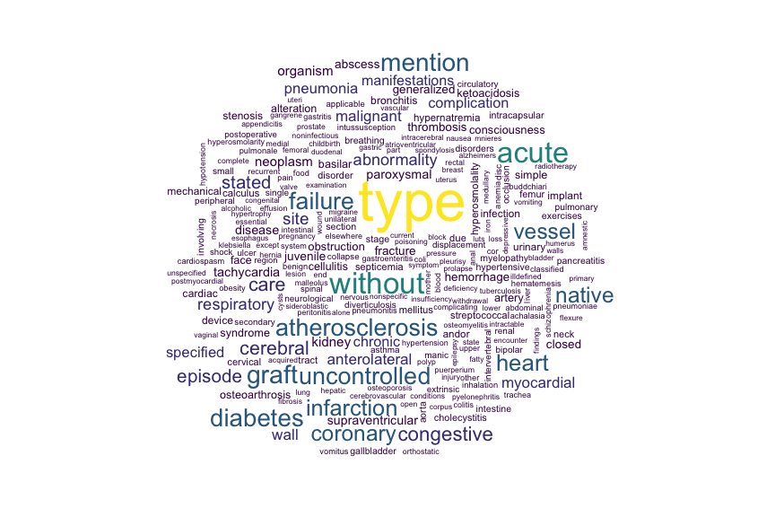

# EDA
Keith Williams  
January 19, 2017  


```r
library(tidyverse) # data wrangling and visualization

# file should exist in the parent directory of the repo
# parent/
# |-> 10kDiabetes.csv
# |-> kdd-diabetes/
# |   |-> R/
file_name <- "../../10kDiabetes.csv"

# read file
diabetes <- read_csv(file_name, na = c("?", ""))
```

## Introduce the rows and columns  


```r
# view structure
glimpse(diabetes)
```

```
## Observations: 10,000
## Variables: 52
## $ rowID                    <int> 1, 2, 3, 4, 5, 6, 7, 8, 9, 10, 11, 12...
## $ race                     <chr> "Caucasian", "Caucasian", "Caucasian"...
## $ gender                   <chr> "Female", "Female", "Male", "Female",...
## $ age                      <chr> "[50-60)", "[20-30)", "[80-90)", "[50...
## $ weight                   <chr> NA, "[50-75)", NA, NA, NA, NA, NA, NA...
## $ admission_type_id        <chr> "Elective", "Urgent", "Not Available"...
## $ discharge_disposition_id <chr> "Discharged to home", "Discharged to ...
## $ admission_source_id      <chr> "Physician Referral", "Physician Refe...
## $ time_in_hospital         <int> 1, 2, 7, 4, 5, 4, 6, 2, 3, 5, 14, 2, ...
## $ payer_code               <chr> "CP", "UN", "MC", "UN", NA, NA, "MC",...
## $ medical_specialty        <chr> "Surgery-Neuro", NA, "Family/GeneralP...
## $ num_lab_procedures       <int> 35, 8, 12, 33, 31, 29, 46, 49, 54, 47...
## $ num_procedures           <int> 4, 5, 0, 1, 0, 0, 1, 1, 0, 2, 2, 0, 4...
## $ num_medications          <int> 21, 5, 21, 5, 13, 10, 20, 17, 10, 12,...
## $ number_outpatient        <int> 0, 0, 0, 0, 0, 0, 0, 2, 0, 0, 0, 0, 0...
## $ number_emergency         <int> 0, 0, 0, 0, 0, 0, 0, 1, 0, 0, 0, 0, 0...
## $ number_inpatient         <int> 0, 0, 1, 0, 0, 0, 0, 1, 1, 0, 0, 1, 0...
## $ diag_1                   <chr> "723", "664", "481", "682", "296", "4...
## $ diag_2                   <chr> "723", "648", "428", "41", "250.01", ...
## $ diag_3                   <chr> "719", "285", "276", "250", "298", "4...
## $ number_diagnoses         <int> 9, 6, 9, 3, 7, 8, 8, 9, 9, 5, 9, 5, 5...
## $ max_glu_serum            <chr> "None", "None", ">200", "None", "None...
## $ A1Cresult                <chr> "None", "None", "None", "None", "None...
## $ metformin                <chr> "No", "No", "No", "No", "Steady", "St...
## $ repaglinide              <chr> "No", "No", "No", "No", "No", "No", "...
## $ nateglinide              <chr> "No", "No", "No", "No", "No", "No", "...
## $ chlorpropamide           <chr> "No", "No", "No", "No", "No", "No", "...
## $ glimepiride              <chr> "No", "No", "No", "No", "No", "No", "...
## $ acetohexamide            <chr> "No", "No", "No", "No", "No", "No", "...
## $ glipizide                <chr> "No", "No", "No", "No", "Steady", "No...
## $ glyburide                <chr> "No", "No", "No", "No", "No", "No", "...
## $ tolbutamide              <chr> "No", "No", "No", "No", "No", "No", "...
## $ pioglitazone             <chr> "No", "No", "No", "No", "No", "No", "...
## $ rosiglitazone            <chr> "No", "No", "No", "No", "No", "No", "...
## $ acarbose                 <chr> "No", "No", "No", "No", "No", "No", "...
## $ miglitol                 <chr> "No", "No", "No", "No", "No", "No", "...
## $ troglitazone             <chr> "No", "No", "No", "No", "No", "No", "...
## $ tolazamide               <chr> "No", "No", "No", "No", "No", "No", "...
## $ examide                  <chr> "No", "No", "No", "No", "No", "No", "...
## $ citoglipton              <chr> "No", "No", "No", "No", "No", "No", "...
## $ insulin                  <chr> "No", "No", "Steady", "Steady", "Stea...
## $ glyburide.metformin      <chr> "No", "No", "No", "No", "No", "No", "...
## $ glipizide.metformin      <chr> "No", "No", "No", "No", "No", "No", "...
## $ glimepiride.pioglitazone <chr> "No", "No", "No", "No", "No", "No", "...
## $ metformin.rosiglitazone  <chr> "No", "No", "No", "No", "No", "No", "...
## $ metformin.pioglitazone   <chr> "No", "No", "No", "No", "No", "No", "...
## $ change                   <chr> "No", "No", "No", "No", "Ch", "No", "...
## $ diabetesMed              <chr> "No", "No", "Yes", "Yes", "Yes", "Yes...
## $ readmitted               <lgl> FALSE, FALSE, TRUE, FALSE, FALSE, FAL...
## $ diag_1_desc              <chr> "Spinal stenosis in cervical region",...
## $ diag_2_desc              <chr> "Spinal stenosis in cervical region",...
## $ diag_3_desc              <chr> "Effusion of joint, site unspecified"...
```

```r
# outcome variable
mean(diabetes$readmitted)
```

```
## [1] 0.3965
```

There are 10,000 records, 39.65% of which were readmitted within 30 days. Features include demographics, admission conditions, procedure and lab descriptions and results, medication changes, and diagnoses.  

## Use descriptive statistics to describe the data  


```r
# proportion of missing records for each variable
prop_na <- map_dbl(diabetes, ~mean(is.na(.x)))
data_frame(variable = names(prop_na), proportion_na = prop_na) %>% 
    ggplot(aes(forcats::fct_reorder(variable, prop_na), prop_na)) +
    geom_bar(stat = "identity") +
    labs(x = "variable", y = "proportion missing values", title = "Missing Values") +
    coord_flip()
```

<!-- -->

Weight, payer code, and medical specialty have so many missing values, that they likely won't be useful. It may be possible to impute admission_source_id, admission_type_id, discharge_disposition_id, race, and the diagnoses.  


```r
# demographic distributions
race_plot <- ggplot(diabetes, aes(race, fill = readmitted)) + geom_bar()
age_plot <- ggplot(diabetes, aes(age, fill = readmitted)) + geom_bar()
gender_plot <- ggplot(diabetes, aes(gender, fill = readmitted)) + geom_bar()

gridExtra::grid.arrange(race_plot, age_plot, gender_plot)
```

<!-- -->


```r
# summarise numeric columns
numeric_cols <- diabetes[, map_lgl(diabetes, ~is.numeric(.x))] %>% 
    select(-rowID)
summary(numeric_cols)
```

```
##  time_in_hospital num_lab_procedures num_procedures  num_medications
##  Min.   : 1.000   Min.   :  1.00     Min.   :0.000   Min.   : 1.00  
##  1st Qu.: 2.000   1st Qu.: 32.00     1st Qu.:0.000   1st Qu.:10.00  
##  Median : 4.000   Median : 44.00     Median :1.000   Median :14.00  
##  Mean   : 4.435   Mean   : 43.08     Mean   :1.399   Mean   :15.56  
##  3rd Qu.: 6.000   3rd Qu.: 57.00     3rd Qu.:2.000   3rd Qu.:19.00  
##  Max.   :14.000   Max.   :120.00     Max.   :6.000   Max.   :81.00  
##  number_outpatient number_emergency number_inpatient  number_diagnoses
##  Min.   : 0.0000   Min.   : 0.000   Min.   : 0.0000   Min.   :1.000   
##  1st Qu.: 0.0000   1st Qu.: 0.000   1st Qu.: 0.0000   1st Qu.:5.000   
##  Median : 0.0000   Median : 0.000   Median : 0.0000   Median :7.000   
##  Mean   : 0.2817   Mean   : 0.115   Mean   : 0.3873   Mean   :7.025   
##  3rd Qu.: 0.0000   3rd Qu.: 0.000   3rd Qu.: 0.0000   3rd Qu.:9.000   
##  Max.   :36.0000   Max.   :42.000   Max.   :10.0000   Max.   :9.000
```

```r
# look at numeric column distributions by readmission status
tidy_numeric_cols <- numeric_cols %>% 
    bind_cols(select(diabetes, readmitted)) %>% 
    gather("variable", "value", -readmitted)

# boxplots
ggplot(tidy_numeric_cols, aes(factor(0), value)) + 
    geom_boxplot() + 
    facet_wrap(~variable, scales = "free_x") +
    labs(x = NULL, title = "Numeric Column Boxplots") +
    coord_flip() +
    theme(axis.text.y = element_blank(), axis.ticks.y = element_blank())
```

<!-- -->

```r
# Distribution by readmission status
ggplot(tidy_numeric_cols, aes(value, color = readmitted, fill = readmitted)) +
    geom_density(alpha = 0.4) + 
    facet_wrap(~variable, scales = "free")
```

<!-- -->


```r
# medications
select(diabetes, max_glu_serum:readmitted) %>% 
    gather("med", "description", -readmitted) %>% 
    ggplot(aes(description, fill = readmitted)) +
    geom_bar() +
    facet_wrap(~med, scales = "free_x", ncol = 4)
```

<!-- -->

One can see that some the medications have zero or near-zero variance:  
    - acarbose  
    - acetohexamide  
    - chlorpropamide
    - citoglipton  
    - examide  
    - glimepiride:pioglitazone  
    - glipizide.metformin  
    - metformin.pioglitazone  
    - metformin.rosiglitazone  
    - miglitol  
    - tolazamide  
    - tolbutamide  
    - troglitazone  
    
These medications will not be useful in predicting readmission with little to no variance among records.    

Of particular interest, it appears "change" has a much higher proportion of readmissions than no change:  

```r
ggplot(diabetes, aes(change, fill = readmitted)) + 
    geom_bar(position = "fill")
```

<!-- -->

Also, A1Cresult seems to have an association with readmission:  

```r
diabetes %>% 
    mutate(A1C_tested = ifelse(A1Cresult == "None", "not_tested", "tested")) %>% 
ggplot(aes(A1C_tested, fill = readmitted)) +
    geom_bar(position = "fill")
```

<!-- -->


```r
# look for commonalities in primary diagnosis
stringr::str_replace_all(diabetes$diag_1_desc, pattern = "unspecified", "") %>% 
wordcloud::wordcloud(max.words = 250, 
                     random.color = FALSE, 
                     colors = viridis::viridis(n = 7))
```

<!-- -->

